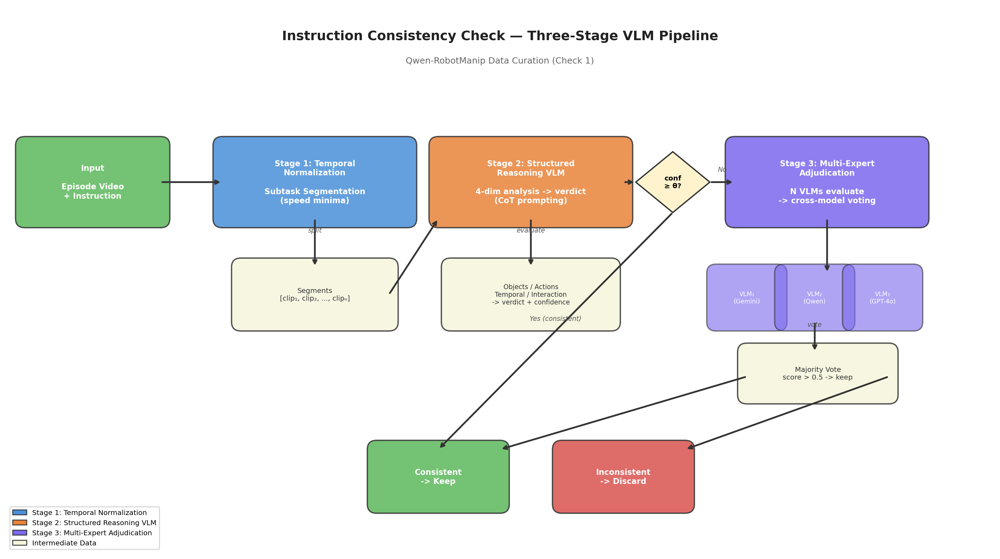
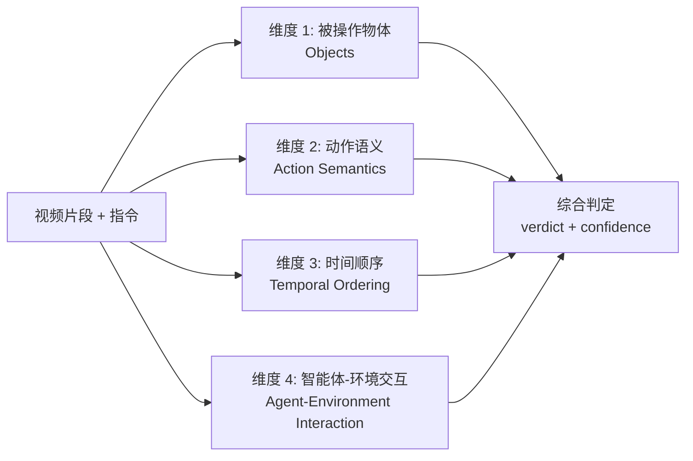
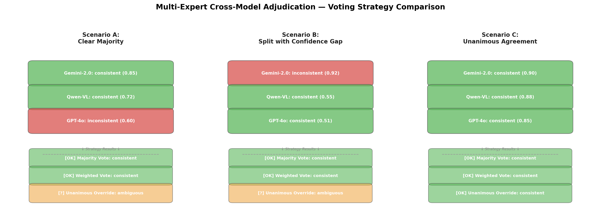
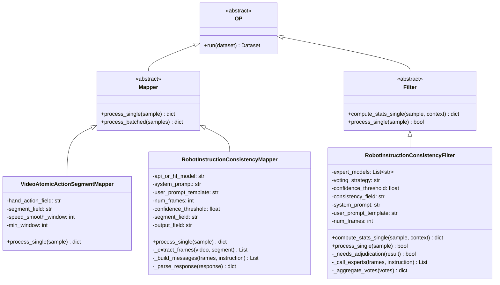
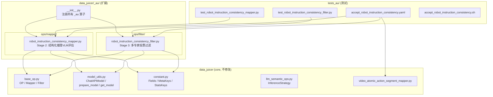
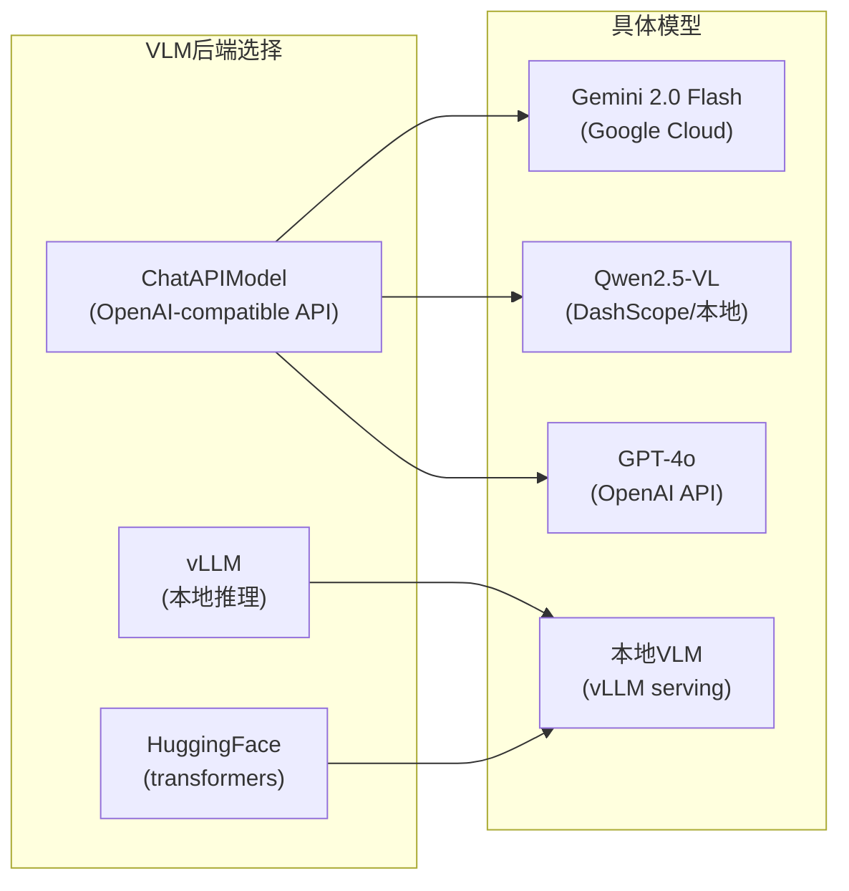
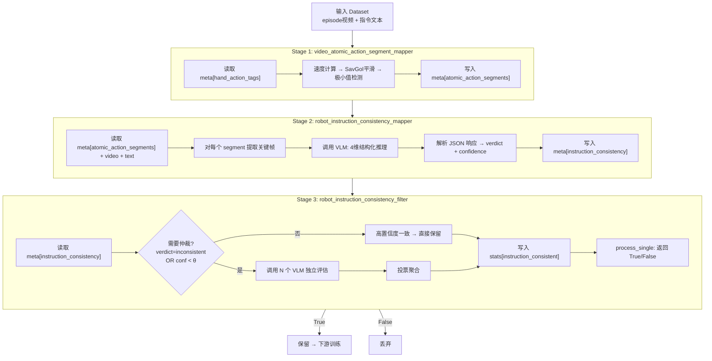
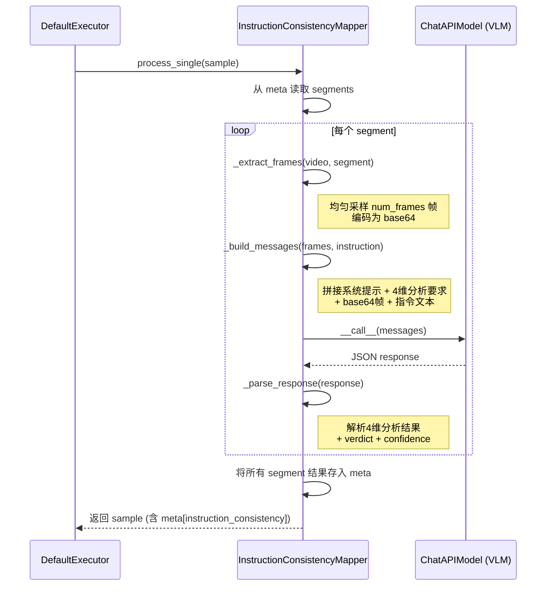
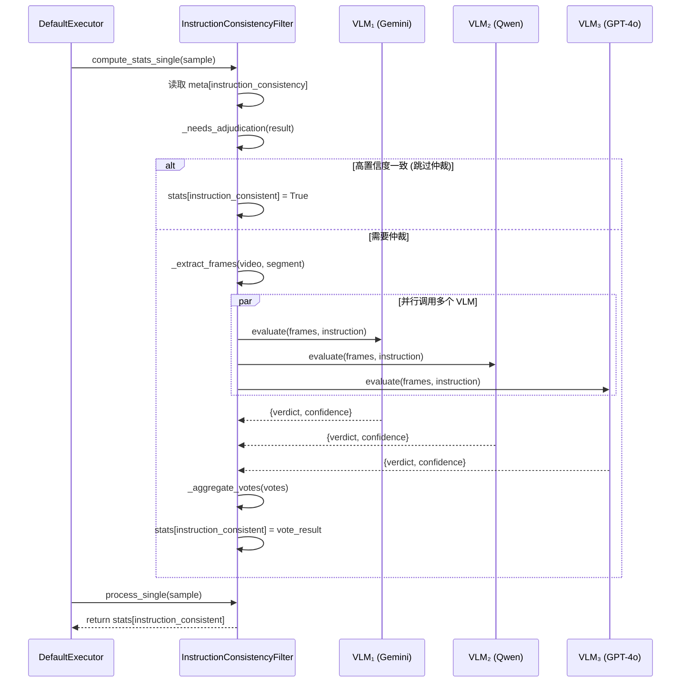

# 用 data-juicer 实现 Qwen-RobotManip Check 1: Instruction Consistency 方案

本文目标是给出一个可落地方案：如何用当前 `data-juicer` 代码库实现 Qwen-RobotManip 论文中 **Check 1: Instruction Consistency** 所描述的三阶段 VLM 流水线。分析基于论文 TeX 原文、本地官方文档与真实源码，遵循"扩展大于修改"原则，仅在 `data_juicer/_au/` 中新增算子。

对应论文位置：`b/d/QwenRobotmanip/TeX_Source/chapter/data.tex` 第 238-243 行。

---

## 1. 论文原文与翻译

### 1.1 原文

> **Check 1: Instruction Consistency.** We verify semantic consistency between each demonstration and its language annotation via a three-stage VLM-based pipeline. First, long episodes are decomposed into subtask-level segments (Lei et al., 2025) so that each clip corresponds to a temporally localized action unit, keeping the visual evidence focused and tractable for automated assessment (Temporal Normalization for Evaluation Units). Second, each segment is evaluated through structured reasoning-guided prompting: rather than requesting an immediate binary label, the VLM is directed to attend to manipulated objects, action semantics, temporal ordering, and agent-environment interaction, producing an intermediate analytical judgment before issuing a final consistency decision. This structured prompting reduces superficial or heuristic responses and improves label interpretability (Structured Reasoning-Guided Annotation). Third, clips flagged as non-aligned or ambiguous by the initial model are adjudicated by multiple VLMs as independent evaluators, with the final label determined by cross-model voting, reducing single-model bias and improving label robustness (Multi-Expert Cross-Model Adjudication). Inconsistent samples are excluded from training.

### 1.2 中文翻译

**检查 1：指令一致性。** 我们通过一个三阶段的 VLM（视觉语言模型）流水线来验证每个演示与其语言标注之间的语义一致性。**第一阶段**，将长时间的演示 episode 分解为子任务级别的片段 (Lei et al., 2025)，使每个视频片段对应一个时间上局部化的动作单元，从而保持视觉证据聚焦且易于自动评估处理（**评估单元的时序归一化**）。**第二阶段**，通过结构化推理引导的提示词对每个片段进行评估：不是直接要求一个二元标签，而是引导 VLM 关注被操作的物体、动作语义、时间顺序和智能体-环境交互，先产生一个中间分析性判断，然后再给出最终的一致性决策。这种结构化提示策略减少了表面化或启发式的响应，并提高了标签的可解释性（**结构化推理引导标注**）。**第三阶段**，对于被初始模型标记为不一致或模糊的片段，由多个 VLM 作为独立评估者进行裁定，最终标签由跨模型投票决定，以减少单模型偏差并提高标签鲁棒性（**多专家跨模型仲裁**）。不一致的样本将被排除在训练之外。

---

## 2. 深入分析

### 2.1 方法总览：三阶段流水线

Instruction Consistency Check 的核心洞察是：**验证"视频演示是否在做指令所说的事"不能靠单一模型一次性判断**。论文设计了一个逐步精化的三阶段流水线：

```
输入 (episode视频 + 语言指令)
    │
    ▼
┌─────────────────────────────┐
│ Stage 1: 时序归一化          │  ── 切分为子任务片段
│ (Temporal Normalization)    │
└─────────────────────────────┘
    │ [clip₁, clip₂, ..., clipₙ]
    ▼
┌─────────────────────────────┐
│ Stage 2: 结构化推理 VLM 评估 │  ── 4维分析 → verdict + confidence
│ (Structured Reasoning)      │
└─────────────────────────────┘
    │
    ├── 高置信度一致 → 保留
    │
    ▼ 低置信度 / 不一致 / 模糊
┌─────────────────────────────┐
│ Stage 3: 多专家仲裁         │  ── N个VLM独立评估 → 跨模型投票
│ (Multi-Expert Adjudication) │
└─────────────────────────────┘
    │
    ├── 投票通过 → 保留
    └── 投票未通过 → 丢弃
```



*图 1: Instruction Consistency Check 三阶段 VLM 流水线架构图。输入为 episode 视频与语言指令，经过时序归一化切分、结构化推理评估、多专家投票仲裁三个阶段，最终决定每个样本是保留还是丢弃。*

### 2.2 Stage 1: 时序归一化 (Temporal Normalization)

#### 2.2.1 动机与设计原理

机器人操作的一个 episode 通常包含多个子任务。例如一个 "整理桌面" 的 episode 可能包含 "拿起杯子 → 放到架子上 → 擦拭桌面" 三个子动作。如果将整个 episode 视频直接输入 VLM 评估，会面临两个问题：

1. **VLM 认知窗口有限**：当前 VLM 处理长视频的能力有限。即使是 Gemini 2.0 Flash 这样支持长上下文的模型，对超过几十秒的操作视频，其理解精度也会随时长快速下降。
2. **语义颗粒度不匹配**：一条指令（如 "把杯子放到架子上"）可能只对应 episode 中的一个子任务片段。用整个 episode 去验证这条指令的一致性，噪声太大。

因此，论文引用了 Lei et al. (2025) 的方法，通过检测手腕在三维空间中的速度极小值来切分子任务边界。直觉是：**人/机器人在完成一个子动作后、开始下一个子动作前，末端执行器速度通常会降至接近零**——这是一个天然的子任务分界点。

#### 2.2.2 形式化描述

设 episode 中末端执行器（或手腕）在世界坐标系下的轨迹为：

$$
\mathbf{p} = [\mathbf{p}_1, \mathbf{p}_2, \ldots, \mathbf{p}_T] \in \mathbb{R}^{T \times 3}
$$

计算瞬时速度：

$$
v_t = \|\mathbf{p}_{t+1} - \mathbf{p}_t\|_2, \quad t = 1, \ldots, T-1
$$

对速度信号进行 Savitzky-Golay 平滑以去除高频抖动：

$$
\tilde{v} = \operatorname{SavGol}(v; w_s, p)
$$

其中 $w_s$ 为窗口大小，$p$ 为多项式阶数。

切分点定义为**局部速度极小值**：当帧 $t$ 在窗口 $[t - w, t + w]$ 内是最小值时，$t$ 即为切分点：

$$
\mathcal{C} = \{t \mid \tilde{v}_t = \min_{|s - t| \leq w} \tilde{v}_s \}
$$

最终按切分点将 episode 分为 $|\mathcal{C}| + 1$ 个子任务片段：

$$
\text{segments} = \{[\mathcal{C}_{i-1}, \mathcal{C}_i) \mid i = 1, \ldots, |\mathcal{C}|+1\}
$$

#### 2.2.3 DJ 中的现有实现

`data-juicer` 已经实现了这一算法：`video_atomic_action_segment_mapper`（位于 `data_juicer/ops/mapper/video_atomic_action_segment_mapper.py`）。该算子：

- 输入：样本的 `__dj__meta__` 中的手部动作轨迹数据
- 输出：将切分后的原子动作片段列表写入 `__dj__meta__[atomic_action_segments]`
- 核心参数：`speed_smooth_window`（平滑窗口）、`min_window`（极小值检测半窗口）、`min_segment_frames`（最小片段帧数）、`max_segment_frames`（最大片段帧数）

```python
@OPERATORS.register_module(OP_NAME)
class VideoAtomicActionSegmentMapper(Mapper):
    def __init__(
        self,
        hand_action_field: str = MetaKeys.hand_action_tags,
        segment_field: str = "atomic_action_segments",
        speed_smooth_window: int = 5,
        min_window: int = 15,
        min_segment_frames: int = 8,
        max_segment_frames: int = 300,
        hand_type: str = "both",
        *args, **kwargs,
    ):
        ...
```

**关键设计决策**：Stage 1 直接**复用**此现有算子，无需重新实现。这遵循了"扩展大于修改"和"尽量利用 data_juicer 已有的功能与模块"的原则。

#### 2.2.4 举例说明

假设一个机器人执行 "Connect Router Cables" 任务的 episode 包含 200 帧，末端执行器速度曲线如下图所示（示意）：

```
速度 v
  │    ╱╲        ╱╲      ╱╲
  │   ╱  ╲      ╱  ╲    ╱  ╲
  │  ╱    ╲    ╱    ╲  ╱    ╲
  │ ╱      ╲  ╱      ╲╱      ╲
  │╱        ╲╱                 ╲
  └────────────────────────────── 帧
  0    40   80   120   160   200
       ↑         ↑
     切分点1    切分点2
```

在帧 80 和帧 120 处，速度降至局部最小值，这对应子任务之间的过渡。整个 episode 被切分为三个片段：
- Segment 1: 帧 0-79（抓取线缆）
- Segment 2: 帧 80-119（移动到路由器）  
- Segment 3: 帧 120-200（插入线缆）

### 2.3 Stage 2: 结构化推理引导标注 (Structured Reasoning-Guided Annotation)

#### 2.3.1 为什么不直接二元分类？

一个直观但粗暴的方法是直接问 VLM："这个视频和这条指令一致吗？回答 yes 或 no。" 然而，这种 **direct prompting** 有严重缺陷：

| 问题 | 描述 |
|------|------|
| **锚定偏差** | VLM 容易在没有充分分析的情况下默认回答 "yes"（因为大部分训练数据中视频和描述是匹配的） |
| **缺乏可解释性** | 二元答案无法告诉我们不一致发生在哪个维度——是物体错了？动作错了？还是顺序错了？ |
| **一致性差** | 同一个 VLM 对同一输入多次推理可能给出不同答案，无法稳定评估 |

论文选择了 **Chain-of-Thought (CoT) 结构化推理**：先让 VLM 从 4 个维度逐一分析，再综合给出判断。这类似于让一个评审员先填详细评估表，最后再给总分——过程约束了思维路径，显著提高了判断质量。

#### 2.3.2 四维分析框架

论文要求 VLM 从以下四个维度分析视频-指令一致性：



各维度的含义和评估要点：

**维度 1: 被操作物体 (Objects)**
- 指令中提到的物体是否出现在视频中？
- 视频中实际被操作的物体是否与指令描述一致？
- 例：指令说 "拿起红色杯子"，但视频中机器人拿起的是蓝色杯子 → 不一致

**维度 2: 动作语义 (Action Semantics)**
- 视频中的动作是否与指令描述的动作类型匹配？
- 例：指令说 "推门"，但视频中机器人在拉门 → 不一致

**维度 3: 时间顺序 (Temporal Ordering)**
- 如果指令描述了多步操作，视频中的执行顺序是否正确？
- 例：指令说 "先拿杯子再倒水"，但视频中先倒水再拿杯子 → 不一致

**维度 4: 智能体-环境交互 (Agent-Environment Interaction)**
- 机器人与环境的交互方式是否合理？
- 是否有物理上不可能的交互（如穿透、悬浮）？
- 操作的结果是否符合指令的预期效果？

#### 2.3.3 CoT Prompt 设计

形式化地，Stage 2 的 prompt 可以表示为：

$$
P_{\text{stage2}} = P_{\text{system}} \oplus P_{\text{user}}(V_{\text{frames}}, I_{\text{text}})
$$

其中 $P_{\text{system}}$ 是系统提示词（定义角色与输出格式），$P_{\text{user}}$ 是包含视频帧和指令文本的用户消息，$\oplus$ 表示消息拼接。

VLM 的期望输出是一个结构化 JSON：

```json
{
  "objects": {
    "analysis": "视频中出现了路由器和一根网线...",
    "aligned": true
  },
  "action_semantics": {
    "analysis": "机器人执行了抓取-移动-插入的序列...",
    "aligned": true
  },
  "temporal_ordering": {
    "analysis": "先抓取线缆，再移动到端口，最后插入...",
    "aligned": true
  },
  "agent_environment_interaction": {
    "analysis": "夹爪正确夹持线缆，插入角度合理...",
    "aligned": true
  },
  "verdict": "consistent",
  "confidence": 0.85
}
```

#### 2.3.4 与其他方法的横向对比

| 方法 | 输入模态 | 推理方式 | 可解释性 | 成本 |
|------|---------|---------|---------|------|
| CLIP Score | 图像-文本 | 嵌入距离 | 低 | 低 |
| LLM-as-Judge (direct) | 文本 | 直接分类 | 低 | 中 |
| LLM-as-Judge (CoT) | 文本 | 推理链 | 中 | 中 |
| **本文 Stage 2 (VLM CoT)** | **视频+文本** | **4维结构化推理** | **高** | **高** |
| 人工标注 | 视频+文本 | 专家判断 | 最高 | 极高 |

本文方法的优势在于：
- 相比 CLIP Score，能够处理**时序信息**和**复杂动作语义**
- 相比直接 LLM 分类，**结构化推理降低了假阳性和假阴性率**
- 相比人工标注，**成本可控且可大规模并行**

#### 2.3.5 消融分析

根据论文的设计和类似工作的经验，可以推断各个设计选择的效果：

| 设计点 | 预期贡献 | 重要性 |
|--------|---------|--------|
| 子任务切分（Stage 1） | 减少长视频的噪声，提高 VLM 理解精度 | 高 |
| 4 维结构化分析 | 减少遗漏，提高判断全面性 | 高 |
| CoT 推理（vs. 直接分类） | 提高准确率 5-15%（据类似工作估计） | 中-高 |
| 置信度评分 | 区分困难样本，为 Stage 3 提供筛选依据 | 中 |
| 多模型投票（Stage 3） | 减少单模型偏差 3-8% | 中 |

### 2.4 Stage 3: 多专家跨模型仲裁 (Multi-Expert Cross-Model Adjudication)

#### 2.4.1 设计动机

单一 VLM 存在系统性偏差。例如：
- Gemini 可能对某类动作理解更好，但对另一类有盲区
- Qwen-VL 在中文场景下表现优异，但英文指令可能略逊
- GPT-4o 综合能力强，但对机器人领域的特定动作可能不如专业模型

多模型投票的理论基础是 **Condorcet 陪审团定理 (Condorcet Jury Theorem)**：如果每个独立评估者正确率 $p > 0.5$，那么多数投票的正确率随评估者数量 $N$ 增加而趋近于 1：

$$
P(\text{majority correct}) = \sum_{k=\lceil N/2 \rceil}^{N} \binom{N}{k} p^k (1-p)^{N-k} \xrightarrow{N \to \infty} 1
$$

前提是评估者之间的**误差不相关**——这正是使用**不同架构、不同训练数据的 VLM** 所提供的保证。

#### 2.4.2 投票策略

论文提到 "cross-model voting"，但未详细说明具体投票算法。基于实践经验，设计三种可配置的投票策略：

**策略 1: 多数投票 (Majority Vote)**

最简单直接。$N$ 个模型中超过半数判定一致即为一致：

$$
\text{verdict} = \begin{cases}
\text{consistent} & \text{if } \sum_{i=1}^N \mathbb{1}[v_i = \text{consistent}] > \frac{N}{2} \\
\text{inconsistent} & \text{otherwise}
\end{cases}
$$

**策略 2: 置信度加权投票 (Weighted Vote)**

考虑每个模型的置信度 $c_i$，加权求和：

$$
S = \frac{\sum_{i: v_i = \text{consistent}} c_i}{\sum_{i=1}^N c_i}
$$

$$
\text{verdict} = \begin{cases}
\text{consistent} & \text{if } S > 0.5 \\
\text{inconsistent} & \text{otherwise}
\end{cases}
$$

这种策略让高置信度的判断有更大的话语权。当一个模型以 0.92 的置信度判定不一致，而另外两个以 0.55 和 0.51 的低置信度判定一致时，加权投票会倾向于不一致——这通常是更合理的判断。

**策略 3: 一致性覆盖 (Unanimous Override)**

如果所有模型一致同意，直接采纳；否则标记为需要进一步人工审核：

$$
\text{verdict} = \begin{cases}
v_1 & \text{if } v_1 = v_2 = \cdots = v_N \\
\text{ambiguous (需人工审核)} & \text{otherwise}
\end{cases}
$$



*图 2: 三种投票策略在不同场景下的决策差异。Scenario A 展示了明确多数的情况，三种策略结果一致；Scenario B 展示了置信度差异大的分裂情况，加权投票与多数投票结果不同；Scenario C 展示了全体一致的情况。*

#### 2.4.3 何时触发 Stage 3？

并非所有样本都需要经过 Stage 3。论文指出只有 "flagged as non-aligned or ambiguous" 的样本才会进入多专家仲裁。这是一个**效率与质量的权衡**：

$$
\text{进入 Stage 3} \iff (v_{\text{stage2}} = \text{inconsistent}) \lor (c_{\text{stage2}} < \theta)
$$

其中 $\theta$ 是置信度阈值（可配置，建议默认 0.7）。

- $c \geq \theta$ 且 $v = \text{consistent}$：直接保留，无需多模型验证
- $c \geq \theta$ 且 $v = \text{inconsistent}$：可能直接丢弃，或仍送 Stage 3 验证
- $c < \theta$：模型不确定，必须送 Stage 3

#### 2.4.4 纵向对比：与人工标注的关系

| 方面 | 本文方法 | 纯人工标注 |
|------|---------|-----------|
| 成本 | API 调用费（约 $0.01-0.1/样本） | 人工标注费（约 $0.5-5/样本） |
| 速度 | 可并行，百万级/天 | 受标注员数量限制 |
| 一致性 | 同一输入同一输出（确定性） | 标注员间差异（需要 inter-rater agreement） |
| 覆盖面 | 受限于 VLM 能力边界 | 可处理任意复杂场景 |
| 适用场景 | 大规模数据清洗初筛 | 高价值数据精标 |

实际应用中，推荐**两者结合**：先用本文方法做大规模初筛（过滤掉明显不一致的 70-80%），再对边界样本做人工审核。

---

## 3. Data-Juicer 实现方案

### 3.1 算子分解设计

遵循 data-juicer 的组合式设计哲学，将三阶段流水线分解为**三个独立算子**，通过 YAML recipe 组合：

| 阶段 | 算子类型 | 算子名 | 来源 |
|------|---------|--------|------|
| Stage 1 | Mapper | `video_atomic_action_segment_mapper` | **复用已有** |
| Stage 2 | Mapper | `robot_instruction_consistency_mapper` | **新建** (`_au/`) |
| Stage 3 | Filter | `robot_instruction_consistency_filter` | **新建** (`_au/`) |

为什么不用一个 Pipeline 算子？

1. **DJ 的 Pipeline 基类** (`base_op.py`) 的 `run(dataset)` 方法是 dataset 级别的，适合包装完整的子流程，但三个阶段有独立的参数、独立的 VLM 配置，用 Pipeline 会导致参数爆炸。
2. **三个独立算子更灵活**：用户可以只运行 Stage 1+2（不需要多模型投票），或者复用 Stage 1 做其他分析。
3. **现有 `_au/` 扩展模式**一致性：已有的 `robot_sudden_change_filter`、`robot_extreme_value_filter` 等都是独立算子。

### 3.2 静态架构

#### 3.2.1 类继承图



#### 3.2.2 组件图



#### 3.2.3 VLM 集成组件



### 3.3 动态架构

#### 3.3.1 数据流图



#### 3.3.2 Stage 2 序列图



#### 3.3.3 Stage 3 序列图



### 3.4 VLM 集成方案

复用 `data_juicer/utils/model_utils.py` 中的 `ChatAPIModel`——它是一个 OpenAI-compatible 的 API 客户端，通过环境变量配置：

```python
# ChatAPIModel 核心代码（model_utils.py:190-250）
class ChatAPIModel:
    def __init__(self, model=None, endpoint=None, response_path=None, **kwargs):
        self.model = model
        self.endpoint = endpoint or "/chat/completions"
        self.response_path = response_path or "choices.0.message.content"
        
        client_args = filter_arguments(openai.OpenAI, kwargs)
        if "base_url" not in client_args and os.environ.get("OPENAI_BASE_URL"):
            client_args["base_url"] = os.environ.get("OPENAI_BASE_URL").rstrip("/")
        self._client = openai.OpenAI(**client_args)
    
    def __call__(self, messages, **kwargs):
        body = {"messages": messages, "model": self.model}
        body.update(kwargs)
        response = self._client.post(self.endpoint, body=body, cast_to=httpx.Response)
        result = response.json()
        return nested_access(result, self.response_path) or ""
```

**适配不同 VLM 提供商**：

| 提供商 | 环境变量配置 | model 参数 |
|--------|------------|-----------|
| Google Gemini | `OPENAI_BASE_URL=https://generativelanguage.googleapis.com/v1beta/openai`<br>`OPENAI_API_KEY=<your-gemini-key>` | `gemini-2.0-flash` |
| 阿里 DashScope | `OPENAI_BASE_URL=https://dashscope.aliyuncs.com/compatible-mode/v1`<br>`DASHSCOPE_API_KEY=<key>` | `qwen-vl-max` |
| OpenAI | `OPENAI_BASE_URL=https://api.openai.com/v1`<br>`OPENAI_API_KEY=<key>` | `gpt-4o` |
| 本地 vLLM | `OPENAI_BASE_URL=http://localhost:8000/v1`<br>`OPENAI_API_KEY=dummy` | `Qwen/Qwen2.5-VL-72B-Instruct` |

所有提供商都通过同一个 `ChatAPIModel` 访问，无需修改算子代码。只需在 YAML 配置或环境变量中切换即可。

### 3.5 数据流设计

三个算子之间通过 `Fields.meta`（即 `__dj__meta__`）传递结构化数据。选择 `meta` 而非 `stats` 的原因：

- `Fields.stats`（`__dj__stats__`）设计用于**标量统计量**（bool/float/int），供 `dj-analyze` 的 pandas `describe()` 使用
- `Fields.meta`（`__dj__meta__`）设计用于**结构化元数据**（dict/list），以 JSON 字符串形式存储，避免 Arrow schema 冲突

数据流细节：

```
Stage 1 输出 → meta["atomic_action_segments"]:
    [
      {"segment_id": 0, "start_frame": 0, "end_frame": 79, ...},
      {"segment_id": 1, "start_frame": 80, "end_frame": 119, ...},
      {"segment_id": 2, "start_frame": 120, "end_frame": 200, ...}
    ]

Stage 2 输出 → meta["instruction_consistency"]:
    {
      "segments": [
        {
          "segment_id": 0,
          "objects": {"analysis": "...", "aligned": true},
          "action_semantics": {"analysis": "...", "aligned": true},
          "temporal_ordering": {"analysis": "...", "aligned": true},
          "agent_environment_interaction": {"analysis": "...", "aligned": true},
          "verdict": "consistent",
          "confidence": 0.85
        },
        ...
      ],
      "overall_verdict": "consistent",
      "overall_confidence": 0.82,
      "model": "gemini-2.0-flash"
    }

Stage 3 输出 → stats["instruction_consistent"]:
    True / False  (标量，供 Filter.process_single 返回)

              → meta["instruction_consistency_adjudication"]:
    {
      "needed": true,
      "expert_votes": [
        {"model": "gemini-2.0-flash", "verdict": "consistent", "confidence": 0.85},
        {"model": "qwen-vl-max", "verdict": "consistent", "confidence": 0.72},
        {"model": "gpt-4o", "verdict": "inconsistent", "confidence": 0.60}
      ],
      "voting_strategy": "majority",
      "final_verdict": "consistent",
      "final_score": 0.667
    }
```

### 3.6 YAML 配置示例

#### 3.6.1 完整三阶段配置（Google Cloud Gemini）

```yaml
# recipe_instruction_consistency.yaml
# Instruction Consistency Check - 三阶段 VLM 流水线

# 数据集路径
dataset_path: /mnt/r/DATA/tst/Galaxea-Open-World-Dataset/Connect_Router_Cables_20250625_002/
export_path: ./output/instruction_consistency_checked/

# 加载 _au 扩展模块（包引入方式）
custom_operator_paths:
  - data_juicer/_au

# 基础字段
text_key: instruction
video_key: video

process:
  # ──── Stage 1: 时序归一化（复用已有算子） ────
  - video_atomic_action_segment_mapper:
      speed_smooth_window: 5
      min_window: 15
      min_segment_frames: 8
      max_segment_frames: 300
      hand_type: both

  # ──── Stage 2: 结构化推理 VLM 评估（新算子） ────
  - robot_instruction_consistency_mapper:
      api_or_hf_model: gemini-2.0-flash
      num_frames: 8
      segment_field: atomic_action_segments
      output_field: instruction_consistency
      system_prompt: >
        You are a robot manipulation expert evaluating whether
        a video demonstration is semantically consistent with
        a given language instruction. Analyze along four dimensions,
        then give a final verdict.
      try_num: 3

  # ──── Stage 3: 多专家跨模型投票过滤（新算子） ────
  - robot_instruction_consistency_filter:
      consistency_field: instruction_consistency
      confidence_threshold: 0.7
      expert_models:
        - gemini-2.0-flash
        - qwen-vl-max
        - gpt-4o
      voting_strategy: majority   # majority / weighted / unanimous_override
      num_frames: 8
      try_num: 3
```

#### 3.6.2 环境变量配置

```bash
# Google Cloud Gemini（通过 OpenAI 兼容接口）
export OPENAI_BASE_URL="https://generativelanguage.googleapis.com/v1beta/openai"
export OPENAI_API_KEY="your-gemini-api-key"

# 如果同时使用 DashScope（用于 Qwen-VL）
export DASHSCOPE_API_KEY="your-dashscope-api-key"
```

#### 3.6.3 简化配置（只用单模型，跳过 Stage 3）

```yaml
# recipe_instruction_consistency_simple.yaml
# 简化版：只用 Stage 1 + Stage 2，不做多模型投票

dataset_path: /mnt/r/DATA/tst/Galaxea-Open-World-Dataset/Connect_Router_Cables_20250625_002/
export_path: ./output/instruction_consistency_simple/

custom_operator_paths:
  - data_juicer/_au

text_key: instruction
video_key: video

process:
  - video_atomic_action_segment_mapper:
      speed_smooth_window: 5
      min_window: 15

  - robot_instruction_consistency_mapper:
      api_or_hf_model: gemini-2.0-flash
      num_frames: 8

  # 直接用 Stage 2 的结果过滤，不做多模型仲裁
  - robot_instruction_consistency_filter:
      consistency_field: instruction_consistency
      confidence_threshold: 0.0  # 不触发 Stage 3 仲裁
      expert_models: []           # 空列表 = 跳过多模型投票
      voting_strategy: majority
```

---

## 4. 关键算法详解

### 4.1 结构化评估 Prompt 设计

Stage 2 的 prompt 是整个流水线中最关键的部分。一个好的 prompt 需要：
1. 明确角色定义（robot manipulation expert）
2. 给出 4 个分析维度的具体要求
3. 要求结构化 JSON 输出（便于程序解析）
4. 包含 Chain-of-Thought 引导（先分析再判断）

#### 4.1.1 System Prompt

```
You are a robot manipulation expert. Your task is to evaluate whether a
video clip of a robot performing an action is semantically consistent
with a given language instruction.

You MUST analyze the video along exactly four dimensions before giving
your final verdict. For each dimension, provide a brief analysis and
an alignment judgment (true/false).

Output format (JSON):
{
  "objects": {
    "analysis": "<What objects appear in the video? Do they match the instruction?>",
    "aligned": true/false
  },
  "action_semantics": {
    "analysis": "<What action is the robot performing? Does it match the instruction?>",
    "aligned": true/false
  },
  "temporal_ordering": {
    "analysis": "<Is the sequence of sub-actions correct per the instruction?>",
    "aligned": true/false
  },
  "agent_environment_interaction": {
    "analysis": "<Is the robot-environment interaction physically plausible and consistent?>",
    "aligned": true/false
  },
  "verdict": "consistent" or "inconsistent",
  "confidence": 0.0 to 1.0
}
```

#### 4.1.2 User Prompt Template

```
## Instruction
{instruction}

## Video Frames
The following {num_frames} frames are uniformly sampled from a video clip
showing a robot performing a manipulation task.

[Frame 1] {base64_frame_1}
[Frame 2] {base64_frame_2}
...
[Frame N] {base64_frame_N}

## Task
Analyze the video-instruction consistency along the four dimensions
(objects, action_semantics, temporal_ordering, agent_environment_interaction).
Then provide your final verdict and confidence score.
Return ONLY the JSON object, no additional text.
```

#### 4.1.3 帧提取与编码

从视频中均匀采样 $N$ 帧并编码为 base64：

```python
def _extract_frames(self, video_path: str, segment: dict, 
                    num_frames: int) -> list:
    """从视频的指定片段中均匀采样帧并编码为 base64。"""
    import cv2
    import base64
    
    cap = cv2.VideoCapture(video_path)
    start = segment.get('start_frame', 0)
    end = segment.get('end_frame', int(cap.get(cv2.CAP_PROP_FRAME_COUNT)))
    
    total = end - start
    if total <= 0:
        return []
    
    indices = np.linspace(start, end - 1, num=num_frames, dtype=int)
    
    frames = []
    for idx in indices:
        cap.set(cv2.CAP_PROP_POS_FRAMES, idx)
        ret, frame = cap.read()
        if ret:
            _, buffer = cv2.imencode('.jpg', frame)
            b64 = base64.b64encode(buffer).decode('utf-8')
            frames.append(b64)
    
    cap.release()
    return frames
```

对于支持视觉输入的 API，消息格式为：

```python
messages = [
    {"role": "system", "content": system_prompt},
    {"role": "user", "content": [
        {"type": "text", "text": user_text},
        {"type": "image_url", "image_url": {
            "url": f"data:image/jpeg;base64,{frame_b64}"
        }}
        # ... 重复 N 帧
    ]}
]
```

### 4.2 多模型投票算法

#### 4.2.1 投票聚合伪代码

```python
def aggregate_votes(votes: list, strategy: str) -> dict:
    """
    votes: [{"model": str, "verdict": str, "confidence": float}, ...]
    strategy: "majority" | "weighted" | "unanimous_override"
    """
    if strategy == "majority":
        consistent_count = sum(
            1 for v in votes if v["verdict"] == "consistent"
        )
        final = "consistent" if consistent_count > len(votes) / 2 \
                else "inconsistent"
        score = consistent_count / len(votes)
        
    elif strategy == "weighted":
        w_consistent = sum(
            v["confidence"] for v in votes 
            if v["verdict"] == "consistent"
        )
        w_total = sum(v["confidence"] for v in votes)
        score = w_consistent / w_total if w_total > 0 else 0
        final = "consistent" if score > 0.5 else "inconsistent"
        
    elif strategy == "unanimous_override":
        verdicts = set(v["verdict"] for v in votes)
        if len(verdicts) == 1:
            final = verdicts.pop()
            score = 1.0
        else:
            final = "ambiguous"
            score = 0.5
    
    return {
        "final_verdict": final,
        "final_score": score,
        "voting_strategy": strategy,
        "expert_votes": votes,
    }
```

#### 4.2.2 短路优化

当 Stage 2 的结果已经明确时，可以跳过 Stage 3 以节省 API 调用成本：

```python
def _needs_adjudication(self, stage2_result: dict) -> bool:
    """判断是否需要进入 Stage 3 多专家仲裁。"""
    verdict = stage2_result.get("overall_verdict", "inconsistent")
    confidence = stage2_result.get("overall_confidence", 0.0)
    
    # 高置信度一致 → 直接保留
    if verdict == "consistent" and confidence >= self.confidence_threshold:
        return False
    
    # 没有配置专家模型 → 跳过仲裁
    if not self.expert_models:
        return False
    
    return True
```

### 4.3 VLM 响应解析

VLM 返回的文本可能包含 markdown 代码块或其他格式。需要鲁棒的 JSON 解析：

```python
def _parse_response(self, response: str) -> dict:
    """从 VLM 响应中解析结构化 JSON。"""
    import json
    import re
    
    # 尝试直接解析
    try:
        return json.loads(response)
    except json.JSONDecodeError:
        pass
    
    # 尝试从 markdown 代码块中提取
    match = re.search(r'```(?:json)?\s*\n?(.*?)\n?```', 
                      response, re.DOTALL)
    if match:
        try:
            return json.loads(match.group(1))
        except json.JSONDecodeError:
            pass
    
    # 尝试找到第一个 { 和最后一个 } 之间的内容
    start = response.find('{')
    end = response.rfind('}')
    if start != -1 and end != -1 and end > start:
        try:
            return json.loads(response[start:end+1])
        except json.JSONDecodeError:
            pass
    
    # 解析失败，返回默认值
    return {
        "verdict": "inconsistent",
        "confidence": 0.0,
        "parse_error": True,
        "raw_response": response[:500]
    }
```

---

## 5. 文件布局与代码骨架

### 5.1 文件布局

```
data_juicer/
├── _au/
│   ├── __init__.py                  # ← 需要新增 import
│   └── ops/
│       ├── mapper/
│       │   ├── __init__.py
│       │   ├── robot_base_frame_alignment_mapper.py   (已有)
│       │   └── robot_instruction_consistency_mapper.py  ← 新建
│       └── filter/
│           ├── __init__.py
│           ├── robot_extreme_value_filter.py            (已有)
│           ├── robot_state_action_alignment_filter.py   (已有)
│           ├── robot_sudden_change_filter.py            (已有)
│           └── robot_instruction_consistency_filter.py   ← 新建
│
tests_au/
├── ops/
│   ├── mapper/
│   │   └── test_robot_instruction_consistency_mapper.py  ← 新建
│   └── filter/
│       ├── test_robot_instruction_consistency_filter.py  ← 新建
│       ├── accept_robot_instruction_consistency.yaml     ← 新建
│       └── accept_robot_instruction_consistency.sh       ← 新建
```

### 5.2 `_au/__init__.py` 更新

需要在现有的 `__init__.py` 中添加两行 import：

```python
# data_juicer/_au/__init__.py
from .ops.filter import robot_extreme_value_filter  # noqa: F401
from .ops.filter import robot_state_action_alignment_filter  # noqa: F401
from .ops.filter import robot_sudden_change_filter  # noqa: F401
from .ops.mapper import robot_base_frame_alignment_mapper  # noqa: F401
# ↓ 新增
from .ops.mapper import robot_instruction_consistency_mapper  # noqa: F401
from .ops.filter import robot_instruction_consistency_filter  # noqa: F401
```

### 5.3 Stage 2 算子骨架

```python
# data_juicer/_au/ops/mapper/robot_instruction_consistency_mapper.py
"""Stage 2: Structured Reasoning-Guided VLM Annotation for
instruction-video consistency.

Evaluates each video segment against its language instruction along
four dimensions (objects, action_semantics, temporal_ordering,
agent_environment_interaction) using CoT prompting.

Writes structured analysis results to Fields.meta.
"""
import json
from typing import Dict, List, Optional

import numpy as np
from loguru import logger
from pydantic import PositiveInt

from data_juicer.ops.base_op import OPERATORS, Mapper
from data_juicer.utils.constant import Fields
from data_juicer.utils.model_utils import get_model, prepare_model

OP_NAME = "robot_instruction_consistency_mapper"

DEFAULT_SYSTEM_PROMPT = """You are a robot manipulation expert. ..."""

DEFAULT_USER_TEMPLATE = """## Instruction\n{instruction}\n\n..."""

ANALYSIS_DIMENSIONS = [
    "objects", "action_semantics",
    "temporal_ordering", "agent_environment_interaction",
]


@OPERATORS.register_module(OP_NAME)
class RobotInstructionConsistencyMapper(Mapper):
    """Evaluate video-instruction consistency via structured VLM reasoning."""

    _accelerator = "cuda"

    def __init__(
        self,
        api_or_hf_model: str = "gemini-2.0-flash",
        *,
        segment_field: str = "atomic_action_segments",
        output_field: str = "instruction_consistency",
        num_frames: int = 8,
        system_prompt: Optional[str] = None,
        user_prompt_template: Optional[str] = None,
        api_endpoint: Optional[str] = None,
        response_path: Optional[str] = None,
        try_num: PositiveInt = 3,
        model_params: Optional[Dict] = None,
        **kwargs,
    ):
        super().__init__(**kwargs)
        self.segment_field = segment_field
        self.output_field = output_field
        self.num_frames = num_frames
        self.system_prompt = system_prompt or DEFAULT_SYSTEM_PROMPT
        self.user_prompt_template = user_prompt_template or DEFAULT_USER_TEMPLATE
        self.try_num = try_num

        self.model_key = prepare_model(
            model_type="api",
            model=api_or_hf_model,
            endpoint=api_endpoint,
            response_path=response_path,
            **(model_params or {}),
        )

    def _extract_frames(self, video_path, segment, num_frames):
        """Extract and base64-encode frames from a video segment."""
        ...

    def _build_messages(self, frames, instruction):
        """Build OpenAI-compatible messages with vision content."""
        ...

    def _parse_response(self, response):
        """Parse structured JSON from VLM response."""
        ...

    def process_single(
        self, sample: Dict, rank: Optional[int] = None
    ) -> Dict:
        if Fields.meta not in sample:
            sample[Fields.meta] = {}

        meta = sample[Fields.meta]
        segments = meta.get(self.segment_field, [])
        instruction = sample.get(self.text_key, "")

        model = get_model(self.model_key, rank, self.use_cuda())

        results = []
        for seg in segments:
            frames = self._extract_frames(
                sample.get(self.video_key, ""), seg, self.num_frames
            )
            messages = self._build_messages(frames, instruction)

            response = ""
            for attempt in range(self.try_num):
                response = model(messages)
                if response:
                    break

            parsed = self._parse_response(response)
            parsed["segment_id"] = seg.get("segment_id", 0)
            results.append(parsed)

        # aggregate across segments
        overall = self._aggregate_segments(results)
        meta[self.output_field] = json.dumps(overall)

        return sample

    def _aggregate_segments(self, results):
        """Compute overall verdict from per-segment results."""
        ...
```

### 5.4 Stage 3 算子骨架

```python
# data_juicer/_au/ops/filter/robot_instruction_consistency_filter.py
"""Stage 3: Multi-Expert Cross-Model Adjudication for
instruction consistency filtering.

For samples flagged by Stage 2, queries multiple VLMs and
aggregates their verdicts via configurable voting strategy.

Keeps samples judged as consistent.
"""
import json
from typing import Dict, List, Optional

from loguru import logger
from pydantic import PositiveInt

from data_juicer.ops.base_op import OPERATORS, Filter
from data_juicer.utils.constant import Fields, StatsKeys
from data_juicer.utils.model_utils import get_model, prepare_model

OP_NAME = "robot_instruction_consistency_filter"


@OPERATORS.register_module(OP_NAME)
class RobotInstructionConsistencyFilter(Filter):
    """Filter by multi-expert VLM adjudication on instruction consistency."""

    _accelerator = "cuda"

    def __init__(
        self,
        consistency_field: str = "instruction_consistency",
        confidence_threshold: float = 0.7,
        expert_models: Optional[List[str]] = None,
        voting_strategy: str = "majority",
        num_frames: int = 8,
        system_prompt: Optional[str] = None,
        user_prompt_template: Optional[str] = None,
        api_endpoint: Optional[str] = None,
        response_path: Optional[str] = None,
        try_num: PositiveInt = 3,
        model_params: Optional[Dict] = None,
        **kwargs,
    ):
        super().__init__(**kwargs)
        self.consistency_field = consistency_field
        self.confidence_threshold = confidence_threshold
        self.expert_models = expert_models or []
        self.voting_strategy = voting_strategy
        self.num_frames = num_frames
        self.system_prompt = system_prompt
        self.user_prompt_template = user_prompt_template
        self.try_num = try_num

        # prepare model keys for each expert
        self.expert_model_keys = []
        for m in self.expert_models:
            key = prepare_model(
                model_type="api",
                model=m,
                endpoint=api_endpoint,
                response_path=response_path,
                **(model_params or {}),
            )
            self.expert_model_keys.append(key)

    def _needs_adjudication(self, stage2_result: dict) -> bool:
        """Check if this sample needs multi-expert adjudication."""
        ...

    def _call_experts(self, frames, instruction, rank):
        """Query each expert VLM and collect votes."""
        ...

    def _aggregate_votes(self, votes: list) -> dict:
        """Aggregate expert votes using configured strategy."""
        ...

    def compute_stats_single(
        self, sample: Dict, rank: Optional[int] = None, 
        context: bool = False
    ) -> Dict:
        if Fields.stats not in sample:
            sample[Fields.stats] = {}

        meta = sample.get(Fields.meta, {})
        raw = meta.get(self.consistency_field, "{}")
        stage2_result = json.loads(raw) if isinstance(raw, str) else raw

        if not self._needs_adjudication(stage2_result):
            # high-confidence consistent → keep
            sample[Fields.stats]["instruction_consistent"] = True
            return sample

        # need multi-expert adjudication
        instruction = sample.get(self.text_key, "")
        frames = self._extract_frames_for_worst_segment(
            sample, stage2_result
        )
        votes = self._call_experts(frames, instruction, rank)
        result = self._aggregate_votes(votes)

        is_consistent = result["final_verdict"] == "consistent"
        sample[Fields.stats]["instruction_consistent"] = is_consistent

        # store adjudication details in meta
        if Fields.meta not in sample:
            sample[Fields.meta] = {}
        sample[Fields.meta]["instruction_consistency_adjudication"] = \
            json.dumps(result)

        return sample

    def process_single(self, sample: Dict) -> bool:
        return sample.get(Fields.stats, {}).get(
            "instruction_consistent", False
        )
```

---

## 6. 测试方案

### 6.1 单元测试（Mock VLM）

使用 `unittest.mock` 模拟 VLM 响应，测试算子的数据处理逻辑，不依赖真实 API。

```python
# tests_au/ops/mapper/test_robot_instruction_consistency_mapper.py
import json
import unittest
from unittest.mock import MagicMock, patch

from data_juicer.utils.unittest_utils import DataJuicerTestCaseBase, TEST_TAG

@TEST_TAG("standalone")
class TestRobotInstructionConsistencyMapper(DataJuicerTestCaseBase):

    def _make_sample(self, instruction="pick up the cup"):
        return {
            "text": instruction,
            "video": "/fake/video.mp4",
            "__dj__meta__": {
                "atomic_action_segments": json.dumps([
                    {"segment_id": 0, "start_frame": 0, "end_frame": 50}
                ])
            }
        }

    @patch("data_juicer._au.ops.mapper."
           "robot_instruction_consistency_mapper.get_model")
    def test_consistent_sample(self, mock_get_model):
        """VLM returns consistent → output field has correct structure."""
        mock_model = MagicMock()
        mock_model.return_value = json.dumps({
            "objects": {"analysis": "cup visible", "aligned": True},
            "action_semantics": {"analysis": "picking up", "aligned": True},
            "temporal_ordering": {"analysis": "correct", "aligned": True},
            "agent_environment_interaction": {
                "analysis": "plausible", "aligned": True
            },
            "verdict": "consistent",
            "confidence": 0.9
        })
        mock_get_model.return_value = mock_model

        from data_juicer._au.ops.mapper.robot_instruction_consistency_mapper \
            import RobotInstructionConsistencyMapper

        op = RobotInstructionConsistencyMapper(
            api_or_hf_model="test-model"
        )
        # ... test body
```

### 6.2 验收脚本

```yaml
# tests_au/ops/filter/accept_robot_instruction_consistency.yaml
dataset_path: /mnt/r/DATA/tst/Galaxea-Open-World-Dataset/Connect_Router_Cables_20250625_002/
export_path: ./output/accept_instruction_consistency/

custom_operator_paths:
  - data_juicer/_au

text_key: instruction
video_key: video

process:
  - video_atomic_action_segment_mapper:
      speed_smooth_window: 5
      min_window: 15

  - robot_instruction_consistency_mapper:
      api_or_hf_model: gemini-2.0-flash
      num_frames: 8

  - robot_instruction_consistency_filter:
      consistency_field: instruction_consistency
      confidence_threshold: 0.7
      expert_models:
        - gemini-2.0-flash
      voting_strategy: majority
```

```bash
#!/bin/bash
# tests_au/ops/filter/accept_robot_instruction_consistency.sh
set -euo pipefail

SCRIPT_DIR="$(cd "$(dirname "$0")" && pwd)"
YAML="${SCRIPT_DIR}/accept_robot_instruction_consistency.yaml"

echo "=== Acceptance Test: Instruction Consistency Check ==="
echo "Config: ${YAML}"

dj-process --config "${YAML}"

echo "=== Done ==="
```

### 6.3 测试矩阵

| 测试场景 | 预期行为 | 测试类型 |
|---------|---------|---------|
| 一致的视频-指令对 | Stage 2 输出 consistent, 高置信度 → 保留 | 单元测试 |
| 明显不一致的对 | Stage 2 输出 inconsistent → 进入 Stage 3 或丢弃 | 单元测试 |
| 模糊样本 (低置信度) | Stage 2 低置信度 → 触发 Stage 3 | 单元测试 |
| VLM 返回非 JSON | `_parse_response` 的回退逻辑 | 单元测试 |
| VLM API 超时/错误 | 重试 try_num 次后标记为不一致 | 单元测试 |
| 空 segments 列表 | 跳过 VLM 调用，标记为不一致 | 单元测试 |
| 多模型投票一致 | majority/weighted/unanimous 都通过 | 单元测试 |
| 多模型投票分裂 | 不同策略可能给出不同结果 | 单元测试 |
| 真实数据集端到端 | 三阶段完整运行，输出合理 | 验收测试 |

---

## 7. 总结

本文档详细分析了 Qwen-RobotManip 论文中 Check 1: Instruction Consistency 的三阶段 VLM 流水线，并设计了基于 data-juicer 的可落地实施方案。核心设计决策：

1. **Stage 1 直接复用** `video_atomic_action_segment_mapper`，无需重新实现
2. **Stage 2 和 Stage 3 作为独立算子**放在 `_au/` 中，通过 YAML 组合
3. **VLM 集成复用 `ChatAPIModel`**，支持 Gemini/DashScope/OpenAI/本地 vLLM
4. **数据流通过 `Fields.meta` JSON 字符串传递**，避免 Arrow schema 冲突
5. **三种投票策略可配置**，适应不同的质量-成本权衡需求

下一步实施计划：
1. 实现 `robot_instruction_consistency_mapper.py`（Stage 2 核心）
2. 实现 `robot_instruction_consistency_filter.py`（Stage 3 过滤）
3. 编写单元测试（mock VLM）
4. 用 Galaxea 数据集运行验收测试
5. 根据验收结果调整 prompt 和参数
