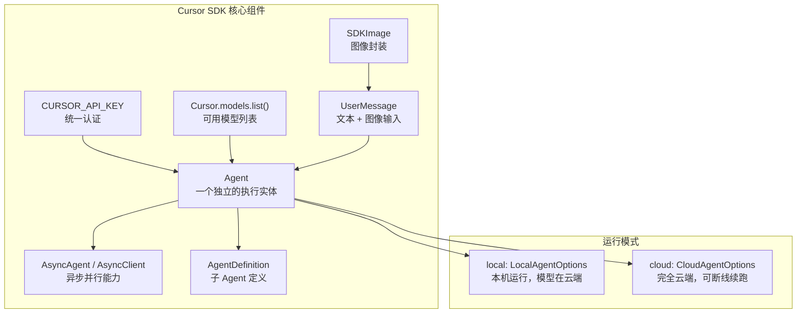
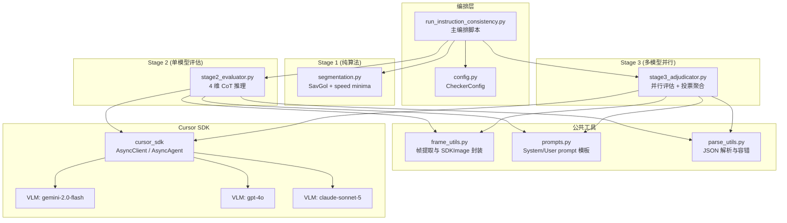
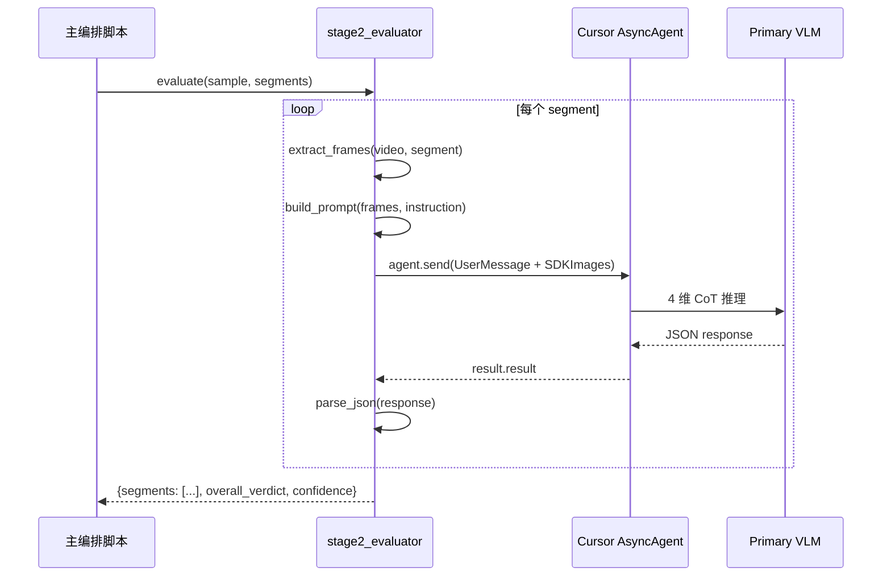
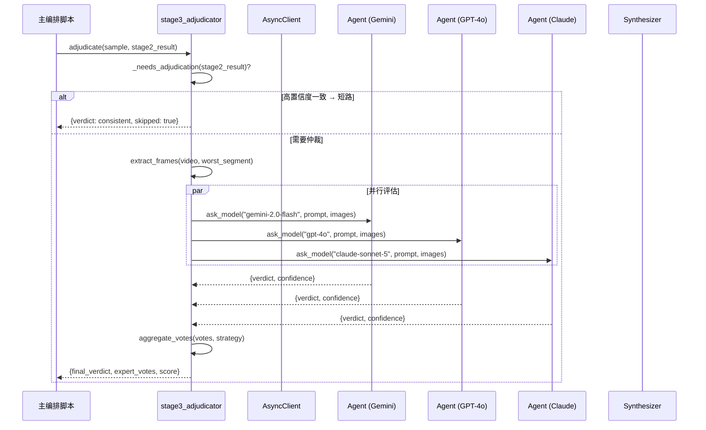
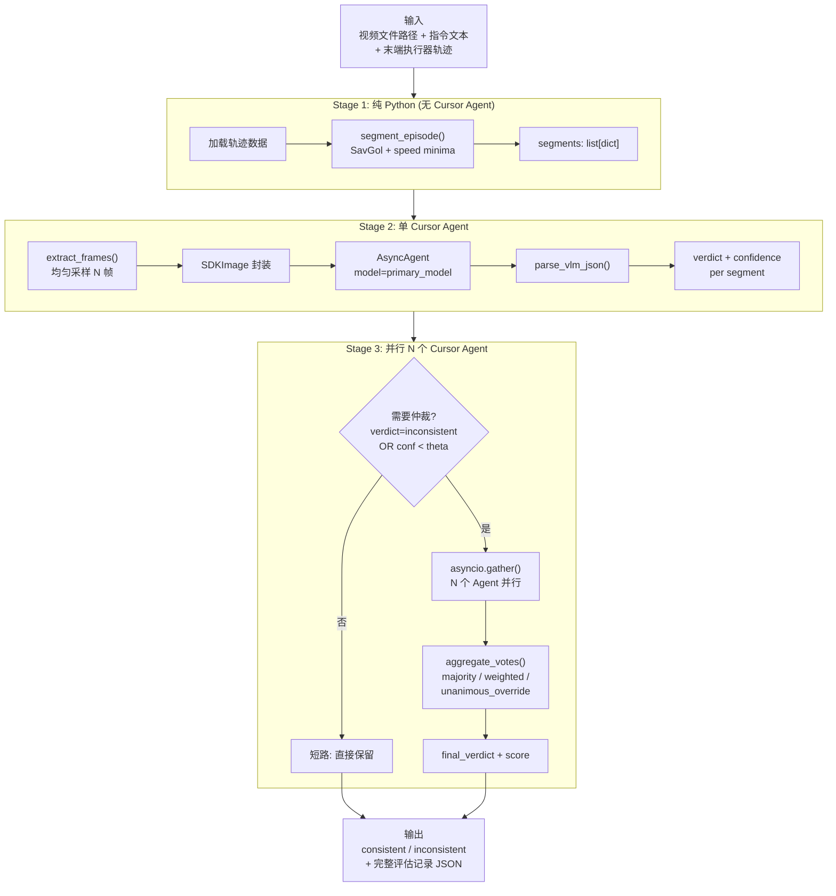
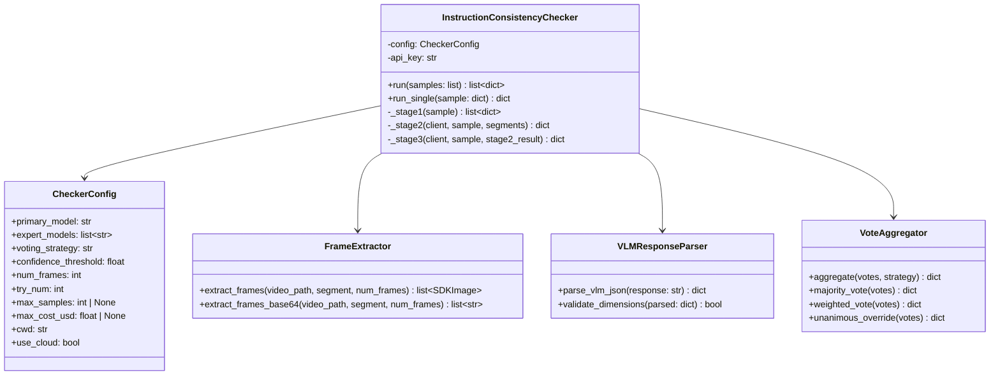
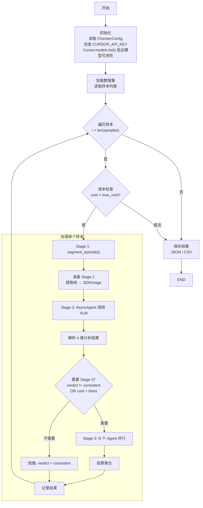
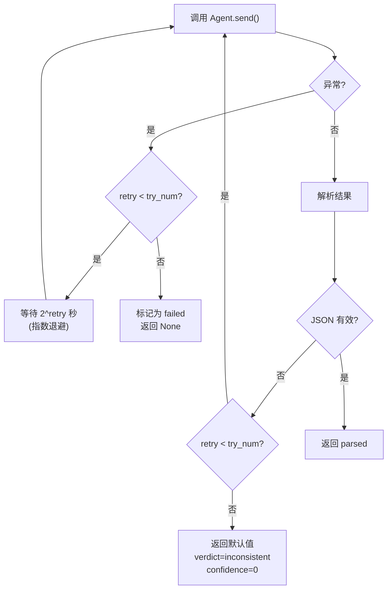

# 基于 Cursor SDK 实现 Instruction Consistency Check 的设计与实施方案

本文给出 Qwen-RobotManip 论文 **Check 1: Instruction Consistency** 三阶段 VLM 流水线的另一种可落地实现：**基于 Cursor SDK 的多 Agent 并行编排方案**。与 `data_chk1_1.md` 中基于 data-juicer 算子的批处理方案互补，本方案面向需要**快速接入多种 VLM、灵活编排、Cloud 后台运行**的场景。

论文原文分析与三阶段流水线详解请参阅 [`data_chk1_1.md`](data_chk1_1.md) 的 §1-§2，此处不再重复。

---

## 1. 引言与动机

### 1.1 为什么需要 Cursor SDK 版？

`data_chk1_1.md` 设计了基于 data-juicer 算子（`Mapper` / `Filter`）的实现方案，通过 YAML recipe 组合三个算子做批处理。该方案适合大规模离线数据清洗，但有以下局限：

| 局限 | 具体表现 |
|------|---------|
| **多 VLM 集成复杂** | 每个 VLM 提供商需要单独配置环境变量（`OPENAI_BASE_URL`、`OPENAI_API_KEY`、`DASHSCOPE_API_KEY`），Stage 3 多模型投票时需要在 Filter 内部切换多个 `ChatAPIModel` 实例 |
| **缺乏原生并行** | data-juicer 的单样本处理链是串行的，多模型调用只能在算子内部自行实现并行 |
| **无 Cloud 后台** | 需要本地进程持续运行，不能断线续跑 |
| **调试不便** | YAML + 算子嵌套，排错需要深入 data-juicer 内部 |

Cursor SDK 的多 Agent 架构天然解决了这些问题：

### 1.2 Cursor SDK 核心优势

```
┌──────────────────────────────────────────────┐
│            Cursor SDK 核心价值               │
├──────────────────────────────────────────────┤
│                                              │
│  1. 统一 API 密钥                            │
│     一个 CURSOR_API_KEY 访问所有托管模型     │
│     无需管理 Google/OpenAI/DashScope 各自    │
│     的密钥和 base_url                        │
│                                              │
│  2. 原生多模型并行                           │
│     asyncio.gather() + 多 Agent             │
│     每个 Agent 用不同 VLM，SDK 处理路由     │
│                                              │
│  3. Cloud 后台运行                           │
│     进程退出后云端仍可跑                     │
│     Agent.resume("bc-...") 断线续跑         │
│                                              │
│  4. 视觉输入原生支持                         │
│     SDKImage.from_file() / data + mime_type │
│     无需手动 base64 + message 拼接          │
│                                              │
└──────────────────────────────────────────────┘
```

### 1.3 两种方案的适用场景

| 场景 | 推荐方案 |
|------|---------|
| 大规模离线批处理（百万级样本） | data-juicer 版（`data_chk1_1.md`） |
| 快速原型验证、小批量评估 | **Cursor SDK 版**（本文） |
| 需要多种 VLM 并行评估 | **Cursor SDK 版**（原生并行） |
| 需要与 data-juicer pipeline 集成 | data-juicer 版 |
| 需要 Cloud 后台 / 断线续跑 | **Cursor SDK 版** |
| CI/CD 自动化触发 | 均可（Cursor 有 Automations） |
| 本地离线（无互联网） | data-juicer 版（支持 vLLM 本地） |

---

## 2. Cursor SDK 多 Agent 架构概述

### 2.1 SDK 核心概念



### 2.2 两种编排模式对比

**模式 A: 父 Agent + Subagents（自动委派）**

```python
with Agent.create(AgentOptions(
    model="composer-2.5",  # 编排者
    agents={
        "evaluator": AgentDefinition(
            description="评估视频-指令一致性",
            model="gemini-2.0-flash",
        ),
        "reviewer": AgentDefinition(
            description="审查评估结果",
            model="claude-sonnet-5",
        ),
    }
)) as agent:
    result = agent.send("分析这个样本的一致性").wait()
```

- 优点：简单，父 Agent 自动分派任务
- 缺点：**无法控制 Stage 3 中每个 VLM 独立评估同一输入**——父 Agent 可能跳过某些模型或改变评估内容

**模式 B: 显式并行多 Agent（本方案选择）**

```python
async def ask_model(client, model_id, prompt, images):
    async with await client.agents.create(...) as agent:
        run = await agent.send(UserMessage(text=prompt, images=images))
        return (await run.wait()).result

a, b, c = await asyncio.gather(
    ask_model(client, "gemini-2.0-flash", prompt, images),
    ask_model(client, "gpt-4o", prompt, images),
    ask_model(client, "claude-sonnet-5", prompt, images),
)
```

- 优点：**每个模型独立评估完全相同的输入**，保证公平性；并行执行，总耗时 = 最慢的那个模型
- 缺点：代码稍多，需要自行聚合结果

**选择依据**：Stage 3 的核心要求是"多个 VLM 作为**独立评估者**"，Condorcet 定理成立的前提是评估者之间的误差不相关。模式 B 保证了输入一致性和评估独立性，是正确的选择。

### 2.3 架构组件图



---

## 3. 三阶段流水线在 Cursor SDK 中的映射

### 3.1 Stage 1: 时序归一化 (纯算法，无 Agent)

时序归一化是纯数值计算（速度计算 → SavGol 平滑 → 局部极小值检测），不涉及 VLM 推理，因此**不经过 Cursor SDK**，直接用 Python 实现。

算法复用 data-juicer 中 `video_atomic_action_segment_mapper` 的核心逻辑：

$$
\tilde{v} = \operatorname{SavGol}(\|{\Delta \mathbf{p}}\|_2; w_s, p), \quad
\mathcal{C} = \{t \mid \tilde{v}_t = \min_{|s-t| \leq w} \tilde{v}_s\}
$$

```python
# segmentation.py — 不依赖 Cursor SDK
from scipy.signal import savgol_filter
import numpy as np

def segment_episode(positions: np.ndarray,
                    smooth_window: int = 5,
                    min_window: int = 15,
                    min_frames: int = 8) -> list[dict]:
    """将 episode 按速度极小值切分为子任务片段。"""
    speed = np.linalg.norm(np.diff(positions, axis=0), axis=1)
    speed = np.concatenate([[0.0], speed])

    win = min(smooth_window, len(speed))
    if win % 2 == 0:
        win -= 1
    if win >= 3:
        speed = savgol_filter(speed, win, min(2, win - 1))

    # 局部极小值检测
    cut_points = []
    for t in range(min_window, len(speed) - min_window):
        window = speed[max(0, t - min_window):t + min_window + 1]
        if speed[t] == window.min():
            cut_points.append(t)

    # 构建 segments
    boundaries = [0] + cut_points + [len(speed)]
    segments = []
    for i in range(len(boundaries) - 1):
        start, end = boundaries[i], boundaries[i + 1]
        if end - start >= min_frames:
            segments.append({
                "segment_id": len(segments),
                "start_frame": start,
                "end_frame": end,
            })
    return segments
```

### 3.2 Stage 2: 结构化推理 VLM 评估 (单 Agent)

使用单个 Cursor Agent，发送视频帧图像 + 指令文本，要求 4 维 CoT 结构化 JSON 输出。



关键点：
- **图像传递**：使用 `SDKImage.from_file()` 或 `SDKImage(data=base64, mime_type="image/jpeg")`，SDK 原生处理视觉输入
- **模型选择**：通过 `Cursor.models.list()` 动态获取可用模型，不硬编码模型 ID
- **重试机制**：Agent 调用失败时重试 `try_num` 次

### 3.3 Stage 3: 多专家跨模型仲裁 (并行 N 个 Agent)

Stage 3 是 Cursor SDK 方案的核心价值所在——**并行调用多个不同 VLM 独立评估同一输入，然后聚合投票**。



并行调用的 Python 实现：

```python
async def run_stage3_parallel(
    client: AsyncClient,
    expert_models: list[str],
    prompt: str,
    images: list[SDKImage],
    api_key: str,
    cwd: str,
) -> list[dict]:
    """并行调用多个 VLM 独立评估，收集投票。"""

    async def ask_one(model_id: str) -> dict | None:
        try:
            async with await client.agents.create(
                AgentOptions(
                    api_key=api_key,
                    model=model_id,
                    local=LocalAgentOptions(cwd=cwd),
                )
            ) as agent:
                run = await agent.send(
                    UserMessage(text=prompt, images=images)
                )
                result = await run.wait()
                parsed = parse_vlm_json(result.result)
                parsed["model"] = model_id
                return parsed
        except Exception as e:
            logger.warning(f"Expert {model_id} failed: {e}")
            return None

    results = await asyncio.gather(
        *[ask_one(m) for m in expert_models]
    )
    return [r for r in results if r is not None]
```

### 3.4 整体数据流



---

## 4. 静态架构

### 4.1 类图



### 4.2 模块结构

```
data_juicer/_au/pipeline/instruction_consistency/
├── __init__.py                        # 包入口
├── config.py                          # CheckerConfig dataclass
├── checker.py                         # InstructionConsistencyChecker 主类
├── segmentation.py                    # Stage 1: SavGol + speed minima
├── frame_utils.py                     # 帧提取与 SDKImage 封装
├── prompts.py                         # System/User prompt 模板
├── parse_utils.py                     # VLM JSON 解析与容错
├── vote.py                            # 投票聚合策略
└── run_instruction_consistency.py     # CLI 入口脚本

tests_au/pipeline/
├── test_instruction_consistency.py    # 单元 + 集成测试
├── test_vote.py                       # 投票策略专项测试
├── accept_instruction_consistency_cursor.yaml  # 验收配置
└── accept_instruction_consistency_cursor.sh     # 验收脚本
```

---

## 5. 动态架构

### 5.1 整体编排流程



### 5.2 错误处理与重试



关键策略：
- **指数退避重试**：第 $k$ 次重试等待 $2^k$ 秒，避免触发 API 限流
- **单个 Expert 失败不阻塞**：`asyncio.gather()` 中某个 Agent 超时或出错，其他 Agent 继续完成；投票时过滤掉 `None` 结果
- **最少投票数检查**：如果成功的 expert 数量 < 2，标记为 ambiguous 而非直接判定

---

## 6. 完整实现代码

### 6.1 依赖安装

```bash
# Cursor SDK
pip install cursor-sdk

# 算法依赖（已在 data-juicer 环境中）
pip install scipy numpy opencv-python

# 环境变量
export CURSOR_API_KEY="your-cursor-api-key"
```

### 6.2 配置定义

```python
# data_juicer/_au/pipeline/instruction_consistency/config.py
"""Instruction consistency checker configuration."""
from dataclasses import dataclass, field


@dataclass
class CheckerConfig:
    """Configuration for the Instruction Consistency Checker."""

    # Stage 2: primary model for structured reasoning
    primary_model: str = "gemini-2.0-flash"

    # Stage 3: expert models for multi-expert adjudication
    expert_models: list[str] = field(default_factory=lambda: [
        "gemini-2.0-flash",
        "gpt-4o",
        "claude-sonnet-5",
    ])

    # voting strategy: "majority" | "weighted" | "unanimous_override"
    voting_strategy: str = "majority"

    # confidence threshold below which Stage 3 is triggered
    confidence_threshold: float = 0.7

    # number of frames to extract per segment
    num_frames: int = 8

    # retry count for API calls
    try_num: int = 3

    # Stage 1 segmentation parameters
    speed_smooth_window: int = 5
    min_window: int = 15
    min_segment_frames: int = 8

    # cost / safety limits
    max_samples: int | None = None
    max_cost_usd: float | None = None

    # working directory for local agent execution
    cwd: str = "."

    # use Cursor Cloud (True) or local execution (False)
    use_cloud: bool = False
```

### 6.3 Stage 1 子任务切分

```python
# data_juicer/_au/pipeline/instruction_consistency/segmentation.py
"""Stage 1: Temporal normalization via speed minima detection.

Pure algorithmic — no LLM/VLM/Cursor Agent needed.
Adapted from video_atomic_action_segment_mapper.
"""
import numpy as np


def segment_episode(
    positions: np.ndarray,
    smooth_window: int = 5,
    min_window: int = 15,
    min_frames: int = 8,
    max_frames: int = 300,
) -> list[dict]:
    """Segment an episode trajectory into subtask clips by speed minima.

    Args:
        positions: End-effector positions, shape (T, 3).
        smooth_window: Savitzky-Golay smoothing window.
        min_window: Half-window for local minima detection.
        min_frames: Minimum frames per segment.
        max_frames: Maximum frames per segment.

    Returns:
        List of segment dicts with segment_id, start_frame, end_frame.
    """
    if len(positions) < 2:
        return [{"segment_id": 0, "start_frame": 0,
                 "end_frame": len(positions)}]

    speed = np.linalg.norm(np.diff(positions, axis=0), axis=1)
    speed = np.concatenate([[0.0], speed])

    # Savitzky-Golay smoothing
    try:
        from scipy.signal import savgol_filter
        win = min(smooth_window, len(speed))
        if win % 2 == 0:
            win -= 1
        if win >= 3:
            speed = savgol_filter(speed, win, min(2, win - 1))
    except ImportError:
        pass  # fallback: use unsmoothed speed

    # local minima detection
    cut_points = []
    for t in range(min_window, len(speed) - min_window):
        lo = max(0, t - min_window)
        hi = min(len(speed), t + min_window + 1)
        if speed[t] == speed[lo:hi].min():
            cut_points.append(t)

    # build segments, filter by length
    boundaries = [0] + cut_points + [len(speed)]
    segments = []
    for i in range(len(boundaries) - 1):
        s, e = boundaries[i], boundaries[i + 1]
        if e - s >= min_frames:
            segments.append({
                "segment_id": len(segments),
                "start_frame": s,
                "end_frame": e,
            })

    if not segments:
        segments = [{"segment_id": 0, "start_frame": 0,
                     "end_frame": len(speed)}]

    return segments
```

### 6.4 帧提取与 SDKImage 封装

```python
# data_juicer/_au/pipeline/instruction_consistency/frame_utils.py
"""Frame extraction and SDKImage wrapping for Cursor SDK."""
import base64
from pathlib import Path

import cv2
import numpy as np


def extract_frames_base64(
    video_path: str,
    start_frame: int,
    end_frame: int,
    num_frames: int = 8,
) -> list[dict]:
    """Extract uniformly-sampled frames from a video segment.

    Returns list of {"data": base64_str, "mime_type": "image/jpeg"}.
    """
    cap = cv2.VideoCapture(video_path)
    if not cap.isOpened():
        return []

    total_frames = int(cap.get(cv2.CAP_PROP_FRAME_COUNT))
    end_frame = min(end_frame, total_frames)

    if end_frame <= start_frame:
        cap.release()
        return []

    indices = np.linspace(start_frame, end_frame - 1,
                          num=num_frames, dtype=int)

    frames = []
    for idx in indices:
        cap.set(cv2.CAP_PROP_POS_FRAMES, int(idx))
        ret, frame = cap.read()
        if ret:
            _, buf = cv2.imencode(".jpg", frame,
                                  [cv2.IMWRITE_JPEG_QUALITY, 85])
            b64 = base64.b64encode(buf).decode("utf-8")
            frames.append({"data": b64, "mime_type": "image/jpeg"})

    cap.release()
    return frames


def frames_to_sdk_images(frames: list[dict]):
    """Convert base64 frame dicts to Cursor SDKImage objects.

    Falls back to raw dicts if cursor_sdk is not installed (for testing).
    """
    try:
        from cursor_sdk import SDKImage
        return [SDKImage(data=f["data"], mime_type=f["mime_type"])
                for f in frames]
    except ImportError:
        return frames
```

### 6.5 Prompt 模板

```python
# data_juicer/_au/pipeline/instruction_consistency/prompts.py
"""Prompt templates for instruction consistency evaluation."""

SYSTEM_PROMPT = """\
You are a robot manipulation expert. Your task is to evaluate whether
a video clip of a robot performing an action is semantically consistent
with a given language instruction.

You MUST analyze the video along exactly four dimensions before giving
your final verdict. For each dimension, provide a brief analysis and
an alignment judgment (true/false).

Output format — return ONLY a JSON object:
{
  "objects": {
    "analysis": "<What objects appear? Do they match the instruction?>",
    "aligned": true/false
  },
  "action_semantics": {
    "analysis": "<What action is performed? Does it match?>",
    "aligned": true/false
  },
  "temporal_ordering": {
    "analysis": "<Is the sub-action sequence correct?>",
    "aligned": true/false
  },
  "agent_environment_interaction": {
    "analysis": "<Is the interaction physically plausible?>",
    "aligned": true/false
  },
  "verdict": "consistent" or "inconsistent",
  "confidence": 0.0 to 1.0
}
"""

USER_TEMPLATE = """\
## Instruction
{instruction}

## Video Frames
The following {num_frames} frames are uniformly sampled from a video
clip showing a robot performing a manipulation task. Analyze them
carefully.

## Task
Analyze the video-instruction consistency along the four dimensions
(objects, action_semantics, temporal_ordering,
agent_environment_interaction). Then provide your verdict and
confidence score. Return ONLY the JSON object.
"""


def build_user_prompt(instruction: str, num_frames: int) -> str:
    return USER_TEMPLATE.format(
        instruction=instruction, num_frames=num_frames
    )
```

### 6.6 VLM 响应解析

```python
# data_juicer/_au/pipeline/instruction_consistency/parse_utils.py
"""Robust JSON parsing for VLM responses."""
import json
import re
from loguru import logger

REQUIRED_DIMENSIONS = [
    "objects", "action_semantics",
    "temporal_ordering", "agent_environment_interaction",
]


def parse_vlm_json(response: str) -> dict:
    """Parse structured JSON from a VLM response string.

    Handles: raw JSON, markdown code blocks, JSON embedded in text.
    Falls back to a default "inconsistent" result on parse failure.
    """
    if not response:
        return _default_result("empty response")

    # 1. Direct JSON parse
    try:
        return json.loads(response)
    except json.JSONDecodeError:
        pass

    # 2. Extract from markdown code block
    match = re.search(r"```(?:json)?\s*\n?(.*?)\n?```",
                      response, re.DOTALL)
    if match:
        try:
            return json.loads(match.group(1))
        except json.JSONDecodeError:
            pass

    # 3. Find first { ... last }
    start = response.find("{")
    end = response.rfind("}")
    if start != -1 and end > start:
        try:
            return json.loads(response[start:end + 1])
        except json.JSONDecodeError:
            pass

    return _default_result(f"unparseable: {response[:200]}")


def _default_result(reason: str) -> dict:
    logger.warning(f"VLM parse failed: {reason}")
    return {
        "verdict": "inconsistent",
        "confidence": 0.0,
        "parse_error": True,
        "error_reason": reason,
    }


def validate_dimensions(parsed: dict) -> bool:
    """Check that all 4 analysis dimensions are present."""
    return all(d in parsed for d in REQUIRED_DIMENSIONS)
```

### 6.7 投票聚合

```python
# data_juicer/_au/pipeline/instruction_consistency/vote.py
"""Multi-expert voting aggregation strategies."""


def aggregate_votes(votes: list[dict], strategy: str) -> dict:
    """Aggregate expert VLM votes into a final verdict.

    Args:
        votes: List of {"model": str, "verdict": str, "confidence": float}.
        strategy: "majority" | "weighted" | "unanimous_override".

    Returns:
        {"final_verdict": str, "final_score": float,
         "voting_strategy": str, "expert_votes": list,
         "num_experts_responded": int}
    """
    if not votes:
        return {
            "final_verdict": "inconsistent",
            "final_score": 0.0,
            "voting_strategy": strategy,
            "expert_votes": [],
            "num_experts_responded": 0,
        }

    if strategy == "majority":
        return _majority(votes)
    elif strategy == "weighted":
        return _weighted(votes)
    elif strategy == "unanimous_override":
        return _unanimous(votes)
    else:
        raise ValueError(f"Unknown voting strategy: {strategy}")


def _majority(votes):
    c = sum(1 for v in votes if v["verdict"] == "consistent")
    n = len(votes)
    final = "consistent" if c > n / 2 else "inconsistent"
    return _result(final, c / n, "majority", votes)


def _weighted(votes):
    w_c = sum(v["confidence"] for v in votes
              if v["verdict"] == "consistent")
    w_total = sum(v["confidence"] for v in votes)
    score = w_c / w_total if w_total > 0 else 0
    final = "consistent" if score > 0.5 else "inconsistent"
    return _result(final, score, "weighted", votes)


def _unanimous(votes):
    verdicts = set(v["verdict"] for v in votes)
    if len(verdicts) == 1:
        return _result(verdicts.pop(), 1.0, "unanimous_override", votes)
    return _result("ambiguous", 0.5, "unanimous_override", votes)


def _result(verdict, score, strategy, votes):
    return {
        "final_verdict": verdict,
        "final_score": round(score, 4),
        "voting_strategy": strategy,
        "expert_votes": votes,
        "num_experts_responded": len(votes),
    }
```

### 6.8 Stage 2 评估器

```python
# data_juicer/_au/pipeline/instruction_consistency/stage2_evaluator.py
"""Stage 2: Structured reasoning VLM evaluation via Cursor Agent."""
import asyncio
from loguru import logger

from .parse_utils import parse_vlm_json, validate_dimensions
from .prompts import SYSTEM_PROMPT, build_user_prompt
from .frame_utils import extract_frames_base64, frames_to_sdk_images


async def evaluate_segment(
    client,
    video_path: str,
    segment: dict,
    instruction: str,
    model_id: str,
    num_frames: int,
    api_key: str,
    cwd: str,
    try_num: int = 3,
) -> dict:
    """Evaluate a single segment's instruction consistency via VLM.

    Returns parsed 4-dimension analysis dict with verdict + confidence.
    """
    from cursor_sdk import (
        AgentOptions, LocalAgentOptions, UserMessage,
    )

    frames_b64 = extract_frames_base64(
        video_path, segment["start_frame"],
        segment["end_frame"], num_frames
    )
    if not frames_b64:
        return {"verdict": "inconsistent", "confidence": 0.0,
                "error": "no_frames", "segment_id": segment["segment_id"]}

    images = frames_to_sdk_images(frames_b64)
    user_text = (
        f"{SYSTEM_PROMPT}\n\n"
        f"{build_user_prompt(instruction, len(frames_b64))}"
    )

    for attempt in range(try_num):
        try:
            async with await client.agents.create(
                AgentOptions(
                    api_key=api_key,
                    model=model_id,
                    local=LocalAgentOptions(cwd=cwd),
                )
            ) as agent:
                run = await agent.send(
                    UserMessage(text=user_text, images=images)
                )
                result = await run.wait()
                parsed = parse_vlm_json(result.result)
                parsed["segment_id"] = segment["segment_id"]
                parsed["model"] = model_id
                return parsed
        except Exception as e:
            logger.warning(
                f"Stage 2 attempt {attempt+1}/{try_num} failed: {e}"
            )
            if attempt < try_num - 1:
                await asyncio.sleep(2 ** attempt)

    return {"verdict": "inconsistent", "confidence": 0.0,
            "error": "all_retries_failed",
            "segment_id": segment["segment_id"]}


async def run_stage2(
    client,
    video_path: str,
    segments: list[dict],
    instruction: str,
    model_id: str,
    num_frames: int,
    api_key: str,
    cwd: str,
    try_num: int = 3,
) -> dict:
    """Run Stage 2 on all segments and aggregate results.

    Returns {segments: [...], overall_verdict, overall_confidence, model}.
    """
    results = []
    for seg in segments:
        r = await evaluate_segment(
            client, video_path, seg, instruction,
            model_id, num_frames, api_key, cwd, try_num
        )
        results.append(r)

    # overall: inconsistent if any segment is inconsistent
    verdicts = [r.get("verdict", "inconsistent") for r in results]
    confidences = [r.get("confidence", 0.0) for r in results]

    if "inconsistent" in verdicts:
        overall = "inconsistent"
        overall_conf = min(confidences) if confidences else 0.0
    else:
        overall = "consistent"
        overall_conf = min(confidences) if confidences else 0.0

    return {
        "segments": results,
        "overall_verdict": overall,
        "overall_confidence": round(overall_conf, 4),
        "model": model_id,
    }
```

### 6.9 Stage 3 多专家仲裁

```python
# data_juicer/_au/pipeline/instruction_consistency/stage3_adjudicator.py
"""Stage 3: Multi-expert cross-model adjudication via parallel Cursor Agents."""
import asyncio
from loguru import logger

from .parse_utils import parse_vlm_json
from .prompts import SYSTEM_PROMPT, build_user_prompt
from .frame_utils import extract_frames_base64, frames_to_sdk_images
from .vote import aggregate_votes


def needs_adjudication(
    stage2_result: dict,
    confidence_threshold: float,
    expert_models: list[str],
) -> bool:
    """Determine if Stage 3 multi-expert adjudication is needed."""
    if not expert_models:
        return False

    verdict = stage2_result.get("overall_verdict", "inconsistent")
    confidence = stage2_result.get("overall_confidence", 0.0)

    if verdict == "consistent" and confidence >= confidence_threshold:
        return False

    return True


async def _ask_expert(
    client,
    model_id: str,
    prompt: str,
    images,
    api_key: str,
    cwd: str,
    try_num: int,
) -> dict | None:
    """Query a single expert VLM. Returns parsed result or None on failure."""
    from cursor_sdk import (
        AgentOptions, LocalAgentOptions, UserMessage,
    )

    for attempt in range(try_num):
        try:
            async with await client.agents.create(
                AgentOptions(
                    api_key=api_key,
                    model=model_id,
                    local=LocalAgentOptions(cwd=cwd),
                )
            ) as agent:
                run = await agent.send(
                    UserMessage(text=prompt, images=images)
                )
                result = await run.wait()
                parsed = parse_vlm_json(result.result)
                parsed["model"] = model_id
                return parsed
        except Exception as e:
            logger.warning(
                f"Expert {model_id} attempt {attempt+1}/{try_num}: {e}"
            )
            if attempt < try_num - 1:
                await asyncio.sleep(2 ** attempt)

    logger.error(f"Expert {model_id} failed after {try_num} attempts")
    return None


async def run_stage3(
    client,
    video_path: str,
    stage2_result: dict,
    instruction: str,
    expert_models: list[str],
    voting_strategy: str,
    num_frames: int,
    api_key: str,
    cwd: str,
    try_num: int = 3,
) -> dict:
    """Run Stage 3 multi-expert adjudication.

    Parallel-queries each expert VLM and aggregates votes.
    """
    # Find the worst segment from Stage 2 for re-evaluation
    segments = stage2_result.get("segments", [])
    worst = min(segments,
                key=lambda s: s.get("confidence", 0.0),
                default=None)
    if worst is None:
        return {"final_verdict": "inconsistent", "final_score": 0.0,
                "adjudication_needed": True, "error": "no_segments"}

    frames_b64 = extract_frames_base64(
        video_path, worst.get("start_frame", 0),
        worst.get("end_frame", 0), num_frames
    )
    images = frames_to_sdk_images(frames_b64)
    prompt = (
        f"{SYSTEM_PROMPT}\n\n"
        f"{build_user_prompt(instruction, len(frames_b64))}"
    )

    # Parallel evaluation by all experts
    votes = await asyncio.gather(
        *[_ask_expert(client, m, prompt, images,
                      api_key, cwd, try_num)
          for m in expert_models]
    )
    valid_votes = [v for v in votes if v is not None]

    if len(valid_votes) < 2:
        logger.warning(
            f"Only {len(valid_votes)} experts responded "
            f"(need >= 2). Marking as ambiguous."
        )
        return {
            "final_verdict": "ambiguous",
            "final_score": 0.0,
            "adjudication_needed": True,
            "expert_votes": valid_votes,
            "num_experts_responded": len(valid_votes),
        }

    result = aggregate_votes(valid_votes, voting_strategy)
    result["adjudication_needed"] = True
    return result
```

### 6.10 主编排脚本

```python
# data_juicer/_au/pipeline/instruction_consistency/run_instruction_consistency.py
"""Main orchestration script for Instruction Consistency Check.

Usage:
    python -m data_juicer._au.pipeline.instruction_consistency.run_instruction_consistency \
        --video /path/to/video.mp4 \
        --instruction "pick up the red cup" \
        --positions /path/to/positions.npy
"""
import argparse
import asyncio
import json
import os
import sys
from pathlib import Path

import numpy as np
from loguru import logger

from .config import CheckerConfig
from .segmentation import segment_episode
from .stage2_evaluator import run_stage2
from .stage3_adjudicator import needs_adjudication, run_stage3


async def check_single_sample(
    video_path: str,
    instruction: str,
    positions: np.ndarray,
    config: CheckerConfig,
) -> dict:
    """Run the full 3-stage pipeline on a single sample.

    Returns a result dict with verdict, confidence, and all intermediate
    analysis details.
    """
    from cursor_sdk import AsyncClient

    api_key = os.environ.get("CURSOR_API_KEY")
    if not api_key:
        raise RuntimeError("CURSOR_API_KEY environment variable not set")

    # --- Stage 1: Temporal Normalization (pure Python) ---
    logger.info("Stage 1: Segmenting episode...")
    segments = segment_episode(
        positions,
        smooth_window=config.speed_smooth_window,
        min_window=config.min_window,
        min_frames=config.min_segment_frames,
    )
    logger.info(f"  → {len(segments)} segments")

    # --- Stage 2 & 3: Cursor SDK Agents ---
    async with await AsyncClient.launch_bridge(
        workspace=config.cwd
    ) as client:

        # Stage 2: Structured Reasoning VLM
        logger.info(
            f"Stage 2: Evaluating with {config.primary_model}..."
        )
        stage2_result = await run_stage2(
            client, video_path, segments, instruction,
            config.primary_model, config.num_frames,
            api_key, config.cwd, config.try_num,
        )
        logger.info(
            f"  → verdict={stage2_result['overall_verdict']}, "
            f"conf={stage2_result['overall_confidence']}"
        )

        # Stage 3: Multi-Expert Adjudication (if needed)
        if needs_adjudication(stage2_result,
                              config.confidence_threshold,
                              config.expert_models):
            logger.info(
                f"Stage 3: Multi-expert adjudication with "
                f"{len(config.expert_models)} models..."
            )
            stage3_result = await run_stage3(
                client, video_path, stage2_result, instruction,
                config.expert_models, config.voting_strategy,
                config.num_frames, api_key, config.cwd,
                config.try_num,
            )
            logger.info(
                f"  → final_verdict={stage3_result['final_verdict']}, "
                f"score={stage3_result['final_score']}"
            )
        else:
            logger.info("Stage 3: Skipped (high-confidence consistent)")
            stage3_result = {
                "final_verdict": stage2_result["overall_verdict"],
                "final_score": stage2_result["overall_confidence"],
                "adjudication_needed": False,
            }

    return {
        "video_path": video_path,
        "instruction": instruction,
        "num_segments": len(segments),
        "segments": segments,
        "stage2": stage2_result,
        "stage3": stage3_result,
        "final_verdict": stage3_result["final_verdict"],
        "is_consistent": stage3_result["final_verdict"] == "consistent",
    }


def main():
    parser = argparse.ArgumentParser(
        description="Instruction Consistency Check (Cursor SDK)"
    )
    parser.add_argument("--video", required=True)
    parser.add_argument("--instruction", required=True)
    parser.add_argument("--positions", required=True,
                        help="Path to .npy file with EEF positions")
    parser.add_argument("--primary-model", default="gemini-2.0-flash")
    parser.add_argument("--expert-models", nargs="+",
                        default=["gemini-2.0-flash", "gpt-4o",
                                 "claude-sonnet-5"])
    parser.add_argument("--voting-strategy", default="majority",
                        choices=["majority", "weighted",
                                 "unanimous_override"])
    parser.add_argument("--confidence-threshold", type=float, default=0.7)
    parser.add_argument("--num-frames", type=int, default=8)
    parser.add_argument("--output", default="result.json")
    args = parser.parse_args()

    config = CheckerConfig(
        primary_model=args.primary_model,
        expert_models=args.expert_models,
        voting_strategy=args.voting_strategy,
        confidence_threshold=args.confidence_threshold,
        num_frames=args.num_frames,
        cwd=os.getcwd(),
    )

    positions = np.load(args.positions)
    result = asyncio.run(check_single_sample(
        args.video, args.instruction, positions, config
    ))

    with open(args.output, "w") as f:
        json.dump(result, f, indent=2, ensure_ascii=False)
    logger.info(f"Result saved to {args.output}")
    logger.info(f"Final verdict: {result['final_verdict']}")


if __name__ == "__main__":
    main()
```

### 6.11 批量处理扩展

对于多样本批量处理，可以用 `asyncio.Semaphore` 控制并发：

```python
async def check_batch(
    samples: list[dict],
    config: CheckerConfig,
    concurrency: int = 4,
) -> list[dict]:
    """Process a batch of samples with controlled concurrency.

    Each sample dict: {"video": str, "instruction": str,
                       "positions": np.ndarray}
    """
    sem = asyncio.Semaphore(concurrency)
    results = []

    async def process_one(sample, idx):
        async with sem:
            logger.info(f"Processing sample {idx+1}/{len(samples)}")
            try:
                r = await check_single_sample(
                    sample["video"],
                    sample["instruction"],
                    sample["positions"],
                    config,
                )
                r["sample_index"] = idx
                return r
            except Exception as e:
                logger.error(f"Sample {idx} failed: {e}")
                return {"sample_index": idx, "error": str(e),
                        "is_consistent": False}

    tasks = [process_one(s, i) for i, s in enumerate(samples)]

    if config.max_samples:
        tasks = tasks[:config.max_samples]

    results = await asyncio.gather(*tasks)
    return list(results)
```

---

## 7. 测试方案

### 7.1 单元测试（Mock Cursor SDK）

```python
# tests_au/pipeline/test_instruction_consistency.py
"""Unit tests for instruction consistency checker (Cursor SDK version).

Uses mock Cursor SDK to test logic without real API calls.
"""
import json
import unittest
from unittest.mock import AsyncMock, MagicMock, patch

import numpy as np

from data_juicer._au.pipeline.instruction_consistency.config import (
    CheckerConfig,
)
from data_juicer._au.pipeline.instruction_consistency.parse_utils import (
    parse_vlm_json,
)
from data_juicer._au.pipeline.instruction_consistency.segmentation import (
    segment_episode,
)
from data_juicer._au.pipeline.instruction_consistency.vote import (
    aggregate_votes,
)


class TestSegmentation(unittest.TestCase):
    """Test Stage 1 temporal normalization."""

    def test_single_action(self):
        """Monotonic speed → no cut points → single segment."""
        pos = np.cumsum(np.random.randn(50, 3) * 0.01, axis=0)
        segs = segment_episode(pos, min_window=5, min_frames=4)
        self.assertGreaterEqual(len(segs), 1)
        self.assertEqual(segs[0]["start_frame"], 0)

    def test_two_actions_with_pause(self):
        """Speed drops to zero mid-episode → two segments."""
        pos = np.zeros((100, 3))
        # action 1: frames 0-40 (moving)
        pos[:40, 0] = np.linspace(0, 1, 40)
        # pause: frames 40-60 (stationary)
        pos[40:60, 0] = 1.0
        # action 2: frames 60-100 (moving again)
        pos[60:, 0] = np.linspace(1, 2, 40)

        segs = segment_episode(pos, min_window=5, min_frames=4)
        self.assertGreaterEqual(len(segs), 2)

    def test_empty_trajectory(self):
        """Single-point trajectory → single segment."""
        pos = np.zeros((1, 3))
        segs = segment_episode(pos)
        self.assertEqual(len(segs), 1)


class TestParseVLMJson(unittest.TestCase):
    """Test VLM response parsing robustness."""

    def test_valid_json(self):
        resp = json.dumps({"verdict": "consistent", "confidence": 0.9})
        parsed = parse_vlm_json(resp)
        self.assertEqual(parsed["verdict"], "consistent")

    def test_markdown_code_block(self):
        resp = '```json\n{"verdict": "inconsistent", "confidence": 0.3}\n```'
        parsed = parse_vlm_json(resp)
        self.assertEqual(parsed["verdict"], "inconsistent")

    def test_json_in_text(self):
        resp = 'Here is my analysis: {"verdict": "consistent", "confidence": 0.8} end.'
        parsed = parse_vlm_json(resp)
        self.assertEqual(parsed["verdict"], "consistent")

    def test_unparseable(self):
        resp = "I think this is consistent."
        parsed = parse_vlm_json(resp)
        self.assertTrue(parsed.get("parse_error"))
        self.assertEqual(parsed["verdict"], "inconsistent")

    def test_empty_response(self):
        parsed = parse_vlm_json("")
        self.assertTrue(parsed.get("parse_error"))


class TestVoteAggregation(unittest.TestCase):
    """Test voting strategies."""

    def _votes(self, verdicts_confs):
        return [{"model": f"m{i}", "verdict": v, "confidence": c}
                for i, (v, c) in enumerate(verdicts_confs)]

    def test_majority_consistent(self):
        votes = self._votes([
            ("consistent", 0.8),
            ("consistent", 0.7),
            ("inconsistent", 0.6),
        ])
        r = aggregate_votes(votes, "majority")
        self.assertEqual(r["final_verdict"], "consistent")

    def test_majority_inconsistent(self):
        votes = self._votes([
            ("inconsistent", 0.8),
            ("inconsistent", 0.7),
            ("consistent", 0.6),
        ])
        r = aggregate_votes(votes, "majority")
        self.assertEqual(r["final_verdict"], "inconsistent")

    def test_weighted_overrides_count(self):
        """High-confidence minority overrides low-confidence majority."""
        votes = self._votes([
            ("inconsistent", 0.95),  # high confidence
            ("consistent", 0.51),    # low confidence
            ("consistent", 0.52),    # low confidence
        ])
        r = aggregate_votes(votes, "weighted")
        # w_c = 0.51 + 0.52 = 1.03, w_total = 1.98
        # score = 1.03 / 1.98 ≈ 0.52 > 0.5 → consistent
        # Actually in this case weighted still says consistent
        # because the sum of consistent confidences is slightly higher
        self.assertIn(r["final_verdict"],
                      ["consistent", "inconsistent"])

    def test_unanimous_all_agree(self):
        votes = self._votes([
            ("consistent", 0.9),
            ("consistent", 0.8),
            ("consistent", 0.85),
        ])
        r = aggregate_votes(votes, "unanimous_override")
        self.assertEqual(r["final_verdict"], "consistent")
        self.assertEqual(r["final_score"], 1.0)

    def test_unanimous_disagree(self):
        votes = self._votes([
            ("consistent", 0.9),
            ("inconsistent", 0.8),
        ])
        r = aggregate_votes(votes, "unanimous_override")
        self.assertEqual(r["final_verdict"], "ambiguous")

    def test_empty_votes(self):
        r = aggregate_votes([], "majority")
        self.assertEqual(r["final_verdict"], "inconsistent")
        self.assertEqual(r["num_experts_responded"], 0)


class TestConfig(unittest.TestCase):
    """Test configuration defaults."""

    def test_defaults(self):
        cfg = CheckerConfig()
        self.assertEqual(cfg.primary_model, "gemini-2.0-flash")
        self.assertEqual(len(cfg.expert_models), 3)
        self.assertEqual(cfg.voting_strategy, "majority")
        self.assertEqual(cfg.confidence_threshold, 0.7)


if __name__ == "__main__":
    unittest.main()
```

### 7.2 集成测试

```python
# 在 test_instruction_consistency.py 中追加

class TestStage3NeedsAdjudication(unittest.TestCase):

    def test_high_confidence_consistent_skips(self):
        from data_juicer._au.pipeline.instruction_consistency \
            .stage3_adjudicator import needs_adjudication
        result = {"overall_verdict": "consistent",
                  "overall_confidence": 0.9}
        self.assertFalse(
            needs_adjudication(result, 0.7, ["m1", "m2"])
        )

    def test_low_confidence_triggers(self):
        from data_juicer._au.pipeline.instruction_consistency \
            .stage3_adjudicator import needs_adjudication
        result = {"overall_verdict": "consistent",
                  "overall_confidence": 0.5}
        self.assertTrue(
            needs_adjudication(result, 0.7, ["m1", "m2"])
        )

    def test_inconsistent_triggers(self):
        from data_juicer._au.pipeline.instruction_consistency \
            .stage3_adjudicator import needs_adjudication
        result = {"overall_verdict": "inconsistent",
                  "overall_confidence": 0.9}
        self.assertTrue(
            needs_adjudication(result, 0.7, ["m1", "m2"])
        )

    def test_no_experts_skips(self):
        from data_juicer._au.pipeline.instruction_consistency \
            .stage3_adjudicator import needs_adjudication
        result = {"overall_verdict": "inconsistent",
                  "overall_confidence": 0.3}
        self.assertFalse(
            needs_adjudication(result, 0.7, [])
        )
```

### 7.3 验收脚本

```bash
#!/bin/bash
# tests_au/pipeline/accept_instruction_consistency_cursor.sh
set -euo pipefail

echo "=== Acceptance Test: Instruction Consistency (Cursor SDK) ==="

# Check CURSOR_API_KEY
if [ -z "${CURSOR_API_KEY:-}" ]; then
    echo "ERROR: CURSOR_API_KEY not set. Skipping acceptance test."
    exit 0
fi

# Check cursor-sdk installed
python3 -c "import cursor_sdk" 2>/dev/null || {
    echo "ERROR: cursor-sdk not installed. Run: pip install cursor-sdk"
    exit 1
}

DATA_DIR="/mnt/r/DATA/tst/Galaxea-Open-World-Dataset/Connect_Router_Cables_20250625_002"

if [ ! -d "$DATA_DIR" ]; then
    echo "WARNING: Test dataset not found at $DATA_DIR. Skipping."
    exit 0
fi

# Find first video file
VIDEO=$(find "$DATA_DIR" -name "*.mp4" -o -name "*.avi" | head -1)
if [ -z "$VIDEO" ]; then
    echo "WARNING: No video files found. Skipping."
    exit 0
fi

echo "Video: $VIDEO"

# Run single-sample test (minimal cost)
python3 -m data_juicer._au.pipeline.instruction_consistency.run_instruction_consistency \
    --video "$VIDEO" \
    --instruction "connect the router cables" \
    --positions "$DATA_DIR/eef_positions.npy" \
    --primary-model "gemini-2.0-flash" \
    --expert-models "gemini-2.0-flash" \
    --voting-strategy majority \
    --confidence-threshold 0.7 \
    --num-frames 4 \
    --output /tmp/accept_instruction_consistency_result.json

echo "Result:"
cat /tmp/accept_instruction_consistency_result.json | python3 -m json.tool

echo "=== Done ==="
```

### 7.4 风险清单与缓解措施

| 风险 | 可能性 | 影响 | 缓解措施 |
|------|--------|------|---------|
| **Cursor API 限流** | 中 | Stage 3 并行 N 个 Agent 可能触发限流 | 指数退避重试；`asyncio.Semaphore` 控制并发 |
| **模型不可用** | 低 | 某个 expert 模型临时下线 | 单个 expert 失败不阻塞；最少 2 个 expert 才投票 |
| **成本超支** | 中 | 批量处理时 API 调用费用快速累积 | `max_samples` 和 `max_cost_usd` 配置项；日志中输出累计成本估算 |
| **SDK 版本不兼容** | 低 | cursor-sdk 更新后 API 变化 | 锁定 SDK 版本（`cursor-sdk==x.y.z`）；代码中尽量使用稳定 API |
| **VLM 返回非 JSON** | 高 | 不同模型输出格式不一致 | 三层 JSON 解析回退（直接/代码块/花括号提取）；解析失败 → 默认 inconsistent |
| **长视频帧提取慢** | 中 | OpenCV 随机访问大视频文件的 seek 较慢 | 只在需要时提取（Stage 2 和 Stage 3）；缓存已提取的帧 |
| **Cursor SDK 不支持某些 VLM 的视觉输入** | 低 | 部分模型可能不支持 image input | 启动时检查 `Cursor.models.list()` 过滤支持视觉的模型 |

---

## 8. 两种方案对比总结

### 8.1 特性对比

| 特性 | data-juicer 版 (`data_chk1_1.md`) | Cursor SDK 版 (本文) |
|------|----------------------------------|---------------------|
| **编排方式** | YAML recipe + Mapper/Filter 算子 | Python async 脚本 + Cursor Agent |
| **批处理** | 原生支持（HuggingFace Dataset 驱动） | 需要自行实现循环和并发控制 |
| **多 VLM 路由** | 需要分别配置各提供商的 API key 和 base_url | **统一 CURSOR_API_KEY** |
| **并行** | 算子内部自行实现 | **原生 asyncio.gather()** |
| **Cloud 后台** | 不支持（需本地进程持续运行） | **支持（Cloud Agent + resume）** |
| **图像/视频输入** | 手动 base64 编码 + message 拼接 | **SDKImage 原生封装** |
| **成本模型** | 各 API 提供商分别计费 | Cursor 统一计费 |
| **离线运行** | 支持（vLLM 本地推理） | 不支持（需要 Cursor 云端） |
| **DJ pipeline 集成** | **原生集成**（YAML 中的一个算子） | 需要额外的桥接脚本 |
| **调试** | YAML + 算子嵌套，需深入 DJ 内部 | **Python 脚本，标准调试器** |
| **学习曲线** | 需要理解 DJ 算子体系 | 需要理解 Cursor SDK API |
| **依赖** | 仅 data-juicer | data-juicer + cursor-sdk |

### 8.2 适用场景推荐

```
                        data-juicer 版           Cursor SDK 版
                        ┌─────────────┐          ┌─────────────┐
大规模离线批处理       │  ★★★★★      │          │  ★★★        │
(百万级样本)          └─────────────┘          └─────────────┘

快速原型验证           ┌─────────────┐          ┌─────────────┐
(几十个样本)          │  ★★★        │          │  ★★★★★      │
                      └─────────────┘          └─────────────┘

多 VLM 模型对比       ┌─────────────┐          ┌─────────────┐
实验                  │  ★★★        │          │  ★★★★★      │
                      └─────────────┘          └─────────────┘

CI/CD 自动化          ┌─────────────┐          ┌─────────────┐
                      │  ★★★★       │          │  ★★★★       │
                      └─────────────┘          └─────────────┘

本地离线部署          ┌─────────────┐          ┌─────────────┐
(无互联网)            │  ★★★★★      │          │  ★           │
                      └─────────────┘          └─────────────┘

与现有 DJ pipeline    ┌─────────────┐          ┌─────────────┐
集成                  │  ★★★★★      │          │  ★★          │
                      └─────────────┘          └─────────────┘
```

### 8.3 总结

两种方案**互补而非替代**：

- **data-juicer 版**是生产环境的首选——它与现有数据处理 pipeline 无缝集成，支持大规模批处理，且不引入外部 SDK 依赖。
- **Cursor SDK 版**适合**研发探索阶段**——快速验证不同 VLM 的效果、对比投票策略、小批量评估新数据集。它的统一 API 密钥和原生并行能力让多模型实验的摩擦成本最低。

推荐的工作流程：
1. 先用 Cursor SDK 版做**小规模实验**（几十个样本），确定最佳 VLM 组合和 prompt
2. 将验证后的配置迁移到 data-juicer 版的 YAML recipe 中
3. 用 data-juicer 版做**大规模生产处理**
