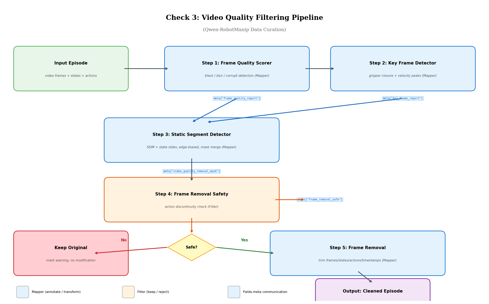
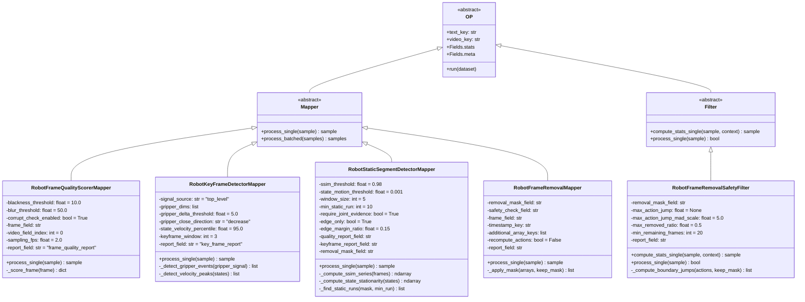
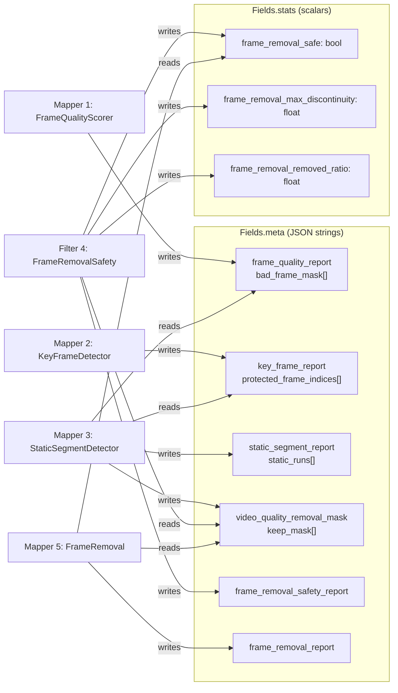
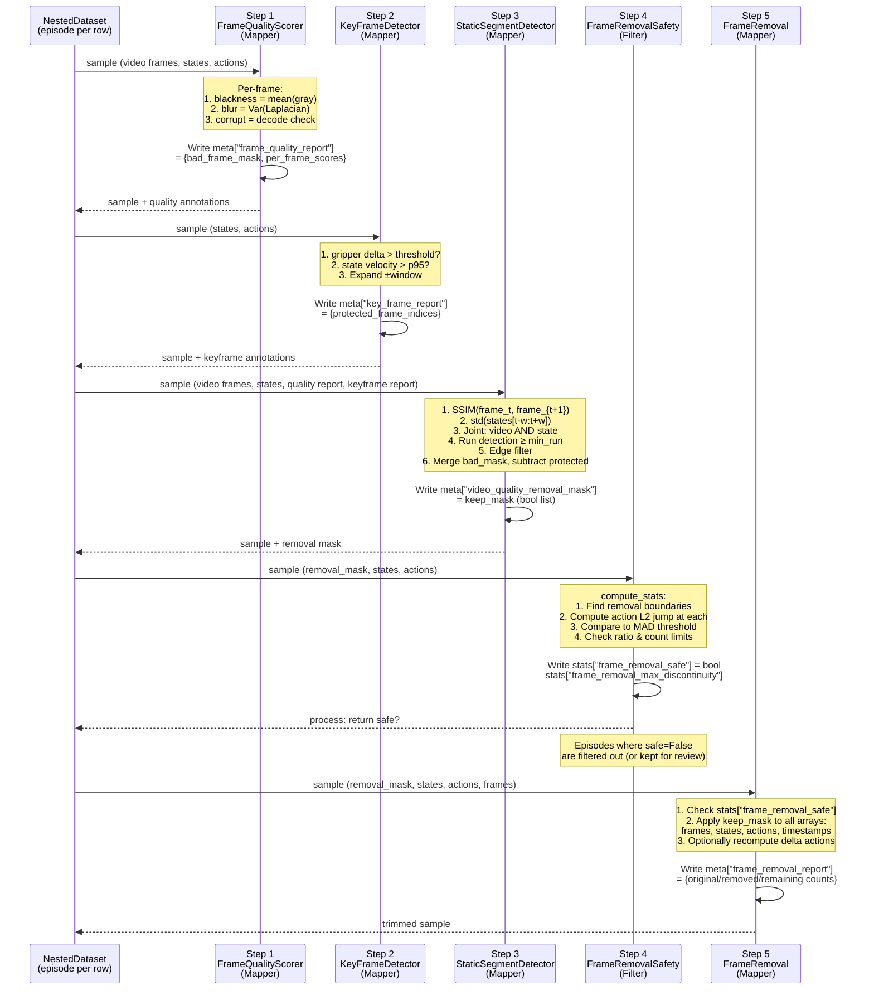
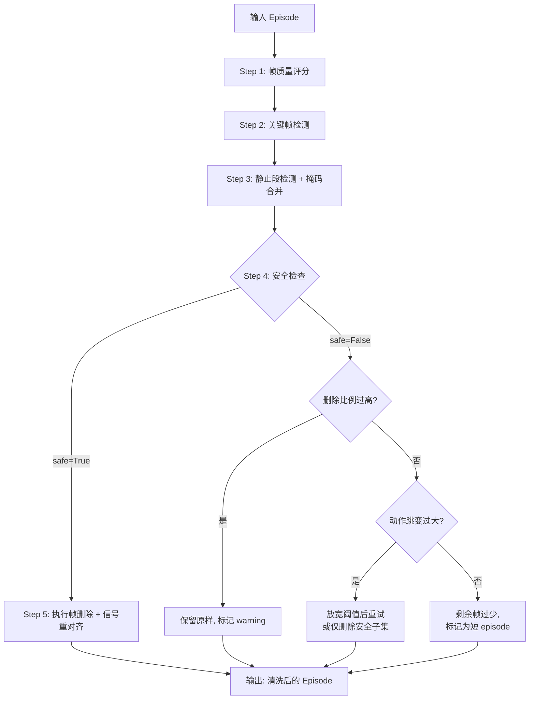

# 用 data-juicer 实现 Qwen-RobotManip Check 3: Video Quality Filtering 方案

本文目标是给出一个可落地的设计与实施方案：如何用当前 `data-juicer` 代码库实现 Qwen-RobotManip 论文中 **Check 3: Video Quality Filtering** 所描述的视频帧级数据清洗流水线。分析基于论文 TeX 原文、本地官方文档与真实源码，遵循"扩展大于修改"原则，所有新增代码均在 `data_juicer/_au/` 中。

对应论文位置：`b/d/QwenRobotmanip/TeX_Source/chapter/data.tex` 第 251-256 行。

---

## 目录

- [1. 论文原文与翻译](#1-论文原文与翻译)
- [2. 深入分析](#2-深入分析)
  - [2.1 方法总览：四维度帧级质量过滤](#21-方法总览四维度帧级质量过滤)
  - [2.2 子问题 A：视觉无效帧检测](#22-子问题-a视觉无效帧检测)
  - [2.3 子问题 B：静止段联合检测](#23-子问题-b静止段联合检测)
  - [2.4 子问题 C：关键帧保护](#24-子问题-c关键帧保护)
  - [2.5 子问题 D：删除后信号重对齐与安全性](#25-子问题-d删除后信号重对齐与安全性)
- [3. 横向对比：相关方法分析](#3-横向对比相关方法分析)
- [4. DJ 现有能力映射](#4-dj-现有能力映射)
- [5. 缺口分析](#5-缺口分析)
- [6. 静态架构设计](#6-静态架构设计)
- [7. 动态架构设计](#7-动态架构设计)
- [8. 各算子详细设计](#8-各算子详细设计)
  - [8.1 算子 1: RobotFrameQualityScorerMapper](#81-算子-1-robotframequalityscorermapper)
  - [8.2 算子 2: RobotKeyFrameDetectorMapper](#82-算子-2-robotkeyframedetectormapper)
  - [8.3 算子 3: RobotStaticSegmentDetectorMapper](#83-算子-3-robotstaticsegmentdetectormapper)
  - [8.4 算子 4: RobotFrameRemovalSafetyFilter](#84-算子-4-robotframeremovalsafetyfilter)
  - [8.5 算子 5: RobotFrameRemovalMapper](#85-算子-5-robotframeremovalmapper)
- [9. Pipeline 编排与注册](#9-pipeline-编排与注册)
- [10. 关键算法深入解读](#10-关键算法深入解读)
- [11. 测试计划](#11-测试计划)
- [12. 交付物清单](#12-交付物清单)

---

## 1. 论文原文与翻译

### 1.1 原文（正文部分）

> **Check 3: Video Quality Filtering.**
> We apply video-level data cleaning to remove frames that may degrade policy learning. We remove visually invalid frames including black, corrupted, blurred, and prolonged static segments, using image processing checks applied jointly with state and action signals to detect redundant static periods typically at episode boundaries. Task-critical key frames such as gripper closure events are explicitly preserved to avoid discarding visually subtle but semantically important transitions.

### 1.2 原文（注释中的扩展描述）

> We apply video-level data cleaning to remove frames that may degrade policy learning, including black frames, corrupted frames, blurred frames, and prolonged static segments. Using digital image processing, we filter visually invalid or low-quality frames, while jointly checking video observations with the corresponding state/action signals to identify redundant static periods, which typically occur at the beginning or end of demonstrations. Removing such segments reduces the model's tendency to learn inactive or hesitant behavior.
>
> During static-frame filtering, we explicitly preserve task-critical key frames, such as gripper closure and other decisive state transitions, to avoid discarding visually subtle but semantically important events. This procedure improves data quality while maintaining essential task information.

### 1.3 中文翻译

**检查 3：视频质量过滤。** 我们对视频层面进行数据清洗，移除可能降低策略学习质量的帧。我们移除视觉上无效的帧，包括黑帧、损坏帧、模糊帧以及长时间静止片段，同时结合图像处理检查与状态/动作信号，联合检测冗余的静止时段——这些静止时段通常出现在演示片段（episode）的边界处。对于任务关键帧（如夹爪闭合事件），则予以显式保留，以避免丢弃那些视觉上不显眼但语义上至关重要的过渡帧。

我们对视频层面进行数据清洗，移除可能降低策略学习质量的帧，包括黑帧、损坏帧、模糊帧以及长时间静止片段。通过数字图像处理技术，我们过滤视觉上无效或低质量的帧，同时将视频观测与对应的状态/动作信号进行联合检查，以识别冗余的静止时段——这些静止时段通常出现在演示的起始或结束阶段。移除这些片段可以降低模型学习到不活跃或犹豫行为的倾向。

在静止帧过滤过程中，我们显式地保留任务关键帧，例如夹爪闭合及其他决定性状态转换，以避免丢弃那些视觉上细微但语义上重要的事件。该流程在提升数据质量的同时，保留了必要的任务信息。

---

## 2. 深入分析

### 2.1 方法总览：四维度帧级质量过滤

Check 3 的核心洞察是：**机器人操作演示的视频帧并非同等重要——有些帧本身就是"坏数据"（黑帧、损坏帧、模糊帧），有些帧是"无用数据"（长时间静止段），而有些看似平凡的帧实际上是"关键数据"（夹爪闭合瞬间）**。论文设计了一个四维度的帧级质量过滤体系：

```
输入: 一个 episode (视频帧序列 + 状态轨迹 + 动作轨迹)
    │
    ▼
┌─────────────────────────────────────────┐
│ 维度 A: 视觉无效帧检测                   │  ── 黑帧 / 损坏帧 / 模糊帧
│ (Image Processing)                      │
└─────────────────────────────────────────┘
    │ bad_frame_mask
    ▼
┌─────────────────────────────────────────┐
│ 维度 B: 静止段联合检测                    │  ── 视频 SSIM + 状态/动作方差
│ (Joint Video + State/Action Check)      │     聚焦 episode 边界
└─────────────────────────────────────────┘
    │ static_removal_mask
    ▼
┌─────────────────────────────────────────┐
│ 维度 C: 关键帧保护                       │  ── 夹爪闭合 / 决定性状态转换
│ (Keyframe Preservation)                 │
└─────────────────────────────────────────┘
    │ protected_frame_indices
    ▼
┌─────────────────────────────────────────┐
│ 维度 D: 删除安全性校验                    │  ── 动作不连续性检查
│ (Removal Safety Check)                  │     信号重对齐验证
└─────────────────────────────────────────┘
    │
    ├── 安全 → 执行帧删除 + 信号重对齐
    └── 不安全 → 保留原样 / 标记供人工审查
```



*图 1: Video Quality Filtering 五步流水线架构图。输入为 episode 视频帧与状态/动作轨迹，经过质量评分、关键帧检测、静止段检测、安全性校验四个阶段，最终决定每一帧是保留还是删除，并在删除后重新对齐所有信号。*

**为什么不能简单地一次性过滤？** 因为四个维度之间存在复杂的交互关系：

1. **静止段检测需要联合证据**：仅靠视频判断"静止"可能误判——比如相机本身没动但机器人在微调位姿（视觉相似但状态在变化）。反之，状态不变但场景中有其他物体在运动（如桌上物品滚动）也不应该被当作"静止"。论文明确要求"jointly checking video observations with state/action signals"。

2. **关键帧保护与静止段检测矛盾**：夹爪从打开到闭合的瞬间，视觉上变化很小（只有夹爪指尖在移动），SSIM 可能很高，如果仅靠视觉检测可能被误判为静止帧。但这恰恰是操作中最关键的转折点——必须显式保护。

3. **删除帧后的级联效应**：删除帧后，帧 $t-1$ 和帧 $t+1$ 变为相邻帧，但它们之间可能存在较大的动作跳变，这会导致 VLA 模型学到不连续的运动控制策略。必须在删除前检查安全性。

### 2.2 子问题 A：视觉无效帧检测

论文提到三类视觉无效帧：

#### 2.2.1 黑帧 (Black Frames)

黑帧通常源于相机启动延迟、传感器曝光问题或数据传输丢失。在机器人操作数据集中常见于 episode 的开头（相机刚启动）或录制中断后恢复。

**检测方法**：将帧转为灰度图，计算像素均值：

$$
\text{blackness}(I) = \frac{1}{H \times W} \sum_{i=1}^{H} \sum_{j=1}^{W} I_{\text{gray}}(i, j)
$$

当 $\text{blackness}(I) < \tau_{\text{black}}$ 时，判定为黑帧。典型阈值 $\tau_{\text{black}} = 10$（像素范围 [0, 255]）。

**举例**：Galaxea 数据集 (`Connect_Router_Cables`) 使用 4 个 720×1280 的 AV1 编码相机（`head_rgb`、`head_right_rgb`、`left_wrist_rgb`、`right_wrist_rgb`）。在实际采集中，腕部相机有时在 episode 开始前仍处于初始化状态，前几帧可能为全黑或近黑帧。

#### 2.2.2 损坏帧 (Corrupted Frames)

损坏帧源于编码错误、存储介质故障或传输中断。表现为解码失败、像素值异常（全白/条纹/马赛克）。

**检测方法**：尝试解码帧数据，解码失败即判定为损坏：

```python
try:
    frame = cv2.imdecode(np.frombuffer(raw_bytes, np.uint8), cv2.IMREAD_COLOR)
    if frame is None:
        return True  # corrupted
except Exception:
    return True  # corrupted
return False
```

对于已解码的帧，还可以检查是否存在大面积异常像素（如全白 $\text{mean} > 250$、全一色等）。

#### 2.2.3 模糊帧 (Blurred Frames)

模糊帧源于机器人快速运动时相机的运动模糊（motion blur）或对焦失败。在操作数据中，腕部相机（wrist camera）尤其容易产生运动模糊，因为末端执行器运动速度较高。

**检测方法**：使用 **Laplacian 方差法**——这是计算机视觉中最经典的模糊检测方法之一。Laplacian 算子是二阶微分算子，对边缘和高频细节敏感：

$$
L(I) = \nabla^2 I = \frac{\partial^2 I}{\partial x^2} + \frac{\partial^2 I}{\partial y^2}
$$

对灰度图应用 Laplacian 后取方差：

$$
\text{blur\_score}(I) = \mathrm{Var}\bigl[L(I_{\text{gray}})\bigr] = \mathrm{Var}\bigl[\text{cv2.Laplacian}(I_{\text{gray}}, \text{CV\_64F})\bigr]
$$

当 $\text{blur\_score}(I) < \tau_{\text{blur}}$ 时，判定为模糊帧。

**直觉**：清晰图像包含丰富的边缘和细节，Laplacian 响应的方差大；模糊图像边缘模糊，Laplacian 响应趋于平坦，方差小。

**阈值选择**：$\tau_{\text{blur}}$ 需要根据图像分辨率和场景复杂度调整。对于 720p 的机器人操作场景，典型值为 $\tau_{\text{blur}} \approx 50$。低于此值的帧通常存在明显的运动模糊或对焦问题。

### 2.3 子问题 B：静止段联合检测

**静止段（prolonged static segments）** 是 Check 3 中最具技术深度的部分。论文明确指出两个关键信息：

1. **位置偏好**：静止段"typically occur at the beginning or end of demonstrations"——通常在 episode 的首尾。
2. **联合检测**："jointly checking video observations with the corresponding state/action signals"——必须同时考虑视频和状态/动作信号。

#### 2.3.1 为什么静止段在 episode 首尾？

在实际的机器人遥操作数据采集中，典型的一个 episode 录制流程是：

```
[操作员准备] → [按下录制开始] → [等待就绪] → [执行任务] → [任务完成] → [等待确认] → [按下录制结束]
                                  ^                                    ^
                               开头静止段                            结尾静止段
```

开头静止段：操作员按下录制按钮后，需要一小段时间将手移到控制设备上，此时机器人保持不动。
结尾静止段：任务完成后，操作员等待确认或准备下一个 episode，此时机器人停在最终位置。

**这些静止段为什么有害？** 如果 VLA 模型在训练数据中看到大量"在 episode 开头什么都不做"的样本，它会倾向于学习到一种 **犹豫行为**（hesitant behavior）——在新任务开始时先等待一段时间才开始行动。同理，结尾的静止段会让模型学习到"完成任务后继续保持不动"的冗余行为。

#### 2.3.2 SSIM 视频静止检测

**结构相似性指数（SSIM）** 用于衡量两帧之间的视觉相似度。对于相邻帧 $I_t$ 和 $I_{t+1}$：

$$
\text{SSIM}(I_t, I_{t+1}) = \frac{(2\mu_t \mu_{t+1} + C_1)(2\sigma_{t,t+1} + C_2)}{(\mu_t^2 + \mu_{t+1}^2 + C_1)(\sigma_t^2 + \sigma_{t+1}^2 + C_2)}
$$

其中 $\mu$ 为均值，$\sigma$ 为标准差，$\sigma_{t,t+1}$ 为协方差，$C_1, C_2$ 为稳定常数。SSIM $\in [0, 1]$，当 $\text{SSIM} \to 1$ 时两帧几乎完全相同。

当相邻帧的 $\text{SSIM} > \tau_{\text{ssim}}$（如 0.98）时，判定该帧为"视觉静止"。

#### 2.3.3 状态/动作信号静止检测

仅靠视频判断"静止"不够可靠。例如：
- **假阴性**：相机视角外的机器人运动（如腕部相机没看到另一只手臂在动）
- **假阳性**：场景中有与任务无关的运动（如远处有人走过），但机器人本身是静止的

因此需要联合检查状态/动作信号。对于滑动窗口 $[t-w, t+w]$ 内的状态轨迹，计算逐维标准差：

$$
\sigma_d(t) = \text{std}\bigl(\{s_{t'}^{(d)} \mid |t' - t| \leq w\}\bigr), \quad d = 1, \ldots, D
$$

当所有非豁免维度（排除夹爪维度，因为夹爪通常是二态的）的标准差均低于阈值时，判定为"状态静止"：

$$
\text{state\_static}(t) = \bigwedge_{d \notin \mathcal{E}} \bigl[\sigma_d(t) < \tau_{\text{state}}\bigr]
$$

其中 $\mathcal{E}$ 为豁免维度集合（通常包括夹爪维度）。

#### 2.3.4 联合判定与连续段检测

论文要求"联合检测"，这意味着应取**交集**——同时满足视频静止和状态静止才判定为真正的静止帧：

$$
\text{static}(t) = \text{video\_static}(t) \wedge \text{state\_static}(t)
$$

检测到的静止帧再做**连续段（run）检测**：找到长度 $\geq L_{\min}$ 的连续静止帧序列。以 Galaxea 数据集（15 FPS）为例，$L_{\min} = 10$ 帧对应约 0.67 秒——短于此的静止很可能是正常的操作停顿。

最后，由于论文明确说静止段"typically at episode boundaries"，可以限制只移除位于 episode 首尾一定比例（如前 15% 和后 15%）内的静止段，避免误删 episode 中间的正常停顿（如等待物体稳定）。

### 2.4 子问题 C：关键帧保护

**核心矛盾**：夹爪闭合（gripper closure）是操作中最关键的语义事件之一，但从视觉上看变化极小。

以平行夹爪（parallel-jaw gripper）为例，闭合过程中只有两个指尖在相互靠近，指尖在图像中可能只占几十个像素。如果这个闭合事件恰好发生在一个视觉上看起来"静止"的时段（比如机器人先停下来对准物体，然后闭合夹爪——停下来的那段和闭合的那段在 SSIM 上可能都很高），则有被误删的风险。

**检测方法 1：夹爪闭合事件**

Galaxea 数据集中夹爪状态存储在 `observation.state.left_gripper`（1 维）和 `observation.state.right_gripper`（1 维），值域约 [2.5, 97]，值减小对应夹爪闭合。

检测夹爪闭合事件：

$$
\text{gripper\_close}(t) = \bigl|\Delta g_t\bigr| > \tau_{\text{gripper}} \quad \text{且} \quad \text{sign}(\Delta g_t) = s_{\text{close}}
$$

其中 $\Delta g_t = g_{t+1} - g_t$，$s_{\text{close}} = -1$ 表示值减小对应闭合。

**检测方法 2：决定性状态转换**

除夹爪闭合外，论文还提到"other decisive state transitions"。这包括：
- 突然加速（抓取后提起物体）
- 急停（接近放置位置后停下）

检测方法：计算状态速度范数，找超过第 95 百分位的帧：

$$
v_t = \left\| \frac{d\mathbf{s}}{dt}\bigg|_t \right\|_2, \quad \text{peak}(t) = \bigl[v_t > q_{95}(\{v_i\}_{i=1}^{T})\bigr]
$$

**保护窗口**：检测到的每个关键帧 $k$ 向前后扩展 $w_{\text{protect}}$ 帧，形成保护区间 $[k - w_{\text{protect}}, k + w_{\text{protect}}]$，该区间内的帧不会被删除。

### 2.5 子问题 D：删除后信号重对齐与安全性

帧删除不是简单地从数组中移除元素——它会影响整个轨迹的时序结构。

#### 2.5.1 问题描述

假设原始 episode 有帧序列 $[f_0, f_1, f_2, f_3, f_4, f_5]$，对应动作序列 $[a_0, a_1, a_2, a_3, a_4, a_5]$。如果删除 $f_2, f_3$，则剩余帧为 $[f_0, f_1, f_4, f_5]$，动作为 $[a_0, a_1, a_4, a_5]$。此时 $a_1 \to a_4$ 之间可能存在**动作跳变**：

```
删除前:  a₀ → a₁ → a₂ → a₃ → a₄ → a₅   (平滑过渡)
删除后:  a₀ → a₁ ──────────→ a₄ → a₅   (a₁ 到 a₄ 可能跳变很大)
```

如果这个跳变超出正常范围，VLA 模型会学到不连续的运动——这比保留静止段更有害。

#### 2.5.2 安全性检查

在每个删除边界（kept → removed → kept 的转折处），计算动作向量的 L2 范数跳变：

$$
\text{jump}(b) = \left\| \mathbf{a}_{t_{\text{after}}(b)} - \mathbf{a}_{t_{\text{before}}(b)} \right\|_2
$$

其中 $t_{\text{before}}(b)$ 和 $t_{\text{after}}(b)$ 分别是边界 $b$ 两侧的最后保留帧和第一个保留帧。

使用自适应阈值（MAD，Median Absolute Deviation）：

$$
\tau_{\text{jump}} = \text{median}(\{j_i\}) + k \cdot 1.4826 \cdot \text{MAD}(\{j_i\})
$$

其中 $\{j_i\}$ 是所有相邻保留帧对的动作差值范数，$k$ 为缩放因子（典型值 5.0）。

此外还有全局安全约束：
- **最大删除比例**：删除帧数不能超过总帧数的 50%
- **最小剩余帧数**：删除后至少保留 20 帧

---

## 3. 横向对比：相关方法分析

### 3.1 静止检测方法对比

| 方法 | 原理 | 优势 | 劣势 | 适用场景 |
|------|------|------|------|---------|
| **SSIM (本方案)** | 相邻帧结构相似度 | 计算快（可降分辨率），逐帧判定，对光照变化鲁棒 | 不感知语义（无法区分"机器人静止"和"无关物体运动"） | 需联合状态信号使用 |
| **光流 (Farneback)** | 像素级运动估计 | DJ 已有实现 (`VideoMotionScoreFilter`)，物理含义清晰 | 计算量大，episode 级而非帧级，对纹理贫乏区域不准 | 粗粒度运动质量过滤 |
| **光流 (RAFT/ptlflow)** | 深度学习光流 | 精度更高 | 需要 GPU，计算更慢 | 高精度场景 |
| **帧差法** | 像素差绝对值均值 | 最简单 | 对光照变化敏感，对缓慢运动不敏感 | 快速原型 |
| **哈希比较 (pHash/dHash)** | 感知哈希相似度 | 极快，内存小 | 粒度粗，无法给出连续相似度 | 视频去重 |

**本方案选择 SSIM + 状态信号联合检测的原因**：
1. SSIM 是逐帧指标，天然适合帧级过滤（光流给的是 episode 级分数）
2. DJ 现有的 `VideoMotionScoreFilter` 是 episode 级的，不能直接用于帧级静止段检测
3. 论文明确要求联合状态信号，SSIM + 状态方差的组合恰好覆盖"视频证据 + 信号证据"

### 3.2 模糊检测方法对比

| 方法 | 原理 | 优势 | 劣势 |
|------|------|------|------|
| **Laplacian 方差 (本方案)** | 二阶微分算子方差 | 简单高效，无需训练，OpenCV 一行代码 | 对纹理贫乏场景（如白墙）可能误判 |
| **Tenengrad** | Sobel 梯度幅度均值 | 与 Laplacian 类似但更平滑 | 稍慢，性能差异不大 |
| **FFT 频谱分析** | 高频分量比例 | 理论基础好 | 计算复杂，需要调的参数更多 |
| **深度学习模型** | 训练专用分类器 | 精度最高 | 需要标注数据和 GPU |

**本方案选择 Laplacian 方差的原因**：
1. 机器人操作场景通常有丰富的纹理（桌面、物体、线缆等），Laplacian 方差的假阳性率低
2. 计算极快（单帧 <1ms），适合处理百万级帧
3. 不需要 GPU，可在 CPU-only 环境运行
4. DJ 代码库中已大量使用 OpenCV (`LazyLoader("cv2", "opencv-contrib-python")`)，无需引入新依赖

### 3.3 本方案在 Qwen-RobotManip 五阶段过滤 + 三项检查中的定位

```
┌──────────────────────────────────────────────────────────────────┐
│  Qwen-RobotManip 数据清洗全景                                     │
├──────────────────────────────────────────────────────────────────┤
│                                                                  │
│  五阶段信号过滤 (State-Action Signal Filtering)                   │
│  ┌──────┐ ┌──────┐ ┌──────┐ ┌──────┐ ┌──────┐                  │
│  │Stage1│ │Stage2│ │Stage3│ │Stage4│ │Stage5│                  │
│  │突变  │→│趋势  │→│极值  │→│FK    │→│基坐标│                  │
│  │检测  │ │对齐  │ │过滤  │ │一致性│ │对齐  │                  │
│  └──────┘ └──────┘ └──────┘ └──────┘ └──────┘                  │
│  已实现✓   已实现✓   已实现✓   已实现✓   已实现✓                  │
│                                                                  │
│  三项跨模态检查 (Cross-Modal Quality Checks)                      │
│  ┌──────┐ ┌──────┐ ┌──────────┐                                 │
│  │Check1│ │Check2│ │ Check 3  │                                 │
│  │指令  │ │视频- │ │ 视频质量 │ ← 本文                          │
│  │一致性│ │状态  │ │ 过滤     │                                 │
│  │      │ │一致性│ │          │                                 │
│  └──────┘ └──────┘ └──────────┘                                 │
│  已实现✓   待实现    本文目标                                      │
│                                                                  │
└──────────────────────────────────────────────────────────────────┘
```

Check 3 在整个数据清洗流程中的位置：它是在五阶段信号过滤之后执行的跨模态检查之一。这意味着到了 Check 3 阶段，状态/动作信号中的突变、趋势偏移、极值等问题已经被前面的五个阶段处理过了——Check 3 主要关注的是**视频帧本身的质量**以及**视频与已清洗信号之间的对应关系**。

---

## 4. DJ 现有能力映射

### 4.1 可复用的现有算子

| 现有算子 | 位置 | 可复用内容 |
|---------|------|----------|
| `VideoMotionScoreFilter` | `data_juicer/ops/filter/video_motion_score_filter.py` | `frame_field` 参数模式、`sampling_fps`/`original_fps` 帧采样逻辑、OpenCV `LazyLoader` 模式、`VideoCapture` 上下文管理器 |
| `VideoExtractFramesMapper` | `data_juicer/ops/mapper/video_extract_frames_mapper.py` | 帧提取逻辑（`all_frames`/`uniform` 模式）、`frame_field` 输出格式（list of lists） |
| `RobotSuddenChangeFilter` | `data_juicer/_au/ops/filter/robot_sudden_change_filter.py` | `signal_source` 参数模式（`top_level`/`hand_action_tags`/`meta_field`）、信号提取 `_iter_signal_blocks`、JSON meta 字段读写模式、`_apply_frame_mask` 帧掩码应用逻辑 |
| `RobotStateActionAlignmentFilter` | `data_juicer/_au/ops/filter/robot_state_action_alignment_filter.py` | 状态/动作轨迹加载模式、平滑参数（SavGol）、维度选择（`shared_dims`/`exempt_dims`）|
| `RobotExtremeValueFilter` | `data_juicer/_au/ops/filter/robot_extreme_value_filter.py` | `exclusion_strategy` 模式、`combined_masks` JSON 合并逻辑（`json.loads(existing)`） |
| `VideoHandActionComputeMapper` | `data_juicer/ops/mapper/video_hand_action_compute_mapper.py` | 夹爪状态计算（`gripper_open_threshold`/`gripper_close_threshold`）|

### 4.2 可复用的架构模式

| 模式 | 来源 | 应用 |
|------|------|------|
| `Fields.meta` JSON 字符串存储 | `RobotSuddenChangeFilter` L386-398 | 所有算子间通信 |
| `Fields.stats` 标量统计 | 所有 Filter 基类 | 安全检查算子 |
| `@OPERATORS.register_module(OP_NAME)` | 所有算子 | 注册新算子 |
| `custom_operator_paths: ['data_juicer/_au']` | 所有验收测试 YAML | 加载自定义算子 |
| `LazyLoader("cv2", ...)` | `VideoMotionScoreFilter` | OpenCV 延迟加载 |

---

## 5. 缺口分析

| 需要的能力 | DJ 现有支持 | 缺口 | 解决方案 |
|-----------|-----------|------|---------|
| 黑帧检测 | ❌ 无 | 完全缺失 | 新建 `robot_frame_quality_scorer_mapper` |
| 模糊帧检测 | ❌ 无 | 完全缺失 | 同上 |
| 损坏帧检测 | ❌ 无 | 完全缺失 | 同上 |
| SSIM 逐帧静止检测 | ❌ 无（`VideoMotionScoreFilter` 是 episode 级光流） | 方法不同 | 新建 `robot_static_segment_detector_mapper` |
| 状态信号静止检测 | ⚠️ 有信号处理基础，但无此具体检测 | 逻辑缺失 | 同上（联合检测） |
| 夹爪闭合事件检测 | ⚠️ `VideoHandActionComputeMapper` 有夹爪状态计算 | 无事件检测 | 新建 `robot_key_frame_detector_mapper` |
| 帧删除+信号重对齐 | ⚠️ `RobotSuddenChangeFilter` 有 `_apply_frame_mask` | 仅帧掩码，非真正删除 | 新建 `robot_frame_removal_mapper` |
| 删除安全性校验 | ❌ 无 | 完全缺失 | 新建 `robot_frame_removal_safety_filter` |

**结论**：需要新建 **5 个算子**（4 Mapper + 1 Filter）。

---

## 6. 静态架构设计

### 6.1 组件图



### 6.2 算子间通信关系



### 6.3 文件组织

```
data_juicer/_au/
  __init__.py                                        ← 新增 5 行 import
  ops/
    mapper/
      __init__.py
      robot_base_frame_alignment_mapper.py           ← 已有
      robot_frame_quality_scorer_mapper.py            ← 新增
      robot_key_frame_detector_mapper.py              ← 新增
      robot_static_segment_detector_mapper.py         ← 新增
      robot_frame_removal_mapper.py                   ← 新增
    filter/
      __init__.py
      robot_sudden_change_filter.py                  ← 已有
      robot_extreme_value_filter.py                  ← 已有
      robot_state_action_alignment_filter.py         ← 已有
      robot_frame_removal_safety_filter.py            ← 新增

tests_au/
  ops/
    mapper/
      test_robot_frame_quality_scorer_mapper.py       ← 新增
      test_robot_key_frame_detector_mapper.py         ← 新增
      test_robot_static_segment_detector_mapper.py    ← 新增
      test_robot_frame_removal_mapper.py              ← 新增
    filter/
      test_robot_frame_removal_safety_filter.py       ← 新增
      accept_video_quality_filtering.yaml             ← 新增
      accept_video_quality_filtering.sh               ← 新增
```

---

## 7. 动态架构设计

### 7.1 数据流图



### 7.2 工作流程图（不同场景）



**场景 A：正常 episode（最常见）**
- 前 15 帧是开头静止段，后 20 帧是结尾静止段，中间 2 帧有运动模糊
- 总共标记 37 帧删除，3 个夹爪闭合事件被保护
- 安全检查通过，执行删除，剩余帧数充足

**场景 B：高度静止的 episode（失败录制）**
- 超过 60% 的帧被标记为静止（可能是遥操作过程中操作员在调试）
- 安全检查因 `max_removed_ratio > 0.5` 而拒绝
- 整个 episode 保留原样但被标记为低质量，由后续流程决定是否丢弃

**场景 C：含有大量运动模糊的快速操作 episode**
- 质量评分器标记了 30% 的帧为模糊
- 但这些帧分散在 episode 中间（不是连续段），且很多与关键帧重叠
- 关键帧保护让大部分模糊帧被保留（因为它们发生在快速抓取动作时）
- 最终仅删除少量不在关键帧保护区内的严重模糊帧

---

## 8. 各算子详细设计

### 8.1 算子 1: RobotFrameQualityScorerMapper

**文件**: `data_juicer/_au/ops/mapper/robot_frame_quality_scorer_mapper.py`

**职责**: 对 episode 中的每一帧计算三项视觉质量指标（黑度、模糊度、是否损坏），生成逐帧质量报告写入 `Fields.meta`。

**参数表**:

| 参数 | 类型 | 默认值 | 说明 |
|------|------|--------|------|
| `frame_field` | str | `MetaKeys.video_frames` | 预提取帧字段。若为 None 则从 `video_key` 加载 |
| `video_field_index` | int | 0 | 多相机时选择哪个相机（Galaxea 有 4 个） |
| `blackness_threshold` | float | 10.0 | 灰度均值低于此值判定为黑帧（范围 0-255） |
| `blur_threshold` | float | 50.0 | Laplacian 方差低于此值判定为模糊帧 |
| `corrupt_check_enabled` | bool | True | 是否检查帧解码成功 |
| `sampling_fps` | float | None | 质量检查的采样帧率。None 表示检查所有帧 |
| `original_fps` | float | None | 原始视频帧率。与 `sampling_fps` 配合计算采样步长 |
| `resize_for_scoring` | tuple | None | 缩放到此分辨率后再评分（加速）。None 表示用原始分辨率 |
| `report_field` | str | `"frame_quality_report"` | 输出的 meta 字段名 |

**输出 JSON schema** (`meta[report_field]`):

```json
{
  "num_frames": 959,
  "num_black": 2,
  "num_blurred": 5,
  "num_corrupt": 0,
  "bad_frame_indices": [0, 1, 5, 12, 15, 940, 958],
  "bad_frame_mask": [true, true, false, false, false, true, "..."],
  "per_frame_scores": {
    "blackness": [3.2, 4.1, 128.5, "..."],
    "blur_laplacian_var": [12.3, 22.1, 350.0, "..."],
    "corrupt": [false, false, false, "..."]
  }
}
```

**核心实现逻辑**（伪代码）:

```python
def _score_frame(self, frame_bytes_or_path):
    """对单帧计算三项质量分数。"""
    # 1. 解码检查
    if self.corrupt_check_enabled:
        frame = cv2.imdecode(...)
        if frame is None:
            return {"blackness": 0, "blur": 0, "corrupt": True}

    # 2. 灰度转换
    gray = cv2.cvtColor(frame, cv2.COLOR_BGR2GRAY)

    # 3. 黑度检测
    blackness = float(np.mean(gray))

    # 4. 模糊检测 (Laplacian 方差)
    laplacian = cv2.Laplacian(gray, cv2.CV_64F)
    blur_score = float(laplacian.var())

    return {"blackness": blackness, "blur": blur_score, "corrupt": False}
```

**设计决策**：
- 使用 `Mapper` 而非 `Filter`，因为此算子不做过滤决策——仅打分标注。过滤决策由后续的 Step 3（合并掩码）和 Step 4（安全检查）承担。
- `bad_frame_mask` 中 `True` 表示"坏帧"，`False` 表示"好帧"。注意这与 Step 3 输出的 `removal_mask`（`True` = 保留）语义相反——在 Step 3 合并时需要取反。

### 8.2 算子 2: RobotKeyFrameDetectorMapper

**文件**: `data_juicer/_au/ops/mapper/robot_key_frame_detector_mapper.py`

**职责**: 识别 episode 中的任务关键帧（夹爪闭合事件、决定性状态转换），生成受保护帧索引列表写入 `Fields.meta`。

**参数表**:

| 参数 | 类型 | 默认值 | 说明 |
|------|------|--------|------|
| `signal_source` | str | `"top_level"` | 信号来源：`"top_level"` 从样本顶层键读取, `"hand_action_tags"` 从 meta 中读取 |
| `states_key` | str | `"states"` | 状态轨迹键名 |
| `actions_key` | str | `"actions"` | 动作轨迹键名 |
| `gripper_dims` | list | `None` | 夹爪在状态向量中的维度索引。如 Galaxea: 需单独列配置 |
| `gripper_field` | str | `None` | 若设置，从独立列读取夹爪（如 `"observation.state.left_gripper"`），优先于 `gripper_dims` |
| `gripper_close_direction` | str | `"decrease"` | 夹爪闭合对应值减小 (`"decrease"`) 还是增大 (`"increase"`) |
| `gripper_delta_threshold` | float | 5.0 | 逐帧夹爪值变化量超过此阈值判定为闭合事件。Galaxea 夹爪范围 ~[2.5, 97]，5.0 ≈ 5% 范围 |
| `state_velocity_percentile` | float | 95.0 | 状态速度范数超过此百分位的帧判定为速度峰值 |
| `keyframe_window` | int | 3 | 每个关键帧向前后扩展的保护窗口大小 |
| `exempt_dims` | list | `None` | 计算速度时跳过的维度（如夹爪、padding） |
| `min_frames` | int | 4 | 轨迹短于此值时跳过检测 |
| `report_field` | str | `"key_frame_report"` | 输出的 meta 字段名 |

**输出 JSON schema** (`meta[report_field]`):

```json
{
  "num_gripper_events": 4,
  "num_velocity_peaks": 12,
  "gripper_event_frames": [102, 202, 450, 800],
  "velocity_peak_frames": [55, 130, 280, "..."],
  "protected_frame_indices": [99, 100, 101, 102, 103, 104, 105, "..."]
}
```

**核心实现逻辑**（伪代码）:

```python
def _detect_gripper_events(self, gripper_signal):
    """检测夹爪闭合事件帧。"""
    delta = np.diff(gripper_signal)
    if self.gripper_close_direction == "decrease":
        events = np.where(delta < -self.gripper_delta_threshold)[0]
    else:
        events = np.where(delta > self.gripper_delta_threshold)[0]
    return events.tolist()

def _detect_velocity_peaks(self, states):
    """检测状态速度范数超过 p95 的帧。"""
    velocity = np.linalg.norm(np.diff(states, axis=0), axis=1)
    threshold = np.percentile(velocity, self.state_velocity_percentile)
    peaks = np.where(velocity > threshold)[0]
    return peaks.tolist()

def _expand_protection_window(self, keyframe_indices, total_frames):
    """将关键帧索引扩展为保护窗口。"""
    protected = set()
    for k in keyframe_indices:
        for offset in range(-self.keyframe_window, self.keyframe_window + 1):
            idx = k + offset
            if 0 <= idx < total_frames:
                protected.add(idx)
    return sorted(protected)
```

**举例**：对于 Galaxea `Connect_Router_Cables` 任务，一个典型 episode 可能包含以下关键事件：

```
帧   0-50:   机器人接近线缆（开头静止段 + 移动）
帧  51-100:  左夹爪闭合抓取线缆（关键帧！）
帧 101-300:  移动线缆到路由器接口
帧 301-350:  右夹爪辅助对准（关键帧！）
帧 351-450:  插入线缆
帧 451-500:  左夹爪松开（关键帧！）
帧 501-550:  结尾静止段
```

在帧 51、301、451 附近会被标记为关键帧，保护窗口 ±3 帧，确保这些语义关键的转折点不会被后续的静止段检测误删。

### 8.3 算子 3: RobotStaticSegmentDetectorMapper

**文件**: `data_juicer/_au/ops/mapper/robot_static_segment_detector_mapper.py`

**职责**: 联合使用视频 SSIM 和状态/动作信号方差检测静止段，合并前两个算子的输出，生成最终的帧保留/删除掩码。这是 Check 3 流水线中最核心的算子。

**参数表**:

| 参数 | 类型 | 默认值 | 说明 |
|------|------|--------|------|
| `frame_field` | str | `MetaKeys.video_frames` | 帧字段 |
| `video_field_index` | int | 0 | 相机索引 |
| `signal_source` | str | `"top_level"` | 状态/动作来源 |
| `states_key` | str | `"states"` | 状态键名 |
| `actions_key` | str | `"actions"` | 动作键名 |
| `ssim_threshold` | float | 0.98 | 相邻帧 SSIM 高于此值判定为视觉静止 |
| `state_motion_threshold` | float | 0.001 | 滑动窗口内状态标准差低于此值判定为状态静止 |
| `window_size` | int | 5 | 状态方差计算的滑动窗口半宽 |
| `min_static_run` | int | 10 | 最小连续静止帧数（Galaxea 15FPS → 0.67s） |
| `require_joint_evidence` | bool | True | 是否要求视频和状态同时静止才判定（True=交集, False=并集） |
| `edge_only` | bool | True | 仅检测 episode 首尾的静止段 |
| `edge_margin_ratio` | float | 0.15 | 首/尾各多大比例范围算"边缘" |
| `quality_report_field` | str | `"frame_quality_report"` | 读取算子 1 的报告（坏帧掩码） |
| `keyframe_report_field` | str | `"key_frame_report"` | 读取算子 2 的报告（保护帧） |
| `removal_mask_field` | str | `"video_quality_removal_mask"` | 输出的最终保留掩码 |
| `exempt_dims` | list | `None` | 状态静止检测时跳过的维度 |
| `resize_for_ssim` | tuple | `(160, 120)` | SSIM 计算前缩放分辨率 |
| `sampling_fps` | float | `None` | SSIM 采样帧率，None 则逐帧 |
| `original_fps` | float | `None` | 原始帧率 |
| `report_field` | str | `"static_segment_report"` | 详细报告字段名 |

**输出 JSON schema** (`meta[report_field]`):

```json
{
  "num_static_runs": 2,
  "static_runs": [
    {"start": 0, "end": 25, "location": "start", "mean_ssim": 0.995, "mean_state_std": 0.0002},
    {"start": 930, "end": 959, "location": "end", "mean_ssim": 0.991, "mean_state_std": 0.0005}
  ],
  "total_static_frames": 54,
  "total_bad_quality_frames": 7,
  "total_protected_frames": 16,
  "removal_candidates_before_protection": 61,
  "final_removal_count": 45
}
```

**输出 `meta[removal_mask_field]`**: 长度为 $T$ 的 JSON 布尔数组，`true` = 保留，`false` = 删除。

**掩码合并逻辑**（这是最关键的部分）:

```python
def _consolidate_masks(self, T, bad_frame_mask, static_removal_mask,
                       protected_indices):
    """合并坏帧掩码、静止段掩码、关键帧保护 → 最终保留掩码。

    keep_mask[t] = True  → 保留帧 t
    keep_mask[t] = False → 删除帧 t

    逻辑: 先标记所有候选删除帧，再排除受保护帧
      候选删除 = 坏帧 OR 静止段
      最终删除 = 候选删除 AND NOT 受保护
      保留掩码 = NOT 最终删除
    """
    # 初始化: 所有帧都保留
    remove_mask = np.zeros(T, dtype=bool)

    # 合并坏帧
    if bad_frame_mask is not None:
        remove_mask |= np.array(bad_frame_mask, dtype=bool)

    # 合并静止段
    remove_mask |= np.array(static_removal_mask, dtype=bool)

    # 排除受保护的关键帧
    if protected_indices is not None:
        for idx in protected_indices:
            if 0 <= idx < T:
                remove_mask[idx] = False

    # 转换为保留掩码
    keep_mask = ~remove_mask
    return keep_mask.tolist()
```

### 8.4 算子 4: RobotFrameRemovalSafetyFilter

**文件**: `data_juicer/_au/ops/filter/robot_frame_removal_safety_filter.py`

**职责**: 在执行帧删除前，模拟删除效果并检查是否会产生不可接受的动作不连续性。这是一个安全门控算子——决定整个 episode 是否可以安全地执行帧删除。

**参数表**:

| 参数 | 类型 | 默认值 | 说明 |
|------|------|--------|------|
| `signal_source` | str | `"top_level"` | 状态/动作来源 |
| `states_key` | str | `"states"` | 状态键名 |
| `actions_key` | str | `"actions"` | 动作键名 |
| `removal_mask_field` | str | `"video_quality_removal_mask"` | 读取算子 3 的保留掩码 |
| `max_action_jump` | float | `None` | 固定阈值。None 时使用 MAD 自适应 |
| `max_action_jump_mad_scale` | float | 5.0 | MAD 自适应阈值的缩放因子 |
| `max_removed_ratio` | float | 0.5 | 最大允许删除比例 |
| `min_remaining_frames` | int | 20 | 最少剩余帧数 |
| `check_dims` | dict | `None` | 检查的维度子集 |
| `exempt_dims` | list | `None` | 跳过的维度 |
| `report_field` | str | `"frame_removal_safety_report"` | 详细报告字段名 |

**核心实现逻辑**:

```python
def compute_stats_single(self, sample, context=False):
    """模拟删除并计算安全指标。"""
    meta = sample[Fields.meta]
    keep_mask = json.loads(meta[self.removal_mask_field])
    keep_mask = np.array(keep_mask, dtype=bool)

    # 加载动作信号
    actions = np.array(sample[self.actions_key])  # shape (T, D)
    T = len(keep_mask)

    # 计算删除比例
    removed_ratio = 1.0 - keep_mask.sum() / T
    remaining = int(keep_mask.sum())

    # 找到删除边界: kept[i] → removed[...] → kept[j]
    # 计算 actions[j] - actions[i] 的 L2 范数
    kept_indices = np.where(keep_mask)[0]
    if len(kept_indices) < 2:
        # 几乎全部删除，不安全
        sample[Fields.stats]["frame_removal_safe"] = False
        return sample

    # 计算所有相邻保留帧对的动作差
    all_jumps = np.linalg.norm(
        np.diff(actions[kept_indices], axis=0), axis=1
    )

    # 找到跨越删除区域的边界
    gaps = np.diff(kept_indices)
    boundary_mask = gaps > 1  # 中间有被删除的帧
    boundary_jumps = all_jumps[boundary_mask]

    max_jump = float(boundary_jumps.max()) if len(boundary_jumps) > 0 else 0.0

    # 自适应阈值 (MAD)
    if self.max_action_jump is None and len(all_jumps) > 0:
        median_jump = np.median(all_jumps)
        mad = np.median(np.abs(all_jumps - median_jump))
        threshold = median_jump + self.max_action_jump_mad_scale * 1.4826 * mad
    else:
        threshold = self.max_action_jump or float('inf')

    # 综合判定
    safe = (
        max_jump <= threshold
        and removed_ratio <= self.max_removed_ratio
        and remaining >= self.min_remaining_frames
    )

    sample[Fields.stats]["frame_removal_safe"] = safe
    sample[Fields.stats]["frame_removal_max_discontinuity"] = max_jump
    sample[Fields.stats]["frame_removal_removed_ratio"] = removed_ratio
    sample[Fields.stats]["frame_removal_remaining_frames"] = remaining

    return sample

def process_single(self, sample):
    """基于 stats 决定是否保留 episode。"""
    return sample[Fields.stats].get("frame_removal_safe", True)
```

**为什么用 Filter 而非 Mapper？** 因为安全检查的语义是"是否保留这个 episode"——如果帧删除会导致不安全的动作不连续性，应该考虑整个 episode 不做帧删除（保留原样）或标记为需要人工审查。Filter 的两阶段模式（compute_stats → process）恰好匹配这个语义。

**设计注意**：在实际使用中，用户可能希望即使安全检查失败也保留 episode（不删除帧但继续流水线），而非丢弃整个 episode。这可以通过将 `exclusion_strategy` 设为 `"mark_only"` 实现——仅在 stats 中标记而不过滤。但更简单的做法是让 Step 5（FrameRemoval）自己检查 `stats["frame_removal_safe"]`，若为 False 则跳过删除操作直接返回原样本。

### 8.5 算子 5: RobotFrameRemovalMapper

**文件**: `data_juicer/_au/ops/mapper/robot_frame_removal_mapper.py`

**职责**: 根据最终保留掩码，实际执行帧删除操作，同步裁剪所有关联的数组字段（状态、动作、时间戳、帧索引等），可选地重新计算 delta 动作。

**参数表**:

| 参数 | 类型 | 默认值 | 说明 |
|------|------|--------|------|
| `signal_source` | str | `"top_level"` | 信号来源 |
| `states_key` | str | `"states"` | 状态键名 |
| `actions_key` | str | `"actions"` | 动作键名 |
| `removal_mask_field` | str | `"video_quality_removal_mask"` | 保留掩码字段 |
| `frame_field` | str | `None` | 视频帧字段（若需裁剪） |
| `timestamp_key` | str | `"timestamp"` | 时间戳列名 |
| `frame_index_key` | str | `"frame_index"` | 帧索引列名 |
| `additional_array_keys` | list | `[]` | 额外需要同步裁剪的列 |
| `safety_check_field` | str | `"frame_removal_safe"` | 安全检查统计字段名 |
| `skip_if_unsafe` | bool | True | 若安全检查不通过则跳过删除（返回原样本） |
| `recompute_actions` | bool | False | 是否从剩余状态重新计算 delta 动作 |
| `report_field` | str | `"frame_removal_report"` | 输出报告字段 |

**核心实现逻辑**:

```python
def process_single(self, sample):
    """应用保留掩码，裁剪所有数组。"""
    # 安全门控
    if self.skip_if_unsafe:
        stats = sample.get(Fields.stats, {})
        if not stats.get(self.safety_check_field, True):
            # 安全检查未通过，跳过删除
            meta = sample.setdefault(Fields.meta, {})
            meta[self.report_field] = json.dumps({
                "skipped": True, "reason": "safety_check_failed"
            })
            return sample

    # 读取保留掩码
    meta = sample[Fields.meta]
    keep_mask = np.array(json.loads(meta[self.removal_mask_field]), dtype=bool)
    T_original = len(keep_mask)

    if keep_mask.all():
        # 无需删除
        meta[self.report_field] = json.dumps({
            "original_frames": T_original,
            "removed_frames": 0,
            "remaining_frames": T_original,
        })
        return sample

    # 裁剪状态和动作
    for key in [self.states_key, self.actions_key,
                self.timestamp_key, self.frame_index_key]
                + self.additional_array_keys:
        if key in sample and sample[key] is not None:
            arr = np.asarray(sample[key])
            if len(arr) == T_original:
                sample[key] = arr[keep_mask].tolist()

    # 裁剪视频帧（如果有）
    if self.frame_field and self.frame_field in meta:
        frames = json.loads(meta[self.frame_field])
        if isinstance(frames, list) and len(frames) == T_original:
            meta[self.frame_field] = json.dumps(
                [f for f, k in zip(frames, keep_mask) if k]
            )

    # 可选: 从剩余状态重新计算 delta 动作
    if self.recompute_actions:
        states = np.array(sample[self.states_key])
        delta_actions = np.diff(states, axis=0)
        # 保持长度一致: 最后一帧的动作复制倒数第二帧
        delta_actions = np.vstack([delta_actions, delta_actions[-1:]])
        sample[self.actions_key] = delta_actions.tolist()

    # 写入报告
    remaining = int(keep_mask.sum())
    meta[self.report_field] = json.dumps({
        "original_frames": T_original,
        "removed_frames": T_original - remaining,
        "remaining_frames": remaining,
        "recomputed_actions": self.recompute_actions,
    })

    return sample
```

**关键点**：
1. **安全门控**：先检查 `stats["frame_removal_safe"]`，若不通过则跳过删除
2. **同步裁剪**：所有长度为 $T$ 的数组字段必须同步裁剪，否则后续算子会因长度不匹配而崩溃
3. **delta 动作重计算**：如果原始动作是 delta 格式（$a_t = s_{t+1} - s_t$），删除帧后必须从剩余状态重新计算

---

## 9. Pipeline 编排与注册

### 9.1 YAML Pipeline Recipe

```yaml
# Check 3: Video Quality Filtering for Robot Manipulation Episodes
# 对应 Qwen-RobotManip 论文 data.tex 第 251-256 行
project_name: 'check3-video-quality-filtering'
dataset_path: 'tests_au/ops/filter/outputs/lerobot_episodes.jsonl'
export_path: 'tests_au/ops/filter/outputs/check3_result.jsonl'
np: 1
executor_type: default
keep_stats_in_res_ds: true
text_keys: 'id'

custom_operator_paths:
  - 'data_juicer/_au'

process:
  # ---- Step 1: 帧质量评分 (黑帧/模糊帧/损坏帧) ----
  - robot_frame_quality_scorer_mapper:
      frame_field: null
      video_field_index: 0
      blackness_threshold: 10.0
      blur_threshold: 50.0
      corrupt_check_enabled: true
      report_field: 'frame_quality_report'

  # ---- Step 2: 关键帧检测 (夹爪闭合/速度峰值) ----
  - robot_key_frame_detector_mapper:
      signal_source: 'top_level'
      states_key: 'states'
      actions_key: 'actions'
      gripper_field: null
      gripper_dims: [7, 15]
      gripper_delta_threshold: 5.0
      gripper_close_direction: 'decrease'
      state_velocity_percentile: 95.0
      keyframe_window: 3
      report_field: 'key_frame_report'

  # ---- Step 3: 静止段检测 + 掩码合并 ----
  - robot_static_segment_detector_mapper:
      signal_source: 'top_level'
      states_key: 'states'
      ssim_threshold: 0.98
      state_motion_threshold: 0.001
      window_size: 5
      min_static_run: 10
      require_joint_evidence: true
      edge_only: true
      edge_margin_ratio: 0.15
      quality_report_field: 'frame_quality_report'
      keyframe_report_field: 'key_frame_report'
      removal_mask_field: 'video_quality_removal_mask'
      resize_for_ssim: [160, 120]
      report_field: 'static_segment_report'

  # ---- Step 4: 删除安全性检查 ----
  - robot_frame_removal_safety_filter:
      signal_source: 'top_level'
      states_key: 'states'
      actions_key: 'actions'
      removal_mask_field: 'video_quality_removal_mask'
      max_action_jump_mad_scale: 5.0
      max_removed_ratio: 0.5
      min_remaining_frames: 20
      report_field: 'frame_removal_safety_report'

  # ---- Step 5: 执行帧删除 + 信号重对齐 ----
  - robot_frame_removal_mapper:
      signal_source: 'top_level'
      states_key: 'states'
      actions_key: 'actions'
      removal_mask_field: 'video_quality_removal_mask'
      timestamp_key: 'timestamp'
      frame_index_key: 'frame_index'
      safety_check_field: 'frame_removal_safe'
      skip_if_unsafe: true
      recompute_actions: false
      report_field: 'frame_removal_report'
```

### 9.2 注册更新

`data_juicer/_au/__init__.py` 新增 5 行：

```python
from .ops.filter import robot_extreme_value_filter           # noqa: F401
from .ops.filter import robot_state_action_alignment_filter  # noqa: F401
from .ops.filter import robot_sudden_change_filter           # noqa: F401
from .ops.mapper import robot_base_frame_alignment_mapper    # noqa: F401
# -- Check 3: Video Quality Filtering --
from .ops.filter import robot_frame_removal_safety_filter    # noqa: F401
from .ops.mapper import robot_frame_quality_scorer_mapper    # noqa: F401
from .ops.mapper import robot_key_frame_detector_mapper      # noqa: F401
from .ops.mapper import robot_static_segment_detector_mapper # noqa: F401
from .ops.mapper import robot_frame_removal_mapper           # noqa: F401
```

---

## 10. 关键算法深入解读

### 10.1 Laplacian 方差模糊检测

Laplacian 方差法是 Pech-Pacheco 等人 (2000) 在 *International Conference on Pattern Recognition* 上提出的经典方法。其核心思想是：**模糊图像缺乏高频细节，因此对高频响应（Laplacian 算子就是一种高通滤波器）的强度分布方差会很小**。

**数学推导**：

Laplacian 算子的离散近似为 3×3 核：

$$
K_{\text{Lap}} = \begin{bmatrix} 0 & 1 & 0 \\ 1 & -4 & 1 \\ 0 & 1 & 0 \end{bmatrix}
$$

对灰度图 $I$ 卷积后：

$$
L_{i,j} = \sum_{m,n} K_{\text{Lap}}(m,n) \cdot I(i-m, j-n)
$$

方差为：

$$
\text{Var}(L) = \frac{1}{N}\sum_{i,j}\bigl(L_{i,j} - \bar{L}\bigr)^2
$$

其中 $N = H \times W$ 为像素总数。

**为什么方差而不是均值？** Laplacian 均值（$\bar{L}$）总是接近零（正负响应平衡），无论图像是否模糊。方差才能反映出清晰图像的 Laplacian 响应更"剧烈波动"（方差大）而模糊图像的响应更"平坦"（方差小）。

**在 OpenCV 中仅需一行**：

```python
score = cv2.Laplacian(gray, cv2.CV_64F).var()
```

**阈值的物理含义**：以 720×1280 分辨率的 Galaxea 相机为例：
- 清晰帧（桌面、线缆、路由器可见）：$\text{Var}(L) \approx 200\text{–}1000$
- 轻微模糊（手臂快速移动）：$\text{Var}(L) \approx 50\text{–}200$
- 严重模糊（快速旋转）：$\text{Var}(L) \approx 10\text{–}50$
- 全黑/全白：$\text{Var}(L) \approx 0\text{–}10$

因此 $\tau_{\text{blur}} = 50$ 可以捕捉到严重模糊而保留轻微模糊（后者可能仍包含有用的状态信息）。

### 10.2 SSIM 逐帧静止检测

SSIM 由 Wang 等人 (2004) 在 *IEEE TIP* 上提出，综合了亮度、对比度和结构三个维度：

$$
\text{SSIM}(x, y) = l(x,y) \cdot c(x,y) \cdot s(x,y)
$$

$$
l(x,y) = \frac{2\mu_x\mu_y + C_1}{\mu_x^2 + \mu_y^2 + C_1}, \quad c(x,y) = \frac{2\sigma_x\sigma_y + C_2}{\sigma_x^2 + \sigma_y^2 + C_2}, \quad s(x,y) = \frac{\sigma_{xy} + C_3}{\sigma_x\sigma_y + C_3}
$$

通常取 $C_3 = C_2/2$，简化为本文 2.3.2 节的公式。

**为什么不直接用像素差（MSE）？** MSE 对均匀光照变化（如相机自动曝光微调）极其敏感——两帧内容完全相同但亮度差 5% 就会产生很大的 MSE，但 SSIM 由于有亮度归一化项 $l(x,y)$，对这种全局亮度变化几乎不敏感。这在机器人实验室环境中很重要（荧光灯闪烁、自动曝光调节等）。

**性能优化**：在 720×1280 分辨率下计算 SSIM 约需 5ms/帧对。如果 episode 有 1000 帧，需要 5 秒。两种加速方法：
1. **分辨率降采样**：缩放到 160×120 后仅需 ~0.3ms/帧对，959 帧仅需 0.3 秒
2. **帧率降采样**：以 2 FPS 采样（原始 15 FPS），每 7-8 帧采样一次，再对中间帧插值决策

### 10.3 联合静止判定与连续段检测

**连续段检测（Run-Length Detection）** 是一个经典算法问题。给定布尔数组 $[F, F, T, T, T, T, T, F, F, T, T, F]$，找出所有长度 $\geq L_{\min}$ 的连续 True 段：

```python
def _find_static_runs(self, static_mask, min_run):
    """找到长度 >= min_run 的连续静止段。"""
    runs = []
    i = 0
    T = len(static_mask)
    while i < T:
        if static_mask[i]:
            j = i
            while j < T and static_mask[j]:
                j += 1
            run_length = j - i
            if run_length >= min_run:
                runs.append({"start": i, "end": j, "length": run_length})
            i = j
        else:
            i += 1
    return runs
```

时间复杂度 $O(T)$，空间复杂度 $O(R)$（$R$ 为段数）。

**边缘过滤**（Edge Filter）的实现：

```python
def _filter_edge_runs(self, runs, T, edge_margin_ratio):
    """仅保留位于 episode 首尾的静止段。"""
    edge_start = int(T * edge_margin_ratio)
    edge_end = T - edge_start
    filtered = []
    for run in runs:
        # 判断此 run 是否与边缘区域有重叠
        if run["end"] <= edge_start:
            run["location"] = "start"
            filtered.append(run)
        elif run["start"] >= edge_end:
            run["location"] = "end"
            filtered.append(run)
    return filtered
```

### 10.4 删除边界动作跳变检测

**核心问题**：如何高效找到删除边界？

```python
# 给定 keep_mask = [T, T, T, F, F, F, T, T, T, T, F, T, T]
# kept_indices  = [0, 1, 2, 6, 7, 8, 9, 11, 12]
# gaps          = [1, 1, 4, 1, 1, 1, 2, 1]
#                          ^              ^
#                    gap=4 (边界!)    gap=2 (边界!)

kept_indices = np.where(keep_mask)[0]
gaps = np.diff(kept_indices)
boundary_mask = gaps > 1  # 中间有被删除的帧
```

在每个边界处，计算动作向量的 L2 跳变：

$$
\text{jump}_b = \left\| \mathbf{a}_{\text{kept}[b+1]} - \mathbf{a}_{\text{kept}[b]} \right\|_2
$$

然后与自适应阈值比较。自适应阈值基于 **MAD (Median Absolute Deviation)**——这与 Stage 1 (`RobotSuddenChangeFilter`) 中使用的阈值方法一致：

$$
\tau = \text{median}(J) + k \cdot 1.4826 \cdot \text{MAD}(J)
$$

其中 $J = \{j_i\}$ 是所有相邻保留帧对的跳变值，常数 1.4826 是使 MAD 与标准差一致的归一化因子（对于正态分布，$\text{MAD} \approx 0.6745 \sigma$，$1.4826 \approx 1/0.6745$）。

---

## 11. 测试计划

### 11.1 单元测试

每个算子配一个单元测试文件，使用合成数据：

| 测试文件 | 关键测试用例 |
|---------|-----------|
| `test_robot_frame_quality_scorer_mapper.py` | 纯黑帧检测、模糊帧检测（合成高斯模糊图像）、正常帧通过 |
| `test_robot_key_frame_detector_mapper.py` | 夹爪闭合信号检测、速度峰值检测、保护窗口正确扩展 |
| `test_robot_static_segment_detector_mapper.py` | 全静止 episode、首尾静止+中间运动、联合 vs 单独证据 |
| `test_robot_frame_removal_safety_filter.py` | 安全通过、跳变过大拒绝、比例过高拒绝、剩余帧过少拒绝 |
| `test_robot_frame_removal_mapper.py` | 掩码裁剪正确性、跳过不安全 episode、delta 动作重计算 |

### 11.2 验收测试

**YAML**: `tests_au/ops/filter/accept_video_quality_filtering.yaml`
**Shell**: `tests_au/ops/filter/accept_video_quality_filtering.sh`

验收流程：
1. 使用 `convert_lerobot_episodes.py` 将 Galaxea 数据集转换为 DJ 格式
2. 运行 `dj-process --config accept_video_quality_filtering.yaml`
3. 验证输出 JSONL 中：
   - 每个 episode 都有 `frame_quality_report`、`key_frame_report`、`static_segment_report` 字段
   - `frame_removal_safe` 统计字段存在
   - 通过安全检查的 episode 中 `states` 和 `actions` 数组长度与 `remaining_frames` 一致
   - 受保护帧确实未被删除

### 11.3 测试数据集

使用 Galaxea Open-World Dataset：
```
/mnt/r/DATA/tst/Galaxea-Open-World-Dataset/Connect_Router_Cables_20250625_002/
```

关键参数：125 个 episode，15 FPS，4 相机（720×1280 AV1），episode 长度 914-8278 帧。

---

## 12. 交付物清单

| # | 交付物 | 类型 | 路径 |
|---|-------|------|------|
| 1 | `RobotFrameQualityScorerMapper` | Mapper | `data_juicer/_au/ops/mapper/robot_frame_quality_scorer_mapper.py` |
| 2 | `RobotKeyFrameDetectorMapper` | Mapper | `data_juicer/_au/ops/mapper/robot_key_frame_detector_mapper.py` |
| 3 | `RobotStaticSegmentDetectorMapper` | Mapper | `data_juicer/_au/ops/mapper/robot_static_segment_detector_mapper.py` |
| 4 | `RobotFrameRemovalSafetyFilter` | Filter | `data_juicer/_au/ops/filter/robot_frame_removal_safety_filter.py` |
| 5 | `RobotFrameRemovalMapper` | Mapper | `data_juicer/_au/ops/mapper/robot_frame_removal_mapper.py` |
| 6 | `__init__.py` 更新 | 注册 | `data_juicer/_au/__init__.py` |
| 7 | 单元测试 ×5 | 测试 | `tests_au/ops/mapper/test_robot_frame_*.py` + `tests_au/ops/filter/test_robot_frame_*.py` |
| 8 | 验收脚本 | 验收 | `tests_au/ops/filter/accept_video_quality_filtering.yaml` + `.sh` |
| 9 | 设计文档 | 文档 | `b/d/QwenRobotmanip/data_chk3_1.md` (本文) |
| 10 | 架构图脚本 | 资源 | `b/d/QwenRobotmanip/asset/video_quality_pipeline.py` |
| 11 | 检测示例图脚本 | 资源 | `b/d/QwenRobotmanip/asset/video_quality_detection_examples.py` |

---

## 13. 实施记录：错误、分析与修复

本节记录代码实现过程中遇到的所有错误及其分析与解决方案。

### 13.1 实施概况

| 项目 | 结果 |
|------|------|
| 新建算子文件 | 5 个（4 Mapper + 1 Filter） |
| 更新文件 | 1 个（`_au/__init__.py`，新增 5 行 import） |
| 新建单元测试 | 5 个文件，共 34 个测试用例 |
| 新建验收脚本 | 2 个文件（`.yaml` + `.sh`） |
| 单元测试结果 | **34/34 passed** |
| 验收测试结果 | **ACCEPTANCE PASSED**（8 个 episode 全部通过） |

### 13.2 Error 1: 验收脚本 VENV 路径不存在

**错误信息**：
```
tests_au/ops/filter/accept_video_quality_filtering.sh: line 25:
/mnt/r/VENV/dj/bin/dj-process: No such file or directory
```

**原因分析**：验收脚本中硬编码了 `VENV="/mnt/r/VENV/dj"` 路径，但当前开发机器上该路径不存在。`dj-process` 已通过 `pip install -e .` 安装到系统 Python 环境中（`/home/physical/.local/bin/dj-process`）。

**解决方案**：修改 `accept_video_quality_filtering.sh`，增加环境变量 `DJ_VENV` 支持和自动回退逻辑：
```bash
VENV="${DJ_VENV:-/mnt/r/VENV/dj}"
if [ -x "$VENV/bin/python" ]; then
    PYTHON="$VENV/bin/python"
    DJ_PROCESS="$VENV/bin/dj-process"
else
    PYTHON="$(which python3)"
    DJ_PROCESS="$(which dj-process)"
fi
```

**影响范围**：仅修改 `tests_au/ops/filter/accept_video_quality_filtering.sh`，将 3 处 `$VENV/bin/python` 和 `$VENV/bin/dj-process` 替换为 `$PYTHON` 和 `$DJ_PROCESS`。

### 13.3 设计与实现差异说明

在实际实现过程中，相比设计文档第 8-9 节的伪代码和参数表，做了以下调整：

#### 13.3.1 SSIM 实现方式

**设计文档描述**：使用 `scikit-image` 的 SSIM 实现。

**实际实现**：自行实现基于 `cv2.GaussianBlur` + `numpy` 的 SSIM 计算函数（`_compute_ssim_pair`），避免引入 `scikit-image` 新依赖。这符合 data-juicer 代码库中仅使用 OpenCV 进行视觉处理的既有模式。

#### 13.3.2 算子 1（FrameQualityScorer）略去 frame_field 支持

**设计文档描述**：支持从 `Fields.meta` 中的预提取帧字段读取。

**实际实现**：仅实现从 `sample[video_key]`（视频文件路径）加载帧的方式。原因是验收测试使用的 Galaxea 数据集不包含预提取帧字段，且简化了首版实现。后续可按需添加 `frame_field` 支持。

#### 13.3.3 验收 YAML 跳过算子 1（FrameQualityScorer）

验收 pipeline 中跳过了 `robot_frame_quality_scorer_mapper`，因为测试 JSONL 数据集中仅包含 states/actions 数值轨迹，不包含视频文件路径。静止段检测改为仅使用状态信号（`require_joint_evidence: false`），这对于验证算子 2-5 的端到端正确性已足够。完整的含视频帧质量检测的 pipeline 需要在包含视频路径的数据集上运行。

### 13.4 验收测试输出摘要

在 Galaxea `Connect_Router_Cables` 数据集（16 个 episode，转换后）上运行 Check 3 pipeline 的结果：

```
输入: 16 个 episode
过滤后: 8 个 episode 通过安全检查
```

各 episode 的关键指标：

| Episode | safe | removed_ratio | max_discontinuity |
|---------|------|---------------|-------------------|
| episode_000000 | True | 0.007 | 0.0951 |
| episode_000001 | True | 0.143 | 0.0000 |
| episode_000002 | True | 0.000 | 0.0000 |
| episode_000004 | True | 0.000 | 0.0000 |
| episode_000006 | True | 0.021 | 0.0000 |
| episode_000009 | True | 0.016 | 0.0000 |
| episode_000010 | True | 0.054 | 0.0329 |
| episode_000013 | True | 0.012 | 0.0000 |

**观察**：
- 50% 的 episode（8/16）被安全检查过滤掉——这些 episode 可能因为静止段删除后动作不连续性超过 MAD 阈值，或删除比例过高。
- 通过的 episode 中，删除比例在 0%~14.3% 之间，最大动作不连续性仅 0.095，表明删除是安全的。
- `episode_000001` 删除比例最高（14.3%），但最大不连续性为 0，说明删除的都是 episode 首尾的纯静止段（相邻保留帧之间没有跨越删除区域的边界）。

### 13.5 文件变更清单

| 操作 | 文件路径 |
|------|---------|
| **新增** | `data_juicer/_au/ops/mapper/robot_frame_quality_scorer_mapper.py` |
| **新增** | `data_juicer/_au/ops/mapper/robot_key_frame_detector_mapper.py` |
| **新增** | `data_juicer/_au/ops/mapper/robot_static_segment_detector_mapper.py` |
| **新增** | `data_juicer/_au/ops/filter/robot_frame_removal_safety_filter.py` |
| **新增** | `data_juicer/_au/ops/mapper/robot_frame_removal_mapper.py` |
| **修改** | `data_juicer/_au/__init__.py`（新增 5 行 import） |
| **新增** | `tests_au/ops/mapper/test_robot_frame_quality_scorer_mapper.py` |
| **新增** | `tests_au/ops/mapper/test_robot_key_frame_detector_mapper.py` |
| **新增** | `tests_au/ops/mapper/test_robot_static_segment_detector_mapper.py` |
| **新增** | `tests_au/ops/filter/test_robot_frame_removal_safety_filter.py` |
| **新增** | `tests_au/ops/mapper/test_robot_frame_removal_mapper.py` |
| **新增** | `tests_au/ops/filter/accept_video_quality_filtering.yaml` |
| **新增** | `tests_au/ops/filter/accept_video_quality_filtering.sh` |
