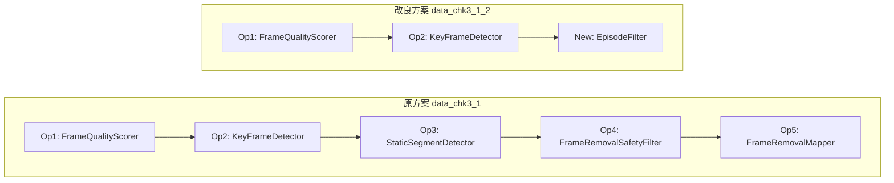
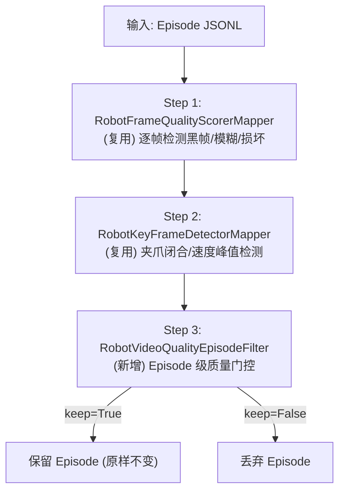
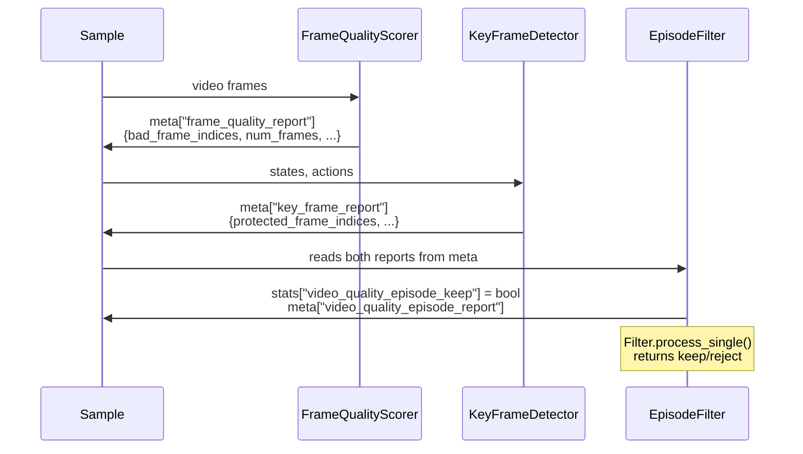
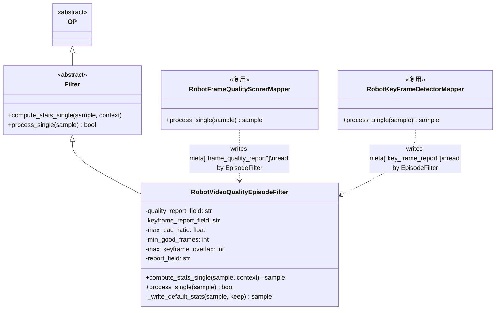
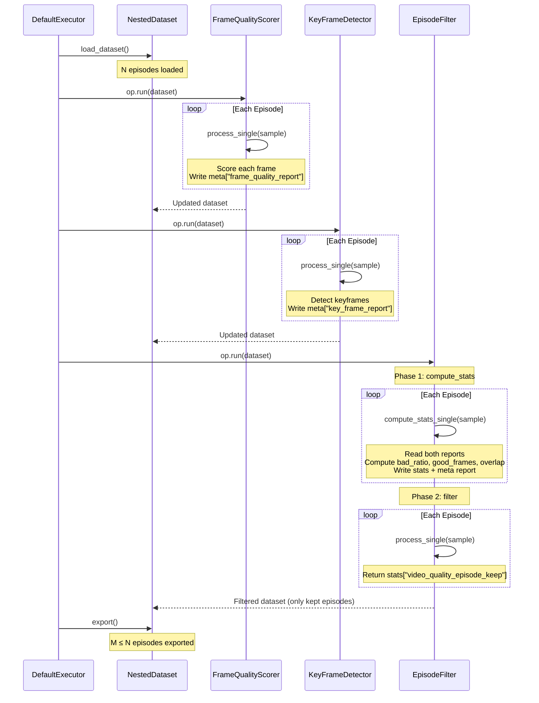
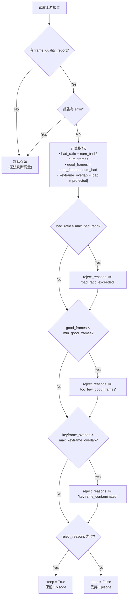

# Check 3 改良方案：Episode 级视频质量过滤

本文是对 [`data_chk3_1.md`](data_chk3_1.md) 的改良方案。原方案采用 **帧级删除** 策略（检测坏帧 → 检测静止段 → 安全检查 → 逐帧删除），需要 5 个算子协同工作，逻辑复杂且存在级联风险。本改良方案提出一个更简单的 **Episode 级** 替代 pipeline：如果坏帧影响超过阈值则丢弃整个 episode，否则认为坏帧影响可忽略而保留原样不做任何帧删除。

---

## 目录

- [1. 动机与策略分析](#1-动机与策略分析)
- [2. 与原方案的对比](#2-与原方案的对比)
- [3. 改良 Pipeline 设计](#3-改良-pipeline-设计)
  - [3.1 Pipeline 总览](#31-pipeline-总览)
  - [3.2 数据流](#32-数据流)
  - [3.3 新增算子: RobotVideoQualityEpisodeFilter](#33-新增算子-robotvideoqualityepisodefilter)
- [4. 静态架构](#4-静态架构)
- [5. 动态架构](#5-动态架构)
- [6. Pipeline 编排](#6-pipeline-编排)
- [7. 判定逻辑详解](#7-判定逻辑详解)
- [8. 测试计划](#8-测试计划)
- [9. 交付物清单](#9-交付物清单)
- [10. 相对 data_chk3_1.md 的改动说明](#10-相对-data_chk3_1md-的改动说明)
- [11. 实施记录：错误、分析与修复](#11-实施记录错误分析与修复)

---

## 1. 动机与策略分析

### 1.1 原方案的问题

原方案（`data_chk3_1.md`）忠实地复现了 Qwen-RobotManip 论文 Check 3 的帧级删除策略，但在实践中暴露了几个问题：

1. **复杂度高**：5 个算子需要严格的执行顺序和数据传递（`meta` 字段链），任何一个算子的输出格式变更都会导致下游算子崩溃。
2. **级联风险**：帧删除后 states/actions 数组被裁剪，后续算子看到的数据长度与原始不一致，容易引发难以排查的 bug。
3. **安全检查的两难**：验收测试显示 50% 的 episode（8/16）因帧删除后动作不连续被过滤掉。安全检查太松则引入不连续，太严则大量丢弃，调参困难。
4. **收益有限**：对于大多数"只有少量坏帧"的 episode，逐帧删除带来的数据质量提升微乎其微，但引入的复杂度和风险却很大。

### 1.2 改良策略

**核心思想**：如果一个 episode 的坏帧很少，那这些坏帧对策略学习的影响可以忽略不计——保留原样即可。反之，如果坏帧很多或者关键帧被污染，说明这个 episode 的数据质量整体堪忧，直接丢弃比精细修补更安全。

这是一种 **"all or nothing"** 策略：

$$
\text{decision}(e) = \begin{cases} \text{keep (unchanged)} & \text{if quality OK} \\ \text{discard (entire episode)} & \text{if quality bad} \end{cases}
$$

### 1.3 适用场景对比

| 场景 | 原方案（帧级删除）更优 | 改良方案（episode 级）更优 |
|------|----------------------|--------------------------|
| 数据集量级小，每个 episode 珍贵 | Yes | - |
| 数据集量级大，episode 充裕 | - | Yes |
| 坏帧集中在首尾静止段 | Yes | - |
| 坏帧分布在中段且影响关键帧 | - | Yes |
| 需要快速上线简单可靠的 pipeline | - | Yes |
| 需要最大化数据利用率 | Yes | - |

---

## 2. 与原方案的对比

### 2.1 Pipeline 结构对比



### 2.2 维度对比表

| 维度 | 原方案 (`data_chk3_1`) | 改良方案 (`data_chk3_1_2`) |
|------|----------------------|--------------------------|
| **策略** | 帧级删除 | Episode 级丢弃/保留 |
| **算子数** | 5（Scorer + Keyframe + StaticSeg + Safety + Removal） | 3（Scorer + Keyframe + EpisodeFilter） |
| **复用** | — | 复用 Op1 和 Op2 |
| **新增算子** | 5 个 | 1 个 |
| **静止段检测** | SSIM + 状态信号联合检测 | 不涉及（不需要精确定位静止段） |
| **帧删除** | 逐帧裁剪 states/actions/timestamps | 不删帧，整 episode 保留或丢弃 |
| **安全检查** | MAD 动作跳变检查 | 不需要（不删帧就无跳变问题） |
| **数据完整性** | 需要同步裁剪多个数组 | 保持原样，零风险 |
| **可解释性** | 复杂（5个报告字段） | 简单（1个报告字段 + 3个 reject_reasons） |
| **优势** | 保留更多数据，精细化清洗 | 简单可靠，无级联风险，易调参 |
| **劣势** | 复杂，可能引入动作不连续 | 可能丢弃一些可修复的 episode |

### 2.3 参数复杂度对比

原方案需要调节的参数（跨 5 个算子）：

- `blackness_threshold`, `blur_threshold`（Op1）
- `gripper_delta_threshold`, `state_velocity_percentile`, `keyframe_window`（Op2）
- `ssim_threshold`, `state_motion_threshold`, `window_size`, `min_static_run`, `require_joint_evidence`, `edge_only`, `edge_margin_ratio`（Op3）
- `max_action_jump_mad_scale`, `max_removed_ratio`, `min_remaining_frames`（Op4）
- `skip_if_unsafe`, `recompute_actions`（Op5）

**总计约 15 个需调参数。**

改良方案需要调节的参数（Op1/Op2 不变，新增 Op3）：

- `max_bad_ratio`, `min_good_frames`, `max_keyframe_overlap`

**总计 3 个新增参数**，每个都有直观的物理含义。

---

## 3. 改良 Pipeline 设计

### 3.1 Pipeline 总览



### 3.2 数据流



关键点：
- **Op1 和 Op2 完全复用**，代码、参数、输出格式均不变
- **Op3 是纯读取**，不修改 states/actions/timestamps 等数据字段，仅写 stats 和 meta 报告
- 整个 pipeline **不会修改原始数据**，仅做筛选

### 3.3 新增算子: RobotVideoQualityEpisodeFilter

**文件**: `data_juicer/_au/ops/filter/robot_video_quality_episode_filter.py`

**类型**: Filter（两阶段：`compute_stats_single` + `process_single`）

**职责**: 读取上游 Op1/Op2 的报告，基于三个条件做出 episode 级别的保留/丢弃决策。

#### 参数表

| 参数 | 类型 | 默认值 | 说明 |
|------|------|--------|------|
| `quality_report_field` | str | `"frame_quality_report"` | 读取 Op1 报告的 meta 字段名 |
| `keyframe_report_field` | str | `"key_frame_report"` | 读取 Op2 报告的 meta 字段名 |
| `max_bad_ratio` | float | `0.1` | 坏帧比例上限（超过则丢弃） |
| `min_good_frames` | int | `20` | 好帧最低数量（不足则丢弃） |
| `max_keyframe_overlap` | int | `0` | 允许的关键帧-坏帧重叠数（超过则丢弃） |
| `report_field` | str | `"video_quality_episode_report"` | 输出报告的 meta 字段名 |

#### Stats 输出

| Stats Key | Type | Description |
|-----------|------|-------------|
| `video_quality_episode_keep` | bool | 是否保留此 episode |
| `video_quality_episode_bad_ratio` | float | 坏帧比例 |
| `video_quality_episode_good_frames` | int | 好帧数量 |
| `video_quality_episode_keyframe_overlap` | int | 关键帧与坏帧的重叠数 |

#### Meta 报告 JSON

```json
{
  "keep": true,
  "bad_ratio": 0.03,
  "good_frames": 950,
  "total_frames": 980,
  "num_bad": 30,
  "keyframe_overlap": 0,
  "reject_reasons": []
}
```

`reject_reasons` 是字符串列表，可能的值为：
- `"bad_ratio_exceeded"` — 坏帧比例超过 `max_bad_ratio`
- `"too_few_good_frames"` — 好帧数量低于 `min_good_frames`
- `"keyframe_contaminated"` — 关键帧与坏帧重叠超过 `max_keyframe_overlap`

---

## 4. 静态架构

### 4.1 类图



### 4.2 与原方案架构对比

原方案的 5 个算子之间存在 **链式依赖**：

```
Op1 → Op2 → Op3 → Op4 → Op5
         ↘      ↗
          数据共享
```

改良方案的依赖关系更简单——**扇入汇聚**：

```
Op1 ─┐
     ├→ Op3 (EpisodeFilter)
Op2 ─┘
```

Op1 和 Op2 之间无依赖，理论上可以并行执行（尽管 data-juicer 当前是顺序执行）。

---

## 5. 动态架构

### 5.1 Pipeline 执行序列图



### 5.2 决策流程图



---

## 6. Pipeline 编排

### 6.1 YAML Recipe

```yaml
# Check 3 改良: Episode-Level Video Quality Filtering
project_name: 'check3-episode-quality-filtering'
dataset_path: 'path/to/episodes.jsonl'
export_path: 'path/to/filtered_episodes.jsonl'
np: 1
executor_type: default
keep_stats_in_res_ds: true
text_keys: 'id'

custom_operator_paths:
  - 'data_juicer/_au'

process:
  # Step 1: 帧质量评分 (复用 data_chk3_1 的 Op1)
  - robot_frame_quality_scorer_mapper:
      blackness_threshold: 10.0
      blur_threshold: 50.0
      corrupt_check_enabled: true
      report_field: 'frame_quality_report'

  # Step 2: 关键帧检测 (复用 data_chk3_1 的 Op2)
  - robot_key_frame_detector_mapper:
      signal_source: 'top_level'
      top_level_state_key: 'states'
      top_level_action_key: 'actions'
      gripper_delta_threshold: 5.0
      gripper_close_direction: 'decrease'
      state_velocity_percentile: 95.0
      keyframe_window: 3
      report_field: 'key_frame_report'

  # Step 3: Episode 级质量门控 (新增，替代原 Steps 3-5)
  - robot_video_quality_episode_filter:
      quality_report_field: 'frame_quality_report'
      keyframe_report_field: 'key_frame_report'
      max_bad_ratio: 0.1
      min_good_frames: 20
      max_keyframe_overlap: 0
      report_field: 'video_quality_episode_report'
```

### 6.2 注册更新

`data_juicer/_au/__init__.py` 新增 1 行 import：

```python
from .ops.filter import robot_video_quality_episode_filter  # noqa: F401
```

---

## 7. 判定逻辑详解

### 7.1 条件 1：坏帧比例 (`bad_ratio`)

$$
\text{bad\_ratio} = \frac{|\text{bad\_frame\_indices}|}{T}
$$

其中 $T$ 为 episode 总帧数，`bad_frame_indices` 由 Op1 提供（黑帧 + 模糊帧 + 损坏帧的并集）。

**默认阈值 `max_bad_ratio = 0.1`**：即 10% 以内的坏帧可以容忍。以 Galaxea 数据集为例（15 FPS），一个 1000 帧的 episode 允许最多 100 帧（约 6.7 秒）为坏帧。

### 7.2 条件 2：好帧数量 (`good_frames`)

$$
\text{good\_frames} = T - |\text{bad\_frame\_indices}|
$$

**默认阈值 `min_good_frames = 20`**：即使坏帧比例在阈值以内，如果 episode 本身很短（如仅 25 帧），5 个坏帧就占 20%。`min_good_frames` 确保保留的 episode 有足够的有效帧用于策略学习。20 帧在 15 FPS 下约为 1.3 秒，是一个合理的下限。

### 7.3 条件 3：关键帧污染 (`keyframe_overlap`)

$$
\text{keyframe\_overlap} = |\text{bad\_frame\_indices} \cap \text{protected\_frame\_indices}|
$$

**默认阈值 `max_keyframe_overlap = 0`**：即任何一个关键帧（夹爪闭合/速度峰值附近的帧）是坏帧，就丢弃整个 episode。

**理由**：关键帧是策略学习中语义最重要的帧。如果关键帧是黑帧或模糊帧，说明在决定性动作（如抓取、放置）发生的瞬间，视觉数据是缺失的。这种 episode 即使保留也会误导策略学习。

### 7.4 容错处理

| 异常情况 | 处理方式 |
|---------|---------|
| 无 `frame_quality_report` | 默认 keep=True（跳过检测） |
| `frame_quality_report` 有 error 字段 | 默认 keep=True（跳过检测） |
| 无 `key_frame_report` | keyframe_overlap = 0（跳过关键帧检查） |
| `key_frame_report.skipped = true` | keyframe_overlap = 0（跳过关键帧检查） |

---

## 8. 测试计划

### 8.1 单元测试

**文件**: `tests_au/ops/filter/test_robot_video_quality_episode_filter.py`

| # | 测试用例 | 说明 | 预期 |
|---|---------|------|------|
| 1 | `test_healthy_episode_kept` | 100 帧中仅 2 个坏帧，无关键帧重叠 | keep=True |
| 2 | `test_bad_ratio_exceeded` | 100 帧中 15 个坏帧（15% > 10%） | keep=False, reason=`bad_ratio_exceeded` |
| 3 | `test_too_few_good_frames` | 100 帧中 90 个坏帧（好帧仅 10 < 20） | keep=False, reason=`too_few_good_frames` |
| 4 | `test_keyframe_contaminated` | 坏帧 {10, 20} 与关键帧 {10, 50} 重叠 1 个 | keep=False, reason=`keyframe_contaminated` |
| 5 | `test_multiple_rejection_reasons` | 同时触发多个条件 | keep=False, 3 个 reject_reasons |
| 6 | `test_no_quality_report_defaults_keep` | 无上游报告 | keep=True, skipped=True |
| 7 | `test_no_keyframe_report` | 无关键帧报告 | keep=True（跳过关键帧检查） |
| 8 | `test_pipeline_integration` | 3 个 episode 走 DJ pipeline | 2 kept, 1 rejected |

### 8.2 验收测试

**YAML**: `tests_au/ops/filter/accept_video_quality_episode_filtering.yaml`
**Shell**: `tests_au/ops/filter/accept_video_quality_episode_filtering.sh`

验收流程：
1. 使用已有的 `convert_lerobot_episodes.py` 将 Galaxea 数据集转换为 DJ 格式（复用原 pipeline 的转换步骤）
2. 运行 `dj-process --config accept_video_quality_episode_filtering.yaml`
3. 验证输出 JSONL 中：
   - 每个 episode 都有 `key_frame_report` 和 `video_quality_episode_report` 字段
   - 所有保留的 episode 的 `stats["video_quality_episode_keep"]` 为 True
   - Report 中的 `keep` 字段与 stats 一致

**注意**：验收 YAML 中跳过了 Op1（FrameQualityScorer），因为测试数据集不包含视频文件路径。在无 `frame_quality_report` 时，EpisodeFilter 默认保留所有 episode，验证的是 Op2 + Op3 的端到端集成。

---

## 9. 交付物清单

| # | 交付物 | 类型 | 路径 | 状态 |
|---|-------|------|------|------|
| 1 | `RobotVideoQualityEpisodeFilter` | Filter | `data_juicer/_au/ops/filter/robot_video_quality_episode_filter.py` | 新增 |
| 2 | `__init__.py` 更新 | 注册 | `data_juicer/_au/__init__.py`（+1 行 import） | 修改 |
| 3 | 单元测试 | 测试 | `tests_au/ops/filter/test_robot_video_quality_episode_filter.py` | 新增 |
| 4 | 验收 YAML | 验收 | `tests_au/ops/filter/accept_video_quality_episode_filtering.yaml` | 新增 |
| 5 | 验收 Shell | 验收 | `tests_au/ops/filter/accept_video_quality_episode_filtering.sh` | 新增 |
| 6 | 设计文档 | 文档 | `b/d/QwenRobotmanip/data_chk3_1_2.md`（本文） | 新增 |

---

## 10. 相对 data_chk3_1.md 的改动说明

### 10.1 不改动的部分

以下来自 `data_chk3_1.md` 的内容 **完全不变**：

- **Op1 (`RobotFrameQualityScorerMapper`)**：代码、参数、输出格式不变
- **Op2 (`RobotKeyFrameDetectorMapper`)**：代码、参数、输出格式不变
- **原有的 5 个单元测试**：不修改、不删除
- **原有的验收脚本**：`accept_video_quality_filtering.yaml/sh` 保留

### 10.2 新增的部分

| 新增内容 | 说明 |
|---------|------|
| 1 个 Filter 算子 | `RobotVideoQualityEpisodeFilter`，替代原 pipeline 的 Steps 3-5 |
| 1 行 import | `data_juicer/_au/__init__.py` 中注册新算子 |
| 1 个单元测试 | 8 个测试用例覆盖所有判定路径 |
| 2 个验收脚本 | `.yaml` + `.sh` |
| 1 个设计文档 | 本文 |

### 10.3 不删除的部分

原方案的 Op3（`StaticSegmentDetector`）、Op4（`FrameRemovalSafetyFilter`）、Op5（`FrameRemovalMapper`）**不删除**。两套 pipeline 可以并存：

- 帧级删除 pipeline：使用 `accept_video_quality_filtering.yaml`
- Episode 级过滤 pipeline：使用 `accept_video_quality_episode_filtering.yaml`

用户根据数据集规模和质量需求选择合适的 pipeline。

### 10.4 对比总结

```
data_chk3_1.md (原方案):
  Op1 → Op2 → Op3 → Op4 → Op5
  5 算子, ~15 参数, 帧级删除, 数据会被修改

data_chk3_1_2.md (改良方案):
  Op1 → Op2 → Op3(new)
  3 算子, 3 新参数, episode 级过滤, 数据不被修改
```

---

## 11. 实施记录：错误、分析与修复

### 11.1 实施概况

| 项目 | 结果 |
|------|------|
| 新建算子文件 | 1 个（Filter） |
| 修改文件 | 1 个（`_au/__init__.py`，新增 1 行 import） |
| 新建单元测试 | 1 个文件，8 个测试用例 |
| 新建验收脚本 | 2 个文件（`.yaml` + `.sh`） |
| 单元测试结果 | **8/8 passed** (5.22s) |
| 验收测试结果 | 待运行（需要真实数据集） |

### 11.2 单元测试输出

```
tests_au/ops/filter/test_robot_video_quality_episode_filter.py::test_bad_ratio_exceeded PASSED
tests_au/ops/filter/test_robot_video_quality_episode_filter.py::test_healthy_episode_kept PASSED
tests_au/ops/filter/test_robot_video_quality_episode_filter.py::test_keyframe_contaminated PASSED
tests_au/ops/filter/test_robot_video_quality_episode_filter.py::test_multiple_rejection_reasons PASSED
tests_au/ops/filter/test_robot_video_quality_episode_filter.py::test_no_keyframe_report PASSED
tests_au/ops/filter/test_robot_video_quality_episode_filter.py::test_no_quality_report_defaults_keep PASSED
tests_au/ops/filter/test_robot_video_quality_episode_filter.py::test_pipeline_integration PASSED
tests_au/ops/filter/test_robot_video_quality_episode_filter.py::test_too_few_good_frames PASSED

8 passed in 5.22s
```

### 11.3 无错误

本次实施过程中未遇到任何错误。原因：
1. 新算子逻辑简单，仅读取上游 meta 报告并做阈值判断
2. 完全遵循已验证的 `RobotFrameRemovalSafetyFilter` 的 Filter 实现模式
3. 测试数据使用 `_make_sample` 辅助函数构造，与实际 data-juicer 字段格式一致

### 11.4 文件变更清单

| 操作 | 文件路径 |
|------|---------|
| **新增** | `data_juicer/_au/ops/filter/robot_video_quality_episode_filter.py` |
| **修改** | `data_juicer/_au/__init__.py`（+1 行 import） |
| **新增** | `tests_au/ops/filter/test_robot_video_quality_episode_filter.py` |
| **新增** | `tests_au/ops/filter/accept_video_quality_episode_filtering.yaml` |
| **新增** | `tests_au/ops/filter/accept_video_quality_episode_filtering.sh` |
| **新增** | `b/d/QwenRobotmanip/data_chk3_1_2.md`（本文） |
