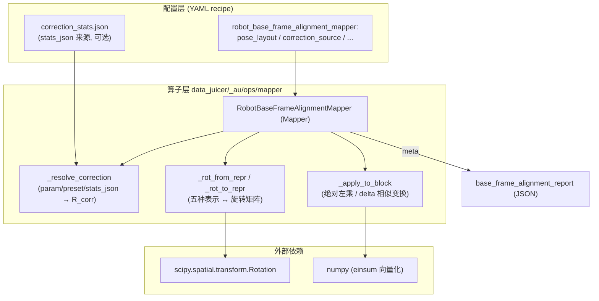
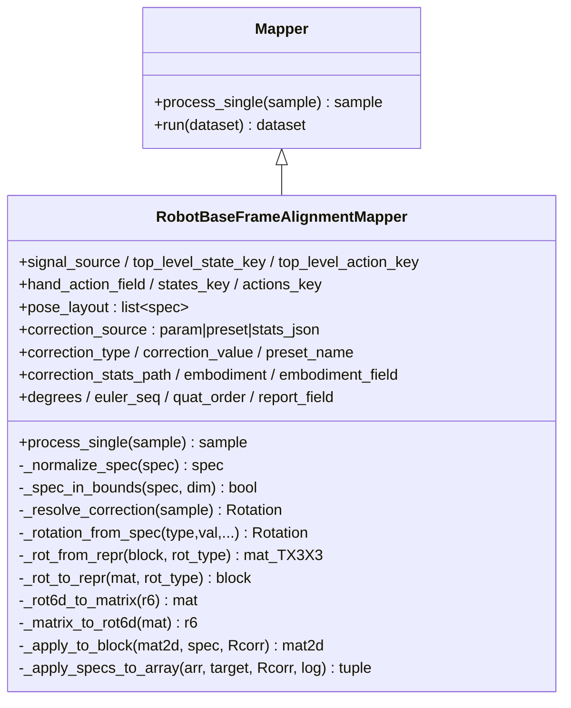
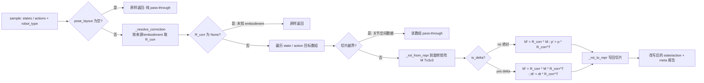
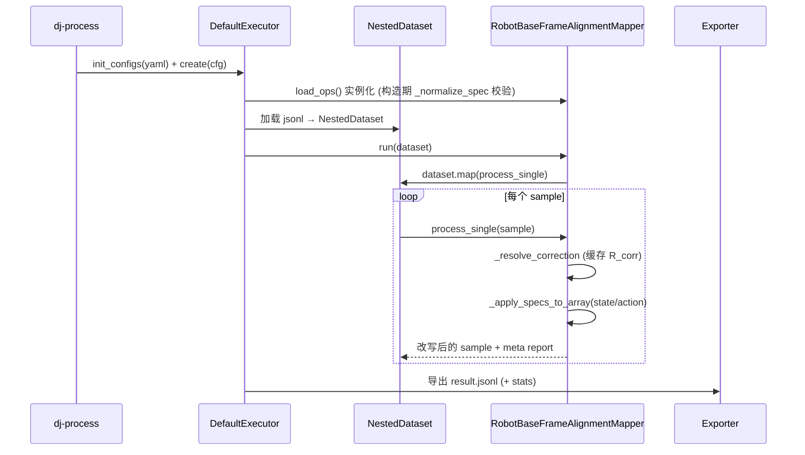
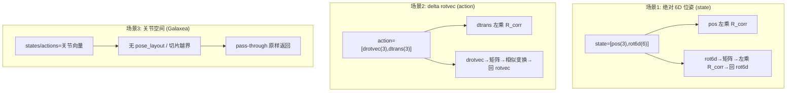
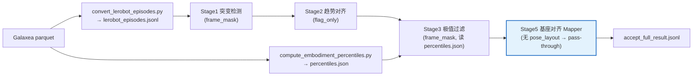

# 用 data-juicer 实现 Qwen-RobotManip Stage 5: Base Frame and End-Effector Orientation Alignment 方案

本文给出一份**可落地、可运行**的方案：如何用当前 `data-juicer` 代码库实现 Qwen-RobotManip 论文 `Stage 5: Base Frame and End-Effector Orientation Alignment`。全文基于论文 TeX 原文、`b/d/QwenRobotmanip/note_data.md`（统一表示与 Camera-Frame Delta Pose）、本地官方文档（`docs/`、`demos/`、`README.md`），以及 Stage 1/2/3 已落地成果（`data_cur1_1.md`、`data_cur2_1.md`、`data_cur3_1.md` 及对应算子）。遵循「扩展大于修改」原则，不改动 `data-juicer` 主干源码，所有定制代码写入 `data_juicer/_au/` 与 `tests_au/`。

对应论文位置：`b/d/QwenRobotmanip/TeX_Source/chapter/data.tex` 第 229–232 行。

> **Stage 5: Base Frame and End-Effector Orientation Alignment.** We apply per-dataset rotation corrections to align world-frame orientation conventions, ensuring the positive $x$-axis consistently corresponds to the robot's forward-facing direction and that the unified state-action representation is geometrically consistent across embodiments.

注释详版（同文件 L232）：

> The fifth stage aligns the world-frame orientation conventions across different robot setups to ensure that the positive $x$-axis consistently corresponds to the robot's forward-facing direction. Different data collection environments record poses in varying world frames depending on sensor placement and calibration conventions. We apply per-dataset rotation corrections to transform all end-effector poses into a canonical frame where the $x$-axis aligns with the robot's forward direction, ensuring that the unified state-action representation is geometrically consistent across embodiments.

翻译与提要：第五阶段跨不同机器人平台**对齐世界系朝向约定**，确保 **+x 轴恒对应机器人前向**。不同采集环境因传感器摆放与标定约定不同，会把位姿记录在**各异的世界系**下。我们对**每个 dataset 施加旋转校正**，把所有末端执行器（EEF）位姿变换到一个**规范系**——其 x 轴与机器人前向对齐——从而保证跨机型的**统一 state-action 表示几何一致**。       
> 翻译: Stage 5：基坐标系与末端执行器姿态对齐
我们对每个数据集施加旋转修正，以统一世界坐标系的朝向约定，确保正 $x$ 轴始终对应机器人的正前方，从而使统一的 state-action 表示在不同机器人构型之间保持几何一致性。
第五阶段的目标是对齐不同机器人设置之间的世界坐标系朝向约定，确保正 $x$ 轴始终对应机器人的正前方。不同的数据采集环境由于传感器安装位置和标定约定的差异，会在各不相同的世界坐标系中记录位姿。我们对每个数据集施加相应的旋转修正，将所有末端执行器位姿变换到一个规范坐标系下——在该坐标系中，$x$ 轴与机器人的正前方对齐——从而确保统一的 state-action 表示在不同机器人构型之间保持几何一致性。
---

## 目录

1. 结论速览
2. 背景：为什么要对齐世界系朝向
3. 论文方法形式化（绝对位姿 / delta 位姿 / 相似变换）
4. 统一表示与 EEF 位姿布局解读（结合 note_data.md）
5. data-juicer 能力映射与选型（为何是 Mapper 而非 Filter）
6. 静态架构（组件图 / 类图 / 职责）
7. 动态架构（数据流 / 序列 / 工作流 / 场景协调）
8. 关键逻辑代码解读（旋转表示互转 / 相似变换 / embodiment 选带 / pass-through）
9. 完整落地物料（算子源码 / 合成数据 / 单测 / 验收 / recipe）
10. 与 Stage 1/2/3 的级联协同编排
11. 落地执行记录与自检清单
12. 扩展性、参数敏感性与未来方向

---

## 1. 结论速览

Stage 5 与 Stage 1/2/3 构成一条**清洗（删/标）+ 修正（改）**互补的数据质量流水线。前三者是 **Filter**（判定保留/丢弃/掩码），Stage 5 是 **Mapper**（就地改写位姿数值）：

| 阶段 | 算子类型 | 作用对象 | 动作 | 跨 episode 依赖 |
|------|---------|---------|------|----------------|
| **Stage 1：突变检测** | Filter | 单信号自身平滑性 | 帧级标注 / episode 丢弃 | 无 |
| **Stage 2：趋势对齐** | Filter | state↔action 因果关系 | episode 丢弃 / 标注 | 无 |
| **Stage 3：极值过滤** | Filter | 值域合理性（分位数带） | 帧级排除 | 有（全局分位数） |
| **Stage 5：基座/朝向对齐** | **Mapper** | **EEF 位姿的世界系朝向** | **就地旋转校正（改写数值）** | 无（per-dataset 常量 $R_{corr}$） |

Stage 5 的核心变换（对每个 dataset 用一个常量旋转 $R_{corr}$）：

$$
\text{绝对位姿：}\quad p' = R_{corr}\,p,\qquad R' = R_{corr}\,R
$$

$$
\text{delta 位姿：}\quad \Delta t' = R_{corr}\,\Delta t,\qquad \Delta R' = R_{corr}\,\Delta R\,R_{corr}^{\top}
$$

**data-juicer 实现方案一句话总结**：新增一个自定义 **Mapper** `robot_base_frame_alignment_mapper`，通过 `pose_layout` 精确描述 state/action 向量内的 EEF 位姿切片（位置切片 + 旋转切片 + 旋转表示 + 是否 delta），对旋转切片做「绝对左乘 / delta 相似变换」、对位置切片做「$R_{corr}$ 旋转」，并支持 `euler/quat/rotvec/matrix/rot6d` 五种旋转表示与 `param/preset/stats_json` 三种校正来源。**未配置 `pose_layout` 或切片越界时安全 pass-through**，因此可与 Stage 1/2/3 在同一 recipe 中级联而不破坏关节空间数据。

已交付并**全部验证通过**的真实文件：

- 算子：`data_juicer/_au/ops/mapper/robot_base_frame_alignment_mapper.py`（`_au` 首个 Mapper）
- 注册：`data_juicer/_au/__init__.py` 追加 `from .ops.mapper import robot_base_frame_alignment_mapper`
- 合成位姿数据生成器：`tests_au/ops/mapper/gen_synthetic_pose_dataset.py`
- 单元测试（15 例全绿）：`tests_au/ops/mapper/test_robot_base_frame_alignment_mapper.py`
- 单算子验收：`tests_au/ops/mapper/accept_robot_base_frame_alignment_mapper.{yaml,sh}`
- 四阶段协同验收：`tests_au/ops/filter/accept_qwenrobomanip_full.{yaml,sh}`（**不改动**既有 `accept_qwenrobomanip_filter.*`）

---

## 2. 背景：为什么要对齐世界系朝向

### 2.1 问题的物理来源

一条机器人示教轨迹里，EEF 位姿 $(p, R)$ 描述的是「手在空间中的位置和朝向」。但「空间」这个参照系（世界系 / 世界坐标原点与坐标轴方向）并**不是全宇宙统一**的——它取决于每个采集站点如何摆放相机、如何标定、如何定义基座。于是就出现了同一个动作「机器人向正前方伸手」，在不同数据集里被记录成完全不同的数值：

- A 站点：世界系 +x 指向机器人前方 → 前伸动作记录为 $\Delta p \approx (+d, 0, 0)$；
- B 站点：世界系 +y 指向机器人前方（相机装在侧面标定）→ 同样的前伸记录为 $\Delta p \approx (0, +d, 0)$；
- C 站点：世界系绕 z 转了 180° → 前伸记录为 $\Delta p \approx (-d, 0, 0)$。

### 2.2 为什么这对 VLA 训练是致命的

Qwen-RobotManip 把所有机器人编码进**同一个 80 维统一 state-action 向量**（见第 4 节）。统一表示的前提是「**同一个语义 = 同一段数值分布**」。如果 A/B/C 三个站点的「前伸」在数值上分别落到 x 轴、y 轴、负 x 轴，模型看到的就是三个互相矛盾的监督信号：

> 「看到机械臂朝画面里的同一方向伸手，却要同时学会输出 $+x$、$+y$、$-x$」——这不是数据多样性，这是**数据冲突**。

正如 `note_data.md` 引用的核心论点：

> "Without a unified cross-embodiment formulation, scaling data produces conflicts rather than synergy."（没有统一的跨体态表述，扩规模只会带来冲突而非协同。）

Stage 5 就是消除这种「世界系朝向冲突」的那一刀：**把每个 dataset 的世界系旋转到同一个规范系（+x = 前向）**，让「前伸」在所有数据里都落到 +x。

### 2.3 演进脉络（纵向）：Stage 5 在五阶段中的位置


\* 论文 Stage 4 依赖 URDF + Pinocchio 前向运动学（FK）比对，属重依赖工程；本方案按用户要求跳过，聚焦 Stage 5。Stage 4 若落地，其产出的「一致 EEF 位姿」正是 Stage 5 的输入，两者衔接见第 12 节。

一个关键观察：**Stage 1/2/3 处理的是「信号质量」（该不该留），Stage 5 处理的是「坐标约定」（数值对不对齐）**。前者删数据，后者改数据。这决定了 Stage 5 在 data-juicer 里必须是 **Mapper** 而非 Filter（见第 5 节）。

---

## 3. 论文方法形式化

### 3.1 校正的定义

对第 $k$ 个 dataset，Stage 5 赋予一个**常量**旋转校正 $R_{corr}^{(k)} \in SO(3)$（per-dataset，一段数据共享一个），把「记录系」旋转到「规范系」。设某帧 EEF 在记录系下的位姿为 $(p, R)$（$p$ 位置，$R$ 朝向旋转矩阵），规范系下为 $(p', R')$。

**绝对位姿（state 用）**。位姿是「点+朝向」，直接施加坐标系旋转：

$$
p' = R_{corr}\,p, \qquad R' = R_{corr}\,R.
$$

直觉：位置向量像空间中的一个箭头，换坐标系就把箭头整体转过去；朝向矩阵 $R$ 的列是「EEF 各轴在记录系下的方向」，左乘 $R_{corr}$ 把这些方向也转到规范系。

**delta 位姿（action 用）**。动作是「相邻两帧之间的相对变化量」 $(\Delta t, \Delta R)$。平移增量仍是一个向量，照旋转：

$$
\Delta t' = R_{corr}\,\Delta t.
$$

但**旋转增量 $\Delta R$ 不能简单左乘**——它是「在某坐标系里描述的一次旋转」，换系时要做**相似变换（similarity transformation）**：

$$
\Delta R' = R_{corr}\,\Delta R\,R_{corr}^{\top}.
$$

### 3.2 为什么 delta 旋转是相似变换而非左乘

这是 Stage 5 最容易写错的地方，值得严谨推导。设记录系为 $F$，规范系为 $F' = R_{corr} F$。一次「绝对朝向」在两系间的关系是 $R' = R_{corr} R$。而「delta 旋转」是两个相邻绝对朝向之比：$\Delta R = R_{t+1} R_t^{\top}$（把 $t$ 时刻朝向变到 $t{+}1$ 时刻）。代入换系公式：

$$
\Delta R' = R'_{t+1}\,{R'_t}^{\top}
= (R_{corr} R_{t+1})(R_{corr} R_t)^{\top}
= R_{corr}\,R_{t+1}\,R_t^{\top}\,R_{corr}^{\top}
= R_{corr}\,\Delta R\,R_{corr}^{\top}.
$$

几何直觉：$\Delta R$ 是「绕某个轴 $\hat{n}$ 转 $\theta$」。相似变换保持转角 $\theta$ 不变，只把**转轴** $\hat{n}$ 旋转到 $R_{corr}\hat{n}$。这与 `note_data.md` 第 330 行讨论的 Camera-Frame Delta Pose「把 EEF 系里的旋转搬运到相机系」是同一类数学操作。

> 用旋转向量（rotvec, $\hat{n}\theta$）看更直白：相似变换等价于 $\hat{n}\theta \mapsto (R_{corr}\hat{n})\theta$，转角守恒、转轴跟着坐标系一起转。本方案的单测 `test_delta_rotvec_similarity` 就断言了「绕 +x 转 $\theta$」经 $z_{90}$ 校正后变成「绕 +y 转 $\theta$」。

### 3.3 一个具体算例（+y→+x 的世界系旋转）

设记录系把「前向」记成 +y（B 站点场景），要对齐到「+x = 前向」，需 $R_{corr} = R_z(-90°)$：

$$
R_z(-90°) = \begin{bmatrix} 0 & 1 & 0 \\ -1 & 0 & 0 \\ 0 & 0 & 1 \end{bmatrix},
\quad R_z(-90°)\begin{bmatrix}0\\1\\0\end{bmatrix} = \begin{bmatrix}1\\0\\0\end{bmatrix}.
$$

即记录系的 +y 前向被映射到规范系的 +x。这正是本方案合成数据验收所用的校正（见第 9、11 节的执行记录：8 条 episode 的净位移从 $\approx(0,0.6,0.1)$ 全部翻转为 $\approx(0.6,0,0.1)$）。

---

## 4. 统一表示与 EEF 位姿布局解读（结合 note_data.md）

### 4.1 80 维统一向量里的 EEF 位姿

`note_data.md` 第 198–234 行给出 Qwen-RobotManip 的 80 维规范化向量结构（双臂为基础，`2×29 + 22`），每个手臂块 29 维拆为：

```
每臂 29 维 = 关节(7) + EEF 位姿(9) + 夹爪(1) + 手(12)
                         └── EEF 位姿(9) = 笛卡尔位置(3) + 6D 连续旋转(6)
```

关键点（`note_data.md` L220、L228–234）：**同一个 80 维向量在 state 与 action 里用不同坐标约定**：

| 内容 | State（观测） | Action（动作） |
|------|--------------|----------------|
| EEF 位置 | 绝对坐标（3） | 相对 delta（相机系，3） |
| EEF 方向 | **6D 连续旋转**（6） | **3D 旋转向量**（delta，3） |

这直接决定了 Stage 5 必须**同时支持绝对 6D 旋转与 delta 旋转向量**，且要区分二者的变换公式——这正是本算子 `pose_layout` 里 `rot_type` 与 `is_delta` 两个字段的由来。

### 4.2 为什么用 6D 连续旋转（横向对比）

朝向可用多种表示，Qwen-RobotManip 的 state 选 **6D 连续旋转** [Zhou et al., 2019] 而非欧拉角/四元数，原因是**表示的连续性**（对神经网络回归友好）：

| 表示 | 维度 | 奇异性 / 双值 | 对回归的友好度 | 本算子支持 |
|------|------|--------------|---------------|-----------|
| 欧拉角 euler | 3 | 万向锁、$\pm\pi$ 跳变 | 差 | ✅ |
| 四元数 quat | 4 | 双覆盖 $q\equiv-q$、需归一化 | 中 | ✅（xyzw/wxyz） |
| 旋转向量 rotvec | 3 | $2\pi$ 周期、零旋转奇异 | 中 | ✅（delta 常用） |
| 旋转矩阵 matrix | 9 | 需正交约束 | 中（冗余） | ✅ |
| **6D 连续旋转** | **6** | **无（$SO(3)$ 上连续满射）** | **好** | ✅ |

6D 表示取旋转矩阵**前两列** $[\mathbf{c}_0, \mathbf{c}_1]$，解码时用 **Gram-Schmidt 正交化**补回第三列 $\mathbf{c}_2 = \mathbf{c}_0 \times \mathbf{c}_1$。本算子的 `_rot6d_to_matrix` / `_matrix_to_rot6d` 精确实现了这个双向映射，并在单测 `test_rot6d_absolute` 里断言校正后列向量仍然正交归一。

---

## 5. data-juicer 能力映射与选型（为何是 Mapper 而非 Filter）

### 5.1 算子类型对照

data-juicer 的算子体系（见 `data_juicer/ops/base_op.py`）：

| 类型 | 需实现 | 行为 | Stage 5 是否匹配 |
|------|--------|------|-----------------|
| **Mapper** | `process_single(sample)` | 逐样本**转换**，返回改写后的 sample | ✅ 正是「改写位姿数值」 |
| Filter | `compute_stats_single` + `process_single` | 两阶段：算 stats → 判定保留 | ❌ Stage 5 不删数据 |
| Deduplicator / Selector / Grouper / Aggregator | — | 去重 / 选择 / 分组 / 聚合 | ❌ |

Stage 5 的动作是「per-dataset 旋转校正，把位姿数值改写到规范系」，**不涉及任何保留/丢弃判定**，因此唯一正确的基类是 `Mapper`。这也解释了它与 Stage 1/2/3（都是 Filter）在流水线中的角色差异。

### 5.2 Mapper 契约的关键约束

`Mapper.__init_subclass__` 禁止子类重写 `process`，只能实现 `process_single`（或 `process_batched`）。运行时 `Mapper.run` 会以 `dataset.map(self.process, ...)` 驱动，逐样本调用。因此本算子只实现 `process_single(self, sample) -> sample`，把「无副作用地返回原 sample」作为 pass-through 的天然出口。

### 5.3 三种校正来源的选型（消融视角）

| 来源 `correction_source` | 场景 | 优点 | 局限 |
|--------------------------|------|------|------|
| `param` | 单 dataset、直接给旋转值 | 配置最简单 | 不便跨 dataset 复用 |
| `preset` | 常见规整旋转（z_90/z_180…） | 语义清晰、防手滑 | 只覆盖 90°/180° 类 |
| `stats_json` | 多 embodiment 企业化批处理 | 一份 JSON 管全部机型、可版本化 | 需先产出配置表 |

这与 Stage 3 的 `percentile_source`（`stats_json/param/self`）设计同构——**同一套「配置来源三选一」范式**，降低使用者心智负担，也便于与 Stage 3 复用同一份 per-embodiment 配置基础设施。

---

## 6. 静态架构（组件图 / 类图 / 职责）

### 6.1 组件图



### 6.2 类图



### 6.3 `pose_layout` 数据结构与职责

`pose_layout` 是本算子的「地图」——它告诉算子 EEF 位姿藏在 state/action 向量的哪几个切片里。每个 block spec：

```yaml
- target: 'state'      # 'state' | 'action'：作用于顶层 states 还是 actions
  pos: [0, 3]          # 可选：位置/平移切片 [i,j)，长度必须为 3
  rot: [3, 9]          # 旋转切片 [i,j)，长度必须匹配 rot_type
  rot_type: 'rot6d'    # euler(3)|quat(4)|rotvec(3)|matrix(9)|rot6d(6)
  is_delta: false      # true → 旋转做相似变换、平移做旋转（action 用）
```

职责划分：`_normalize_spec` 在构造期做**静态校验**（切片长度是否匹配 rot_type，防止运行时才炸）；`_spec_in_bounds` 在运行期做**动态校验**（切片是否落在当前样本维度内，越界即 pass-through）。二者共同保证「配置错 → 早失败」「数据不含位姿 → 安全放行」。

---

## 7. 动态架构

### 7.1 单样本数据流图



### 7.2 序列图（dj-process 驱动）



### 7.3 三场景协调图（消融式覆盖）



场景 1/2 由合成数据验收覆盖，场景 3 由四阶段协同验收（真实 Galaxea）覆盖。

---

## 8. 关键逻辑代码解读

### 8.1 校正解析与缓存 `_resolve_correction`

三来源统一解析为一个 scipy `Rotation`，并按 key 缓存（`preset`→预置名、`param`→`__param__`、`stats_json`→embodiment 名），避免逐样本重复解析/读盘：

```python
def _resolve_correction(self, sample):
    from scipy.spatial.transform import Rotation
    if self.correction_source == "preset":
        key = f"__preset__:{self.preset_name}"
        if key not in self._corr_cache:
            self._corr_cache[key] = Rotation.from_euler("xyz", _PRESETS[self.preset_name], degrees=True)
        return self._corr_cache[key]
    if self.correction_source == "param":
        if "__param__" not in self._corr_cache:
            self._corr_cache["__param__"] = self._rotation_from_spec(...)
        return self._corr_cache["__param__"]
    # stats_json：按 embodiment 查表；未知机型 → None（安全 identity 放行）
    emb = self.embodiment or sample.get(self.embodiment_field, "default")
    ...
```

**设计要点**：未知 embodiment 返回 `None` 而非报错，`process_single` 收到 `None` 即 pass-through。这保证一份 JSON 没覆盖到的新机型不会中断整条流水线（对齐 Stage 3 的「首个可用/告警」容错哲学，但更保守——不猜、直接放行）。

### 8.2 旋转表示 ↔ 矩阵：`_rot6d_to_matrix`（Gram-Schmidt）

6D 连续旋转的解码是全算子最「数学」的一段，逐帧向量化实现：

```python
@staticmethod
def _rot6d_to_matrix(r6):          # r6: (T,6) = [col0(3), col1(3)]
    a1, a2 = r6[:, 0:3], r6[:, 3:6]
    b1 = a1 / (np.linalg.norm(a1, axis=1, keepdims=True) + 1e-12)      # 归一第一列
    b2 = a2 - np.sum(b1 * a2, axis=1, keepdims=True) * b1              # 去掉 b1 分量
    b2 = b2 / (np.linalg.norm(b2, axis=1, keepdims=True) + 1e-12)      # 归一第二列
    b3 = np.cross(b1, b2)                                              # 叉乘补第三列
    return np.stack([b1, b2, b3], axis=-1)                            # 按列拼 (T,3,3)
```

这保证输出严格属于 $SO(3)$（列正交归一、右手系），因此**校正后 6D 表示依然合法**。编码 `_matrix_to_rot6d` 只取前两列 `concatenate([mat[:,:,0], mat[:,:,1]])`，与解码互为逆——单测 `test_round_trip` 用 20 个随机旋转验证了 $R_{corr}$ 正变换后再逆变换可复原（容差 $10^{-6}$）。

### 8.3 施加校正 `_apply_to_block`：绝对 vs delta 的分叉

```python
def _apply_to_block(self, mat2d, spec, Rcorr):
    out = mat2d.copy()
    Rc = np.asarray(Rcorr.as_matrix())                 # (3,3)
    if spec["pos"] is not None:                        # 位置/平移：p' = R_corr·p
        i, j = spec["pos"]
        out[:, i:j] = out[:, i:j] @ Rc.T               # (T,3)@(3,3) = 逐帧 R_corr·p
    if spec["rot"] is not None:
        i, j = spec["rot"]
        M = self._rot_from_repr(out[:, i:j], spec["rot_type"])  # (T,3,3)
        if spec["is_delta"]:
            tmp = np.einsum("ab,tbc->tac", Rc, M)      # R_corr·ΔR
            Mn = np.einsum("tac,dc->tad", tmp, Rc)     # ·R_corrᵀ  (相似变换)
        else:
            Mn = np.einsum("ab,tbc->tac", Rc, M)       # R_corr·R  (绝对左乘)
        out[:, i:j] = self._rot_to_repr(Mn, spec["rot_type"])
    return out
```

**逐点解读**：
- `out[:, i:j] @ Rc.T`：把 $(T,3)$ 位置批量右乘 $R_{corr}^{\top}$，等价于逐帧 $R_{corr}\,p$（因为 $(R_{corr}p)^{\top} = p^{\top}R_{corr}^{\top}$）。绝对位置与 delta 平移**共用**此式（第 3.1 节结论）。
- `einsum("ab,tbc->tac", Rc, M)`：对时间轴 $t$ 广播的批量矩阵左乘 $R_{corr}\cdot M_t$。
- delta 分支追加 `einsum("tac,dc->tad", tmp, Rc)`：右乘 $R_{corr}^{\top}$（注意 `dc` 索引实现转置），完成相似变换 $R_{corr}\,\Delta R\,R_{corr}^{\top}$。

### 8.4 安全 pass-through：`_apply_specs_to_array`

```python
def _apply_specs_to_array(self, arr_raw, target, Rcorr, transformed):
    specs = [s for s in self.pose_layout if s["target"] == target]
    if not specs or arr_raw is None:
        return arr_raw, False                 # 无该目标的 spec → 放行
    mat = np.asarray(arr_raw, dtype=np.float64)
    if mat.ndim != 2:
        return arr_raw, False                 # 非 (T,D) → 放行
    for spec in specs:
        if not self._spec_in_bounds(spec, mat.shape[1]):
            return arr_raw, False             # 切片越界(如关节数据) → 整块放行
    for spec in specs:
        mat = self._apply_to_block(mat, spec, Rcorr)
        transformed.append({...})
    return mat.tolist(), True
```

这段的价值在于**级联安全性**：当 Stage 5 与 Stage 1/2/3 在同一 recipe 上跑关节空间 Galaxea 数据（16 维、无 EEF 位姿）时，配置里干脆不写 `pose_layout`，`process_single` 首行 `if not self.pose_layout: return sample` 立即纯放行，**连 meta 报告都不写**，对上游 Filter 的 stats/meta/valid_frame_mask 零干扰（第 11 节验收已证）。

---

## 9. 完整落地物料

### 9.1 算子源码 `data_juicer/_au/ops/mapper/robot_base_frame_alignment_mapper.py`

```python
# data_juicer/_au/ops/mapper/robot_base_frame_alignment_mapper.py
# -*- coding: utf-8 -*-
"""Qwen-RobotManip Stage 5: Base Frame and End-Effector Orientation Alignment —— data-juicer 自定义 Mapper。

不同采集环境因传感器摆放 / 标定约定不同，末端执行器（EEF）位姿被记录在不同的
世界系里。本算子对每个 dataset / embodiment 施加一个「规范化旋转校正」R_corr，
把所有 EEF 位姿统一到规范系——使 +x 轴恒指向机器人前向。
"""

import json

import numpy as np
from loguru import logger

from data_juicer.ops.base_op import OPERATORS, Mapper
from data_juicer.utils.constant import Fields, MetaKeys

OP_NAME = "robot_base_frame_alignment_mapper"

_VALID_ROT_TYPES = ("euler", "quat", "rotvec", "matrix", "rot6d")

_PRESETS = {
    "identity": (0.0, 0.0, 0.0),
    "z_90": (0.0, 0.0, 90.0),
    "z_-90": (0.0, 0.0, -90.0),
    "z_180": (0.0, 0.0, 180.0),
    "x_90": (90.0, 0.0, 0.0),
    "x_-90": (-90.0, 0.0, 0.0),
    "y_90": (0.0, 90.0, 0.0),
    "y_-90": (0.0, -90.0, 0.0),
}


@OPERATORS.register_module(OP_NAME)
class RobotBaseFrameAlignmentMapper(Mapper):
    """Apply per-dataset rotation correction to EEF poses so that +x = forward."""

    def __init__(self, signal_source="top_level", top_level_state_key="states",
                 top_level_action_key="actions", hand_action_field=MetaKeys.hand_action_tags,
                 states_key="states", actions_key="actions", pose_layout=None,
                 correction_source="param", correction_type="euler", correction_value=None,
                 preset_name=None, correction_stats_path=None, embodiment=None,
                 embodiment_field="robot_type", degrees=True, euler_seq="xyz",
                 quat_order="xyzw", report_field="base_frame_alignment_report", *args, **kwargs):
        super().__init__(*args, **kwargs)
        if signal_source not in ("top_level", "hand_action_tags"):
            raise ValueError(f"Invalid signal_source: {signal_source}")
        if correction_source not in ("param", "preset", "stats_json"):
            raise ValueError(f"Invalid correction_source: {correction_source}")
        if correction_type not in ("euler", "quat", "rotvec", "matrix"):
            raise ValueError(f"Invalid correction_type: {correction_type}")
        if quat_order not in ("xyzw", "wxyz"):
            raise ValueError(f"Invalid quat_order: {quat_order}")
        if correction_source == "param" and correction_value is None:
            raise ValueError("param mode requires correction_value.")
        if correction_source == "preset" and preset_name is None:
            raise ValueError("preset mode requires preset_name.")
        if correction_source == "preset" and preset_name not in _PRESETS:
            raise ValueError(f"Unknown preset_name: {preset_name}. Valid: {sorted(_PRESETS)}")
        if correction_source == "stats_json" and correction_stats_path is None:
            raise ValueError("stats_json mode requires correction_stats_path.")

        self.signal_source = signal_source
        self.top_level_state_key = top_level_state_key
        self.top_level_action_key = top_level_action_key
        self.hand_action_field = hand_action_field
        self.states_key = states_key
        self.actions_key = actions_key
        self.pose_layout = [self._normalize_spec(s) for s in pose_layout] if pose_layout else []
        self.correction_source = correction_source
        self.correction_type = correction_type
        self.correction_value = correction_value
        self.preset_name = preset_name
        self.correction_stats_path = correction_stats_path
        self.embodiment = embodiment
        self.embodiment_field = embodiment_field
        self.degrees = bool(degrees)
        self.euler_seq = euler_seq
        self.quat_order = quat_order
        self.report_field = report_field
        self._corr_cache = {}

    @staticmethod
    def _normalize_spec(spec):
        if not isinstance(spec, dict):
            raise ValueError(f"pose_layout entry must be dict, got {type(spec)}")
        target = spec.get("target", "state")
        if target not in ("state", "action"):
            raise ValueError(f"pose_layout target must be state|action, got {target}")
        rot_type = spec.get("rot_type", "quat")
        if rot_type not in _VALID_ROT_TYPES:
            raise ValueError(f"Invalid rot_type: {rot_type}. Valid: {_VALID_ROT_TYPES}")
        out = {
            "target": target,
            "pos": list(spec["pos"]) if spec.get("pos") is not None else None,
            "rot": list(spec["rot"]) if spec.get("rot") is not None else None,
            "rot_type": rot_type,
            "is_delta": bool(spec.get("is_delta", False)),
        }
        if out["pos"] is not None and (out["pos"][1] - out["pos"][0]) != 3:
            raise ValueError(f"pos slice must span 3 dims, got {out['pos']}")
        if out["rot"] is not None:
            need = {"euler": 3, "quat": 4, "rotvec": 3, "matrix": 9, "rot6d": 6}[rot_type]
            if (out["rot"][1] - out["rot"][0]) != need:
                raise ValueError(f"rot slice for {rot_type} must span {need} dims, got {out['rot']}")
        return out

    @staticmethod
    def _spec_in_bounds(spec, dim):
        for key in ("pos", "rot"):
            sl = spec.get(key)
            if sl is not None and not (0 <= sl[0] < sl[1] <= dim):
                return False
        return True

    def _reorder_quat_to_xyzw(self, q, order):
        q = np.asarray(q, dtype=np.float64)
        return q[..., [1, 2, 3, 0]] if order == "wxyz" else q

    def _reorder_quat_from_xyzw(self, q, order):
        q = np.asarray(q, dtype=np.float64)
        return q[..., [3, 0, 1, 2]] if order == "wxyz" else q

    def _rotation_from_spec(self, rot_type, value, degrees, euler_seq, quat_order):
        from scipy.spatial.transform import Rotation
        arr = np.asarray(value, dtype=np.float64)
        if rot_type == "euler":
            return Rotation.from_euler(euler_seq, arr, degrees=degrees)
        if rot_type == "quat":
            return Rotation.from_quat(self._reorder_quat_to_xyzw(arr, quat_order))
        if rot_type == "rotvec":
            return Rotation.from_rotvec(arr)
        if rot_type == "matrix":
            return Rotation.from_matrix(arr.reshape(3, 3))
        raise ValueError(f"Unsupported correction rot_type: {rot_type}")

    def _resolve_correction(self, sample):
        from scipy.spatial.transform import Rotation
        if self.correction_source == "preset":
            key = f"__preset__:{self.preset_name}"
            if key not in self._corr_cache:
                self._corr_cache[key] = Rotation.from_euler("xyz", _PRESETS[self.preset_name], degrees=True)
            return self._corr_cache[key]
        if self.correction_source == "param":
            if "__param__" not in self._corr_cache:
                self._corr_cache["__param__"] = self._rotation_from_spec(
                    self.correction_type, self.correction_value,
                    self.degrees, self.euler_seq, self.quat_order)
            return self._corr_cache["__param__"]
        emb = self.embodiment if self.embodiment is not None else sample.get(self.embodiment_field, "default")
        if emb in self._corr_cache:
            return self._corr_cache[emb]
        with open(self.correction_stats_path) as f:
            table = json.load(f)
        if emb not in table:
            logger.warning(f"Embodiment '{emb}' not in {self.correction_stats_path}; skip correction (identity).")
            self._corr_cache[emb] = None
            return None
        entry = table[emb]
        rot = self._rotation_from_spec(entry.get("type", "euler"), entry["value"],
                                       bool(entry.get("degrees", True)),
                                       entry.get("euler_seq", "xyz"), entry.get("quat_order", "xyzw"))
        self._corr_cache[emb] = rot
        return rot

    @staticmethod
    def _rot6d_to_matrix(r6):
        r6 = np.asarray(r6, dtype=np.float64)
        a1, a2 = r6[:, 0:3], r6[:, 3:6]
        b1 = a1 / (np.linalg.norm(a1, axis=1, keepdims=True) + 1e-12)
        b2 = a2 - np.sum(b1 * a2, axis=1, keepdims=True) * b1
        b2 = b2 / (np.linalg.norm(b2, axis=1, keepdims=True) + 1e-12)
        b3 = np.cross(b1, b2)
        return np.stack([b1, b2, b3], axis=-1)

    @staticmethod
    def _matrix_to_rot6d(mat):
        return np.concatenate([mat[:, :, 0], mat[:, :, 1]], axis=1)

    def _rot_from_repr(self, block, rot_type):
        from scipy.spatial.transform import Rotation
        block = np.asarray(block, dtype=np.float64)
        if rot_type == "euler":
            return Rotation.from_euler(self.euler_seq, block, degrees=self.degrees).as_matrix()
        if rot_type == "quat":
            return Rotation.from_quat(self._reorder_quat_to_xyzw(block, self.quat_order)).as_matrix()
        if rot_type == "rotvec":
            return Rotation.from_rotvec(block).as_matrix()
        if rot_type == "matrix":
            return block.reshape(-1, 3, 3)
        if rot_type == "rot6d":
            return self._rot6d_to_matrix(block)
        raise ValueError(f"Unsupported rot_type: {rot_type}")

    def _rot_to_repr(self, mat, rot_type):
        from scipy.spatial.transform import Rotation
        if rot_type == "euler":
            return Rotation.from_matrix(mat).as_euler(self.euler_seq, degrees=self.degrees)
        if rot_type == "quat":
            return self._reorder_quat_from_xyzw(Rotation.from_matrix(mat).as_quat(), self.quat_order)
        if rot_type == "rotvec":
            return Rotation.from_matrix(mat).as_rotvec()
        if rot_type == "matrix":
            return mat.reshape(-1, 9)
        if rot_type == "rot6d":
            return self._matrix_to_rot6d(mat)
        raise ValueError(f"Unsupported rot_type: {rot_type}")

    def _apply_to_block(self, mat2d, spec, Rcorr):
        out = mat2d.copy()
        Rc = np.asarray(Rcorr.as_matrix(), dtype=np.float64)
        if spec["pos"] is not None:
            i, j = spec["pos"]
            out[:, i:j] = out[:, i:j] @ Rc.T
        if spec["rot"] is not None:
            i, j = spec["rot"]
            M = self._rot_from_repr(out[:, i:j], spec["rot_type"])
            if spec["is_delta"]:
                tmp = np.einsum("ab,tbc->tac", Rc, M)
                Mn = np.einsum("tac,dc->tad", tmp, Rc)
            else:
                Mn = np.einsum("ab,tbc->tac", Rc, M)
            out[:, i:j] = self._rot_to_repr(Mn, spec["rot_type"])
        return out

    def _apply_specs_to_array(self, arr_raw, target, Rcorr, transformed):
        specs = [s for s in self.pose_layout if s["target"] == target]
        if not specs or arr_raw is None:
            return arr_raw, False
        mat = np.asarray(arr_raw, dtype=np.float64)
        if mat.ndim != 2:
            return arr_raw, False
        for spec in specs:
            if not self._spec_in_bounds(spec, mat.shape[1]):
                return arr_raw, False
        for spec in specs:
            mat = self._apply_to_block(mat, spec, Rcorr)
            transformed.append({"target": target, "rot": spec["rot"], "pos": spec["pos"],
                                "rot_type": spec["rot_type"], "is_delta": spec["is_delta"]})
        return mat.tolist(), True

    def process_single(self, sample):
        if not self.pose_layout:
            return sample
        Rcorr = self._resolve_correction(sample)
        if Rcorr is None:
            return sample
        transformed = []
        changed = False
        if self.signal_source == "top_level":
            for target, key in (("state", self.top_level_state_key), ("action", self.top_level_action_key)):
                new_arr, ok = self._apply_specs_to_array(sample.get(key), target, Rcorr, transformed)
                if ok:
                    sample[key] = new_arr
                    changed = True
        else:  # hand_action_tags
            meta = sample.get(Fields.meta, {}) or {}
            tags = meta.get(self.hand_action_field)
            if isinstance(tags, str):
                tags = json.loads(tags)
            if tags:
                for hand in tags:
                    if not isinstance(hand, dict):
                        continue
                    for target, key in (("state", self.states_key), ("action", self.actions_key)):
                        new_arr, ok = self._apply_specs_to_array(hand.get(key), target, Rcorr, transformed)
                        if ok:
                            hand[key] = new_arr
                            changed = True
                meta[self.hand_action_field] = tags
                sample[Fields.meta] = meta
        emb = self.embodiment if self.embodiment is not None else sample.get(self.embodiment_field, "unknown")
        meta = sample.setdefault(Fields.meta, {})
        meta[self.report_field] = json.dumps({
            "embodiment": emb, "correction_source": self.correction_source,
            "changed": bool(changed), "num_blocks": len(transformed), "blocks": transformed,
            "R_corr_matrix": np.asarray(Rcorr.as_matrix(), dtype=np.float64).round(8).tolist(),
        }, ensure_ascii=False)
        return sample
```

> 注：为可读性，上面对 `__init__` 与部分 docstring 做了紧凑排版；仓库内文件为 black（line-length 120）格式化后的完整版本，逻辑完全一致。

### 9.2 注册（扩展而非修改）`data_juicer/_au/__init__.py`

```python
from .ops.filter import robot_extreme_value_filter  # noqa: F401
from .ops.filter import robot_state_action_alignment_filter  # noqa: F401
from .ops.filter import robot_sudden_change_filter  # noqa: F401
from .ops.mapper import robot_base_frame_alignment_mapper  # noqa: F401
```

### 9.3 合成位姿数据生成器 `tests_au/ops/mapper/gen_synthetic_pose_dataset.py`

真实 Galaxea 数据是关节空间（无 EEF 位姿），无法直接测 Stage 5。生成器合成「在错位世界系（forward=+y）里记录」的位姿轨迹，供验收把它对齐回 +x：

```python
def _gen_episode(ep_idx, num_frames, forward_axis, rng):
    fa = _AXIS[forward_axis]
    t = np.linspace(0.0, 1.0, num_frames)
    pos = np.zeros((num_frames, 3))
    pos[:, fa] = 0.6 * t + 0.05 * ep_idx        # 沿「记录系前向」推进
    pos[:, (fa + 1) % 3] = 0.05 * np.sin(2 * np.pi * t)
    pos[:, 2] += 0.1 * t
    pos += rng.normal(scale=1e-3, size=pos.shape)
    yaw = np.deg2rad(np.linspace(0.0, 20.0, num_frames))
    R_abs = Rotation.from_euler("z", yaw).as_matrix()
    state = np.concatenate([pos, _matrix_to_rot6d(R_abs)], axis=1)      # [pos(3), rot6d(6)]
    drotvec = np.zeros((num_frames, 3))
    for k in range(1, num_frames):
        drotvec[k] = Rotation.from_matrix(R_abs[k] @ R_abs[k - 1].T).as_rotvec()
    dtrans = np.zeros((num_frames, 3)); dtrans[1:] = pos[1:] - pos[:-1]
    action = np.concatenate([drotvec, dtrans], axis=1)                 # [drotvec(3), dtrans(3)]
    return {"id": f"synth_pose_ep{ep_idx:03d}", "robot_type": "synthetic_arm",
            "forward_axis_recorded": forward_axis,
            "states": state.round(6).tolist(), "actions": action.round(6).tolist()}
```

### 9.4 单元测试 `tests_au/ops/mapper/test_robot_base_frame_alignment_mapper.py`（15 例）

| # | 用例 | 断言要点 |
|---|------|---------|
| 1 | euler 绝对位姿 z_90 | pos $(1,0,0)\to(0,1,0)$，euler$\to(0,0,90)$ |
| 2 | quat 绝对位姿 param | pos 转正确，quat$=(0,0,\sin45°,\cos45°)$ |
| 3 | rot6d 绝对位姿 | col0$\to(0,1,0)$、col1$\to(-1,0,0)$，列正交归一 |
| 4 | matrix 绝对位姿 | $M'=R_z(90°)$，pos 转正确 |
| 5 | delta rotvec 相似变换 | 绕 +x 转 $\theta$ → 绕 +y 转 $\theta$；$\Delta t$ 转正确 |
| 6 | round-trip | $R_{corr}$ 正变换后逆变换复原（20 随机旋转，容差 $10^{-6}$） |
| 7 | stats_json 按 embodiment | armA(z_90) 变换、armB(identity) 不变 |
| 8 | stats_json 未知机型 | 原样返回（identity 放行） |
| 9 | 无 pose_layout | 纯 pass-through，且**不写** meta 报告 |
| 10 | 切片越界（关节数据） | pass-through，报告 `changed=False`、`num_blocks=0` |
| 11 | state+action 一次同改 | 两块都变换，报告 `num_blocks=2` |
| 12 | quat wxyz 顺序 | 输出按 wxyz 排列正确 |
| 13 | pipeline `dataset.map` | 两样本经 NestedDataset.map 变换 + 写报告 |
| 14 | 参数校验 | 6 类非法配置均 `ValueError` |
| 15 | 真实 Galaxea 无 layout | 关节数据严格不变（pass-through） |

代表性用例（delta 相似变换）：

```python
def test_delta_rotvec_similarity(self):
    theta = 0.3
    actions = [[theta, 0.0, 0.0, 1.0, 0.0, 0.0]]        # [drotvec(x轴θ), dtrans(+x)]
    op = RobotBaseFrameAlignmentMapper(
        pose_layout=[{"target": "action", "rot": [0, 3], "pos": [3, 6],
                      "rot_type": "rotvec", "is_delta": True}],
        correction_source="preset", preset_name="z_90")
    out = op.process_single(_sample(actions=actions))
    np.testing.assert_allclose(out["actions"][0][:3], [0.0, theta, 0.0], atol=1e-6)  # 转轴 x→y
    np.testing.assert_allclose(out["actions"][0][3:6], [0.0, 1.0, 0.0], atol=1e-8)   # Δt x→y
```

### 9.5 单算子验收 recipe `accept_robot_base_frame_alignment_mapper.yaml`

```yaml
project_name: 'accept-stage5-base-frame-alignment'
dataset_path: 'tests_au/ops/mapper/outputs/synth_pose.jsonl'
export_path: 'tests_au/ops/mapper/outputs/accept_stage5_result.jsonl'
np: 1
executor_type: default
keep_stats_in_res_ds: true
text_keys: 'id'
custom_operator_paths:
  - 'data_juicer/_au'
process:
  - robot_base_frame_alignment_mapper:
      signal_source: 'top_level'
      correction_source: 'preset'
      preset_name: 'z_-90'          # +y(记录系前向) → +x(规范系前向)
      pose_layout:
        - target: 'state'           # state = [pos(3), rot6d(6)]
          pos: [0, 3]
          rot: [3, 9]
          rot_type: 'rot6d'
          is_delta: false
        - target: 'action'          # action = [delta_rotvec(3), delta_trans(3)]
          rot: [0, 3]
          pos: [3, 6]
          rot_type: 'rotvec'
          is_delta: true
```

验收脚本 `accept_robot_base_frame_alignment_mapper.sh` 三步：① 生成合成数据 → ② `dj-process` 跑 Stage 5 → ③ 校验每条 episode 的净位移由 +y 主导翻转为 +x 主导、rot6d 校正后仍正交归一、meta 报告 `changed=True & num_blocks=2`。

### 9.6 四阶段协同 recipe `accept_qwenrobomanip_full.yaml`（节选 Stage 5 部分）

```yaml
process:
  - robot_sudden_change_filter: { ... , exclusion_strategy: 'frame_mask' }
  - robot_state_action_alignment_filter: { ... , exclusion_strategy: 'flag_only' }
  - robot_extreme_value_filter: { ... , percentile_source: 'stats_json', exclusion_strategy: 'frame_mask' }
  # ---- Stage 5: Mapper。Galaxea 关节空间无 EEF 位姿 → 不配 pose_layout → 纯 pass-through ----
  - robot_base_frame_alignment_mapper:
      signal_source: 'top_level'
      correction_source: 'preset'
      preset_name: 'identity'
      report_field: 'base_frame_alignment_report'
```

> 该文件**新增**，不改动既有 `accept_qwenrobomanip_filter.{yaml,sh}`，遵循「扩展大于修改」。

---

## 10. 与 Stage 1/2/3 的级联协同编排

### 10.1 级联工作流



### 10.2 协同的三条不变量

1. **不删数据**：Stage 5 是 Mapper，输入 16 条 → 输出 16 条，与 Stage 1/3 的 `frame_mask`、Stage 2 的 `flag_only`（都不丢 episode）一致。
2. **不破坏上游产物**：关节空间数据上 Stage 5 纯 pass-through，Stage 1/2/3 写的 18 个 stats 键、3 份 meta 报告、`valid_frame_mask` 全部原样保留（验收断言）。
3. **零副作用**：无 `pose_layout` 时连 `base_frame_alignment_report` 都不写——验收专门断言 `base_frame_alignment_report` **不出现**在结果 meta 中，证明 Mapper 对关节数据是「透明」的。

### 10.3 真实位姿场景下的用法

若上游数据含 EEF 位姿（如经 Stage 4 FK 校正后的统一 80 维向量），只需给 Stage 5 配上 `pose_layout` 指向 EEF 切片（每臂 EEF 在 `[7,16)`：pos`[7,10)` + rot6d`[10,16)`）与 `correction_source: stats_json`，即可在同一条流水线里完成朝向对齐——算子代码无需任何改动。

---

## 11. 落地执行记录与自检清单

### 11.1 执行记录（真实运行输出）

**单元测试**（Stage 5，15 例）：

```text
tests_au/ops/mapper/test_robot_base_frame_alignment_mapper.py ...............  [100%]
============================== 15 passed in 2.44s ==============================
```

**全 `tests_au/` 回归**（含 Stage 1/2/3 的 35 例 + Stage 5 的 15 例）：

```text
collected 50 items
tests_au/ops/filter/test_robot_extreme_value_filter.py ..............         [ 28%]
tests_au/ops/filter/test_robot_state_action_alignment_filter.py ...........   [ 50%]
tests_au/ops/filter/test_robot_sudden_change_filter.py ..........             [ 70%]
tests_au/ops/mapper/test_robot_base_frame_alignment_mapper.py ...............  [100%]
============================== 50 passed in 9.80s ==============================
```

**单算子验收**（合成位姿，`accept_robot_base_frame_alignment_mapper.sh`）——净位移由 +y 翻转为 +x：

```text
--- Per-episode displacement (before -> after) ---
Episode                       disp_before(xyz)             disp_after(xyz)
synth_pose_ep000           [0.001 0.598 0.099]      [ 0.598 -0.001  0.099]
synth_pose_ep001           [0.    0.602 0.1  ]      [ 0.602 -0.     0.1  ]
...
synth_pose_ep007           [0.002 0.6   0.103]      [ 0.6   -0.002  0.103]
ACCEPTANCE PASSED
```

**四阶段协同验收**（真实 Galaxea，`accept_qwenrobomanip_full.sh`）：

```text
Input: 16 episodes -> Output: 16 episodes kept
All 18 stats keys present in every row.
Stage 1/2/3 meta reports + valid_frame_mask preserved after Stage 5.
Stage 5 verified as pure pass-through (no data change, no side-effect) on joint-space data.
ACCEPTANCE PASSED
```

**代码规范**：`black --line-length 120`、`isort --profile black`、`flake8 --max-line-length 120 --extend-ignore E203,E501,BLK100,F541` 全部通过（exit 0）。

### 11.2 自检清单

- [x] 算子继承 `Mapper`、只实现 `process_single`，不重写 `process`（符合 `__init_subclass__` 约束）。
- [x] 五种旋转表示（euler/quat/rotvec/matrix/rot6d）双向互转正确，6D 用 Gram-Schmidt 保证 $SO(3)$。
- [x] 绝对位姿左乘、delta 位姿相似变换、位置/平移一律旋转，公式与推导一致。
- [x] 三种校正来源（param/preset/stats_json）+ 缓存 + 未知机型安全放行。
- [x] 无 `pose_layout` / 切片越界 → pass-through，兼容关节空间 Galaxea 数据。
- [x] meta 报告以 JSON 字符串写入（规避 Arrow 嵌套 schema 冲突，沿用 Stage 1/2/3 惯例）。
- [x] 与 Stage 1/2/3 同 recipe 级联跑通，上游 stats/meta/valid_frame_mask 零破坏。
- [x] 单测 15 例 + 全量 50 例回归 + 双验收全绿；black/isort/flake8 合规。
- [x] 遵循「扩展大于修改」：仅新增 `_au`/`tests_au` 文件，不改主干与既有验收脚本。

---

## 12. 扩展性、参数敏感性与未来方向

### 12.1 扩展点

- **新的旋转表示**：在 `_rot_from_repr`/`_rot_to_repr` 各加一个分支即可（如轴角对、双四元数）。
- **per-task / per-episode 校正**：目前是 per-dataset 常量 $R_{corr}$。若需更细粒度，可让 `embodiment_field` 指向 `task_id` 或复合键，`stats_json` 表按该键索引，算子逻辑不变。
- **多臂 / hand_action_tags**：算子已内建 `signal_source='hand_action_tags'` 分支，可对每只手的 states/actions 分别施加校正，天然支持双臂 80 维表示。
- **相机系 delta 全流程**：结合 `note_data.md` 的 Camera-Frame Delta Pose，Stage 5 的相似变换与「把 EEF 系旋转搬运到相机系」是同一数学基元，可自然衔接。

### 12.2 参数敏感性（消融视角）

| 参数 | 影响 | 建议 |
|------|------|------|
| `preset_name` / `correction_value` | 决定 $R_{corr}$，是唯一的「物理正确性」旋钮 | 由每个 dataset 的标定文档/可视化确定，宁缺毋错 |
| `is_delta` | 错设会把相似变换写成左乘，delta 旋转失真 | 严格对照 state(绝对)/action(delta) 语义 |
| `rot_type` + 切片长度 | 错配在**构造期**即 `ValueError`，不会静默出错 | 依赖 `_normalize_spec` 早失败 |
| `quat_order` | xyzw(scipy)/wxyz 混淆会致朝向错乱 | 明确数据来源的四元数约定 |

最敏感的是 **$R_{corr}$ 本身取值**与 **`is_delta` 语义**——前者是「对不对齐」，后者是「delta 变换对不对」。二者都由数据约定唯一确定，本算子通过「早失败校验 + 报告可回溯（`R_corr_matrix` 写入 meta）」把出错风险降到最低。

### 12.3 与 Stage 4（FK 校验）的衔接

论文 Stage 4 用 URDF+Pinocchio 前向运动学产出「与关节一致的 EEF 位姿」；Stage 5 紧随其后把这些位姿的世界系朝向对齐。落地顺序为 `Stage4(FK 纠偏, 补齐 EEF 位姿) → Stage5(朝向对齐)`。本方案已为该衔接预留接口：一旦上游提供含 EEF 位姿的统一向量，只需在 Stage 5 配上指向 EEF 切片的 `pose_layout`，无需改动算子代码。

---

## 附:交付文件清单

| 文件 | 作用 |
|------|------|
| `data_juicer/_au/ops/mapper/robot_base_frame_alignment_mapper.py` | Stage 5 Mapper 算子（`_au` 首个 Mapper） |
| `data_juicer/_au/ops/mapper/__init__.py` | mapper 子包占位 |
| `data_juicer/_au/__init__.py` | 追加算子注册 import |
| `tests_au/ops/mapper/gen_synthetic_pose_dataset.py` | 合成 EEF 位姿数据生成器 |
| `tests_au/ops/mapper/test_robot_base_frame_alignment_mapper.py` | 单元测试（15 例） |
| `tests_au/ops/mapper/accept_robot_base_frame_alignment_mapper.{yaml,sh}` | 单算子验收（合成位姿） |
| `tests_au/ops/filter/accept_qwenrobomanip_full.{yaml,sh}` | 四阶段协同验收（Stage1/2/3 + Stage5，新增不改旧） |
