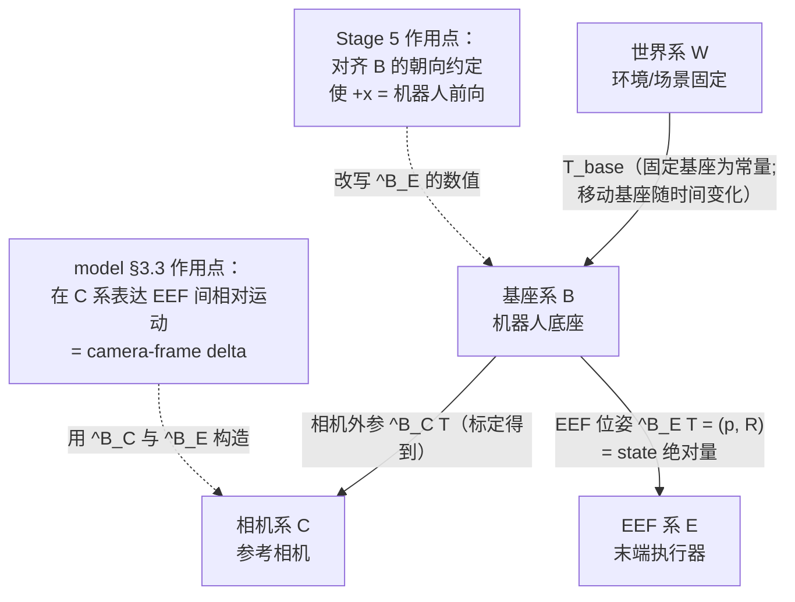
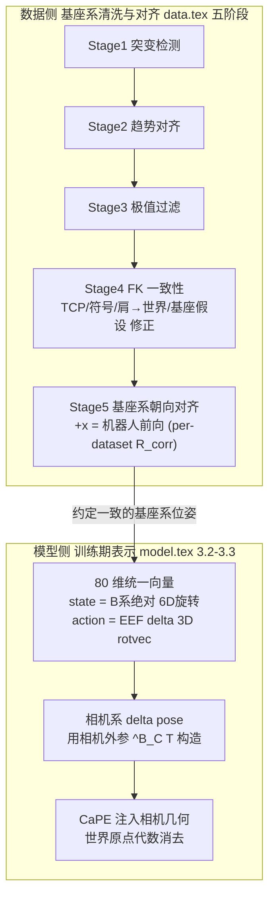
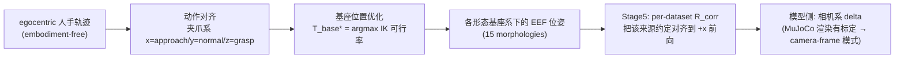
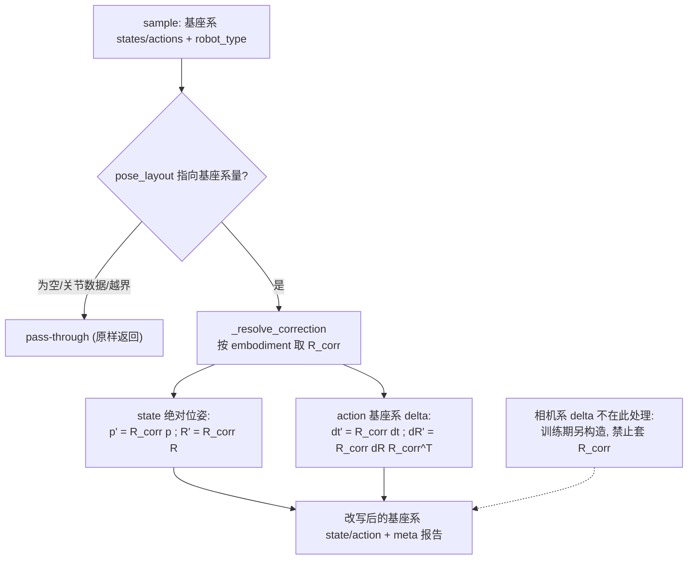
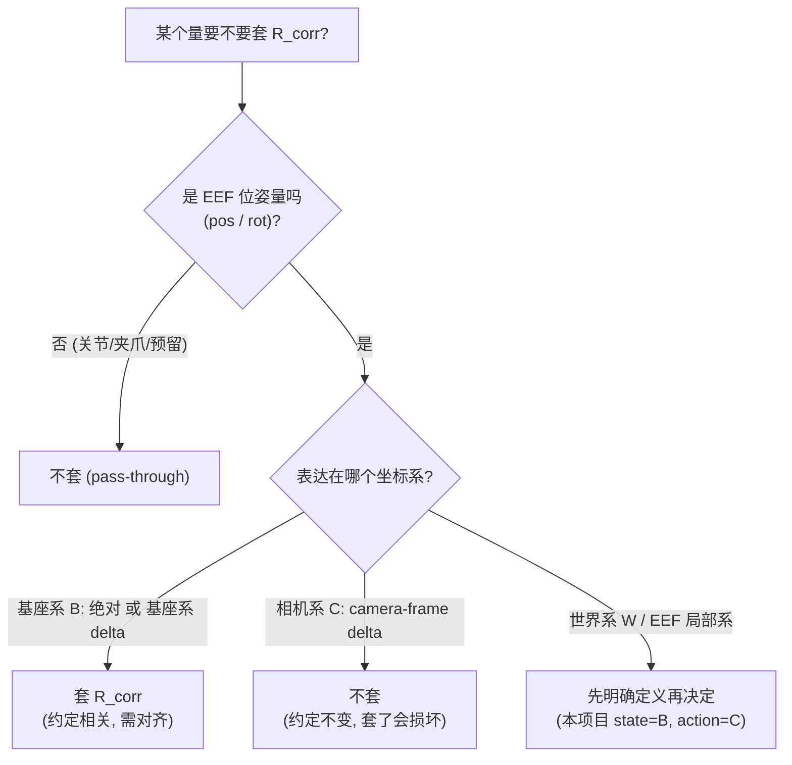

# Qwen-RobotManip Stage 5 勘误重写：Base Frame 是「基座坐标系」，不是「世界坐标系」

> 本文是 [`data_cur5_1.md`](./data_cur5_1.md) 的**勘误与重写版**。所有结论、术语、公式、设计一律以 `b/d/QwenRobotmanip/TeX_Source/` 下的 **Qwen-RobotManip 论文 TeX 原文为唯一权威**，不以任何二手笔记（含 `note.md` / `note_data.md`）为准。
>
> **核心结论**：论文 Stage 5 标题里的 **Base Frame 指机器人「基座坐标系」**。`data_cur5_1.md` 把该阶段通篇解读为「世界坐标系对齐」，并把「相机系 delta 动作」错套上基座级旋转校正 $R_{corr}$，属**概念/术语层面的错误**，需要纠正。有意思的是，`data_cur5_1.md` 交付的算子本身就叫 `robot_base_frame_alignment_mapper`（命名是对的），是**正文叙事跑偏成了「世界系」**。

> **必须合起来读的四处论文**（它们互相关联、互相约束）：
> - Stage 5 原文：[`data.tex` L229–233](./TeX_Source/chapter/data.tex)
> - 80 维统一 state-action 表示：[`model.tex` L35–57](./TeX_Source/chapter/model.tex)
> - 统一 EEF 运动预测（相机系 delta）：[`model.tex` L58–65](./TeX_Source/chapter/model.tex)（及其展开 L66–120）
> - 人到机器人数据合成（H2R）：[`data.tex` L122–200](./TeX_Source/chapter/data.tex)

> **本文范围声明**：按既定方案，本文**只做修正版分析与设计**，**复用**现有算子 [`robot_base_frame_alignment_mapper.py`](../../../data_juicer/_au/ops/mapper/robot_base_frame_alignment_mapper.py)，**不改动**任何源码、测试、recipe，也不改动 `data_cur5_1.md`。修正集中在「概念叙事、坐标系归属、流水线次序、$R_{corr}$ 适用边界与正确使用规范」。

---

## 目录

1. 结论速览（判定 + keep/fix 一览）
2. 勘误对照：`data_cur5_1.md` 的三处 frame 混淆
3. 论文四处证据的交叉整合（唯一权威 = TeX）
4. base / world / camera 三坐标系辨析
5. Stage 5 的正确形式化（基座系朝向对齐）
6. 与 80 维表示 / 相机系 delta / H2R 的关系与流水线次序
7. data-juicer 设计：复用算子 + 正确使用规范 + $R_{corr}$ 适用边界
8. 与 Stage 1–4 的级联协同编排
9. 与 `data_cur5_1.md` 的差异对照表（保留 / 修正 / 新增）
10. 自检清单

---

## 1. 结论速览

### 1.1 一句话判定

**用户的直觉正确**：Stage 5 标题里的 `Base Frame` 指**机器人基座坐标系 $\{B\}$**（robot base frame），而不是环境世界坐标系 $\{W\}$。`data_cur5_1.md` 把它讲成「世界系对齐」是**概念错误**；其算子对**基座系数据**做的数学变换本身没错，但**叙事、坐标系归属、以及对 action 的处理边界**都需要纠正。

论证的三条独立证据（详见 §3）：

1. **论文标题**就叫 `Stage 5: Base Frame and End-Effector Orientation Alignment`（[`data.tex` L229](./TeX_Source/chapter/data.tex)）——这是该阶段的权威命名。
2. **模型侧明确区分三系**：[`model.tex` L49](./TeX_Source/chapter/model.tex) 讲 state 用 “absolute coordinates”，[`model.tex` L67](./TeX_Source/chapter/model.tex) 把它点名为 “absolute pose in the robot **base frame**”，并把 “a **world-frame** delta” 作为**被否决**的动作方案单独列出，最终 action 采用 “**camera-frame** delta pose”。**base、world、camera 是论文自己区分的三个不同坐标系**。
3. **“+x = 机器人前向” 本质上是基座相对概念**：世界系（房间/重力对齐）没有内禀的「机器人前方」；只有相对**基座**才谈得上「前向」。加之 [`model.tex` L48](./TeX_Source/chapter/model.tex) 的 22 维预留含「移动基座速度」——**移动基座下 $\{W\}\neq\{B\}$**，此时「+x=前向」只能是基座相对。

> 正文里论文确实写了 “align **world-frame** orientation conventions”（[`data.tex` L230](./TeX_Source/chapter/data.tex)）。这属于**宽松用词**：对**固定基座**机械臂，数据集的「记录/世界系」通常与「基座系」重合或差一个常量刚体变换，作者遂交替使用。但**标题 + `model.tex` + 移动基座**三重证据都表明，**精确表述是基座坐标系**。`data_cur5_1.md` 只取了「world-frame」这一宽松措辞并放大成全篇主线，丢掉了「base frame」这个权威且更精确的名字。

### 1.2 应当保留的部分（`data_cur5_1.md` 正确之处）

| 保留项 | 为什么对 |
|--------|---------|
| Stage 5 是 **Mapper** 而非 Filter | 它就地改写位姿数值、不删数据（[`data.tex` L230](./TeX_Source/chapter/data.tex) “apply ... rotation corrections”） |
| 绝对位姿 $p'=R_{corr}p,\ R'=R_{corr}R$；delta 相似变换 $\Delta R'=R_{corr}\Delta R R_{corr}^{\top}$ | **对基座系量**严格成立（§5 重新推导） |
| 五种旋转表示互转 + 6D 用 Gram-Schmidt 保 $SO(3)$ | 与 [`model.tex` L44](./TeX_Source/chapter/model.tex) 的 6D 连续旋转一致 |
| 三来源 `param/preset/stats_json` + 缓存 + 未知机型安全放行 | 工程稳健，per-dataset 常量 $R_{corr}$ 与论文「per-dataset rotation corrections」吻合 |
| 无 `pose_layout` / 切片越界 → pass-through | 兼容关节空间数据（Galaxea 等） |
| 算子命名 `robot_base_frame_alignment_mapper` | **本就是「基座系」**——命名正确，是正文叙事偏了 |

### 1.3 必须修正的部分（本文重点）

| 修正项 | `data_cur5_1.md` 现状 | 论文依据 | 正确说法 |
|--------|----------------------|----------|----------|
| **主线术语** | 通篇「世界系朝向对齐」（§2 标题、§2.1–2.3、§3、§7、§8） | 标题 “Base Frame”；[`model.tex` L49/L67](./TeX_Source/chapter/model.tex) | **基座坐标系**朝向对齐（+x=前向是基座相对） |
| **action 归属** | §4.1 表把 action EEF 标注为「相机系 delta」 | [`model.tex` L51/L66–89](./TeX_Source/chapter/model.tex) | Stage 5 处理的是**基座系**的绝对/增量量；**相机系 delta 是训练期下游表示**，不在 Stage 5 作用域 |
| **$R_{corr}$ 边界** | §3/§8 对被标为「相机系」的 delta 施加 $R_{corr}$ 相似变换 | [`model.tex` L66–95](./TeX_Source/chapter/model.tex) | 相机系 delta 对基座旋转**天然不变**；**禁止**对真·相机系 delta 施加 $R_{corr}$ |
| **物理成因叙事** | §2.1「世界系因相机摆放/标定而异」 | [`model.tex` L60/L67](./TeX_Source/chapter/model.tex)、[`data.tex` L171](./TeX_Source/chapter/data.tex) | state EEF 是**基座相对**；差异源于**各数据集基座系轴向约定不同**（相机摆放影响的是相机系 = action 侧，另一套机制） |
| **流水线次序缺失** | 把 Stage 5 与「相机系 delta」揉进一个「世界系」故事 | [`data.tex` L224–232](./TeX_Source/chapter/data.tex) + [`model.tex` L58–118](./TeX_Source/chapter/model.tex) | Stage4(FK/TCP/肩→世界) → **Stage5(基座系朝向对齐)** → 训练期**相机系 delta + CaPE** |

---

## 2. 勘误对照：`data_cur5_1.md` 的三处 frame 混淆

下面把 `data_cur5_1.md` 的原文与论文依据并列，逐条指出问题。三处混淆其实是**同一个根因**（把 base frame 误当 world frame）的不同表现。

### 2.1 混淆一：把「基座系朝向对齐」讲成「世界系朝向对齐」

`data_cur5_1.md` 的表述（[`data_cur5_1.md` L70/L74/L90](./data_cur5_1.md)）：

> §2 标题：「背景：为什么要对齐**世界系**朝向」
> §2.1：「但「空间」这个参照系（**世界系** / 世界坐标原点与坐标轴方向）并不是全宇宙统一的——它取决于每个采集站点如何摆放相机、如何标定、如何定义基座。」
> §2.3：「Stage 5 就是消除这种「**世界系**朝向冲突」的那一刀：把每个 dataset 的**世界系**旋转到同一个规范系（+x = 前向）。」

**问题**：EEF 的 state 位姿在论文里是 **base frame 下的绝对位姿**（[`model.tex` L49](./TeX_Source/chapter/model.tex) “all values are expressed in absolute coordinates” + [`model.tex` L67](./TeX_Source/chapter/model.tex) “absolute pose in the robot **base frame**”）。Stage 5 对齐的是**这个基座系的轴向约定**，让 +x 指向机器人前向。称之为「世界系」既与论文标题（Base Frame）冲突，也与 `model.tex` 对 base/world 的明确区分冲突。

**正确说法**：Stage 5 对齐**基座坐标系 $\{B\}$ 的朝向约定**。「前向」是基座的属性；不同数据集对**同一物理量（机器人前伸）在各自基座系里的轴向定义不同**（有的记成 +x、有的 +y、有的 −x），Stage 5 用 per-dataset 常量 $R_{corr}$ 把它们统一到「+x = 前向」。

### 2.2 混淆二：把 action EEF 说成「相机系 delta」，却又对它套基座级 $R_{corr}$

`data_cur5_1.md` §4.1 的表（[`data_cur5_1.md` L177–180](./data_cur5_1.md)）：

| 内容 | State（观测） | Action（动作） |
|------|--------------|----------------|
| EEF 位置 | 绝对坐标（3） | **相对 delta（相机系，3）** |
| EEF 方向 | 6D 连续旋转（6） | **3D 旋转向量（delta，3）** |

随后 §3.1 / §8.3 对 action 的 delta 施加 $R_{corr}$ 的相似变换 $\Delta R'=R_{corr}\Delta R R_{corr}^{\top}$，并在 §3.2（[`data_cur5_1.md` L147](./data_cur5_1.md)）说这与「把 EEF 系里的旋转搬运到相机系」是同一类操作。

**问题**：这是**自相矛盾**。若 action 真的是**相机系 delta**（论文最终采用的动作表示，[`model.tex` L66–89](./TeX_Source/chapter/model.tex)），那么它对「基座系朝向如何定义」是**天然不变**的（§5.4 给出证明；[`model.tex` L95](./TeX_Source/chapter/model.tex) “the global **world-frame origin cancels** algebraically”）。对一个相机系 delta 施加基座级 $R_{corr}$ 会**平白无故地把它旋转一下**，破坏数据。

**为何算子跑出来仍「正确」**：`data_cur5_1.md` 的合成数据（[`data_cur5_1.md` L779–783](./data_cur5_1.md)）里，action 是从**基座系绝对位姿**差分出来的 `[drotvec(3), dtrans(3)]`——它其实是**基座系 delta**，对它套 $R_{corr}$ 恰好正确。所以**错的是「相机系」这个标签**，不是算子。标签之误正是 base/camera 混淆的直接产物。

**正确说法**：Stage 5 作用的 action 必须是**基座系**下的量（基座系 delta，或转相机系之前的中间量）。**相机系 delta 是 `model.tex` §3.3 在训练期构造的下游表示**，不属于 Stage 5 数据清洗的作用对象；对它绝不能施加 $R_{corr}$。

### 2.3 混淆三：把 base / world / camera 三系压扁成一个「世界系」叙事，丢失流水线次序

`data_cur5_1.md` 把「数据侧的基座系约定对齐」和「模型侧的相机系动作表示」都塞进一个「世界系」故事里（如 §12.1「相机系 delta 全流程……与 Stage 5 的相似变换是同一数学基元」，[`data_cur5_1.md` L971](./data_cur5_1.md)）。

**问题**：论文里这是**两个不同层次、不同坐标系、有先后次序**的机制：

- **数据侧（Stage 4/5）**：在 **base frame** 上做一致性校正与朝向对齐（[`data.tex` L224–232](./TeX_Source/chapter/data.tex)）。
- **模型侧（`model.tex` §3.3）**：训练期把 EEF 动作表达为 **camera frame** delta，并用 CaPE 注入相机几何（[`model.tex` L58–118](./TeX_Source/chapter/model.tex)）。

「同一数学基元（相似变换/共轭）」在数学形式上确有相似，但**语义与作用对象完全不同**：Stage 5 的 $R_{corr}$ 是「把基座系轴向转正」，相机系 delta 的共轭是「把 EEF 间相对运动投影到相机系」。混为一谈会让读者以为 Stage 5 在做相机系变换。

**正确说法**：明确次序 **Stage4 → Stage5（基座系）→ 相机系 delta（训练期）**，三系各司其职（§6 给出数据流图）。

---

## 3. 论文四处证据的交叉整合（唯一权威 = TeX）

本节把四处论文原文摆出来，逐一提炼与 Stage 5 坐标系相关的**硬证据**，最后汇成一张「论文用词 → 精确指向」表。

### 3.1 `data.tex` L229–233：Stage 5 本体

原文（[`data.tex` L229–230](./TeX_Source/chapter/data.tex)）：

> **Stage 5: Base Frame and End-Effector Orientation Alignment.** We apply per-dataset rotation corrections to align world-frame orientation conventions, ensuring the positive $x$-axis consistently corresponds to the robot's forward-facing direction and that the unified state-action representation is geometrically consistent across embodiments.

注释详版（[`data.tex` L232](./TeX_Source/chapter/data.tex)）：

> ... Different data collection environments record poses in varying world frames depending on sensor placement and calibration conventions. We apply per-dataset rotation corrections to transform all end-effector poses into a canonical frame where the $x$-axis aligns with the robot's forward direction ...

**提炼**：
- **标题权威命名 = Base Frame**（基座系）；正文出现 “world-frame” 属宽松措辞。
- 动作 = **per-dataset** 常量旋转校正；对象 = **all end-effector poses**；目标 = **canonical frame，+x = 机器人前向**。
- 关键词 “robot's **forward-facing direction**” 是**基座相对**概念——为后文「为何是基座系」定调。

### 3.2 `model.tex` L35–57：80 维统一 state-action 表示

原文要点：
- [`model.tex` L44](./TeX_Source/chapter/model.tex)：每臂 EEF 位姿 9 维 = 笛卡尔位置(3) + **6D 连续旋转**(6)。
- [`model.tex` L48](./TeX_Source/chapter/model.tex)：尾部 22 维预留跨双臂共享，用于「**mobile-base velocity**（移动基座速度）」等额外自由度。
- [`model.tex` L49](./TeX_Source/chapter/model.tex)：“For the **state** vector, all values are expressed in **absolute coordinates**.”
- [`model.tex` L51](./TeX_Source/chapter/model.tex)：“For the **action** vector, joint actions are expressed as absolute values and **end-effector actions are expressed as relative deltas** from the current state. ... end-effector orientation deltas are parameterized as **3D rotation vectors** ...”

**提炼**：
- **state EEF = 绝对位姿（6D 旋转）**；**action EEF = 相对 delta（3D rotvec）**。这正是 Stage 5 要区分「绝对 / delta」两套变换公式的根据。
- 「absolute coordinates」相对于谁？下一节 L67 会点名是 **base frame**。
- **有「移动基座」自由度** ⇒ 存在 $\{B\}\neq\{W\}$ 的情形 ⇒「+x=前向」必须理解为**基座相对**，坐实「Base Frame」。

### 3.3 `model.tex` L58–65（及展开 L66–120）：统一 EEF 运动预测 = 相机系 delta

原文要点：
- [`model.tex` L60](./TeX_Source/chapter/model.tex)：碎片化根因 = “end-effector poses recorded in **different coordinate frames** across datasets. When the same motion is expressed relative to **different base frames or camera frames** ...”。
- [`model.tex` L67](./TeX_Source/chapter/model.tex)（决定性）：

> Rather than representing end-effector motion as **an absolute pose in the robot base frame**, a relative pose in the end-effector local frame, or **a world-frame delta**, we adopt a **camera-frame delta pose** representation.

- [`model.tex` L95](./TeX_Source/chapter/model.tex)：“Because CaPE is a rotational positional encoding, the **global world-frame origin cancels algebraically** in the dot-product attention ...”。
- [`model.tex` L105](./TeX_Source/chapter/model.tex)：auxiliary flag 在「**camera-frame delta mode** 与 **robot-base relative mode**」之间切换（无标定时降级为基座相对）。

**提炼（本文最强证据）**：论文在此**把三系并列且明确取舍**——
- **base frame**：state 的绝对位姿参考系（也可作 action 的降级方案）；
- **world frame**：被**否决**的 “world-frame delta” 动作方案；且其原点在 CaPE 里被代数消去；
- **camera frame**：**采纳**的 action delta 表示。

因此，把 Stage 5 叫「世界系对齐」，恰好撞上论文**明确否决 world-frame、区分 base/world/camera** 的立场。Stage 5 对齐的是 state 所在的 **base frame**，与被否决的 world-frame delta、与 action 的 camera-frame 都不是一回事。

### 3.4 `data.tex` L122–200：人到机器人数据合成（H2R）——基座系约定异质性的具体来源

原文要点：
- [`data.tex` L142](./TeX_Source/chapter/data.tex)：机器人动作 $\mathbf{a}_t=(\mathbf{p}_t,\mathbf{R}_t,w_t)$——EEF 位置、夹爪朝向、夹爪宽度。
- [`data.tex` L152–159](./TeX_Source/chapter/data.tex)：夹爪朝向构造成右手正交系 $\mathbf{R}=[\mathbf{x}\ \mathbf{y}\ \mathbf{z}]$：$\mathbf{z}$=抓取轴（jaw line），$\mathbf{y}$=夹爪法向，$\mathbf{x}$=**接近轴（approach）**；左右手用 $s=\pm1$ 翻转保证一致。
- [`data.tex` L169–174](./TeX_Source/chapter/data.tex)：**基座位置优化**
$$
\mathbf{T}_\text{base}^*=\arg\max_{\mathbf{T}_\text{base}}\frac{1}{|\mathcal{K}|}\sum_{k\in\mathcal{K}}\mathbb{1}\!\left[\text{IK}(\mathbf{T}_\text{base}^{-1}\mathbf{T}_k^\text{ee})\text{ feasible}\right]
$$
其中 $\mathbf{T}_\text{base}^{-1}\mathbf{T}_k^\text{ee}$ 把 EEF 位姿**变换进基座系**再解 IK；对 15 种形态**各自独立搜索**基座放置。

**提炼**：
- H2R 数据的 EEF 位姿最终是**基座相对**的（IK 需要 $\mathbf{T}_\text{base}^{-1}\mathbf{T}^\text{ee}$）——与 `model.tex` L49/L67 的「base frame 绝对位姿」一致。
- H2R 自带一套**特定 EEF 朝向约定**（x=approach, y=normal, z=grasp），与遥操真机、仿真数据集的约定**未必一致**——这正是「不同数据集基座系轴向约定不同」的**具体实例**，也正是 Stage 5 per-dataset $R_{corr}$ 要抹平的对象。
- 15 形态各自基座放置 ⇒ 逐数据集/逐形态的约定差异 ⇒ 逐数据集 $R_{corr}$ 的动机落地。

### 3.5 汇总：论文用词 → 精确指向

| 论文出处 | 原文用词 | 精确指向 | 说明 |
|----------|----------|----------|------|
| [`data.tex` L229](./TeX_Source/chapter/data.tex)（标题） | “**Base Frame** … Alignment” | 基座系 $\{B\}$ | 阶段**权威命名** |
| [`data.tex` L230/L232](./TeX_Source/chapter/data.tex)（正文） | “**world-frame** orientation conventions” | 基座系 $\{B\}$（宽松记为 world） | 固定基座下 $\{W\}\approx\{B\}$；“+x=前向”是基座相对 |
| [`model.tex` L49](./TeX_Source/chapter/model.tex) | state = “**absolute coordinates**” | $\{B\}$ 下绝对位姿 | 与 L67 呼应 |
| [`model.tex` L67](./TeX_Source/chapter/model.tex) | “absolute pose in the robot **base frame**” | $\{B\}$ | **state 的坐标系** |
| [`model.tex` L67](./TeX_Source/chapter/model.tex) | “a **world-frame** delta”（**被否决**） | $\{W\}$ | 明确区别于 $\{B\}$ 与 $\{C\}$ |
| [`model.tex` L66–89](./TeX_Source/chapter/model.tex) | “**camera-frame** delta pose”（**采纳**） | $\{C\}$ | **action 的坐标系** |
| [`model.tex` L95](./TeX_Source/chapter/model.tex) | “global **world-frame** origin cancels” | $\{W\}$ 原点在 CaPE 中消去 | 相机系 delta 对 $\{W\}/\{B\}$ 旋转不变 |
| [`data.tex` L225](./TeX_Source/chapter/data.tex)（Stage 4） | “shoulder-relative → **world frame**” | $\{W\}$（双臂公共参考） | 属 Stage 4 的修正动作 |
| [`data.tex` L171](./TeX_Source/chapter/data.tex)（H2R） | $\mathbf{T}_\text{base}^{-1}\mathbf{T}^\text{ee}$ | EEF 变换进 $\{B\}$ | H2R 的 EEF 为基座相对 |

**读表结论**：论文自身用 base / world / camera **三个**坐标系。Stage 5 归属 **base frame**；`data_cur5_1.md` 只抓住正文的宽松 “world-frame” 字样，未回到标题与 `model.tex` 的权威区分，故产生系统性偏差。

---

## 4. base / world / camera 三坐标系辨析

要把 Stage 5 讲对，必须先把论文用到的三个坐标系分清楚。下面给出定义、彼此关系，以及**为什么 Stage 5 判定为基座系**。

### 4.1 三系定义与归属

| 坐标系 | 记号 | 附着于 | 论文用途 | 论文出处 |
|--------|------|--------|----------|----------|
| **基座坐标系** | $\{B\}$ | 机器人**基座/安装底座** | **state** 的绝对 EEF 位姿；无标定时 action 的降级参考 | [`model.tex` L49/L67/L105](./TeX_Source/chapter/model.tex)、[`data.tex` L171](./TeX_Source/chapter/data.tex) |
| **世界坐标系** | $\{W\}$ | **环境/场景**（房间、标定板、重力对齐） | Stage 4 双臂「肩→世界」的公共参考；被否决的 world-frame delta；CaPE 中被消去的全局原点 | [`data.tex` L225](./TeX_Source/chapter/data.tex)、[`model.tex` L67/L95](./TeX_Source/chapter/model.tex) |
| **相机坐标系** | $\{C\}$ | **参考相机** | **action** 的 delta 表示（camera-frame delta pose） | [`model.tex` L66–118](./TeX_Source/chapter/model.tex) |

补充：EEF 自身也有局部坐标系 $\{E\}$（`model.tex` L67 的 “end-effector local frame”），是被否决的另一动作方案，不展开。

### 4.2 三系的空间关系（坐标系树）



要点：
- **state 的 EEF 位姿 ${}^B_E\mathbf{T}=(p,R)$ 直接挂在 $\{B\}$ 下**（[`model.tex` L49/L67](./TeX_Source/chapter/model.tex)）。Stage 5 改的就是「$\{B\}$ 的轴向怎么定」，从而改写 $(p,R)$ 的数值。
- **action 的 camera-frame delta 挂在 $\{C\}$ 下**（[`model.tex` L66–89](./TeX_Source/chapter/model.tex)），由 ${}^B_C\mathbf{T}$（相机外参）与 EEF 相对运动共同构造——它是 §3.3 训练期的表示，不是 Stage 5 的对象。
- $\{W\}$ 在本项目里是「配角」：Stage 4 用它做双臂公共参考（肩→世界），模型侧则用 CaPE 让它的**原点代数消去**（[`model.tex` L95](./TeX_Source/chapter/model.tex)）。

### 4.3 base vs world：微妙但关键的区别

这是 `data_cur5_1.md` 踩坑的地方，值得单独讲清。

- **固定基座（fixed base）**：基座在世界里不动，${}^W_B\mathbf{T}$ 是常量；很多数据集干脆把世界原点**设在基座**上，于是 $\{W\}$ 与 $\{B\}$ 数值上重合或只差一个常量刚体变换。**此时「world frame」与「base frame」可以混用**——这解释了论文正文为何写 “world-frame”（[`data.tex` L230](./TeX_Source/chapter/data.tex)）。
- **移动基座（mobile base）**：论文的 22 维预留明确含「mobile-base velocity」（[`model.tex` L48](./TeX_Source/chapter/model.tex)）。此时基座在世界里**移动**，${}^W_B\mathbf{T}$ **随时间变化**。若把 EEF state 说成「世界系绝对位姿」，则必须依赖全局定位（SLAM/动捕）才有意义；但论文说 state 是「absolute coordinates」且为「absolute pose in the robot **base frame**」——**只能理解为基座相对**。

> **判据（决定性）**：Stage 5 的目标是「**+x = 机器人前向（forward-facing direction）**」。世界系（房间/重力）**没有内禀的「机器人前方」**——「前方」是机器人**基座**的属性。所以「把 +x 对齐到机器人前向」这件事，**定义上就是基座系的朝向约定**，与房间怎么摆无关。这条判据独立于「固定/移动基座」，直接把 Stage 5 钉死在 base frame。

### 4.4 三系与 state / action 的归属总表

| 量 | 语义 | 坐标系 | 旋转表示 | 是否受 Stage 5 的 $R_{corr}$ 影响 |
|----|------|--------|----------|-------------------------------|
| **state EEF 位姿** | 绝对 | $\{B\}$ | 6D 连续旋转 | ✅ 受影响，**需**校正（约定相关量） |
| **action EEF（原始基座系 delta）** | 相对增量 | $\{B\}$ | 3D rotvec | ✅ 受影响，**需**校正（若在相机系转换之前） |
| **action EEF（camera-frame delta）** | 相对增量 | $\{C\}$ | 3D rotvec | ❌ **不变**，**禁止**校正（§5.4 证明） |
| 关节量（joint） | 绝对/增量 | 关节空间 | — | ❌ 无位姿，pass-through |

---

## 5. Stage 5 的正确形式化（基座系朝向对齐）

### 5.1 校正的定义

对第 $k$ 个数据集，Stage 5 赋予一个**常量**旋转 $R_{corr}^{(k)}\in SO(3)$，把该数据集**记录时的基座系轴向约定** $\{B\}$ 旋转到**规范约定** $\{B'\}$（其中 +x = 机器人前向）。约定：同一物理点/向量在两系下的坐标满足

$$
x_{B'} = R_{corr}\, x_{B}.
$$

这是「per-dataset rotation corrections」（[`data.tex` L230](./TeX_Source/chapter/data.tex)）的精确化——注意**参照系是基座系 $\{B\}$**，不是世界系。

### 5.2 绝对位姿（state 用）

state 的 EEF 位姿 $(p,R)={}^B_E\mathbf{T}$ 是「基座系下的点 + 朝向」，直接施加基座系旋转：

$$
p' = R_{corr}\,p,\qquad R' = R_{corr}\,R.
$$

直觉：位置 $p$ 是 $\{B\}$ 里的一个箭头，换基座轴向约定就把箭头整体转过去；朝向矩阵 $R={}^B_E R$ 的列是「EEF 各轴在 $\{B\}$ 下的方向」，左乘 $R_{corr}$ 把这些方向也转到 $\{B'\}$。

### 5.3 基座系 delta（action 在转相机系之前）

若原始 action 是**基座系**下的相对增量 $(\Delta t,\Delta R)$（尚未转相机系），平移增量照旋转：

$$
\Delta t' = R_{corr}\,\Delta t.
$$

旋转增量 $\Delta R=R_{t+1}R_t^{\top}$（在 $\{B\}$ 里描述的一次旋转）换系时做**相似变换（共轭）**：

$$
\Delta R' = R'_{t+1}{R'_t}^{\top} = (R_{corr}R_{t+1})(R_{corr}R_t)^{\top} = R_{corr}\,\Delta R\,R_{corr}^{\top}.
$$

几何直觉：$\Delta R$ 是「绕轴 $\hat n$ 转 $\theta$」；相似变换保持转角 $\theta$、只把**转轴**转到 $R_{corr}\hat n$，即 rotvec 层面 $\hat n\theta\mapsto (R_{corr}\hat n)\theta$。

> 这一段数学与 `data_cur5_1.md` §3 一致且**正确**——前提是**作用对象为基座系量**。本文的修正不在公式，而在「它作用于 $\{B\}$，且**不作用于** $\{C\}$」。

### 5.4 为什么相机系 delta 对 $R_{corr}$ 天然不变（禁止施加的严格理由）

这是纠正 `data_cur5_1.md` §4.1「相机系 delta 也套 $R_{corr}$」的核心。论文的 camera-frame delta 旋转块（[`model.tex` Eq. L75–81](./TeX_Source/chapter/model.tex)）：

$$
{}^c_e\mathbf{R}\ {}^e_{e^*}\mathbf{R}\ {}^e_c\mathbf{R},\qquad \text{平移块 } {}^c_e\mathbf{R}\ {}^e\mathbf{t}_{e^*}.
$$

**关键观察**：把基座系约定旋转 $R_{corr}$，等价于「所有相对 $\{B\}$ 测量的朝向都左乘 $R_{corr}$」。设相机、当前 EEF、目标 EEF 相对基座的朝向为 ${}^B_c R,\ {}^B_e R,\ {}^B_{e^*}R$，则

$$
{}^B_c R \mapsto R_{corr}\,{}^B_c R,\quad {}^B_e R \mapsto R_{corr}\,{}^B_e R,\quad {}^B_{e^*}R \mapsto R_{corr}\,{}^B_{e^*}R.
$$

而相机-EEF 的相对朝向由两者之比构成，$R_{corr}$ **成对抵消**：

$$
{}^c_e R = ({}^B_c R)^{\top}({}^B_e R)\ \mapsto\ ({}^B_c R)^{\top}\underbrace{R_{corr}^{\top}R_{corr}}_{=I}({}^B_e R) = {}^c_e R.
$$

同理 ${}^e_{e^*}R$、${}^e_c R$ 皆不变，故整个旋转块 ${}^c_e R\,{}^e_{e^*}R\,{}^e_c R$ **不变**；平移块中 ${}^e\mathbf{t}_{e^*}$ 是 EEF 局部系位移（不随基座约定改变）、${}^c_e R$ 已证不变，故平移块也**不变**。

$$
\boxed{\ \text{camera-frame delta } \mathbf{a}_p \text{ 对基座系约定旋转 } R_{corr} \text{ 完全不变}\ }
$$

这正是论文 [`model.tex` L95](./TeX_Source/chapter/model.tex) 所说「global world-frame origin cancels algebraically」在旋转层面的体现，也是相机系 delta「视觉相似 ⇒ 数值相近、利于跨本体」的根源。

**推论**：
- 对**真·相机系 delta** 施加 $R_{corr}$ 是**多余且有害**的——会平白把一个本应不变的量旋转 $R_{corr}$，制造数据噪声。
- 反过来，**state 的基座系绝对位姿是约定相关的**（$p'=R_{corr}p\neq p$），所以 Stage 5 **必须**校正它。
- 一个干净的对偶：**「约定相关」的量（基座系绝对/基座系 delta）才需要 $R_{corr}$；「约定不变」的量（相机系 delta）不需要也不能施加。**

### 5.5 算例一：基座系 +y→+x（yaw 约定对齐）

某数据集记录时把「前向」定义成基座系 +y（例如底座朝向与轴向定义差 90°），要对齐到「+x=前向」，取 $R_{corr}=R_z(-90^\circ)$：

$$
R_z(-90^\circ)=\begin{bmatrix}0&1&0\\-1&0&0\\0&0&1\end{bmatrix},\qquad
R_z(-90^\circ)\begin{bmatrix}0\\1\\0\end{bmatrix}=\begin{bmatrix}1\\0\\0\end{bmatrix}.
$$

于是「机器人前伸」记录成的 $\Delta p\approx(0,+d,0)$ 被转正为 $(+d,0,0)$。注意：**这里旋转的是基座系轴向约定**，而非「把房间转了 90°」。`data_cur5_1.md` 的合成验收（净位移 $(0,0.6,\cdot)\to(0.6,0,\cdot)$）在数值上正确，只是应解读为**基座系约定对齐**。

### 5.6 算例二：H2R 的 x=approach 约定与其他数据集对齐

H2R 合成数据自带一套 EEF 朝向约定（[`data.tex` L152–159](./TeX_Source/chapter/data.tex)）：$\mathbf{x}$=接近轴（approach，朝抓取目标）、$\mathbf{y}$=夹爪法向、$\mathbf{z}$=抓取轴。其 EEF 位姿经基座位置优化后落在各形态自己的基座系里（$\mathbf{T}_\text{base}^{-1}\mathbf{T}^\text{ee}$，[`data.tex` L171](./TeX_Source/chapter/data.tex)）。

- H2R 的「接近轴 x」大致沿「伸手够物」的方向，天然偏向「前向」；
- 而某个遥操真机数据集可能把基座系 +y 定义为前向；
- Stage 5 对**每个数据集**给一个 $R_{corr}$：对该遥操集用 $R_z(-90^\circ)$、对 H2R 用其对应的（可能接近 identity 的）校正，使**所有来源的「前向」都落到 +x**。

这说明 Stage 5 的 per-dataset $R_{corr}$ 抹平的是**跨数据源的基座系轴向约定异质性**（H2R 约定 vs 遥操约定 vs 仿真约定），而不是「把不同房间的世界系对齐」。H2R 正是这种异质性的一个**具体来源**。

---

## 6. 与 80 维表示 / 相机系 delta / H2R 的关系与流水线次序

`data_cur5_1.md` 最深的问题是把「数据侧基座系对齐」和「模型侧相机系 delta」揉进一个故事。本节按论文把它们拆成**有先后的两层**，并画出数据流。

### 6.1 全局次序：数据侧（基座系）→ 模型侧（相机系）



**核心次序**：Stage 5 在 **base frame** 上把各数据集的轴向约定对齐好之后，模型侧才把 EEF 动作**转换**成 camera-frame delta（[`model.tex` L66–89](./TeX_Source/chapter/model.tex)）并用 CaPE 编码。**相机系 delta 是 Stage 5 的下游**，不是 Stage 5 的一部分。

### 6.2 数据侧 vs 模型侧分工

| 维度 | 数据侧（Stage 4/5） | 模型侧（相机系 delta + CaPE） |
|------|--------------------|-------------------------------|
| 作用坐标系 | **基座系 $\{B\}$** | **相机系 $\{C\}$** |
| 主要对象 | state 的绝对 EEF + 基座系约定 | action 的 EEF 增量 |
| 「统一」含义 | 统一**基座系轴向约定**（+x 前向、TCP、符号、肩→世界） | 统一**视觉锚点**（相机系；世界原点被 CaPE 消去） |
| 处理阶段 | **训练前**数据清洗（`data.tex` §5） | **训练/推理期**表示与注意力（`model.tex` §3.3） |
| 是否需要相机内外参 | 否（纯基座系旋转校正） | 是（无标定则 auxiliary flag 降级为 base-relative，[`model.tex` L105](./TeX_Source/chapter/model.tex)） |
| 是否施加 $R_{corr}$ | 是（约定相关量） | **否**（相机系 delta 对 $R_{corr}$ 不变，§5.4） |

### 6.3 与 80 维统一表示的衔接（`model.tex` L35–57）

- **state EEF 块**（9 维 = 位置 3 + 6D 旋转 6，[`model.tex` L44](./TeX_Source/chapter/model.tex)）：是 $\{B\}$ 下绝对位姿 → Stage 5 对其施加 $p'=R_{corr}p,\ R'=R_{corr}R$（6D 经旋转矩阵中转，Gram-Schmidt 保 $SO(3)$）。
- **action EEF 块**（旋转为 3D rotvec，[`model.tex` L51](./TeX_Source/chapter/model.tex)）：
  - 若管道在**转相机系之前**处理原始基座系 delta → Stage 5 施加 $\Delta t'=R_{corr}\Delta t,\ \Delta R'=R_{corr}\Delta R R_{corr}^{\top}$；
  - 一旦已是 **camera-frame delta** → **不处理**（§5.4）。
- **22 维预留（移动基座速度等）**：非位姿，pass-through；其存在反证「base frame」的必要性（§4.3）。

### 6.4 与 H2R 的衔接（`data.tex` L122–200）



要点：H2R 产出的是**基座系** EEF 位姿（$\mathbf{T}_\text{base}^{-1}\mathbf{T}^\text{ee}$），带自己的朝向约定；Stage 5 用 $R_{corr}$ 把它并入统一约定；之后（因 MuJoCo 渲染有相机标定）进入 camera-frame delta 模式。**整条链再次印证：Stage 5 在基座系、相机系 delta 在下游。**

### 6.5 单样本数据流（Stage 5 到底改了什么）



---

## 7. data-juicer 设计：复用算子 + 正确使用规范 + $R_{corr}$ 适用边界

结论先行：**现有算子 [`robot_base_frame_alignment_mapper.py`](../../../data_juicer/_au/ops/mapper/robot_base_frame_alignment_mapper.py) 无需改代码**——它命名正确（base_frame）、对基座系量的数学正确、pass-through 稳健。需要修正的是**使用规范与文档语义**：`pose_layout` 只能指向基座系量，$R_{corr}$ 严禁作用于相机系 delta。

### 7.1 复用现有算子（不改源码）

算子的能力与 Stage 5 的基座系语义**完全吻合**：
- `Mapper` 就地改写、不删数据；
- 绝对（`is_delta=false`）走左乘、delta（`is_delta=true`）走相似变换——正是 §5.2/§5.3 的基座系公式；
- 五种旋转表示 + 6D Gram-Schmidt；三来源 `param/preset/stats_json` + 未知机型放行；无 `pose_layout`/越界 → pass-through。

唯一要「正名」的是：算子作用对象是 **基座系** 的 state/action，不是「世界系」，更不是「相机系 delta」。

### 7.2 正确的 `pose_layout` 使用规范（关键）

**规范**：`pose_layout` 的每个 spec **只允许指向基座系量**：

1. **state**（`target: 'state'`, `is_delta: false`）：指向 $\{B\}$ 下的**绝对 EEF 位姿**（位置 + 6D 旋转）。✅
2. **action**（`target: 'action'`, `is_delta: true`）：**仅当** action 是**基座系 delta**（尚未转相机系）时才配置。✅
3. **禁止**：若 action 已是 **camera-frame delta**（`model.tex` §3.3 的训练期表示），**绝不为其配置 spec**——否则 $R_{corr}$ 会破坏这个对基座旋转不变的量（§5.4）。❌

> 实操判断：在 `data.tex` 五阶段数据清洗管道里，EEF 通常仍是**基座系绝对/基座系 delta**（相机系 delta 是模型侧构造）。因此在 Stage 5 阶段为 state（及基座系 delta action）配 `pose_layout` 是安全且正确的；**不要**把「模型输入里的相机系 delta」当作 Stage 5 的输入来配。

### 7.3 $R_{corr}$ 适用边界（决策图）



### 7.4 修正版 recipe 示例（基座系语义）

以下示例把 `data_cur5_1.md` 的配置**语义正名**为基座系（配置字段不变，注释更正）：

```yaml
process:
  - robot_base_frame_alignment_mapper:
      signal_source: 'top_level'
      correction_source: 'preset'
      preset_name: 'z_-90'            # 基座系 +y(前向) → +x(前向); 对齐的是【基座系】轴向约定
      pose_layout:
        # state = 基座系【绝对】EEF 位姿: [pos(3), rot6d(6)]
        - target: 'state'
          pos: [0, 3]
          rot: [3, 9]
          rot_type: 'rot6d'
          is_delta: false
        # action = 基座系【delta】(仅当尚未转相机系时才配!): [drotvec(3), dtrans(3)]
        - target: 'action'
          rot: [0, 3]
          pos: [3, 6]
          rot_type: 'rotvec'
          is_delta: true
      # 注意: 若 action 已是 camera-frame delta, 请【删除】上面的 action spec (见 7.2/7.5)
```

关节空间数据（如 Galaxea）无 EEF 位姿：**不配 `pose_layout`** → 纯 pass-through，与 Stage 1/2/3 级联零干扰。

### 7.5 反例警示：不要对相机系 delta 配 spec

若上游已把 action 转成 camera-frame delta（`model.tex` Eq. `cam_delta_rot_inv`），却仍写：

```yaml
- target: 'action'      # 危险: 这是相机系 delta!
  rot: [0, 3]
  rot_type: 'rotvec'
  is_delta: true
```

后果：算子会对一个「本应对基座旋转不变」的量施加 $\Delta R'=R_{corr}\Delta R R_{corr}^{\top}$，凭空引入 $R_{corr}$ 旋转，**破坏视觉-动作对齐**（违背 [`model.tex` L70/L95](./TeX_Source/chapter/model.tex) 的设计初衷）。正确做法：**该 spec 必须删除**；相机系 delta 的一致性由 §3.3 + CaPE 保证，不需要也不能靠 Stage 5。

---

## 8. 与 Stage 1–4 的级联协同编排

### 8.1 级联工作流（基座系语义）


`data_cur5_1.md` 的级联图与验收在**流程与工程**上仍然有效；本文只把 S5 的标签从「世界系」正名为「基座系」，并明确 S5 的产物是「约定一致的**基座系**位姿」，交给下游做相机系 delta。

### 8.2 与 Stage 4 的衔接（论文次序）

- **Stage 4**（[`data.tex` L224–227](./TeX_Source/chapter/data.tex)）：用 URDF+Pinocchio FK 比对，修正五类不一致，含「**incorrect base-frame assumptions**」与「双臂肩相对 → **world frame**」。它产出**几何自洽的基座系 EEF 位姿**。
- **Stage 5**（[`data.tex` L229–232](./TeX_Source/chapter/data.tex)）：在此之上，把各数据集**基座系的轴向约定**统一到「+x=前向」。

两者都在 base frame 上工作、都属数据清洗（Mapper/校正），构成「先修正 → 后对齐」的因果链：Stage 4 让 EEF 位姿**可信**，Stage 5 让它**跨集可比**。

### 8.3 级联三不变量

1. **不删数据**：Stage 5 是 Mapper，输入 N 条 → 输出 N 条。
2. **不破坏上游产物**：关节空间数据上 Stage 5 pass-through，Stage 1/2/3 的 stats/meta/`valid_frame_mask` 原样保留。
3. **坐标系不越权**：Stage 5 只碰**基座系**位姿；关节量、夹爪、预留维、以及任何**相机系 delta** 一律不碰。

---

## 9. 与 `data_cur5_1.md` 的差异对照表

| 主题 | `data_cur5_1.md`（原） | `data_cur5_2.md`（修正） | 论文依据 |
|------|----------------------|-------------------------|----------|
| 阶段对齐的坐标系 | **世界系**朝向对齐 | **基座系**朝向对齐 | 标题 [`data.tex` L229](./TeX_Source/chapter/data.tex)；[`model.tex` L49/L67](./TeX_Source/chapter/model.tex) |
| state EEF 参考系 | 世界系（隐含） | **基座系 $\{B\}$ 绝对** | [`model.tex` L49/L67](./TeX_Source/chapter/model.tex) |
| action EEF 参考系 | 标「相机系」却按世界/基座 delta 处理（自相矛盾） | 明确二分：**基座系 delta（Stage5 内）** / **相机系 delta（下游, 不动）** | [`model.tex` L51/L66–89](./TeX_Source/chapter/model.tex) |
| $R_{corr}$ 适用对象 | state + action 一律施加 | **仅基座系量**；相机系 delta **禁止**（附不变性证明） | [`model.tex` L66–95](./TeX_Source/chapter/model.tex)、§5.4 |
| 三系关系 | 压扁成单一「世界系」 | **base / world / camera 分清** + 先后次序 | [`model.tex` L60/L67/L95](./TeX_Source/chapter/model.tex)、[`data.tex` L225](./TeX_Source/chapter/data.tex) |
| 「+x=前向」的性质 | 世界系朝向 | **基座相对**（世界系无内禀前向；移动基座 $\{W\}\neq\{B\}$） | [`data.tex` L230](./TeX_Source/chapter/data.tex)、[`model.tex` L48](./TeX_Source/chapter/model.tex) |
| 差异物理成因 | 相机摆放/标定 → 世界系各异 | **各数据集基座系轴向约定不同**（state EEF 基座相对；H2R 等各带约定） | [`model.tex` L60](./TeX_Source/chapter/model.tex)、[`data.tex` L152–171](./TeX_Source/chapter/data.tex) |
| 与 H2R 的关系 | 未深入 | H2R = 基座系约定异质性的**具体来源**（x=approach、$\mathbf{T}_\text{base}^{-1}\mathbf{T}^\text{ee}$、15 形态） | [`data.tex` L122–200](./TeX_Source/chapter/data.tex) |
| 算子 / 代码 | 已交付、命名 `..._base_frame_...` | **复用不改**；仅正名 + 使用规范 | — |
| 数学公式 | 正确（但未限定作用域） | **保留**，并明确「仅作用于基座系量」 | §5 |

**一句话**：`data_cur5_1.md` 的**代码与公式**大体可用，**概念叙事与坐标系归属**需要按论文纠正；`data_cur5_2.md` 不推翻其工程，而是把「它到底在哪个坐标系做什么」讲对。

---

## 10. 自检清单

- [x] 阶段命名回归论文标题：**Base Frame = 基座坐标系**，非世界坐标系（[`data.tex` L229](./TeX_Source/chapter/data.tex)）。
- [x] state EEF = **基座系绝对位姿**（[`model.tex` L49/L67](./TeX_Source/chapter/model.tex)）；6D 旋转经矩阵中转、Gram-Schmidt 保 $SO(3)$。
- [x] action EEF 二分清楚：**基座系 delta（Stage 5 处理）** vs **相机系 delta（下游、不处理）**（[`model.tex` L51/L66–89](./TeX_Source/chapter/model.tex)）。
- [x] 给出**相机系 delta 对 $R_{corr}$ 不变**的严格证明，据此禁止对其施加校正（§5.4；[`model.tex` L95](./TeX_Source/chapter/model.tex)）。
- [x] 用「+x=前向是基座相对」+「移动基座 $\{W\}\neq\{B\}$」两条独立论据坐实基座系（[`data.tex` L230](./TeX_Source/chapter/data.tex)、[`model.tex` L48](./TeX_Source/chapter/model.tex)）。
- [x] 明确流水线次序 **Stage4 → Stage5（基座系）→ 训练期相机系 delta + CaPE**（[`data.tex` L224–232](./TeX_Source/chapter/data.tex)、[`model.tex` L58–118](./TeX_Source/chapter/model.tex)）。
- [x] 整合 H2R：夹爪系 x=approach、基座位置优化 $\mathbf{T}_\text{base}^{-1}\mathbf{T}^\text{ee}$、15 形态 → 基座系约定异质性的具体来源（[`data.tex` L122–200](./TeX_Source/chapter/data.tex)）。
- [x] **复用**现有算子不改码；给出 `pose_layout` 只指向基座系量、相机系 delta 禁配 spec 的使用规范（§7）。
- [x] 保留 `data_cur5_1.md` 正确的 Mapper 选型、变换公式、五表示、三来源、pass-through，仅限定其作用域。
- [x] 全篇 base / world / camera 三系一致；结论只依据 `TeX_Source/` 原文，不依赖二手笔记。

---

## 附：一页纸速记

| 你要判断的东西 | 答案 |
|----------------|------|
| Stage 5 的 base frame 是什么？ | **机器人基座坐标系 $\{B\}$**（不是世界系） |
| 为什么不是世界系？ | 「+x=前向」是基座相对；移动基座下 $\{W\}\neq\{B\}$；`model.tex` L67 明确 state 在 base frame，且把 world-frame delta 否决 |
| 论文正文为何写 world-frame？ | 固定基座下 $\{W\}\approx\{B\}$ 的宽松措辞；标题与 `model.tex` 才是权威 |
| state EEF 在哪个系？ | 基座系 $\{B\}$，绝对位姿，6D 旋转 |
| action EEF 在哪个系？ | 最终是相机系 $\{C\}$ 的 delta（训练期构造）；清洗期可能还是基座系 delta |
| $R_{corr}$ 该套在谁身上？ | **只套基座系量**（绝对/基座系 delta）；相机系 delta **不套**（不变，套了会坏） |
| `data_cur5_1.md` 错在哪？ | 术语（世界系）、action 标签（相机系却套 $R_{corr}$）、三系压扁；代码/公式本身对基座系量是对的 |
| 要改代码吗？ | 不改。复用 `robot_base_frame_alignment_mapper`，只正名 + 规范 `pose_layout` 用法 |
