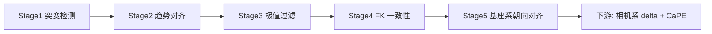
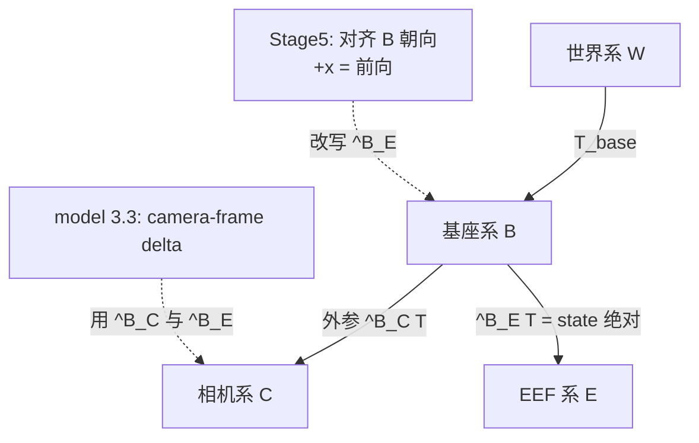
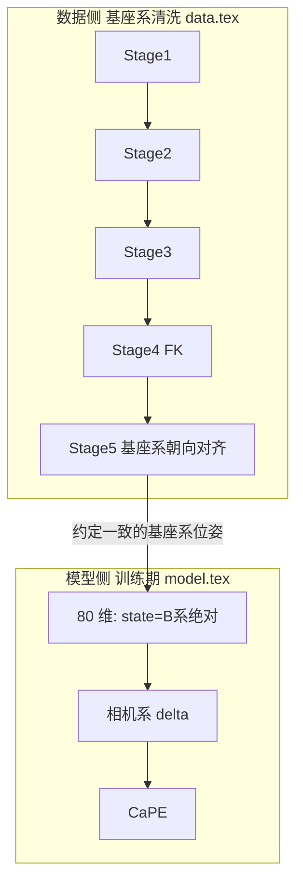
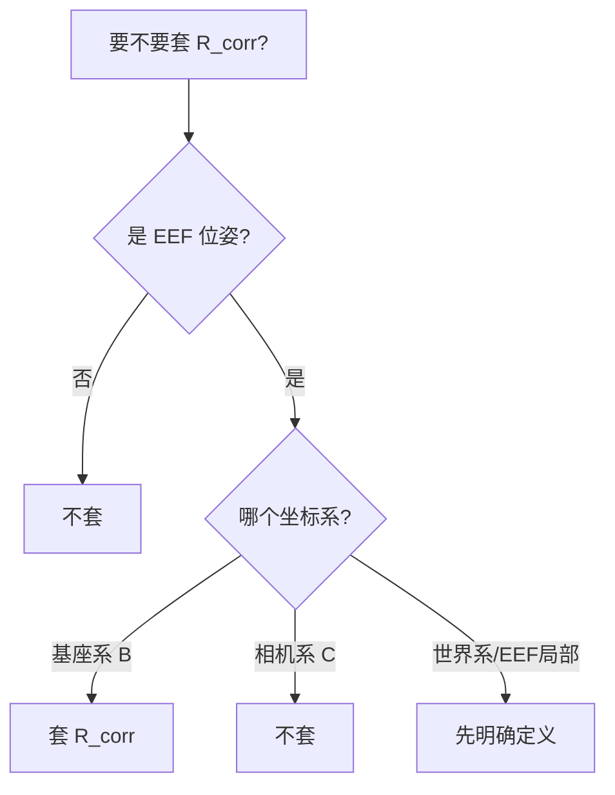
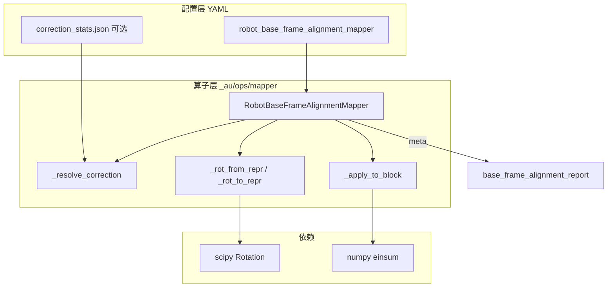
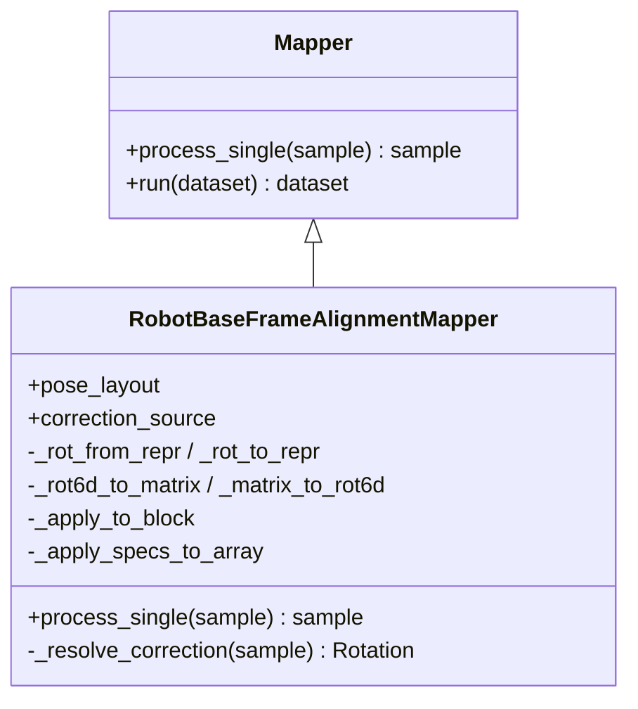
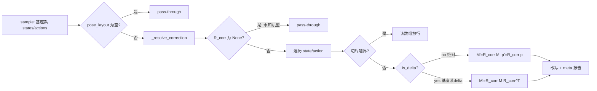
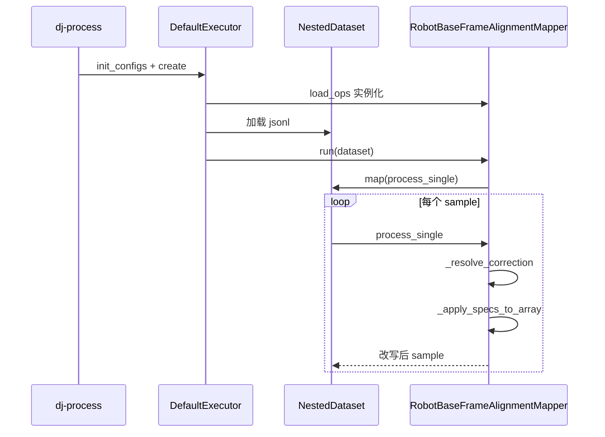
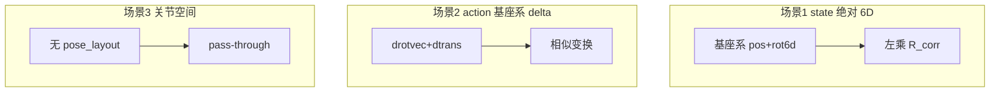

# 用 data-juicer 实现 Qwen-RobotManip Stage 5：基座坐标系与末端执行器朝向对齐（完整方案）

本文是 Stage 5 的**完整可落地方案**，整合自：

| 来源 | 取什么 | 弃什么 |
|------|--------|--------|
| [`data_cur5_2.md`](./data_cur5_2.md) | 坐标系判定、三系辨析、形式化、相机系 delta 不变性、$R_{corr}$ 适用边界、流水线次序 | 以勘误为主的冗长对照（本文只保留一节「与前序文档关系」） |
| [`data_cur5_1.md`](./data_cur5_1.md) | Mapper 选型、静态/动态架构、代码解读、合成数据/单测/验收/recipe、级联编排、执行记录 | 「世界系对齐」叙事、把 action 标成「相机系 delta」却套 $R_{corr}$ 的自相矛盾 |

**唯一权威**：`b/d/QwenRobotmanip/TeX_Source/` 下的 Qwen-RobotManip 论文 TeX。不依赖 `note.md` / `note_data.md` 等二手笔记。遵循「扩展大于修改」，定制代码在 `data_juicer/_au/` 与 `tests_au/`。

对应论文：

> **Stage 5: Base Frame and End-Effector Orientation Alignment.** We apply per-dataset rotation corrections to align world-frame orientation conventions, ensuring the positive $x$-axis consistently corresponds to the robot's forward-facing direction and that the unified state-action representation is geometrically consistent across embodiments.
> — [`data.tex` L229–230](./TeX_Source/chapter/data.tex)

**精确解读**：标题中的 **Base Frame = 机器人基座坐标系 $\{B\}$**。正文 “world-frame” 是固定基座下的宽松措辞；State 的绝对 EEF 在 base frame（[`model.tex` L49/L67](./TeX_Source/chapter/model.tex)），Action 的最终表示是 camera-frame delta（[`model.tex` L66–89](./TeX_Source/chapter/model.tex)），属下游、不在 Stage 5 作用域。

必须合读的四处原文：[`data.tex` L229–233](./TeX_Source/chapter/data.tex)、[`model.tex` L35–57](./TeX_Source/chapter/model.tex)、[`model.tex` L58–120](./TeX_Source/chapter/model.tex)、[`data.tex` L122–200](./TeX_Source/chapter/data.tex)（H2R）。

---

## 目录

1. 结论速览
2. 论文依据：Base Frame 为何是基座系
3. 背景：为什么要对齐基座系朝向
4. base / world / camera 三坐标系辨析
5. Stage 5 正确形式化（绝对 / 基座系 delta / 相机系不变性）
6. 统一表示、EEF 布局与流水线次序
7. data-juicer 选型（Mapper）与 $R_{corr}$ 使用规范
8. 静态架构（组件图 / 类图 / `pose_layout`）
9. 动态架构（数据流 / 序列 / 场景）
10. 关键逻辑代码解读
11. 完整落地物料（算子 / 合成数据 / 单测 / 验收 / recipe）
12. 与 Stage 1–4 的级联协同
13. 落地执行记录与自检清单
14. 扩展性、参数敏感性与未来方向
15. 与 `data_cur5_1` / `data_cur5_2` 的关系

---

## 1. 结论速览

### 1.1 一句话总结

Stage 5 是 **Mapper**：对每个 dataset 用常量旋转 $R_{corr}$，把 **基座系 $\{B\}$** 下的 EEF 位姿轴向约定对齐到「**+x = 机器人前向**」，保证跨机型统一 state-action 表示几何一致。它只作用于**基座系量**（state 绝对位姿、尚未转相机系的基座系 delta）；**禁止**对相机系 delta 施加 $R_{corr}$。

### 1.2 在五阶段中的角色

| 阶段 | 算子类型 | 作用对象 | 动作 | 跨 episode 依赖 |
|------|---------|---------|------|----------------|
| Stage 1：突变检测 | Filter | 单信号平滑性 | 帧级标注 / episode 丢弃 | 无 |
| Stage 2：趋势对齐 | Filter | state↔action 因果 | episode 丢弃 / 标注 | 无 |
| Stage 3：极值过滤 | Filter | 值域合理性 | 帧级排除 | 有（全局分位数） |
| Stage 4：FK 一致性 | Mapper/校正 | TCP/符号/肩→世界/基座假设 | 数据纠偏 | 无 |
| **Stage 5：基座系朝向对齐** | **Mapper** | **基座系 EEF 轴向约定** | **就地旋转校正** | 无（per-dataset $R_{corr}$） |

核心变换（作用域 = **基座系量**）：

$$
\text{绝对（state）：}\quad p' = R_{corr}\,p,\qquad R' = R_{corr}\,R
$$

$$
\text{基座系 delta（action，转相机系前）：}\quad \Delta t' = R_{corr}\,\Delta t,\qquad \Delta R' = R_{corr}\,\Delta R\,R_{corr}^{\top}
$$

### 1.3 实现方案与已交付物料

自定义 Mapper `robot_base_frame_alignment_mapper`：用 `pose_layout` 描述 EEF 切片（位置 + 旋转 + 表示 + 是否 delta），对基座系量做绝对左乘 / delta 相似变换；支持 `euler/quat/rotvec/matrix/rot6d` 与 `param/preset/stats_json`；无 `pose_layout` 或越界时 pass-through。

已验证通过的文件：

- 算子：`data_juicer/_au/ops/mapper/robot_base_frame_alignment_mapper.py`
- 注册：`data_juicer/_au/__init__.py`
- 合成数据：`tests_au/ops/mapper/gen_synthetic_pose_dataset.py`
- 单测 15 例：`tests_au/ops/mapper/test_robot_base_frame_alignment_mapper.py`
- 单算子验收：`tests_au/ops/mapper/accept_robot_base_frame_alignment_mapper.{yaml,sh}`
- 四阶段协同：`tests_au/ops/filter/accept_qwenrobomanip_full.{yaml,sh}`

---

## 2. 论文依据：Base Frame 为何是基座系

### 2.1 三条独立证据

1. **标题权威命名** = `Base Frame ... Alignment`（[`data.tex` L229](./TeX_Source/chapter/data.tex)）。
2. **模型侧区分三系**（[`model.tex` L49/L67](./TeX_Source/chapter/model.tex)）：state = “absolute pose in the robot **base frame**”；“a **world-frame** delta” 被**否决**；最终 action = “**camera-frame** delta pose”。
3. **「+x = 前向」是基座相对**：世界系无内禀「机器人前方」；且 [`model.tex` L48](./TeX_Source/chapter/model.tex) 含移动基座速度 ⇒ 移动基座下 $\{W\}\neq\{B\}$，只能是基座相对。

正文 “align world-frame orientation conventions”（[`data.tex` L230](./TeX_Source/chapter/data.tex)）属**宽松用词**：固定基座下 $\{W\}\approx\{B\}$，作者交替使用。精确表述以标题与 `model.tex` 为准。

### 2.2 论文用词 → 精确指向

| 出处 | 原文用词 | 精确指向 |
|------|----------|----------|
| [`data.tex` L229](./TeX_Source/chapter/data.tex) 标题 | Base Frame | $\{B\}$（权威） |
| [`data.tex` L230/L232](./TeX_Source/chapter/data.tex) | world-frame（宽松） | $\{B\}$（固定基座下近似） |
| [`model.tex` L49/L67](./TeX_Source/chapter/model.tex) | absolute / base frame | state ∈ $\{B\}$ |
| [`model.tex` L67](./TeX_Source/chapter/model.tex) | world-frame delta（否决） | $\{W\}$ |
| [`model.tex` L66–89](./TeX_Source/chapter/model.tex) | camera-frame delta（采纳） | action ∈ $\{C\}$（下游） |
| [`data.tex` L171](./TeX_Source/chapter/data.tex) H2R | $\mathbf{T}_\text{base}^{-1}\mathbf{T}^\text{ee}$ | EEF 为基座相对 |

### 2.3 H2R 为何相关

[`data.tex` L122–200](./TeX_Source/chapter/data.tex)：夹爪系 $\mathbf{R}=[\mathbf{x}\ \mathbf{y}\ \mathbf{z}]$（x=approach）；基座优化 $\mathrm{IK}(\mathbf{T}_\text{base}^{-1}\mathbf{T}^\text{ee})$；15 形态各自基座。说明 **EEF 落在基座系**，且各数据源轴向约定不同——正是 Stage 5 per-dataset $R_{corr}$ 要抹平的对象。

---

## 3. 背景：为什么要对齐基座系朝向

### 3.1 问题的物理来源

EEF 位姿 $(p,R)$ 描述「手在空间中的位置和朝向」，但参照系是**各机器人自己的基座系 $\{B\}$**。不同数据集对「机器人前向」的轴向定义不同：

- A 集：基座系 +x = 前向 → 前伸 $\Delta p\approx(+d,0,0)$；
- B 集：基座系 +y = 前向 → 前伸 $\Delta p\approx(0,+d,0)$；
- C 集：基座系绕 z 转了 180° → 前伸 $\Delta p\approx(-d,0,0)$。

（差异来自各数据集 URDF/标定/记录约定，**不是**「把不同房间的世界系对齐」。相机摆放影响的是相机系，属模型侧另一套机制。）

### 3.2 对 VLA 训练为何致命

Qwen-RobotManip 把所有机器人编进同一 80 维向量（[`model.tex` L35–57](./TeX_Source/chapter/model.tex)）。统一表示要求「同一语义 = 同一段数值分布」。若「前伸」分别落到 $+x/+y/-x$，模型看到的是**冲突监督**而非多样性。Stage 5 用 per-dataset $R_{corr}$ 把所有来源统一到「+x = 前向」。

### 3.3 在五阶段中的位置



Stage 1–3 管「信号质量」（该不该留），Stage 4–5 管「坐标约定」（数值是否可信、是否对齐）。Stage 5 必须是 **Mapper**。

---

## 4. base / world / camera 三坐标系辨析

### 4.1 定义与归属

| 坐标系 | 记号 | 附着于 | 论文用途 |
|--------|------|--------|----------|
| 基座系 | $\{B\}$ | 机器人底座 | **state** 绝对 EEF；无标定时 action 降级参考 |
| 世界系 | $\{W\}$ | 环境/场景 | Stage 4 肩→世界；被否决的 world-frame delta；CaPE 消去原点 |
| 相机系 | $\{C\}$ | 参考相机 | **action** 的 camera-frame delta（训练期） |

### 4.2 坐标系树与 Stage 5 作用点



### 4.3 固定基座 vs 移动基座

- **固定基座**：$\{W\}$ 与 $\{B\}$ 常重合或差常量刚体变换 → 正文可宽松写 world-frame。
- **移动基座**：${}^W_B\mathbf{T}$ 随时间变；state 仍写在 base frame → 「+x=前向」只能是基座相对。

**决定性判据**：「前方」是基座属性，世界系无内禀前向 → Stage 5 钉死在 $\{B\}$。

### 4.4 哪些量受 $R_{corr}$ 影响

| 量 | 坐标系 | 是否套 $R_{corr}$ |
|----|--------|-------------------|
| state EEF 绝对位姿 | $\{B\}$ | ✅ 需 |
| action 基座系 delta（转相机系前） | $\{B\}$ | ✅ 需 |
| action camera-frame delta | $\{C\}$ | ❌ 禁止（不变） |
| 关节 / 夹爪 / 预留维 | — | ❌ pass-through |

---

## 5. Stage 5 正确形式化

### 5.1 定义

对第 $k$ 个 dataset，常量 $R_{corr}^{(k)}\in SO(3)$ 把记录时的基座系约定 $\{B\}$ 旋到规范约定 $\{B'\}$（+x = 前向）：

$$
x_{B'} = R_{corr}\, x_{B}.
$$

### 5.2 绝对位姿（state）

$$
p' = R_{corr}\,p,\qquad R' = R_{corr}\,R.
$$

### 5.3 基座系 delta（action，转相机系前）

$$
\Delta t' = R_{corr}\,\Delta t,\qquad
\Delta R' = R_{corr}\,\Delta R\,R_{corr}^{\top}.
$$

推导：$\Delta R = R_{t+1}R_t^{\top}$，换系后

$$
\Delta R' = (R_{corr}R_{t+1})(R_{corr}R_t)^{\top} = R_{corr}\,\Delta R\,R_{corr}^{\top}.
$$

几何：转角 $\theta$ 不变，转轴 $\hat n\mapsto R_{corr}\hat n$。

### 5.4 相机系 delta 对 $R_{corr}$ 不变（禁止施加）

论文旋转块（[`model.tex` Eq. L75–81](./TeX_Source/chapter/model.tex)）：

$$
{}^c_e\mathbf{R}\ {}^e_{e^*}\mathbf{R}\ {}^e_c\mathbf{R}.
$$

基座约定旋转使 ${}^B_c R\mapsto R_{corr}{}^B_c R$ 等，相对朝向中 $R_{corr}^{\top}R_{corr}=I$ **成对抵消**，故整个 camera-frame delta **不变**（对应 [`model.tex` L95](./TeX_Source/chapter/model.tex) “world-frame origin cancels”）。

$$
\boxed{\text{camera-frame delta 对 } R_{corr} \text{ 完全不变；套了会损坏}}
$$

对偶：**约定相关量（基座系）才套 $R_{corr}$；约定不变量（相机系 delta）不套。**

### 5.5 算例

**+y→+x**：$R_{corr}=R_z(-90^\circ)$，前伸 $(0,+d,0)\to(+d,0,0)$。旋转的是**基座系轴向约定**，不是房间。

**H2R**：自带 x=approach 约定 + 基座相对 EEF；与遥操/仿真约定不同 → per-dataset $R_{corr}$ 抹平跨源异质性。

---

## 6. 统一表示、EEF 布局与流水线次序

### 6.1 80 维中的 EEF（[`model.tex` L35–57](./TeX_Source/chapter/model.tex)）

```
每臂 29 维 = 关节(7) + EEF(9) + 夹爪(1) + 手(12)
EEF(9) = 位置(3) + 6D 连续旋转(6)   # state
action EEF 旋转用 3D rotvec（delta）
```

| 内容 | State | Action（清洗期 / Stage 5） | Action（训练期 / model §3.3） |
|------|-------|---------------------------|------------------------------|
| EEF 位置 | $\{B\}$ 绝对 (3) | $\{B\}$ delta（若尚未转相机系） | $\{C\}$ camera-frame delta |
| EEF 方向 | 6D 连续旋转 (6) | 3D rotvec（基座系 delta） | 3D rotvec（相机系 delta） |

**Stage 5 只处理左两列中的基座系量**；右列由下游构造，**不进** `pose_layout`。

### 6.2 为何用 6D（横向）

| 表示 | 维 | 对回归 | 本算子 |
|------|----|--------|--------|
| euler | 3 | 差（万向锁） | ✅ |
| quat | 4 | 中 | ✅ |
| rotvec | 3 | 中（delta 常用） | ✅ |
| matrix | 9 | 中 | ✅ |
| **6D** | **6** | **好** | ✅ |

6D = 旋转矩阵前两列，Gram-Schmidt 补第三列。

### 6.3 全局流水线：数据侧（基座系）→ 模型侧（相机系）



| 维度 | 数据侧 Stage 4/5 | 模型侧相机系 delta + CaPE |
|------|------------------|---------------------------|
| 坐标系 | $\{B\}$ | $\{C\}$ |
| 「统一」 | 基座系轴向约定 | 视觉锚点（世界原点消去） |
| 阶段 | 训练前清洗 | 训练/推理期 |
| 相机内外参 | 不需要 | 需要（无则降级 base-relative） |
| $R_{corr}$ | ✅ | ❌ |

### 6.4 H2R 衔接


---

## 7. data-juicer 选型与 $R_{corr}$ 使用规范

### 7.1 为何是 Mapper

| 类型 | 行为 | Stage 5 |
|------|------|---------|
| **Mapper** | 逐样本转换 | ✅ 改写位姿 |
| Filter | 保留/丢弃 | ❌ |
| 其它 | 去重/选择/… | ❌ |

只实现 `process_single`；无 `pose_layout` 时原样返回。

### 7.2 三种校正来源

| `correction_source` | 场景 | 优点 | 局限 |
|---------------------|------|------|------|
| `param` | 单集直接给值 | 简单 | 不便复用 |
| `preset` | z_90 / z_180… | 语义清晰 | 只覆盖规整角 |
| `stats_json` | 多 embodiment | 可版本化 | 需配置表 |

### 7.3 `pose_layout` 使用规范（关键）

**只允许指向基座系量**：

1. `target: state`, `is_delta: false` → $\{B\}$ 绝对 EEF ✅
2. `target: action`, `is_delta: true` → **仅当**仍是基座系 delta ✅
3. action 已是 camera-frame delta → **禁止配 spec** ❌

### 7.4 $R_{corr}$ 决策图



### 7.5 推荐 recipe 注释（语义正名）

```yaml
process:
  - robot_base_frame_alignment_mapper:
      signal_source: 'top_level'
      correction_source: 'preset'
      preset_name: 'z_-90'   # 基座系 +y前向 → +x前向
      pose_layout:
        - target: 'state'    # 基座系绝对 [pos(3), rot6d(6)]
          pos: [0, 3]
          rot: [3, 9]
          rot_type: 'rot6d'
          is_delta: false
        - target: 'action'   # 基座系 delta；若已是相机系 delta 则删除本块
          rot: [0, 3]
          pos: [3, 6]
          rot_type: 'rotvec'
          is_delta: true
```

关节空间数据（Galaxea）：**不配 `pose_layout`** → 纯 pass-through。

---

## 8. 静态架构

### 8.1 组件图



### 8.2 类图



### 8.3 `pose_layout` 字段

```yaml
- target: 'state'      # state | action
  pos: [0, 3]          # 可选，长度必须 3
  rot: [3, 9]          # 长度必须匹配 rot_type
  rot_type: 'rot6d'    # euler|quat|rotvec|matrix|rot6d
  is_delta: false      # true → 相似变换（仅基座系 delta）
```

`_normalize_spec` 构造期静态校验；`_spec_in_bounds` 运行期越界 → pass-through。

---

## 9. 动态架构

### 9.1 单样本数据流



### 9.2 序列图



### 9.3 三场景



场景 1/2 由合成数据验收；场景 3 由 Galaxea 四阶段协同验收。

---

## 10. 关键逻辑代码解读

### 10.1 `_resolve_correction`

三来源统一为 `scipy.Rotation` 并缓存；`stats_json` 未知 embodiment → `None` → pass-through（不猜、直接放行）。

### 10.2 `_rot6d_to_matrix`（Gram-Schmidt）

```python
@staticmethod
def _rot6d_to_matrix(r6):  # (T,6) = [col0, col1]
    a1, a2 = r6[:, 0:3], r6[:, 3:6]
    b1 = a1 / (np.linalg.norm(a1, axis=1, keepdims=True) + 1e-12)
    b2 = a2 - np.sum(b1 * a2, axis=1, keepdims=True) * b1
    b2 = b2 / (np.linalg.norm(b2, axis=1, keepdims=True) + 1e-12)
    b3 = np.cross(b1, b2)
    return np.stack([b1, b2, b3], axis=-1)  # (T,3,3) ∈ SO(3)
```

### 10.3 `_apply_to_block`：绝对 vs 基座系 delta

```python
def _apply_to_block(self, mat2d, spec, Rcorr):
    out = mat2d.copy()
    Rc = np.asarray(Rcorr.as_matrix())
    if spec["pos"] is not None:
        i, j = spec["pos"]
        out[:, i:j] = out[:, i:j] @ Rc.T          # p' = R_corr p
    if spec["rot"] is not None:
        i, j = spec["rot"]
        M = self._rot_from_repr(out[:, i:j], spec["rot_type"])
        if spec["is_delta"]:
            tmp = np.einsum("ab,tbc->tac", Rc, M)  # R_corr ΔR
            Mn = np.einsum("tac,dc->tad", tmp, Rc) # ·R_corr^T
        else:
            Mn = np.einsum("ab,tbc->tac", Rc, M)   # R_corr R
        out[:, i:j] = self._rot_to_repr(Mn, spec["rot_type"])
    return out
```

**前提**：`is_delta=true` 的块必须是**基座系** delta。若误配相机系 delta，此相似变换会破坏不变性（§5.4）。

### 10.4 pass-through

无 `pose_layout` / 非 `(T,D)` / 切片越界 → 原样返回；无 layout 时甚至不写 meta 报告，对上游 stats/mask 零干扰。

完整源码见仓库 `data_juicer/_au/ops/mapper/robot_base_frame_alignment_mapper.py`（也可对照 [`data_cur5_1.md` §9.1](./data_cur5_1.md)，逻辑一致；文档字符串中的「世界系」应按本文正名为「基座系」）。

---

## 11. 完整落地物料

### 11.1 注册

```python
# data_juicer/_au/__init__.py
from .ops.mapper import robot_base_frame_alignment_mapper  # noqa: F401
```

### 11.2 合成位姿数据

真实 Galaxea 是关节空间，无法测 Stage 5。生成器合成「基座系前向记成 +y」的轨迹，验收用 $R_z(-90^\circ)$ 对齐到 +x：

```python
# 沿「记录基座系前向」推进，再差分得到基座系 delta action
pos[:, fa] = 0.6 * t + ...
state = concat([pos, rot6d(R_abs)])           # 基座系绝对
action = concat([drotvec, dtrans])            # 基座系 delta（非相机系）
```

### 11.3 单测要点（15 例）

| # | 用例 | 断言 |
|---|------|------|
| 1–4 | euler/quat/rot6d/matrix 绝对 | 基座系位姿按 $R_{corr}$ 旋转 |
| 5 | delta rotvec 相似变换 | 转轴随 $R_{corr}$ 转；$\Delta t$ 正确 |
| 6 | round-trip | 正变换再逆变换复原 |
| 7–8 | stats_json / 未知机型 | 按表变换 / 放行 |
| 9–10 | 无 layout / 越界 | pass-through |
| 11–15 | 双块同改 / quat 序 / pipeline / 参数校验 / Galaxea | 级联安全 |

### 11.4 单算子验收 recipe

见 §7.5；`preset_name: z_-90` 把基座系 +y 前向翻到 +x。验收断言：净位移由 +y 主导翻转为 +x 主导；rot6d 仍正交归一；meta `changed=True, num_blocks=2`。

### 11.5 四阶段协同 recipe（Galaxea 关节空间）

```yaml
process:
  - robot_sudden_change_filter: { ..., exclusion_strategy: 'frame_mask' }
  - robot_state_action_alignment_filter: { ..., exclusion_strategy: 'flag_only' }
  - robot_extreme_value_filter: { ..., percentile_source: 'stats_json', ... }
  - robot_base_frame_alignment_mapper:
      signal_source: 'top_level'
      correction_source: 'preset'
      preset_name: 'identity'
      # 不配 pose_layout → 关节数据纯 pass-through
```

---

## 12. 与 Stage 1–4 的级联协同


**三不变量**：

1. 不删数据（Mapper，N→N）；
2. 不破坏上游 stats/meta/`valid_frame_mask`（关节数据 pass-through）；
3. 坐标系不越权（只碰基座系位姿；关节/夹爪/预留/相机系 delta 一律不碰）。

Stage 4 产出可信基座系 EEF；Stage 5 让其跨集可比（+x=前向）。

---

## 13. 落地执行记录与自检清单

### 13.1 执行记录（来自既有验收）

```text
tests_au/.../test_robot_base_frame_alignment_mapper.py  15 passed
tests_au/ 全量回归 50 passed
accept_robot_base_frame_alignment_mapper.sh  ACCEPTANCE PASSED
  # 净位移 (0,0.6,·) → (0.6,0,·)  —— 解读为基座系约定对齐
accept_qwenrobomanip_full.sh  ACCEPTANCE PASSED
  # Galaxea 上 Stage5 纯 pass-through，上游产物零破坏
```

### 13.2 自检清单

- [x] Base Frame = **基座系**（非世界系）；论文标题 + `model.tex` L49/L67 + 移动基座证据齐全
- [x] state = $\{B\}$ 绝对；action 二分：基座系 delta（Stage5）vs 相机系 delta（下游禁套）
- [x] 相机系 delta 对 $R_{corr}$ 不变性证明；`pose_layout` 禁配相机系 delta
- [x] 流水线：Stage4 → Stage5（基座系）→ 相机系 delta + CaPE
- [x] Mapper + 五表示 + Gram-Schmidt + 三来源 + pass-through
- [x] 单测 15 + 回归 50 + 双验收全绿；扩展大于修改

---

## 14. 扩展性、参数敏感性与未来方向

| 参数 | 影响 | 建议 |
|------|------|------|
| `preset_name` / `correction_value` | 决定 $R_{corr}$ | 由标定/可视化确定，宁缺毋错 |
| `is_delta` | 错设则相似变换↔左乘颠倒 | 严格对照 state 绝对 / 基座系 delta |
| `pose_layout` 是否指向相机系 delta | 会损坏不变性 | **严禁**；见 §7.3 |
| `rot_type` + 切片 | 构造期 ValueError | 依赖早失败 |
| `quat_order` | xyzw/wxyz 混淆 | 明确数据约定 |

扩展点：新旋转表示分支；`embodiment_field` 换细粒度键；`hand_action_tags` 双臂；Stage4 FK 产出含 EEF 后配上指向 `[7,16)` 的 layout。

---

## 15. 与 `data_cur5_1` / `data_cur5_2` 的关系

| 主题 | `data_cur5_1` | `data_cur5_2` | **本文 `data_cur5_3`** |
|------|---------------|---------------|------------------------|
| 对齐坐标系 | 误写世界系 | 纠正为基座系 | **基座系**（完整方案主线） |
| 三系 / 不变性 / $R_{corr}$ 边界 | 缺失或自相矛盾 | 完整 | **采纳** |
| 流水线次序 | 与相机系揉在一起 | 拆清 | **采纳** |
| Mapper 架构 / 代码 / 测试 / 验收 | 完整且正确 | 仅规范、不改码 | **采纳工程**（术语正名） |
| 勘误对照篇幅 | — | 长 | 压缩为本节表 |

**定位**：`data_cur5_3` = 概念正确（5_2）+ 工程完整（5_1）的**单一权威落地文档**。后续实现与验收以本文为准；5_1 / 5_2 保留为历史与勘误索引。

---

## 附：一页纸速记

| 问题 | 答案 |
|------|------|
| Stage 5 对齐什么？ | **基座系**轴向约定（+x=前向） |
| 为何不是世界系？ | 标题=Base Frame；state 在 base frame；+x 前向是基座相对 |
| state / action（Stage5）？ | $\{B\}$ 绝对 / $\{B\}$ delta（转相机系前） |
| 相机系 delta？ | 训练期下游；**不套** $R_{corr}$ |
| 算子？ | `robot_base_frame_alignment_mapper`（已交付，复用） |
| `pose_layout`？ | **只**指向基座系量 |

## 附：交付文件清单

| 文件 | 作用 |
|------|------|
| `data_juicer/_au/ops/mapper/robot_base_frame_alignment_mapper.py` | Stage 5 Mapper |
| `data_juicer/_au/__init__.py` | 注册 import |
| `tests_au/ops/mapper/gen_synthetic_pose_dataset.py` | 合成基座系位姿数据 |
| `tests_au/ops/mapper/test_robot_base_frame_alignment_mapper.py` | 单测 15 例 |
| `tests_au/ops/mapper/accept_robot_base_frame_alignment_mapper.{yaml,sh}` | 单算子验收 |
| `tests_au/ops/filter/accept_qwenrobomanip_full.{yaml,sh}` | Stage1–3+5 协同验收 |
