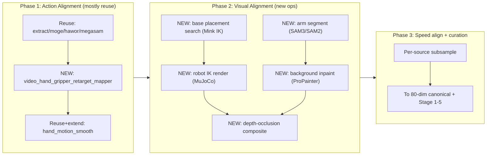
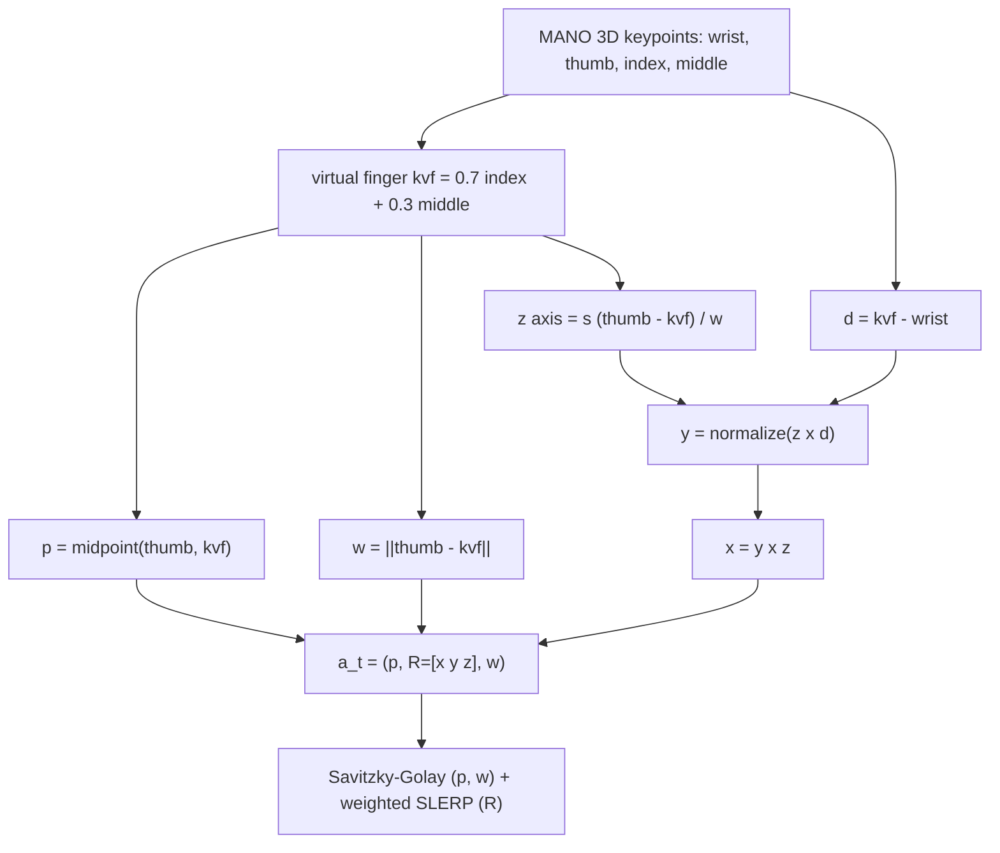
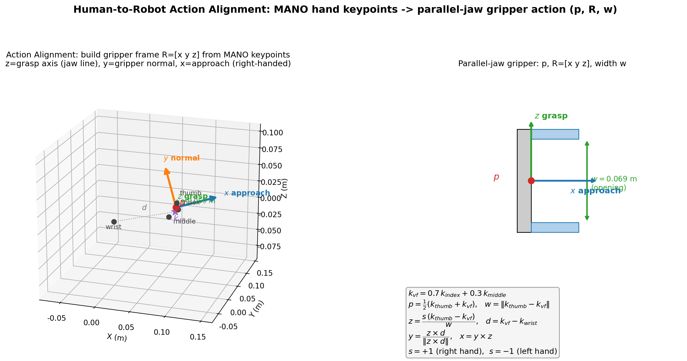
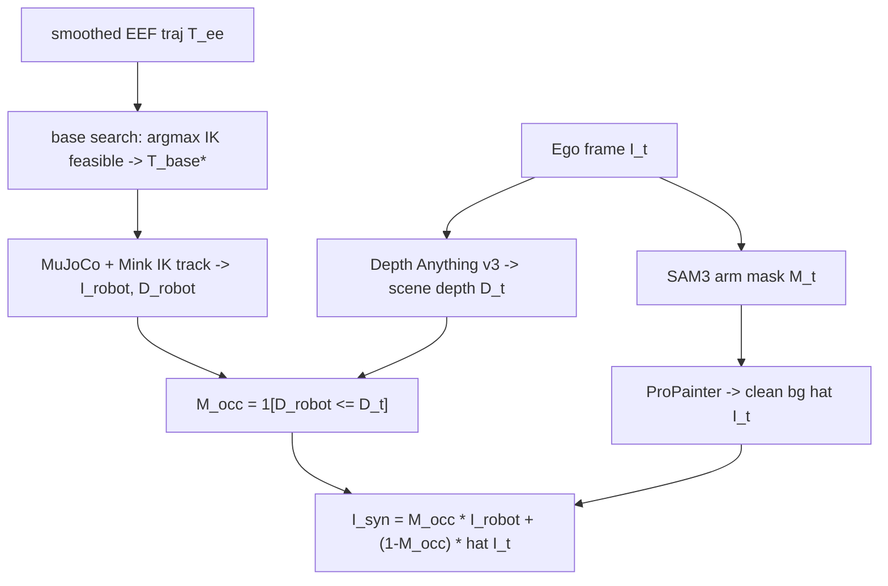
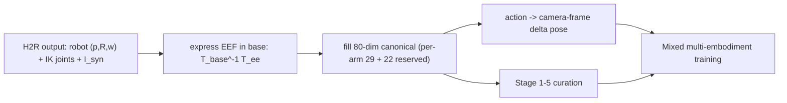
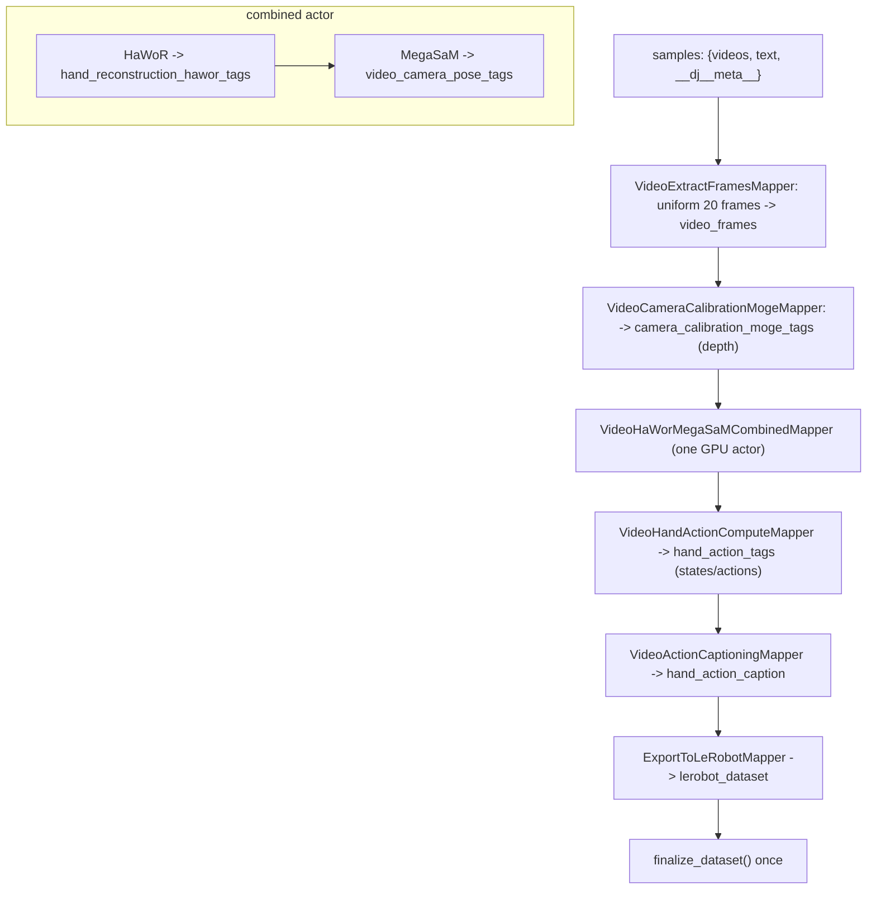
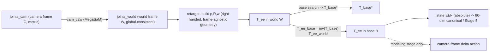
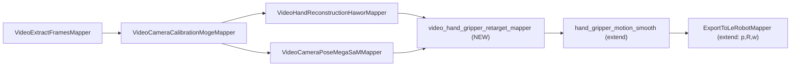
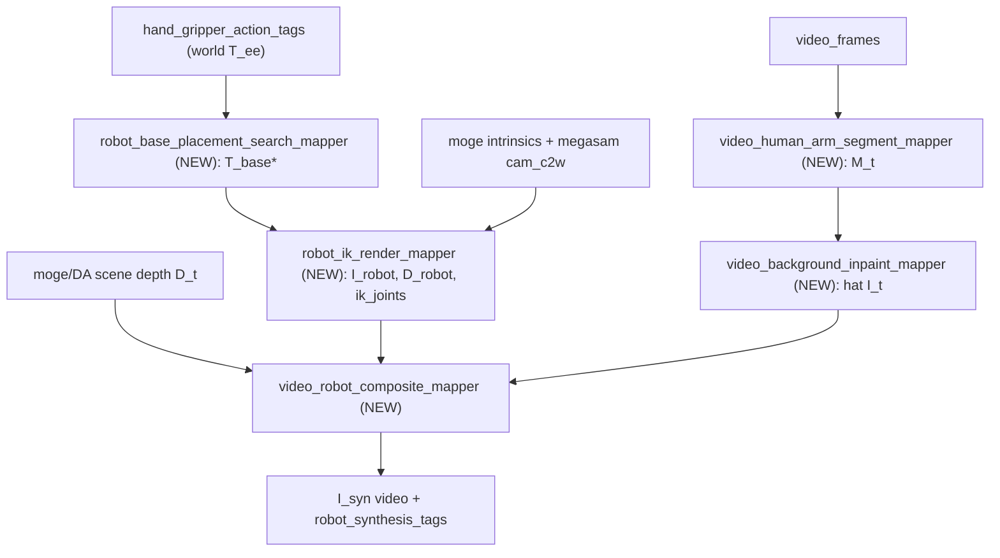
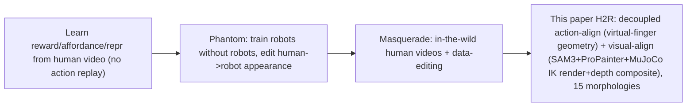

# Human-to-Robot 数据合成：论文精读、代码盘点与落地设计（data_h2r_1.md）

本文回答一个问题：**如何把"第一人称人手视频"合成为"夹爪机器人演示数据"（Human-to-Robot, 简称 H2R），并最大化复用 `data-juicer` 已有代码来完成"把人手改成夹爪"的工作。**

- **唯一权威**：`b/d/QwenRobotmanip/TeX_Source/` 下的 Qwen-RobotManip 论文 TeX，与 `data-juicer` 本地实际代码。**不依赖** `note.md` 及任何二手笔记；本文所有结论均对论文原文逐段、对代码逐行独立核验。
- **纠偏声明**：历史文档/对话中"demo 就是论文实现""demo 输出即 base 系""data-juicer 已能端到端 H2R"等说法均**不准确**，本文在 §1、§3 给出逐条反证。
- **工程规范**：遵循「扩展大于修改」；新增算子落 `data_juicer/_au/ops/mapper/`，测试与验收落 `tests_au/`，YAML 用企业化包引入（`custom_operator_paths: ['data_juicer/_au']`）。本文只产出"分析 + 设计方案"，其中"新增算子"均为**设计蓝图**，不在本文落地为实现代码。

必须合读的论文原文：
[`data.tex` L122–190（H2R）](./TeX_Source/chapter/data.tex)、
[`model.tex` L35–57（80 维 canonical）](./TeX_Source/chapter/model.tex)、
[`model.tex` L58–67（camera-frame delta）](./TeX_Source/chapter/model.tex)、
[`data.tex` L201–232（五阶段曲线化）](./TeX_Source/chapter/data.tex)。

---

## 目录

1. 结论速览（TL;DR）与三条纠偏
2. 论文 H2R 精读（以 TeX 为准）
3. `data-juicer` 现有能力盘点（以本地代码为准）
4. 差异与纠偏（现有实现 vs 论文；坐标系/夹爪/双臂/视觉半程）
5. 设计方案（最大化复用 + `_au` 扩展）
6. 验证与验收（`tests_au/`）
7. 纵向 / 横向 / 消融讨论
8. 风险、开放问题与里程碑
9. 参考文献

---

## 1. 结论速览（TL;DR）与三条纠偏

### 1.1 一句话

H2R 把"第一人称人手视频"变为"夹爪机器人演示"，论文将其**显式拆成三段**（[`data.tex` L136–190](./TeX_Source/chapter/data.tex)）：

1. **Action Alignment（形态 gap）**：用 MANO 3D 手部关键点，几何构造夹爪动作 $\mathbf{a}_t=(\mathbf{p}_t,\mathbf{R}_t,w_t)$（位置、朝向、开口宽度），再做 Savitzky–Golay + SLERP 平滑；
2. **Visual Alignment（视觉 gap）**：SAM3 分割人臂 → ProPainter 补全背景 → 基座位姿搜索（最大化 IK 可行率）→ MuJoCo/Mink IK 跟踪并渲染机器人 RGB+深度 → Depth Anything v3 估计场景深度 → 按深度遮挡合成；
3. **Action Speed Alignment（速度 gap）**：训练期按数据源降采样，使人手动作速度分布贴近机器人遥操作。

### 1.2 三条必须纠正的历史误解（逐条给证据）

> **误解 A**：demo 里的 `video_hand_action_compute_mapper` 就是论文的 Action Alignment。

**错。** 该算子（[`video_hand_action_compute_mapper.py`](../../../data_juicer/ops/mapper/video_hand_action_compute_mapper.py)）：① 用 MANO `global_orient`（腕部整体旋转）直接当末端朝向；② 用"15 个手指关节平均弯曲角"映射到 $[-1,1]$ 的开合标量估计夹爪；③ 位置取 MANO `transl`。而论文（[`data.tex` L143–159](./TeX_Source/chapter/data.tex)）用**虚拟手指**构造 EEF 位置=拇指尖与虚拟手指的中点、夹爪宽度=二者欧氏距离（**米制**）、朝向=由抓取轴/法向/接近轴构成的**正交系**。三者在位置、朝向、夹爪语义上**全部不同**。

> **误解 B**：demo 输出的 state/action 就在机器人基座系（base frame）。

**错。** demo 把手部位姿用 MegaSaM 的 `cam_c2w` 从相机系变换到 **SLAM 世界系**（`pos_world = R_c2w @ transl + t_c2w`，见 [`video_hand_action_compute_mapper.py` L172–178](../../../data_juicer/ops/mapper/video_hand_action_compute_mapper.py)）。论文的 base frame 是**优化搜索**出来的 $\mathbf{T}_\text{base}^*$（[`data.tex` L169–173](./TeX_Source/chapter/data.tex)），二者不是一回事。人手轨迹本身"无本体、无基座"（embodiment-free），基座是 H2R 过程"造"出来的。

> **误解 C**：`data-juicer` 已能端到端做 H2R。

**错。** 现有代码只覆盖"抽帧 → MoGe 标定 → HaWoR 手部 → MegaSaM 位姿 → 动作计算 → LeRobot 导出"这条**动作标注链**。论文视觉对齐的**全部环节**——SAM3 文本掩码、ProPainter 补全、基座搜索、MuJoCo/Mink IK 机器人渲染、遮挡合成——在本地**没有任何对应算子**（§4.5 给出全库检索证据）。

### 1.3 关键支点（好消息，也决定了"怎么复用"）

尽管缺口不小，但**动作对齐半程几乎可完全复用现有产物**：

- HaWoR 已输出 `joints_cam`（每帧 21 个 MANO 关节，**相机系、米制**，OpenPose 关节布局；见 [`video_hand_reconstruction_hawor_mapper.py` L315–357/L498–519](../../../data_juicer/ops/mapper/video_hand_reconstruction_hawor_mapper.py)）。OpenPose 布局下**腕=0、拇指尖=4、食指尖=8、中指尖=12**（由 [`ops/common/mano_func.py` L18/L32](../../../data_juicer/ops/common/mano_func.py) 的 `mano_to_openpose` 映射确定），恰好是论文重定向公式需要的全部关键点。
- MoGe-2 已输出**度量级点云/深度**与相机内参（`points`/`depth` 为 metric scale，见 [`video_camera_calibration_moge_mapper.py` L55–59/L207–210](../../../data_juicer/ops/mapper/video_camera_calibration_moge_mapper.py)）——即遮挡合成所需的"场景深度"本地已有来源。
- MegaSaM 已输出 `cam_c2w`（SE3 相机到世界 4×4，见 [`video_camera_pose_megasam_mapper.py` L356/L389–395](../../../data_juicer/ops/mapper/video_camera_pose_megasam_mapper.py)），可把逐帧手部关键点拼成**全局一致**的三维轨迹（基座搜索必需）。
- `video_hand_motion_smooth_mapper` 已实现 Savitzky–Golay + 四元数平滑 + 离群替换（[`video_hand_motion_smooth_mapper.py`](../../../data_juicer/ops/mapper/video_hand_motion_smooth_mapper.py)），与论文平滑步骤高度对应。
- `export_to_lerobot_mapper` 已能写 LeRobot v2.0（含 `modality.json`/`finalize`）。

一句话：**论文式 Action Alignment 只需在现有 `joints_cam` 上补一个"忠实重定向"算子即可；Visual Alignment 才是需要新造算子的重头。**

### 1.4 推荐落地路径（三阶段，详见 §5）



---

## 2. 论文 H2R 精读（以 TeX 为准）

本节逐段解读 [`data.tex` L122–190](./TeX_Source/chapter/data.tex)，公式与符号完全对齐原文。

### 2.1 动机：两个 gap

> "A significant gap exists between egocentric human data and robot data in both morphology and visual domains." —[`data.tex` L136](./TeX_Source/chapter/data.tex)

人手数据与机器人数据存在两类鸿沟：

- **形态 gap（morphology）**：人手是多指、连续变形的抓取器；目标机器人是**平行夹爪**（parallel-jaw gripper）。二者自由度、几何、抓取语义都不同。
- **视觉 gap（visual domain）**：视频里出现的是"人手 + 人臂"，而策略要在"机器人手臂"图像上工作。

论文受 Phantom [lepert2025phantom] 与 Masquerade [lepert2025masquerade] 启发，把管线**显式解耦**为 Action Alignment 与 Visual Alignment（[`data.tex` L137–138](./TeX_Source/chapter/data.tex)）。解耦的意义：动作侧只关心"人手轨迹→夹爪动作"的几何映射；视觉侧只关心"像素上把人替换成机器人"，两者可独立迭代与并行。

### 2.2 Action Alignment（形态 gap）

**目标量**：帧 $t$ 的机器人动作定义为

$$
\mathbf{a}_t=(\mathbf{p}_t,\ \mathbf{R}_t,\ w_t),\quad \mathbf{p}_t\in\mathbb{R}^3,\ \mathbf{R}_t\in SO(3),\ w_t\in\mathbb{R}_{\ge 0}
$$

即末端位置、夹爪朝向、夹爪开口宽度（[`data.tex` L142](./TeX_Source/chapter/data.tex)）。

**（1）位置与宽度**（[`eq:eef`, L145–150](./TeX_Source/chapter/data.tex)）。用 MANO 3D 关键点 $\mathbf{k}_i$ 定义**虚拟手指** $\mathbf{k}_\text{vf}$（食指尖与中指尖的加权），EEF 位置取"拇指尖与虚拟手指的中点"，夹爪宽度取二者欧氏距离：

$$
\mathbf{k}_\text{vf}=0.7\,\mathbf{k}_\text{index}+0.3\,\mathbf{k}_\text{middle},\qquad
\mathbf{p}=\tfrac12\bigl(\mathbf{k}_\text{thumb}+\mathbf{k}_\text{vf}\bigr),\qquad
w=\lVert \mathbf{k}_\text{thumb}-\mathbf{k}_\text{vf}\rVert_2
$$

直觉：平行夹爪的两个"指"就是"拇指"与"食/中指的等效指"；两指中点即夹爪中心，两指距离即开口。$w$ 是**米制**长度（因为 MANO 关键点在米制空间）。

**（2）朝向（构造正交系）**（[`data.tex` L152–159](./TeX_Source/chapter/data.tex)）。夹爪朝向 $\mathbf{R}=[\mathbf{x}\ \mathbf{y}\ \mathbf{z}]$ 由三步叉乘构造：先定**抓取轴 $\mathbf{z}$**（沿"两指连线/jaw-line"），再用"腕→指"方向 $\mathbf{d}=\mathbf{k}_\text{vf}-\mathbf{k}_\text{wrist}$ 与 $\mathbf{z}$ 张成 jaw 平面，法向为**夹爪法轴 $\mathbf{y}$**，最后 $\mathbf{x}$ 补齐右手系：

$$
\mathbf{z}=\frac{s\,(\mathbf{k}_\text{thumb}-\mathbf{k}_\text{vf})}{w},\qquad
\mathbf{y}=\frac{\mathbf{z}\times\mathbf{d}}{\lVert \mathbf{z}\times\mathbf{d}\rVert},\qquad
\mathbf{x}=\mathbf{y}\times\mathbf{z}
$$

其中手性符号 $s=+1$（右手）/ $s=-1$（左手），用于翻转 $\mathbf{z}$ 的指向，**使左右手映射到同一夹爪系**。三轴语义：$\mathbf{x}$=接近方向（approach）、$\mathbf{y}$=夹爪法向（垂直 jaw 平面）、$\mathbf{z}$=抓取轴（沿 jaw-line）。

**（3）平滑**（[`data.tex` L161–162](./TeX_Source/chapter/data.tex)）。逐帧手部检测有高频噪声：对**位置与宽度**用 Savitzky–Golay [savitzky1964smoothing] 滤波，对**朝向**用高斯加权 SLERP，既平滑又保留运动结构。



下图直观展示了该几何构造（左：由 MANO 关键点构造夹爪正交系 $\mathbf{R}=[\mathbf{x}\ \mathbf{y}\ \mathbf{z}]$ 与位置 $\mathbf{p}$、宽度 $w$；右：对应的平行夹爪示意与公式）。图由 [`asset/h2r_gripper_frame_example.py`](./asset/h2r_gripper_frame_example.py) 生成（脚本内含数值自检：$\det(\mathbf{R})=+1$）。



**一个直观例子**：设某帧（单位：米）拇指尖 $\mathbf{k}_\text{thumb}=(0.10,0,0)$、虚拟手指 $\mathbf{k}_\text{vf}=(0.02,0,0)$、腕 $\mathbf{k}_\text{wrist}=(0.06,-0.10,0)$，右手 $s=+1$。则 $\mathbf{p}=(0.06,0,0)$，$w=0.08$ m（8 cm 开口），$\mathbf{z}=(1,0,0)$；$\mathbf{d}=(-0.04,0.10,0)$，$\mathbf{z}\times\mathbf{d}=(0,0,0.10)\Rightarrow\mathbf{y}=(0,0,1)$，$\mathbf{x}=\mathbf{y}\times\mathbf{z}=(0,1,0)$。得到一个良定义的右手夹爪系。

### 2.3 Visual Alignment（视觉 gap）

该阶段"把人的外观换成机器人"，是一串 masking→inpainting→rendering（[`data.tex` L164–185](./TeX_Source/chapter/data.tex)）：

1. **SAM3 臂部掩码**：用文本提示，SAM3 [carion2025sam3segmentconcepts] 为"人臂"生成二值掩码 $M_t\in\{0,1\}^{H\times W}$。
2. **ProPainter 背景补全**：ProPainter [propainter] 以光流引导补全被掩码区域，得到"无人手/人臂"的干净背景序列 $\{\hat I_t\}$。
3. **基座位姿搜索**（核心难点）：人手轨迹"无基座可参考"，论文将其形式化为——在候选基座位姿上**最大化 IK 可行率**：

$$
\mathbf{T}_\text{base}^*=\arg\max_{\mathbf{T}_\text{base}}\ \frac{1}{|\mathcal{K}|}\sum_{k\in\mathcal{K}}\mathbb{1}\!\left[\mathrm{IK}\bigl(\mathbf{T}_\text{base}^{-1}\mathbf{T}_k^\text{ee}\bigr)\ \text{feasible}\right]
$$

$\mathcal{K}$ 是覆盖轨迹空间极值的代表性关键帧；候选基座由"绕轨迹质心的网格搜索"生成，并受每种形态的最大可达半径 $r_\text{max}$ 约束；**对 15 种形态各自独立搜索**（[`data.tex` L169–174](./TeX_Source/chapter/data.tex)）。
4. **MuJoCo/Mink IK + 渲染**：给定 $\mathbf{T}_\text{base}^*$，在 MuJoCo [mujoco] 虚拟环境中用逆运动学（Mink [Zakka_Mink_Python_inverse_2026]）跟踪平滑后的动作轨迹，渲染机器人图像 $I_t^\text{robot}$ 与深度 $D_t^\text{robot}$（[`data.tex` L176](./TeX_Source/chapter/data.tex)）。
5. **场景深度 + 遮挡合成**：Depth Anything v3 [da3] 估计场景 metric 深度 $D_t$；计算遮挡掩码并合成（[`data.tex` L178–183](./TeX_Source/chapter/data.tex)）：

$$
M_t^\text{occ}=\mathbb{1}\!\left[D_t^\text{robot}\le D_t\right],\qquad
I_t^\text{syn}=M_t^\text{occ}\odot I_t^\text{robot}+\bigl(1-M_t^\text{occ}\bigr)\odot \hat I_t
$$

即"机器人比场景更近的像素"用机器人渲染，其余用补全背景，从而自然处理被物体遮挡的情形。

**多形态**：每条人手演示渲染成 **15 种双臂机器人**配置（Panda、UR5e、ARX-L5、xArm7、Sawyer、Kinova Gen3、IIWA、Jaco、FR3、UR10e、ViperX、WidowX、Piper、YAM、AgileX ALOHA），共合成约 **24,808 小时**（[`data.tex` L185](./TeX_Source/chapter/data.tex)）。



### 2.4 Action Speed Alignment（速度 gap）

第一人称人手操作速度显著高于机器人遥操作。论文在**训练期**按数据源做帧降采样以对齐速度分布（[`data.tex` L187–190](./TeX_Source/chapter/data.tex)）：EgoDex 降到原帧率 60%（约慢 1.7×）、EgoVerse 45%（约慢 2.2×）、ViTRA 25%（约慢 4×）。这是一步轻量但重要的分布对齐，避免"人手过快"污染动作尺度。

### 2.5 H2R 产物如何进入训练（与表示/曲线化的衔接）

H2R 产出：逐帧 robot $(\mathbf{p},\mathbf{R},w)$、由 IK 求得的关节角、以及合成视频 $I^\text{syn}$。它们进入训练前还要"落"到统一表示并过质量曲线化：

- **80 维 canonical**（[`model.tex` L39–48](./TeX_Source/chapter/model.tex)）：每臂 29 维（关节 7 + EEF 位姿 9〔位置 3 + 6D 旋转 6〕+ 夹爪 1 + 灵巧手 12）+ 22 保留维。夹爪 $w$ 落到"gripper 1 维"（需米制→关节行程映射，§4.3）。
- **camera-frame delta action**（[`model.tex` L58–67](./TeX_Source/chapter/model.tex)）：末端动作最终以"相机系增量位姿"表示，与视觉观测对齐。因此 H2R 得到的 base/world 系轨迹会在建模阶段转成相机系 delta。
- **base frame 来自 $\mathbf{T}_\text{base}$**：H2R 用 $\mathbf{T}_\text{base}^{-1}\mathbf{T}^\text{ee}$ 把 EEF 表达到基座系，正是 [`data_cur5_3.md`](./data_cur5_3.md) 里 Stage 5"基座系朝向对齐"的作用对象。
- **五阶段曲线化**（[`data.tex` L201–232](./TeX_Source/chapter/data.tex)）：合成数据同样要过突变检测/趋势对齐/极值/FK 一致性/基座系对齐，才能与真实数据混训。



---

## 3. `data-juicer` 现有能力盘点（以本地代码为准）

### 3.1 现有算子 I/O 清单

下表把"每个已存在算子"映射到"论文 H2R 步骤"，并给出复用判定（reuse=直接用 / extend=需扩展 / partial=可借部分能力 / replace=公式不符需重写）。字段名取自 [`data_juicer/utils/constant.py`](../../../data_juicer/utils/constant.py) 的 `MetaKeys` 与 `CameraCalibrationKeys`。

| 算子 | 输入 | 输出（`Fields.meta` 下的 key 与结构） | 对应论文步骤 | 判定 |
|------|------|------|------|------|
| `VideoExtractFramesMapper` | 视频 | `video_frames`（逐视频帧路径/字节） | 预处理·抽帧 | reuse |
| `VideoCameraCalibrationMogeMapper`（MoGe-2） | `video_frames` | `camera_calibration_moge_tags`：`intrinsics`(K,像素)、`hfov`、`vfov`、`points`(**米制点云**)、`depth`(**米制深度**)、`mask` | 相机内参 + 场景深度 | reuse |
| `VideoHandReconstructionHaworMapper`（HaWoR+MANO） | `video_frames` + `camera_calibration_moge_tags` | `hand_reconstruction_hawor_tags`：`fov_x`、`img_focal`、`left/right`={`frame_ids`,`global_orient`(3),`hand_pose`(45),`betas`(10),`transl`(3),`joints_cam`(T,21,3)} | MANO 3D 手部关键点 | **reuse（关键支点）** |
| `VideoCameraPoseMegaSaMMapper`（MegaSaM） | `video_frames` + `camera_calibration_moge_tags` | `video_camera_pose_tags`：`depth`、`intrinsics`(K)、`cam_c2w`(N,4,4) | 相机位姿（全局轨迹） | reuse |
| `VideoHandActionComputeMapper` | `hand_reconstruction_hawor_tags` + `video_camera_pose_tags` | `hand_action_tags`：逐视频逐手 {`states`(T,8),`actions`(T,7),`valid_frame_ids`,`joints_cam`,`joints_world`} | 动作计算（**非论文式**） | **replace/extend** |
| `VideoHandMotionSmoothMapper` | `hand_action_tags` | 同结构（就地平滑） | 轨迹平滑 | reuse+extend |
| `VideoDepthEstimationMapper`（Video-Depth-Anything） | 视频 | `video_depth_tags`：{`depth_data`,`fps`}，metric 模式可出点云 | 场景深度（DA v3 的本地近似） | reuse |
| `ImageSAM3DBodyMapper`（vitdet+**sam2**+moge2） | 图像 | `sam_3d_body_data`（HMR 结果） | 人体网格/含 SAM2 分割器 | partial（可借 SAM2） |
| `ExportToLeRobotMapper` | `hand_action_tags`/`segment_field` + `video_frames` + 视频 | LeRobot v2.0（`state`=8 维、`action`=7 维、`modality.json`、`info.json`、`robot_type`） | 导出 | reuse+extend |
| `VideoTrajectoryOverlayMapper` | 轨迹/帧 | 叠加可视化视频 | 验收可视化 | reuse |
| `VideoAtomicActionSegmentMapper` / `VideoClipReassemblyMapper` | 动作/片段 | 原子动作分段 / 片段重组 | 分段导出辅助 | reuse |

一句话读表：**动作对齐链的"上游感知"已齐全（抽帧/内参/手部/位姿/深度）**；断点在"论文式重定向 + 视觉对齐全链"。

### 3.2 `ego_hand_action_annotation` demo 数据流全解

demo 的权威入口是脚本 [`demos/ego_hand_action_annotation/vla_pipeline.py`](../../../demos/ego_hand_action_annotation/vla_pipeline.py)（不是 README 里的示意图）。它在 Ray 上串起：



工程要点（均有代码依据）：

- **合并算子**：`VideoHaWorMegaSaMCombinedMapper`（[`vla_pipeline.py` L25–120](../../../demos/ego_hand_action_annotation/vla_pipeline.py)）把 HaWoR 与 MegaSaM 放同一 GPU actor 顺序执行，减少序列化与调度开销，且 MegaSaM 失败时保留 HaWoR 结果（写空位姿兜底）。
- **多 conda 环境**：MegaSaM 依赖 DROID-SLAM 的 CUDA 编译件，与主环境冲突，靠 Ray `runtime_env={"conda":"mega-sam"}` 隔离；其余算子在 `base` 环境（[`vla_pipeline.py` L211](../../../demos/ego_hand_action_annotation/vla_pipeline.py)、[`README.md` L44–46](../../../demos/ego_hand_action_annotation/README.md)）。
- **导出**：`robot_type="egodex_hand"`（[`vla_pipeline.py` L257/L273](../../../demos/ego_hand_action_annotation/vla_pipeline.py)）——注意这标识"人手"而非机器人，正说明 demo 产出的是**人手动作标注**，不是"夹爪机器人"数据。

### 3.3 关键代码解读

**（a）HaWoR 的 `joints_cam` 布局（论文重定向的原料）。**
`ops/common/mano_func.py` 里 `mano_to_openpose = [0,13,14,15,16,1,2,3,17,4,5,6,18,10,11,12,19,7,8,9,20]`（[L18](../../../data_juicer/ops/common/mano_func.py)）把 MANO 关节重排为 **OpenPose 21 关节手部布局**。OpenPose 布局约定：`0`=腕；`1..4`=拇指（4=指尖）；`5..8`=食指（8=指尖）；`9..12`=中指（12=指尖）；`13..16`=无名指；`17..20`=小指。HaWoR 算子里 `_compute_mano_joints(...)` 通过 MANO 前向输出 `(T,21,3)` 的相机系关节，最终写入 `joints_cam`（[`video_hand_reconstruction_hawor_mapper.py` L315–357/L498–519](../../../data_juicer/ops/mapper/video_hand_reconstruction_hawor_mapper.py)）。**因此论文公式所需的 `wrist(0)/thumb_tip(4)/index_tip(8)/middle_tip(12)` 全部现成可取，且为米制。**

**（b）`VideoHandActionComputeMapper` 的真实公式（与论文不符处）。**
- 朝向：`orient_world = R_c2w @ global_orient`，再 `as_euler('xyz')`——用**腕部整体旋转**当末端朝向（[L177–179](../../../data_juicer/ops/mapper/video_hand_action_compute_mapper.py)）。
- 夹爪：`_estimate_gripper_from_hand_pose(...)` 取 15 个手指关节的平均弯曲角，阈值映射到 $[-1,1]$ 的**开合标量**（[L44–94](../../../data_juicer/ops/mapper/video_hand_action_compute_mapper.py)）。
- 位置：`pos_world = R_c2w @ transl + t_c2w`，用 **MANO `transl`** 而非"拇指+虚拟手指中点"（[L172–175](../../../data_juicer/ops/mapper/video_hand_action_compute_mapper.py)）。
- 坐标系：输出在 **SLAM 世界系**（经 `cam_c2w`）。
- 输出 8 维 state `[x,y,z,roll,pitch,yaw,pad,gripper]`、7 维 action `[dx,dy,dz,droll,dpitch,dyaw,gripper]`。

**（c）`VideoHandMotionSmoothMapper`（与论文平滑对应）。**
读 `hand_action_tags`，对 `states[:,0:3]` 做 Savitzky–Golay、对 `states[:,3:6]`（欧拉）转四元数后逐分量 savgol 再归一化、用 median+MAD 做速度离群"插值替换（不删帧）"，最后 `_recompute_actions` 从平滑后的 state 重算 action（[`video_hand_motion_smooth_mapper.py` L104–248/L253–321](../../../data_juicer/ops/mapper/video_hand_motion_smooth_mapper.py)）。**注意**：当前对夹爪列 `states[:,7]` 只做透传（未平滑），且没有"米制宽度"概念——这与论文"对位置与宽度都平滑"有差异，扩展时需补。

**（d）`VideoDepthEstimationMapper`（DA v3 的本地近似）。**
用 Video-Depth-Anything，模型路径含 `"metric"` 时切 metric 模式并可导出点云（[`video_depth_estimation_mapper.py` L82–97/L134–155](../../../data_juicer/ops/mapper/video_depth_estimation_mapper.py)）。输出 `video_depth_tags={depth_data,fps}`，可作为合成的"场景深度"。论文用 Depth Anything v3；本地是其前代，概念一致、可平滑替换（见 §5.4）。

**（e）`ImageSAM3DBodyMapper`（内含 SAM2 分割器）。**
默认 `detector=vitdet`、`segmentor=sam2`、`fov=moge2`，`use_mask=True` 时会自动由 bbox 生成分割掩码（[`image_sam_3d_body_mapper.py` L30–61](../../../data_juicer/ops/mapper/image_sam_3d_body_mapper.py)）。它面向"人体三维网格恢复"，不是"文本提示的人臂视频掩码"，但**其 SAM2 分割能力可被视觉对齐的臂掩码算子借用**（§5.4）。

**（f）`ExportToLeRobotMapper`（导出骨架已就绪）。**
staging（各 actor 用 UUID 独立写）→ `finalize_dataset()`（单线程赋 `episode_index`、生成 `info.json`/`episodes.jsonl`/`tasks.jsonl`/`modality.json`）。`modality.json` 与 `features` 目前写死为 state 8 维、action 7 维（[`export_to_lerobot_mapper.py` L408–441/L647–701](../../../data_juicer/ops/mapper/export_to_lerobot_mapper.py)）。要承载机器人 $(\mathbf{p},\mathbf{R},w)$ 或 80 维 canonical，需要扩展 schema（§5.3）。

---

## 4. 差异与纠偏（现有实现 vs 论文）

本节是全文重点：把"现有代码到底哪里不是论文的做法"说清楚，避免继续沿用错误结论。

### 4.1 动作计算：`VideoHandActionComputeMapper` 与论文逐点对比

| 对比维度 | demo 现状（代码事实） | 论文 Action Alignment | 差异影响 |
|---------|----------------------|----------------------|---------|
| 末端位置 $\mathbf{p}$ | MANO `transl`（近腕根） | 拇指尖与虚拟手指的**中点** | 抓取点系统性偏移到腕，非夹爪中心 |
| 末端朝向 $\mathbf{R}$ | `R_c2w @ global_orient`（腕整体旋转）→欧拉 | 由抓取轴 $\mathbf{z}$/法轴 $\mathbf{y}$/接近轴 $\mathbf{x}$ **构造正交系** | 朝向语义错位，夹爪不对齐抓取姿态 |
| 夹爪 | 手指平均弯曲角→$[-1,1]$ 开合标量 | 米制**开口宽度** $w=\lVert\mathbf{k}_\text{thumb}-\mathbf{k}_\text{vf}\rVert$ | 无法映射到真实夹爪行程；开合语义模糊 |
| 手性 | 无显式处理 | $s=\pm1$ 翻转 $\mathbf{z}$，左右手统一 | 左右手朝向可能相反，双臂不一致 |
| 平滑 | 位置(savgol)+朝向(四元数)；夹爪透传 | 位置+**宽度**(savgol) + 朝向(**加权 SLERP**) | 宽度未平滑；朝向平滑方式不同 |
| 坐标系 | 直接落在 SLAM **世界系** | 相机系构造→世界系→**基座系**（$\mathbf{T}_\text{base}^{-1}$）；建模再转相机系 delta | 缺"基座系"概念，无法直接喂 canonical/Stage 5 |

**结论**：`VideoHandActionComputeMapper` 是一个"能跑通、能出 LeRobot"的**人手动作近似**，但**不是论文的夹爪重定向**。要忠实复现论文，应新增 `video_hand_gripper_retarget_mapper`（§5.2），直接吃 `joints_cam`。

### 4.2 坐标系链路澄清（H2R 各步该在哪个系做）

三套坐标系（与 [`data_cur5_3.md` §4](./data_cur5_3.md) 术语一致）：相机系 $\{C\}$、世界系 $\{W\}$（MegaSaM SLAM）、基座系 $\{B\}$（H2R 搜索得到）。



要点：

- **重定向在哪个系做都行、但要度量一致**。论文公式全是"相对几何"（虚拟手指、腕→指方向、叉乘），在任何右手系下自洽。推荐先把 `joints_cam` 经 `cam_c2w` 变到**世界系**再构造 $(\mathbf{p},\mathbf{R},w)$，因为基座搜索需要**全局一致**的三维轨迹。度量一致性来自：MANO 米制 + MoGe-2 米制深度 + MegaSaM（以 MoGe 深度为输入，尺度近似米制）。
- **基座系 EEF**：$\mathbf{T}^{ee}_{B}=\mathbf{T}_\text{base}^{-1}\,\mathbf{T}^{ee}_{W}$，这是 state 的"绝对 EEF"，用于填 canonical 与 Stage 5。
- **相机系 delta** 是**建模阶段**（[`model.tex` L58–67](./TeX_Source/chapter/model.tex)）的动作表示，**不在 H2R 数据合成阶段做**。把它和 Stage 5 的 $R_{corr}$ 混用是历史错误（见 [`data_cur5_3.md`](./data_cur5_3.md)）。

### 4.3 夹爪宽度：米制 → 各形态行程映射

论文 $w$ 是米制开口；canonical 的"gripper（1 维）"是"平行夹爪的关节位置"（[`model.tex` L45](./TeX_Source/chapter/model.tex)）。二者需要显式映射：

$$
q_\text{grip}=\operatorname{clip}\!\left(\frac{w-w_\text{min}^{\text{robot}}}{w_\text{max}^{\text{robot}}-w_\text{min}^{\text{robot}}},\,0,\,1\right)\ \text{（归一到 }[0,1]\text{）}\quad\text{或}\quad q_\text{grip}=\operatorname{clip}(w,\,0,\,w_\text{max}^{\text{robot}})\ \text{（保留米制行程）}
$$

其中 $w_\text{max}^{\text{robot}}$ 来自各机器人 URDF 的夹爪最大开口。注意：夹爪分布是**双峰**（开/合），[`data.tex` L220–222](./TeX_Source/chapter/data.tex) 的 Stage 3 极值过滤对 gripper 维**豁免**，所以映射后不要再按分位数裁剪夹爪。映射策略需**逐形态**配置（每个 morphology 一套 $w_\text{max}^{\text{robot}}$）。

### 4.4 双手 → 双臂

论文把每条人手演示渲染成 **bimanual（两条相同臂）**配置。落到 canonical：

- 右手 → per-arm block 1；左手 → per-arm block 2（或按目标机型的臂序约定）。
- $s=\pm1$ 已把左右手统一到"同一夹爪系"，双臂朝向一致。
- **单手演示**：只填一臂，另一臂 zero-pad；canonical 的 per-dim mask 会把未填维排除出损失（[`model.tex` L56](./TeX_Source/chapter/model.tex)），因此单手数据同样可用。

### 4.5 视觉对齐半程：缺失清单（全库检索证据）

对 `data_juicer/` 做关键词检索（`propainter|mujoco|mink|inverse_kinematic|IK|render|occlusion|composite|SAM3` 等），结论：

- **无** ProPainter / 视频补全算子（`video_remove_watermark_mapper` 只是"ROI 朴素填补"，非光流引导补全）。
- **无** MuJoCo / Mink / 任何 IK / 机器人渲染算子。
- **无** 基座位姿搜索算子。
- **无** 深度遮挡合成算子。
- **无** "文本提示人臂掩码"算子；仅 `image_sam_3d_body_mapper` 内置 SAM2（面向 HMR）。

因此**视觉对齐需要新增 5 个 `_au` 算子**（§5.4）。这也印证了 §1.2 的误解 C。

---

## 5. 设计方案（最大化复用 + `_au` 扩展）

设计原则：**能复用就复用，只在断点处新增 `_au` 算子**，且每个新算子都窄职责、可单测、失败可兜底。

### 5.1 "复用 / 扩展 / 新增"总表

| 论文步骤 | 落地算子 | 类型 | 位置 |
|---------|---------|------|------|
| 抽帧 | `VideoExtractFramesMapper` | reuse | 内置 |
| 相机内参 + 场景深度 | `VideoCameraCalibrationMogeMapper` | reuse | 内置 |
| MANO 手部关键点 | `VideoHandReconstructionHaworMapper` | reuse | 内置 |
| 相机位姿（全局轨迹） | `VideoCameraPoseMegaSaMMapper` | reuse | 内置 |
| **夹爪重定向 $(\mathbf{p},\mathbf{R},w)$** | `video_hand_gripper_retarget_mapper` | **NEW** | `_au/ops/mapper/` |
| 轨迹平滑（含宽度/SLERP） | `VideoHandMotionSmoothMapper` | extend | 内置→`_au` 扩展 |
| 人臂掩码 | `video_human_arm_segment_mapper` | **NEW** | `_au/ops/mapper/` |
| 背景补全 | `video_background_inpaint_mapper` | **NEW** | `_au/ops/mapper/` |
| 基座位姿搜索 | `robot_base_placement_search_mapper` | **NEW** | `_au/ops/mapper/` |
| 机器人 IK + 渲染 | `robot_ik_render_mapper` | **NEW** | `_au/ops/mapper/` |
| 场景深度（合成用） | `VideoCameraCalibrationMogeMapper` / `VideoDepthEstimationMapper` | reuse | 内置 |
| 遮挡合成 | `video_robot_composite_mapper` | **NEW** | `_au/ops/mapper/` |
| 速度对齐 | 抽帧降采样 / `robot_action_speed_align_mapper` | reuse/NEW | 内置/`_au` |
| 落 canonical + 曲线化 | Stage 1–5 算子（见 `data_cur5_3`） | reuse | `_au` 已有 |
| 导出 | `ExportToLeRobotMapper` | extend | 内置→`_au` 扩展 |

### 5.2 Phase 1 · 新增 `video_hand_gripper_retarget_mapper`（忠实复现论文 Action Alignment）

**职责**：只做一件事——把 `joints_cam` 的 MANO 关键点，按论文公式几何构造夹爪动作 $(\mathbf{p},\mathbf{R},w)$，输出到独立字段。**不做平滑**（交给 §5.3），**不做坐标系耦合**（用参数控制输出系）。

- **类型**：`Mapper`，`@OPERATORS.register_module("video_hand_gripper_retarget_mapper")`，文件 `data_juicer/_au/ops/mapper/video_hand_gripper_retarget_mapper.py`。
- **输入**：`hand_reconstruction_hawor_tags`（取 `joints_cam`）；当 `output_frame="world"` 时另取 `video_camera_pose_tags.cam_c2w`。
- **输出**：新 MetaKey `hand_gripper_action_tags`（需在 `constant.py` 或 `_au` 常量中登记），结构：逐视频逐手 `{frame_ids, p:(T,3), R:(T,3,3), rot6d:(T,6), width:(T,), T_ee:(T,4,4)}`。
- **关键参数**：`hand_type="both"`；`index_weight=0.7`、`middle_weight=0.3`；关键点索引 `wrist=0,thumb_tip=4,index_tip=8,middle_tip=12`（OpenPose 布局，见 §3.3a）；`output_frame="world"|"camera"`；`rotation_repr="6d"|"matrix"|"rotvec"`；`eps=1e-8`（退化保护）。

**伪代码（严格对齐 [`data.tex` L145–159](./TeX_Source/chapter/data.tex)）**：

```python
def retarget_hand_to_gripper(joints_cam, cam_c2w, hand_type, output_frame="world"):
    # joints_cam: (T, 21, 3) in camera frame, metric (OpenPose layout)
    K = {"wrist": 0, "thumb": 4, "index": 8, "middle": 12}
    s = +1.0 if hand_type == "right" else -1.0   # handedness sign flip
    P, R6, W, TEE = [], [], [], []
    for t in range(len(joints_cam)):
        j = joints_cam[t]
        if output_frame == "world":                      # to global-consistent frame
            Rcw, tcw = cam_c2w[t][:3, :3], cam_c2w[t][:3, 3]
            j = (Rcw @ j.T).T + tcw
        k_thumb, k_index = j[K["thumb"]], j[K["index"]]
        k_middle, k_wrist = j[K["middle"]], j[K["wrist"]]
        k_vf = 0.7 * k_index + 0.3 * k_middle            # virtual finger (eq:eef)
        p = 0.5 * (k_thumb + k_vf)                        # EEF position
        w = norm(k_thumb - k_vf)                          # gripper width (metric)
        z = s * (k_thumb - k_vf) / max(w, eps)           # grasp axis
        d = k_vf - k_wrist                                # wrist->finger direction
        y = cross(z, d); y = y / max(norm(y), eps)       # gripper-normal axis
        x = cross(y, z)                                   # approach axis (right-handed)
        Rm = stack_columns(x, y, z)                       # R = [x y z]
        P.append(p); W.append(w); R6.append(matrix_to_rot6d(Rm))
        TEE.append(homogeneous(Rm, p))
    return dict(frame_ids=..., p=P, rot6d=R6, width=W, T_ee=TEE)
```

**边界与自检**：① 当 $\lVert\mathbf{z}\times\mathbf{d}\rVert\approx 0$（腕→指与抓取轴共线）时，用上一帧 $\mathbf{y}$ 或默认法向兜底；② 输出前校验 $\mathbf{R}$ 正交（$\det=+1$）；③ `width` 保底非负；④ 6D 旋转用 [zhou2019continuity] 表示，与 canonical EEF 的 6D 一致（[`model.tex` L44](./TeX_Source/chapter/model.tex)）。

> 为什么新增而不改 `VideoHandActionComputeMapper`？遵循「扩展大于修改」：老算子仍服务"人手动作近似/EgoDex 标注"场景；新算子专注论文式夹爪重定向，二者字段隔离、互不影响、可 A/B 对比。

### 5.3 Phase 1 · 平滑与导出的扩展

**（a）平滑：扩展 `VideoHandMotionSmoothMapper`（或在 `_au` 新增 `hand_gripper_motion_smooth_mapper`）。**
现算子只平滑 `states` 的位置与欧拉朝向、夹爪透传（§3.3c）。按论文需补：

- 对 `width`（米制）做 Savitzky–Golay（论文明确"positions and widths"）；
- 对 $\mathbf{R}$ 用**高斯加权 SLERP**（论文明确 orientations 用加权 SLERP，而非现有的"四元数逐分量 savgol"）；
- 复用现成的 median+MAD 离群替换逻辑（对 `p` 有效）。

建议做法：新增算子读 `hand_gripper_action_tags`，产出平滑后的同结构字段，保持"扩展不改老逻辑"。

**（b）导出：扩展 `ExportToLeRobotMapper`（或 `_au` 子类）。**
现导出把 state/action 写死为 8/7 维（§3.3f）。为承载机器人 $(\mathbf{p},\mathbf{R},w)$ 或 80 维 canonical，需：

- 新增 `state_dim`/`action_dim`/`modality`/`features` 可配置参数（替代写死）；
- 支持"每形态一个 `robot_type` 与子数据集目录"（论文 15 形态各自成集）；
- 两种落法二选一：**(i)** 直接导 `[p(3), rot6d(6), gripper(1)]` 便捷格式；**(ii)** 导 80 维 canonical（推荐，直接对接 Stage 1–5 与训练，见 §5.5）。

**（c）Phase 1 可运行链路（不含渲染，先打通"人手→夹爪动作→LeRobot"）**：



Phase 1 的价值：**几乎全部复用现有感知算子**，只落一个新算子 + 两处扩展，就能拿到"论文式夹爪动作"的 LeRobot 数据集（用于快速验证重定向正确性、与 demo 老公式 A/B）。

### 5.4 Phase 2 · 视觉对齐：五个新算子蓝图

视觉对齐是"造机器人像素"的重头，本地无任何现成算子，需新增 5 个 `_au` 算子。以下给出每个的**职责 / 输入 / 输出（新 MetaKey）/ 依赖 / 关键算法 / 兜底**。

**(1) `video_human_arm_segment_mapper`** — 人臂掩码。

- 职责：逐帧生成"人手 + 人臂"二值掩码 $M_t$（论文用文本提示的 SAM3）。
- 输入：`video_frames`。输出：`human_arm_mask_tags`（逐视频 `(T,H,W)` 掩码，大数组走 `save_dir` 存 `.npy`/PNG，与 MoGe/MegaSaM 一致）。
- 依赖：首选 SAM3 [carion2025sam3segmentconcepts]（文本 prompt "human arm, human hand"）；**退化路径**复用本地 `image_sam_3d_body_mapper` 内置的 SAM2（[`image_sam_3d_body_mapper.py` L34/L56](../../../data_juicer/ops/mapper/image_sam_3d_body_mapper.py)）+ 检测框/文本 grounding。
- 算法：文本→掩码；用 SAM2/SAM3 的**视频时序传播**保持帧间一致；掩码可做 dilation 覆盖阴影边缘。
- 兜底：某帧检测失败→空掩码并记录 `valid=False`，交给下游跳过。

**(2) `video_background_inpaint_mapper`** — 背景补全。

- 职责：用 $M_t$ 抹除人手/人臂并补全，得干净背景 $\{\hat I_t\}$。
- 输入：`video_frames` + `human_arm_mask_tags`。输出：`inpainted_frames_tags`（补全帧路径/视频）。
- 依赖：ProPainter [propainter]（光流引导传播 + transformer）。
- 算法：掩码膨胀→ProPainter 全序列补全；对静态背景效果最佳。
- 兜底：ProPainter 不可用→退化 `cv2.inpaint`（Telea/NS）逐帧补（质量下降，仅保通路）。

**(3) `robot_base_placement_search_mapper`** — 基座位姿搜索。

- 职责：对每种形态，求最大化 IK 可行率的 $\mathbf{T}_\text{base}^*$（[`data.tex` L169–174](./TeX_Source/chapter/data.tex)）。
- 输入：`hand_gripper_action_tags`（世界系 `T_ee` 轨迹）+ 形态配置（URDF/MJCF、$r_\text{max}$、关节限位）。输出：`robot_base_placement_tags`（逐形态 `{T_base, feasibility_rate, keyframe_ids}`）。
- 依赖：Mink [Zakka_Mink_Python_inverse_2026] + MuJoCo [mujoco]。
- 算法：① 选关键帧 $\mathcal{K}$ 覆盖轨迹空间极值（bbox 角点 + 首末 + 极速点）；② 绕轨迹质心做网格搜索候选 $\mathbf{T}_\text{base}$，受 $r_\text{max}$ 约束；③ 对每个候选统计 $\frac{1}{|\mathcal{K}|}\sum_k \mathbb{1}[\mathrm{IK}(\mathbf{T}_\text{base}^{-1}\mathbf{T}_k^\text{ee})\ \text{可行}]$，取 argmax。
- 兜底：最高可行率仍低于阈值→标记该(演示,形态)不可合成并丢弃（与论文"embodiment-free、需逐形态搜索"一致）。

**(4) `robot_ik_render_mapper`** — 机器人 IK + 渲染。

- 职责：给定 $\mathbf{T}_\text{base}^*$ 与平滑动作轨迹，用 IK 跟踪并渲染机器人 RGB 与深度。
- 输入：`robot_base_placement_tags` + 平滑后的 `hand_gripper_action_tags` + 相机（`camera_calibration_moge_tags.intrinsics` 与 `video_camera_pose_tags.cam_c2w`，保证渲染相机=场景相机）。输出：`robot_render_tags`（`{rgb:(T,H,W,3), depth:(T,H,W), ik_joints:(T,dof), gripper_q:(T,)}`）。
- 依赖：MuJoCo + Mink + 各机器人 URDF/MJCF 资产（15 形态）。
- 算法：逐帧 Mink IK 解 `qpos` 跟踪 $\mathbf{T}^{ee}_{B}=\mathbf{T}_\text{base}^{-1}\mathbf{T}^{ee}_{W}$，夹爪按 $w\!\to\!q_\text{grip}$（§4.3）设定；在**场景相机视角**（用 MoGe 内参、外参取 `cam_c2w` 的逆）渲染 RGB + 深度。`ik_joints` 直接产出 canonical 的"关节 7 维"。
- 兜底：IK 不收敛→就近插值/丢帧；始终裁剪到关节限位。

**(5) `video_robot_composite_mapper`** — 深度遮挡合成。

- 职责：按深度遮挡把机器人合成到干净背景，得 $I_t^\text{syn}$（[`eq:composite`, L179–183](./TeX_Source/chapter/data.tex)）。
- 输入：`inpainted_frames_tags`（$\hat I_t$）+ `robot_render_tags`（$I_t^\text{robot}, D_t^\text{robot}$）+ 场景深度（**复用** `camera_calibration_moge_tags.depth` 或 `video_depth_tags`）。输出：合成视频/帧 + `robot_synthesis_tags`。
- 依赖：numpy/cv2。
- 算法：$M_t^\text{occ}=\mathbb{1}[D_t^\text{robot}\le D_t]$，$I_t^\text{syn}=M_t^\text{occ}\odot I_t^\text{robot}+(1-M_t^\text{occ})\odot\hat I_t$；边缘羽化减锯齿。
- 兜底/关键：$D^\text{robot}$（MuJoCo 相机深度，米制）与 $D^\text{scene}$（MoGe/DA 米制）需**同尺度、同相机**——两者都在场景相机系且米制时可直接比较；若尺度不确定，先用 MoGe 米制点云做尺度对齐。



### 5.5 Phase 3 · 速度对齐与曲线化衔接

**(a) 速度对齐**（[`data.tex` L187–190](./TeX_Source/chapter/data.tex)）：两种实现——① 在 `VideoExtractFramesMapper` 用**逐源不同的采样率/步长**（EgoDex≈60%、EgoVerse≈45%、ViTRA≈25%）；② 或新增 `robot_action_speed_align_mapper` 在动作序列上按源做时间重采样（保留 state/action 一致性）。推荐 ①（更省算力，且天然影响后续所有算子）。

**(b) 落 80 维 canonical**：把 `ik_joints`(7)、EEF 位姿 `[p(3), rot6d(6)]`、`gripper q(1)`、灵巧手(12，夹爪机型置零) 填入 per-arm block；双手→双臂（§4.4）；未填维 zero-pad 并由 canonical mask 排除（[`model.tex` L54–56](./TeX_Source/chapter/model.tex)）。

**(c) 过 Stage 1–5 曲线化**：合成数据与真实数据同流水线（[`data.tex` L201–232](./TeX_Source/chapter/data.tex)）；其中 Stage 5「基座系朝向对齐」直接复用 `_au` 已有的 `robot_base_frame_alignment_mapper`（见 [`data_cur5_3.md`](./data_cur5_3.md)）。


### 5.6 工程规范与 YAML recipe 草案

**目录与注册**（对齐 CLAUDE.md 与既有 `_au` 结构）：

- 新算子：`data_juicer/_au/ops/mapper/{video_hand_gripper_retarget_mapper,video_human_arm_segment_mapper,video_background_inpaint_mapper,robot_base_placement_search_mapper,robot_ik_render_mapper,video_robot_composite_mapper}.py`，各自 `@OPERATORS.register_module(...)`。
- 在 `data_juicer/_au/__init__.py` 显式 import 触发注册（`_au` 不被 `data_juicer` 自动导入）。
- 新 MetaKey（`hand_gripper_action_tags`/`human_arm_mask_tags`/`inpainted_frames_tags`/`robot_base_placement_tags`/`robot_render_tags`/`robot_synthesis_tags`）在 `_au` 常量模块登记，避免直接改内置 `constant.py`（扩展优先）。

**多 conda 环境**（依赖互斥，沿用 demo 的 Ray `runtime_env` 策略）：`mega-sam`（MegaSaM）、`mujoco`（mujoco+mink+dm_control）、`propainter`（ProPainter）、`sam3`（SAM3）、`base`（其余）。每个重算子在 recipe/脚本里指定各自环境。

**YAML recipe 草案（企业化包引入，非单文件）**：

```yaml
# h2r_synthesis.yaml  (illustrative; NEW ops are _au blueprints)
project_name: qwen-robomanip-h2r
dataset_path: ./data/ego_demos.jsonl
export_path: ./output/h2r_lerobot
np: 4

# 企业化：包引入 _au 扩展（非单文件路径）
custom_operator_paths:
  - data_juicer/_au

process:
  # ---- Phase 1: Action Alignment (reuse + 1 new op) ----
  - video_extract_frames_mapper:
      frame_sampling_method: uniform
      frame_num: 20            # 逐源可调，兼作速度对齐
  - video_camera_calibration_moge_mapper:
      model_path: Ruicheng/moge-2-vitl
      output_depth: true
      save_dir: ./output/moge_arrays
  - video_hand_reconstruction_hawor_mapper:
      mano_right_path: /path/to/MANO_RIGHT.pkl
      mano_left_path: /path/to/MANO_LEFT.pkl
  - video_camera_pose_megasam_mapper:      # runtime env: mega-sam
      save_dir: ./output/megasam_arrays
  - video_hand_gripper_retarget_mapper:    # NEW (_au)
      hand_type: both
      output_frame: world
      rotation_repr: 6d
  - hand_gripper_motion_smooth_mapper:     # extend (_au)
      smooth_width: true
      orientation_method: weighted_slerp
  # ---- Phase 2: Visual Alignment (new ops) ----
  - video_human_arm_segment_mapper:        # NEW (_au), env: sam3
      text_prompt: "human arm, human hand"
      save_dir: ./output/arm_masks
  - video_background_inpaint_mapper:       # NEW (_au), env: propainter
      save_dir: ./output/inpainted
  - robot_base_placement_search_mapper:    # NEW (_au), env: mujoco
      morphologies: [panda, ur5e, arx_l5]  # 15 形态可扩展
      grid_step: 0.05
      min_feasibility: 0.8
  - robot_ik_render_mapper:                # NEW (_au), env: mujoco
      render_from_scene_camera: true
      save_dir: ./output/robot_render
  - video_robot_composite_mapper:          # NEW (_au)
      scene_depth_source: moge             # 复用 moge/DA 深度
      save_dir: ./output/synth
  # ---- Phase 3: export (extend) ----
  - export_to_lerobot_mapper:              # extend: canonical / per-morphology
      output_dir: ./output/h2r_lerobot
      robot_type: panda_bimanual
```

> 说明：以上 recipe 为**设计蓝图**；标 NEW 的算子尚未实现。Phase 1 部分（前 6 步）在实现新重定向/平滑算子后即可端到端跑通；Phase 2 需先补齐视觉对齐算子与各 conda 环境。

---

## 6. 验证与验收（`tests_au/`）

遵循既有约定：单测 `tests_au/ops/mapper/test_*.py`（`unittest` + `DataJuicerTestCaseBase`），验收 `tests_au/ops/mapper/accept_*.py` + `accept_*.sh`，合成数据可仿 [`tests_au/ops/mapper/gen_synthetic_pose_dataset.py`](../../../tests_au/ops/mapper/gen_synthetic_pose_dataset.py)。

### 6.1 单元测试（几何正确性，纯 CPU、可离线）

- **`test_video_hand_gripper_retarget_mapper`**（最重要）：构造已知的合成 MANO 关键点，断言论文公式：
  - `p = midpoint(thumb, vf)`、`w = ||thumb - vf||`（数值精确）；
  - $\mathbf{R}$ 正交且 $\det(\mathbf{R})=+1$；$\mathbf{z}$ 沿 jaw-line、$\mathbf{x}=\mathbf{y}\times\mathbf{z}$（用 §2.2 的算例做黄金样例）；
  - **手性**：把右手输入按左手镜像并置 $s=-1$，断言映射到**同一夹爪系**；
  - **退化**：令 $\mathbf{z}\parallel\mathbf{d}$，断言兜底不抛异常、$\mathbf{R}$ 仍正交。
- **`test_video_robot_composite_mapper`**：合成 `D_robot`/`D_scene` 网格，断言 $M^\text{occ}=\mathbb{1}[D_\text{robot}\le D_\text{scene}]$ 与合成公式（近处机器人覆盖、远处露背景）。
- **`test_robot_base_placement_search_mapper`**：用简单 2-link 或 Panda MJCF + 已知可达轨迹，断言可行率随基座靠近轨迹质心单调上升、$r_\text{max}$ 约束生效、argmax 命中已知最优；无解时返回"丢弃"标记。

### 6.2 集成测试（真实数据）与数据适配说明（重要纠偏）

工作区规约建议用 `/mnt/r/DATA/tst/Galaxea-Open-World-Dataset/Connect_Router_Cables_20250625_002/` 做真实验证。**经实测该目录是 LeRobot v2.1 格式的真实机器人数据**：`robot_type="r1lite"`（双臂移动机器人），125 episodes / 209484 帧 / fps=15，含 4 路 RGB（`head_rgb`/`head_right_rgb`/`left_wrist_rgb`/`right_wrist_rgb`，720×1280）与关节 state（如 `observation.state.left_arm` 6 维等），任务为中英双语双臂操作。

**结论：它不是"第一人称人手视频"，因此不能作为 H2R 的输入**（H2R 的输入必须是 ego 人手视频）。正确的角色划分：

- **H2R 输入测试**（跑 Phase 1/2 链）：用 ego 人手视频——demo 自带的 [`data/1018.mp4`、`data/1034.mp4`](../../../demos/ego_hand_action_annotation/)，或 EgoDex/EgoVerse/ViTRA 样例。
- **Galaxea r1lite 的正确用途**（下游验证 / 参照）：
  1. **下游一致性**：验证"H2R 产物 → 80 维 canonical → Stage 1–5 → LeRobot"链路能与真实 r1lite 数据同流水线共存（复用 [`data_cur5_3.md`](./data_cur5_3.md) 的 Stage 5 验收）；
  2. **速度对齐参照**：以 r1lite（fps=15 的机器人遥操作）为"目标速度分布"，标定 §5.5 的逐源降采样比例；
  3. **夹爪行程/量纲参照**：从其 state 分布标定 §4.3 的 $w_\text{max}^{\text{robot}}$ 与 gripper 归一区间；
  4. **分布对拍**：合成机器人数据的 state/action 值域应落在真实 r1lite 的合理范围内。

集成断言（Phase 1，用 ego 输入）：链路跑通并导出 LeRobot；`width` 落在合理米制区间（约 0–0.12 m）、$\mathbf{R}$ 正交、`frame_index` 与视频帧对齐、双手→双臂映射正确。

### 6.3 可视化验收（`accept_*.py` + `.sh`）

- **`accept_hand_gripper_retarget`**：复用 `VideoTrajectoryOverlayMapper` 或自绘，把每帧 EEF 的 $\mathbf{x}/\mathbf{y}/\mathbf{z}$ 三轴与夹爪开口叠加到原视频，肉眼校验"抓取姿态是否合理、开合是否跟随抓取动作"。
- **`accept_h2r_composite`**：并排渲染 `原帧 | 人臂掩码 | 补全背景 | 机器人渲染 | 合成帧`，检验遮挡边界与时序一致性。
- 形式对齐既有 [`tests_au/ops/mapper/accept_robot_base_frame_alignment_mapper.sh`](../../../tests_au/ops/mapper/accept_robot_base_frame_alignment_mapper.sh)：`accept_` 前缀 + `.sh` 包装 + `.yaml` recipe。

### 6.4 与 demo 的回归对齐

- **不破坏 demo**：新算子字段隔离（`hand_gripper_action_tags` 独立于 `hand_action_tags`），老 `VideoHandActionComputeMapper` 链继续可跑。
- **A/B 对比**：同一 ego 视频，"老公式（global_orient + 手指角开合）"vs"新重定向（虚拟手指 + 夹爪系 + 米制宽度）"，量化 EEF 轨迹/朝向/夹爪差异，作为"纠偏"的实证。

---

## 7. 纵向 / 横向 / 消融讨论

### 7.1 纵向：从"看人类视频"到"把人手改成夹爪"的演进



- **早期**：多数工作从人类视频里学"奖励/可供性/表征"，并不直接把人手动作变成可重放的机器人动作。
- **Phantom [lepert2025phantom]**：提出"无需真机、只用人类视频训机器人"，核心是 data-editing——把视频里的人手编辑成机器人外观，让策略"以为"在看机器人。
- **Masquerade [lepert2025masquerade]**：把该思路推广到 in-the-wild 人类视频，强化数据编辑与泛化。
- **本文 H2R**：在此谱系上，**显式解耦**动作对齐（虚拟手指几何构造 $(\mathbf{p},\mathbf{R},w)$）与视觉对齐（SAM3 掩码 + ProPainter 补全 + 基座搜索 + MuJoCo/Mink IK 渲染 + 深度遮挡合成），并**跨 15 形态**批量渲染，把 ~1,933h 人手数据放大到 ~24,808h（约 12.8×）。
- **重定向本身的演进**：从"直接用腕位姿/关节角"到"用虚拟手指 + jaw-line 几何构造夹爪系"。后者更贴平行夹爪的物理语义（两指中点=夹爪中心、连线=抓取轴），并用手性符号 $s$ 统一左右手——这正是 §4.1 中 demo 老公式与论文的关键分野。

### 7.2 横向：关键环节的同类方法对比

| 环节 | 论文选择 | 常见替代 | 取舍 |
|------|---------|---------|------|
| 人臂分割 | SAM3（文本概念）[carion2025sam3segmentconcepts] | SAM2（提示/视频传播）、GroundingDINO+SAM | SAM3 对"人臂"语义友好；SAM2 视频时序稳、且本地已有可兜底 |
| 背景补全 | ProPainter [propainter] | E2FGVI、`cv2.inpaint` | ProPainter 时序一致最好；cv2 仅保通路 |
| IK | Mink（MuJoCo）[Zakka_Mink_Python_inverse_2026] | Pinocchio [carpentier2019pinocchio]、cuRobo | Mink 与 MuJoCo 渲染同栈，IK+render 一体；Pinocchio 更宜 FK 校验（Stage 4 已用）；cuRobo 宜 GPU 批量 IK |
| 场景深度 | Depth Anything v3 [da3] | Video-Depth-Anything、MoGe-2 | 合成关键是"米制 + 同相机"；本地 MoGe-2 已出米制点云，可直接复用 |
| 基座放置 | argmax IK 可行率 | 固定/人工摆放、学习式 | 可行率搜索无需源基座，契合 embodiment-free 人手轨迹 |

### 7.3 消融：哪些点更"有效"（基于论文陈述与工程常识）

- **动作/视觉解耦**（设计选择）：两侧可独立迭代与并行；也让"只要动作"的下游可跳过昂贵的视觉渲染。
- **手性符号 $s$**（论文明确）：保证左右手映射同一夹爪系，双臂一致——去掉它会直接引入左右不对称错误。
- **加权虚拟手指 0.7/0.3**（经验权重）：让"等效指"更贴近实际抓取着力点；权重是可调超参。
- **平滑（SavGol + 加权 SLERP）**：抑制逐帧检测高频噪声，对 IK 收敛与策略稳定性重要。
- **深度遮挡合成**（vs 简单 alpha 混合）：天然处理"物体挡住机器人"的情形，视觉更真实。
- **速度对齐**：论文给出**逐源不同**比例（60%/45%/25%），说明速度错配是实测问题，且各源差异显著——不做会让"人手过快"污染动作尺度。
- **多形态渲染（15）**：一份人手→多机器人，数据与视觉多样性放大约 12.8×，对跨本体泛化贡献大。

**适用场景**：① 有大量 ego 人手视频、缺真机 → H2R 性价比最高；② 目标是**平行夹爪** → 直接适用；若目标是**灵巧手**，重定向需从 $(\mathbf{p},\mathbf{R},w)$ 扩展到多指关节（canonical 的"灵巧手 12 维"）；③ 需要跨本体泛化 → 多形态渲染价值最大。

---

## 8. 风险、开放问题与里程碑

### 8.1 风险与开放问题

- **米制一致性**：MANO 尺度、MoGe-2 米制、MegaSaM 尺度三者需对齐，否则 $w$/位置不准。缓解：以 MoGe-2 米制点云为基准做尺度校准。
- **MegaSaM 世界系漂移/尺度**：长序列 SLAM 漂移会污染全局轨迹与基座搜索。缓解：分段处理、关键帧约束、剔除漂移大的片段。
- **单目深度精度**：影响遮挡边界质量。缓解：边缘羽化、掩码膨胀、必要时多源深度融合。
- **多形态资产**：15 种 URDF/MJCF（含夹爪模型）获取与校验成本高。缓解：分批接入（先 3 形态跑通）。
- **IK 可行但不自然/自碰撞**：需碰撞检测与关节限位；不可行片段按论文丢弃。
- **算力**：15 形态 × 渲染 × 大规模数据，成本高。缓解：Ray 分布式、逐源采样、按需渲染。
- **sim-to-real 视觉 gap**：渲染机器人与真实机器人纹理/光照差异。缓解：域随机化、贴图优化。

### 8.2 里程碑

- **M1（MVP，动作对齐）**：实现 `video_hand_gripper_retarget_mapper` + 平滑扩展 + 导出扩展；ego demo 数据端到端出"夹爪 LeRobot"；完成 §6.1 单测与 §6.3 可视化验收；与老公式 A/B。
- **M2（单形态视觉对齐）**：打通 SAM 掩码 + ProPainter + 单机型基座搜索 + MuJoCo/Mink 渲染 + 遮挡合成，产出 1 形态合成视频。
- **M3（多形态 + 曲线化）**：形态 3→15；接速度对齐；落 80 维 canonical 并过 Stage 1–5；与 Galaxea r1lite 做分布对拍。
- **M4（规模化）**：Ray 分布式 + 多 conda 环境编排，跑大规模 ego 数据集。

---

## 9. 参考文献

论文与算法出处（取自 [`TeX_Source/colm2024_conference.bib`](./TeX_Source/colm2024_conference.bib)，与本文引用键一一对应）：

- **[lepert2025phantom]** Lepert, Fang, Bohg. *Phantom: Training robots without robots using only human videos.* arXiv:2503.00779, 2025.
- **[lepert2025masquerade]** Lepert, Fang, Bohg. *Masquerade: Learning from in-the-wild human videos using data-editing.* arXiv:2508.09976, 2025.
- **[carion2025sam3segmentconcepts]** Carion, Gustafson, Hu, et al. *SAM 3: Segment Anything with Concepts.* arXiv:2511.16719, 2025.
- **[propainter]** Zhou, Li, Chan, Loy. *ProPainter: Improving Propagation and Transformer for Video Inpainting.* ICCV 2023: 10477–10486.
- **[mujoco]** Todorov, Erez, Tassa. *MuJoCo: A physics engine for model-based control.* IEEE/RSJ IROS 2012: 5026–5033.
- **[Zakka_Mink_Python_inverse_2026]** Zakka. *Mink: Python inverse kinematics based on MuJoCo.* v1.1.0, 2026. https://github.com/kevinzakka/mink
- **[da3]** Lin, Chen, Liew, et al. *Depth Anything 3: Recovering the visual space from any views.* arXiv:2511.10647, 2025.
- **[carpentier2019pinocchio]** Carpentier, Saurel, Buondonno, et al. *The Pinocchio C++ Library.* IEEE/SICE SII 2019: 614–619.
- **[chen2025toward]** Chen, Yang, Zhu, et al. *Toward Embodiment Equivariant Vision-Language-Action Policy.* arXiv:2509.14630, 2025.
- **[savitzky1964smoothing]** Savitzky, Golay. *Smoothing and Differentiation of Data by Simplified Least Squares Procedures.* Analytical Chemistry 36(8):1627–1639, 1964.
- **[zhou2019continuity]** Zhou et al. *On the Continuity of Rotation Representations in Neural Networks (6D rotation).* CVPR 2019.

代码/工具依赖（本地实现基础）：HaWoR（手部重建，[`video_hand_reconstruction_hawor_mapper.py`](../../../data_juicer/ops/mapper/video_hand_reconstruction_hawor_mapper.py)）、MegaSaM（相机位姿，[`video_camera_pose_megasam_mapper.py`](../../../data_juicer/ops/mapper/video_camera_pose_megasam_mapper.py)）、MoGe-2（标定/米制点云，[`video_camera_calibration_moge_mapper.py`](../../../data_juicer/ops/mapper/video_camera_calibration_moge_mapper.py)）、MANO（[`ops/common/mano_func.py`](../../../data_juicer/ops/common/mano_func.py)）、Video-Depth-Anything（[`video_depth_estimation_mapper.py`](../../../data_juicer/ops/mapper/video_depth_estimation_mapper.py)）。
