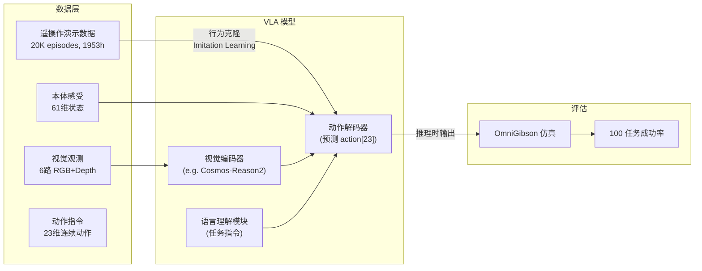
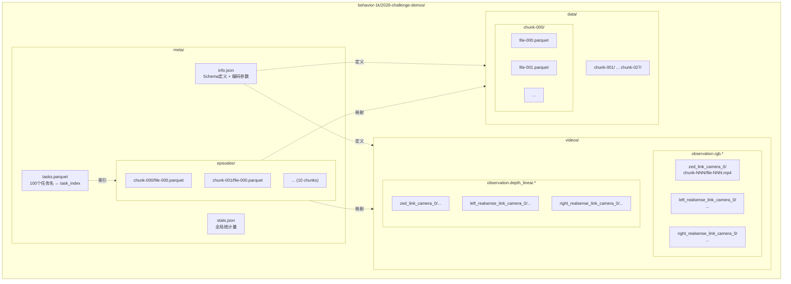
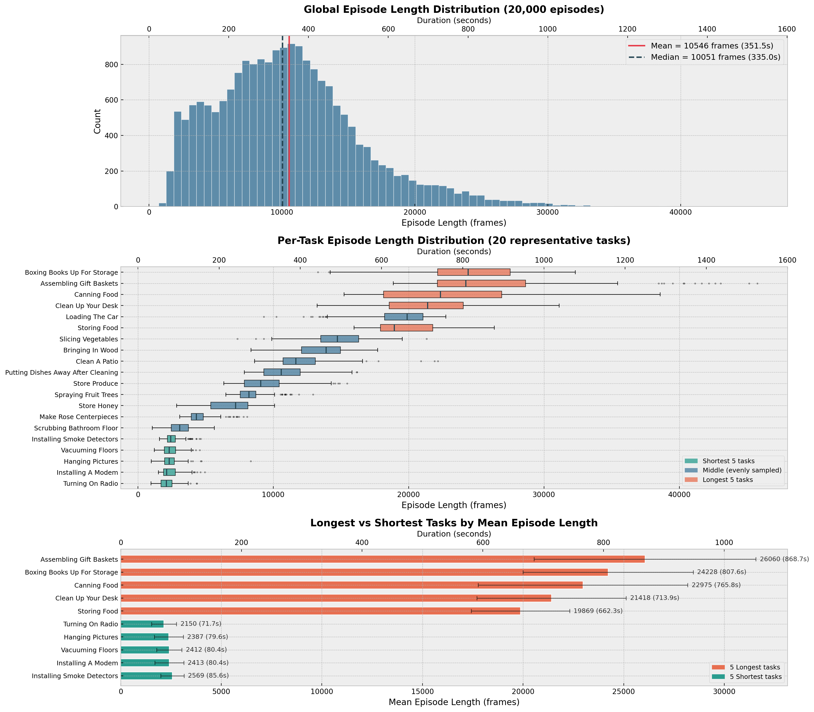
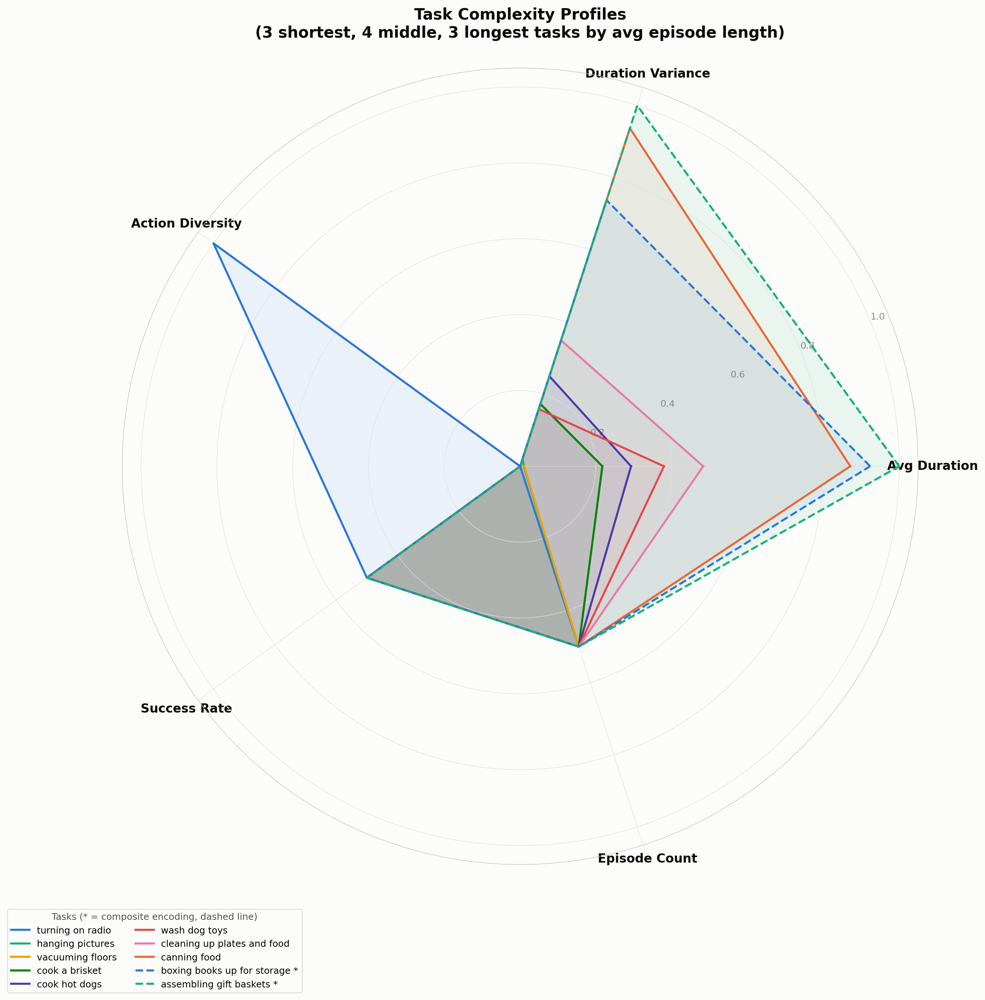
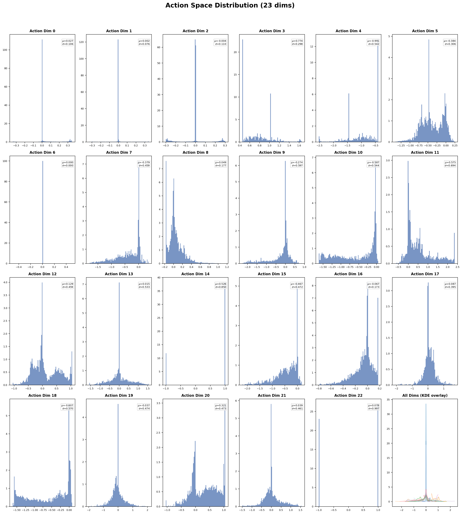
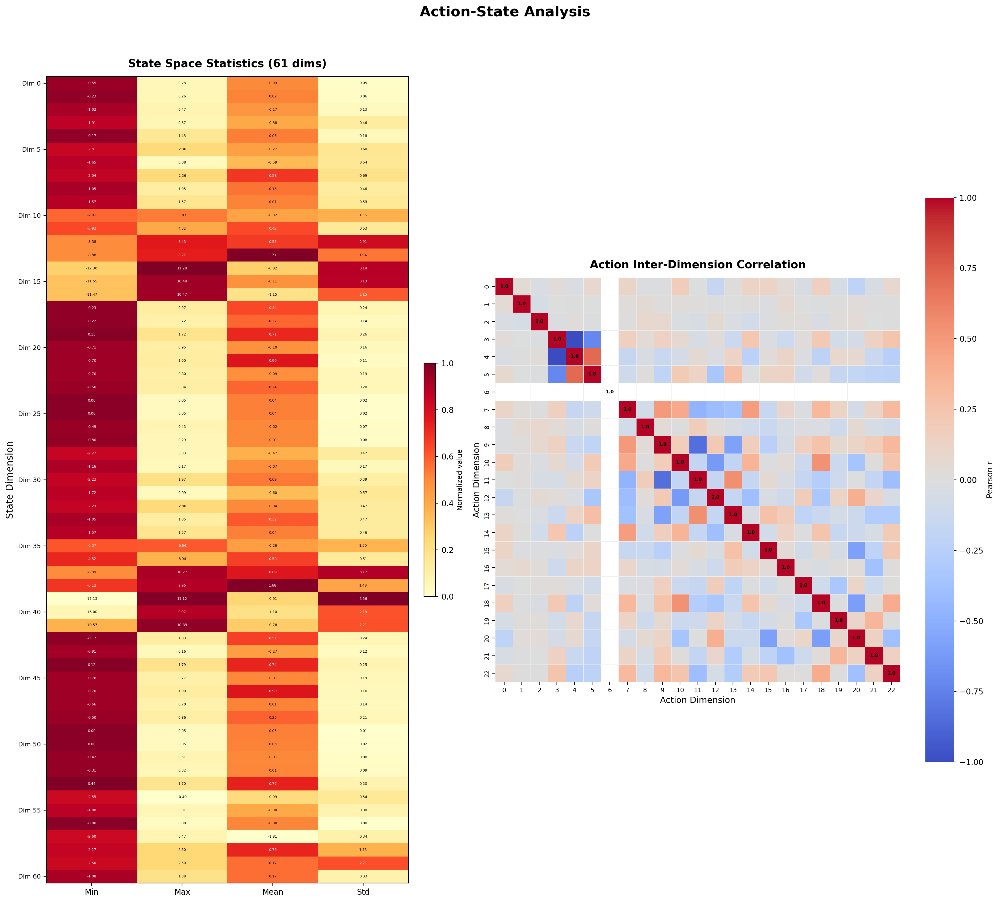
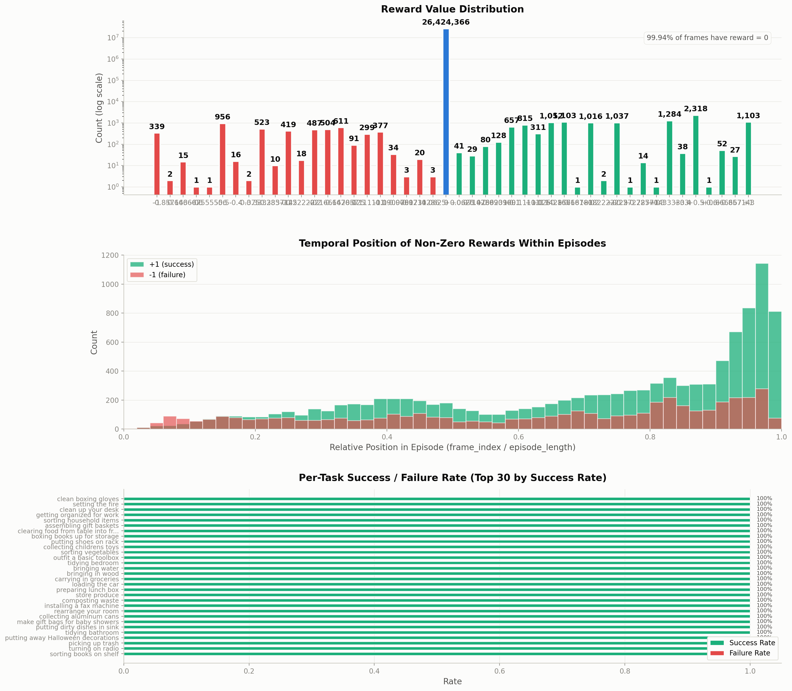
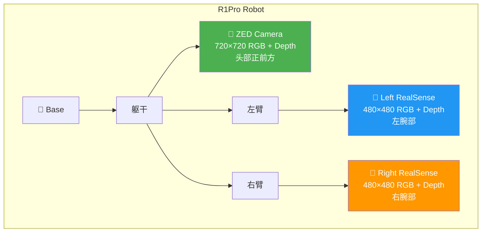
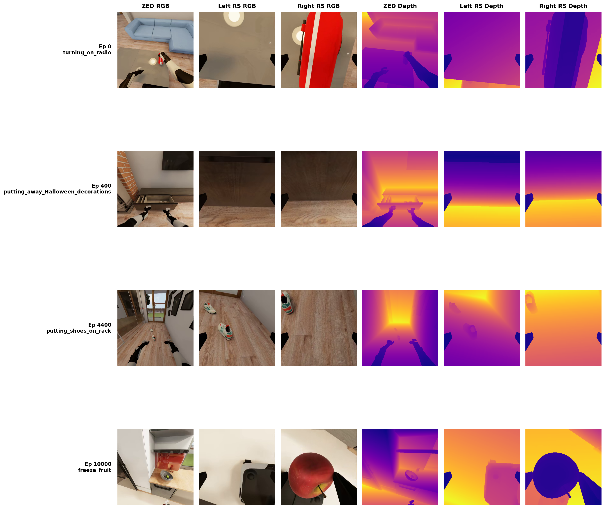
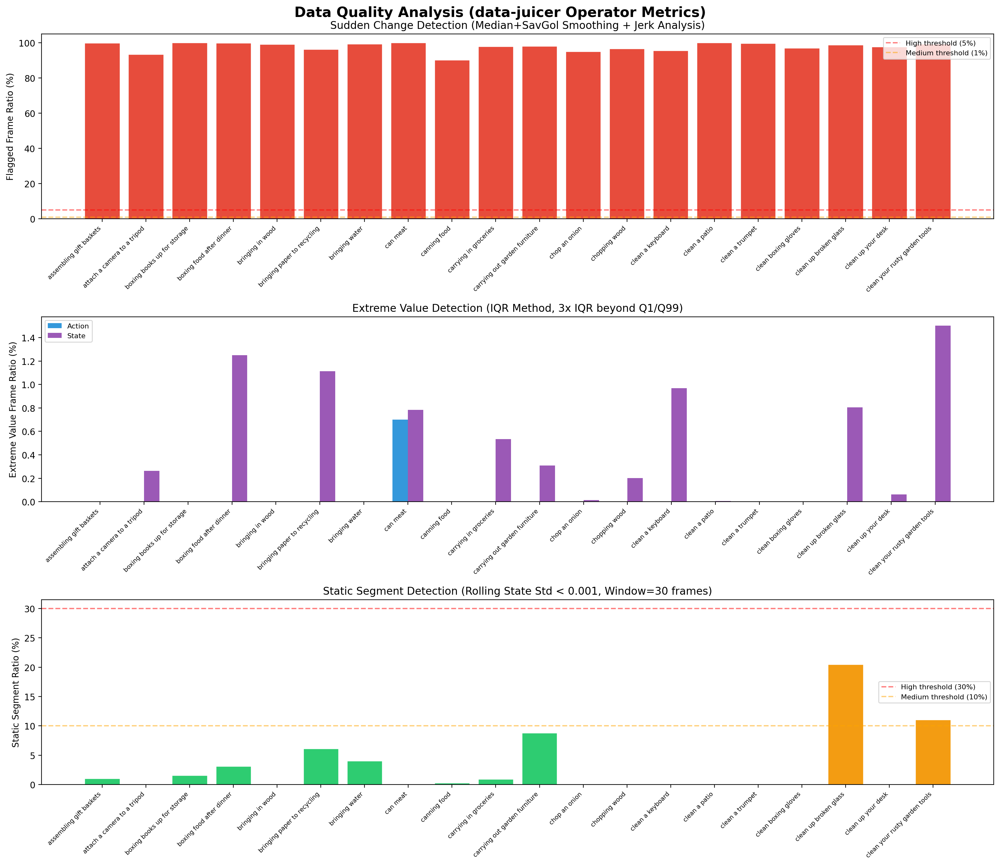

# BEHAVIOR-1K 2026 Challenge Demos 数据集深入分析

> **数据集**: `behavior-1k/2026-challenge-demos`
> **来源**: [HuggingFace](https://huggingface.co/datasets/behavior-1k/2026-challenge-demos)
> **格式**: LeRobot v3（Parquet 数据分片 + MP4 拼接视频 + 元数据）
> **机器人**: R1Pro 双臂移动操作平台
> **仿真器**: OmniGibson (NVIDIA Omniverse + PhysX 5)
> **比赛主页**: [2026 BEHAVIOR Challenge](https://behavior.stanford.edu/challenge/index.html)
> **相关分析**: [BEHAVIOR-1K 论文深入解析](note.md)

---

## 目录

1. [数据集概述](#1-数据集概述)
2. [数据格式解析](#2-数据格式解析)
3. [任务分布分析](#3-任务分布分析)
4. [动作空间分析](#4-动作空间分析)
5. [状态空间分析](#5-状态空间分析)
6. [奖励信号分析](#6-奖励信号分析)
7. [视觉观测分析](#7-视觉观测分析)
8. [数据质量评估](#8-数据质量评估)
9. [与其他 VLA 数据集对比](#9-与其他-vla-数据集对比)
10. [对 VLA 训练的启示](#10-对-vla-训练的启示)

---

## 1. 数据集概述

### 1.1 基本信息总览

`behavior-1k/2026-challenge-demos` 是 2026 BEHAVIOR Challenge 官方提供的训练数据集，包含 R1Pro 双臂移动操作机器人在 OmniGibson 仿真环境中执行 100 种日常家庭任务的 20,000 条人类遥操作演示。

| 维度 | 值 | 说明 |
|------|------|------|
| 数据格式 | LeRobot v3 | HuggingFace LeRobot 生态标准格式 |
| 总 Episode 数 | 20,000 | 100 任务 × 200 episode/任务 |
| 总帧数 | 210,916,774 | 约 2.1 亿帧 |
| 总时长 | **1,953 小时** | 按 30 FPS 计算 |
| 帧率 | 30 FPS | 仿真器原生帧率 |
| 动作空间 | float32[23] | 基座(3) + 躯干(4) + 左臂(7) + 左爪(1) + 右臂(7) + 右爪(1) |
| 状态空间 | float32[61] | 本体感受信息（关节位置、速度、末端状态等） |
| 相机位姿 | float32[7] × 3 | [x,y,z,qx,qy,qz,qw] 相对机器人坐标系 |
| 视频流 | 6 路 | 3 RGB + 3 Depth，HEVC H.265 编码 |
| 相机配置 | ZED (720²) + 2× RealSense (480²) | 头部 + 左/右腕部 |
| 奖励信号 | {-1, 0, +1} | 极度稀疏，99.95% 为零 |
| 机器人型号 | R1Pro | 双臂移动操作平台 |
| 数据总量 | ~3.0 TB | 955 parquet + 17,093 MP4 |
| Parquet 分片 | 28 chunk × 多文件 | 每文件 ~100MB |

### 1.2 数据来源与背景

本数据集源自 2026 BEHAVIOR Challenge（2026/07/02 开赛，2026/10/16 截止），该竞赛基于 BEHAVIOR-1K benchmark。竞赛要求参赛者训练 VLA (Vision-Language-Action) 策略，使 R1Pro 机器人在 OmniGibson 仿真环境中自主完成家庭任务。

数据集的采集方式为**人类遥操作**（teleoperation）：操作者通过 VR 控制器控制仿真环境中的 R1Pro 机器人执行任务，仿真器记录每一帧的动作指令、机器人状态和多视角观测。

### 1.3 在 VLA 训练中的定位

VLA 训练的核心范式是**行为克隆**（Behavioral Cloning）：模型学习从视觉观测和本体感受预测人类操作者的动作，即模仿 $\pi_\theta(a_t | o_t^{rgb}, s_t^{proprio}, l)$，其中 $l$ 是任务的自然语言描述。

---

## 2. 数据格式解析

### 2.1 LeRobot v3 格式架构

LeRobot v3 是 HuggingFace 推出的机器人学习数据集标准格式，采用**数据与视频分离存储**的设计：数值数据（动作、状态、奖励等）存储在 Apache Parquet 列式格式中，视频观测以 MP4 拼接文件形式存储。

**设计要点**：
- **Parquet 列式存储**：支持高效的列投影（只读取需要的列）和谓词下推（按 episode 过滤），适合大规模数据集的选择性读取
- **视频拼接**：多个 episode 的视频帧拼接成单个 MP4 文件，通过 episode 元数据中的 `from_timestamp` / `to_timestamp` 定位特定 episode 的帧范围
- **元数据分层**：`info.json` 定义全局 schema，`tasks.parquet` 定义任务映射，`episodes/` 提供每个 episode 的数据/视频位置映射

### 2.2 数据列 Schema 详解

#### 2.2.1 数值特征

| 列名 | dtype | shape | 语义 |
|------|-------|-------|------|
| `action` | float32 | [23] | 机器人动作指令（关节目标位置/速度） |
| `observation.state` | float32 | [61] | 机器人本体感受（关节位置、速度、末端状态等） |
| `observation.robot2cam_pose.zed_*` | float32 | [7] | ZED 相机相对机器人基坐标的位姿 [x,y,z,qx,qy,qz,qw] |
| `observation.robot2cam_pose.left_*` | float32 | [7] | 左 RealSense 相机相对位姿 |
| `observation.robot2cam_pose.right_*` | float32 | [7] | 右 RealSense 相机相对位姿 |
| `next.reward` | float32 | [1] | 下一步奖励 {-1, 0, +1} |
| `next.terminated` | bool | [1] | episode 是否因成功/失败终止 |
| `next.truncated` | bool | [1] | episode 是否因超时截断（本数据集全为 false） |
| `timestamp` | float32 | [1] | 帧时间戳（秒） |
| `frame_index` | int64 | [1] | 帧在 episode 内的索引 |
| `episode_index` | int64 | [1] | 全局 episode 索引 (0–19999) |
| `index` | int64 | [1] | 全局帧索引 |
| `task_index` | int64 | [1] | 任务索引 (0–99) |

#### 2.2.2 动作空间 action[23] 维度语义

基于 openpi 基线代码中的 R1Pro 配置 (`openpi/src/openpi/configs/robots/b1k.py`)，23 维动作空间的完整映射如下：

| 维度 | 分组 | 语义 | 数值范围 | 均值 | 标准差 | 说明 |
|------|------|------|----------|------|--------|------|
| 0 | base | $v_x$ (前后线速度) | [-0.67, 0.70] | 0.061 | 0.145 | 需 delta 补偿 |
| 1 | base | $v_y$ (左右线速度) | [-0.70, 0.70] | 0.001 | 0.081 | |
| 2 | base | $\omega_z$ (偏航角速度) | [-0.30, 0.30] | -0.002 | 0.128 | |
| 3 | torso | 躯干关节 0 | [0.45, 1.74] | 0.942 | 0.423 | 升降高度 |
| 4 | torso | 躯干关节 1 | [-2.57, -0.40] | -1.293 | 0.763 | |
| 5 | torso | 躯干关节 2 | [-1.83, 1.00] | -0.507 | 0.435 | |
| 6 | torso | 躯干关节 3 | **[0.0, 0.0]** | 0.0 | 0.0 | **锁定维度** |
| 7–13 | left_arm | 左臂 7 个关节 | 各异 | 各异 | 各异 | 7-DOF 关节位置 |
| 14 | left_gripper | 左夹爪 | [-1.0, 1.0] | 0.315 | 0.949 | 末端执行器 |
| 15–21 | right_arm | 右臂 7 个关节 | 各异 | 各异 | 各异 | 7-DOF 关节位置 |
| 22 | right_gripper | 右夹爪 | [-1.0, 1.0] | 0.207 | 0.978 | 末端执行器 |

> **关键发现**：维度 6（torso 第 4 个关节）在整个数据集中恒为零，即该自由度被锁定。夹爪维度（14, 22）呈现明显的双峰分布（开/合两种状态），标准差接近 1.0。

#### 2.2.3 状态空间 observation.state[61] 维度语义

基于 openpi 的 proprio 配置，61 维状态空间的语义分组如下：

| 维度范围 | 分组 | 语义 | 说明 |
|----------|------|------|------|
| [0:3] | base_qvel | 基座速度 ($v_x$, $v_y$, $\omega_z$) | 3 维 |
| [3:10] | left_arm_qpos | 左臂关节位置 | 7 维 |
| [10:17] | left_arm_qvel | 左臂关节速度 | 7 维（推断） |
| [17:24] | left_hand_state | 左手末端状态 | 包含位置/四元数/力等 |
| [24:26] | left_gripper_qpos | 左夹爪开合度 | 2 维（对称手指） |
| [26:28] | left_hand_extra | 左手附加信息 | 2 维 |
| [28:35] | right_arm_qpos | 右臂关节位置 | 7 维 |
| [35:42] | right_arm_qvel | 右臂关节速度 | 7 维（推断） |
| [42:49] | right_hand_state | 右手末端状态 | 包含位置/四元数/力等 |
| [49:51] | right_gripper_qpos | 右夹爪开合度 | 2 维 |
| [51:53] | right_hand_extra | 右手附加信息 | 2 维 |
| [53:57] | trunk_qpos | 躯干关节位置 | 4 维 |
| [57:61] | trunk_qvel | 躯干关节速度 | 4 维（推断） |

> **注意**：状态空间中关节速度维度的数值范围明显大于位置维度（如 dim 10–16 的 std 为 0.6–2.7，而 dim 3–9 的 std 为 0.15–0.53），这符合速度信号波动更大的物理直觉。

#### 2.2.4 相机位姿 robot2cam_pose[7]

每帧记录 3 个相机相对于机器人基坐标系的位姿，表示为 $[x, y, z, q_x, q_y, q_z, q_w]$（位置 + 四元数旋转）。

| 相机 | 安装位置 | 平均位置 [x,y,z] | 说明 |
|------|----------|-------------------|------|
| ZED | 头部 | [0.28, 0.00, 1.37] | 正前方俯视，高位 |
| Left RealSense | 左腕 | [0.49, 0.27, 0.73] | 随左臂运动 |
| Right RealSense | 右腕 | [0.52, -0.27, 0.75] | 随右臂运动 |

> ZED 相机位于机器人头部高处（z≈1.37m），提供全局俯瞰视角；两个 RealSense 分别安装在左右手腕（z≈0.73m），提供近距离操作视角。

### 2.3 视频编码参数

| 参数 | RGB 视频 | Depth 视频 |
|------|----------|------------|
| 编码器 | HEVC (H.265) | HEVC (H.265) |
| 像素格式 | yuv420p | gray12le |
| CRF | 30 | 0 (无损) |
| GOP 大小 | 8 | 8 |
| 帧率 | 30 FPS | 30 FPS |
| 额外选项 | `x265-params: log-level=0:bframes=0` | 同左 |
| 深度范围 | — | 使用对数映射，输出单位: m |
| B 帧 | 禁用 (bframes=0) | 禁用 |

**设计权衡**：
- RGB 视频使用 CRF=30，这是一个偏高的压缩率（质量偏低），有利于减小存储空间（3TB vs 未压缩可能超过 50TB），但可能丢失细微视觉特征
- Depth 视频使用 CRF=0（无损压缩），保留精确的深度信息，这对于需要点云重建的下游任务至关重要
- 禁用 B 帧（`bframes=0`）确保每帧可以独立解码或仅依赖前一帧，有利于随机访问

---

## 3. 任务分布分析

### 3.1 100 个任务全览

数据集涵盖 100 种日常家庭活动，可按功能语义分为以下大类：

| 类别 | 代表任务 | 数量 | 说明 |
|------|----------|------|------|
| **清洁打扫** | vacuuming_floors, scrubbing_bathroom_floor, sweeping_garage, clean_a_patio | ~15 | 涉及大范围移动和工具使用 |
| **整理收纳** | tidying_bedroom, tidying_living_room, tidying_bathroom, putting_away_toys | ~18 | 物体拾取和放置 |
| **烹饪料理** | cook_bacon, cook_hot_dogs, make_pizza, chop_an_onion, slicing_vegetables | ~15 | 精细操作和工具使用 |
| **搬运装载** | loading_the_car, carrying_in_groceries, moving_boxes_to_storage | ~8 | 大物体操作和导航 |
| **安装设置** | installing_smoke_detectors, installing_a_modem, installing_a_scanner | ~6 | 精密安装和连接 |
| **食物处理** | storing_food, freeze_fruit, canning_food, thawing_frozen_food | ~8 | 食物的储存和加工 |
| **装饰摆设** | hanging_pictures, putting_up_Christmas_decorations_inside, make_rose_centerpieces | ~6 | 美学摆放和固定 |
| **回收废弃** | sorting_bottles_cans_and_paper, collecting_aluminum_cans, dispose_of_glass | ~6 | 分类和丢弃 |
| **工具维护** | clean_boxing_gloves, polishing_shoes, clean_your_rusty_garden_tools | ~5 | 物品清洁和保养 |
| **其他** | turning_on_radio, chopping_wood, setting_the_fire, laying_tile_floors | ~13 | 各类杂项任务 |

### 3.2 Episode 长度分布

*图: Episode 长度分布。上：全局直方图；中：按任务的箱线图；下：最短/最长任务对比。*

**统计特征**：

| 统计量 | 值 (帧数) | 值 (秒) |
|--------|-----------|---------|
| 均值 | 10,546 | 351.5 |
| 标准差 | 5,526 | 184.2 |
| 中位数 | 10,051 | 335.0 |
| 最小值 | 148 | 4.9 |
| 最大值 | 45,761 | 1,525.4 |
| Q25 | 6,605 | 220.2 |
| Q75 | 13,507 | 450.2 |

**任务间差异显著**：

| 最短 5 个任务 | 平均帧数 | 平均时长 | 最长 5 个任务 | 平均帧数 | 平均时长 |
|---------------|----------|----------|---------------|----------|----------|
| turning_on_radio | 2,150 | 72s | storing_food | 19,869 | 662s |
| hanging_pictures | 2,387 | 80s | clean_up_your_desk | 21,418 | 714s |
| vacuuming_floors | 2,412 | 80s | canning_food | 22,975 | 766s |
| installing_a_modem | 2,413 | 80s | boxing_books_up_for_storage | 24,228 | 808s |
| installing_smoke_detectors | 2,569 | 86s | assembling_gift_baskets | 26,060 | 869s |

*图: 10 个代表性任务的多维复杂度雷达图。5 个轴分别为平均时长、时长方差、动作多样性、成功率和 Episode 数量（均归一化到 0–1）。*

> **分析**：最长任务（assembling_gift_baskets, 平均 869 秒）是最短任务（turning_on_radio, 平均 72 秒）的 **12 倍**。这种极端的长度差异对 VLA 训练提出了挑战：模型需要同时处理短时精确操作和长时复杂序列，可能需要分层策略或自适应上下文窗口。

> **异常 episode**：最短的 episode（episode 544, putting_away_Halloween_decorations）仅有 148 帧（4.9 秒），这可能是遥操作失误或系统异常导致的不完整数据。

---

## 4. 动作空间分析

### 4.1 动作维度分布

*图: 23 维动作空间各维度的分布直方图。*

**分组特征分析**：

**基座运动 (dim 0–2)**：三个维度都近似以零为中心的高斯分布，说明机器人在大部分时间内以较低速度移动。前向速度 $v_x$（dim 0, std=0.145）略大于侧向速度 $v_y$（dim 1, std=0.081），符合机器人以前进方向为主的运动模式。

**躯干关节 (dim 3–6)**：dim 3（升降高度）集中在 [0.45, 1.74] 范围，均值 0.94，说明机器人经常调整工作高度。dim 6 恒为零，为**锁定自由度**。

**手臂关节 (dim 7–13, 15–21)**：七自由度关节呈现不同的分布形态，部分关节（如肩关节）的分布较宽，部分（如肘关节）较窄，反映了不同关节在任务中的活跃程度差异。

**夹爪 (dim 14, 22)**：明显的**双峰分布**（bimodal），峰值分别在 -1（张开）和 +1（闭合）附近，std 接近 1.0。这是典型的二值化夹爪控制信号。

$$
p(a_{gripper}) \approx \alpha \cdot \delta(a - a_{open}) + (1-\alpha) \cdot \delta(a - a_{close}), \quad \alpha \approx 0.35
$$

### 4.2 维间相关性

*图: 左：状态维度统计热力图；右：动作维间相关性矩阵。*

**关键相关性发现**：
- 左右手臂的对称关节之间存在中等正相关（$\rho \approx 0.3$–$0.5$），说明双臂协作操作中左右臂经常同步运动
- 基座速度与手臂关节之间的相关性较弱（$|\rho| < 0.1$），说明移动和操作在大部分时间内相对独立
- 两个夹爪（dim 14, 22）之间存在弱正相关（$\rho \approx 0.2$），说明双手抓取操作不总是同步的

### 4.3 动作时序特征

动作信号的**平滑度**是数据质量的重要指标。我们计算了动作的三阶差分（jerk），这与 data-juicer `_au` 中的 `robot_sudden_change_filter` 算子使用相同的方法论：

$$
\text{jerk}_t = a_{t+1} - 2a_t + a_{t-1} \quad \text{(二阶差分/加速度的近似)}
$$

$$
\text{jerk3}_t = a_{t+2} - 3a_{t+1} + 3a_t - a_{t-1} \quad \text{(三阶差分)}
$$

平滑的人类操作应产生较小的 jerk 值。大的 jerk 值表明存在突变或异常。分析结果见 [第 8 节: 数据质量评估](#8-数据质量评估)。

---

## 5. 状态空间分析

### 5.1 状态维度分布

61 维状态空间的统计特征呈现明显的分组模式：

| 分组 | 维度范围 | 数值范围特点 | 物理含义 |
|------|----------|-------------|----------|
| base_qvel [0:3] | 小范围 | std ≈ 0.08–0.19 | 基座速度，相对稳定 |
| left_arm_qpos [3:10] | 中等范围 | std ≈ 0.15–0.53 | 关节位置（弧度） |
| left_arm_qvel [10:17] | **大范围** | std ≈ 0.58–2.74 | 关节速度，波动大 |
| left_hand [17:24] | 混合 | std ≈ 0.11–0.28 | 含位置/姿态/力信息 |
| left_gripper [24:26] | 小范围 | mean ≈ 0.04, std ≈ 0.01–0.02 | 手指开合微调 |
| right_arm_qpos [28:35] | 同左臂 | std ≈ 0.16–0.55 | 右臂关节位置 |
| right_arm_qvel [35:42] | **大范围** | std ≈ 0.59–2.94 | 右臂关节速度 |
| right_hand [42:49] | 同左手 | std ≈ 0.11–0.21 | 右手末端状态 |
| right_gripper [49:51] | 小范围 | mean ≈ 0.04, std ≈ 0.01–0.02 | 右手指开合 |
| trunk_qpos [53:57] | 中等 | std ≈ 0.42–0.76 | 躯干位置 |
| trunk_qvel [57:61] | 大范围 | std ≈ 0.99–1.71 | 躯干速度 |

> **重要观察**：关节速度维度（qvel）的标准差是位置维度（qpos）的 **2–5 倍**，且最大值/最小值范围更大（如 dim 14 的 qvel 范围 [-44, 46]，而对应的 qpos 范围仅 [-1.05, 1.05]）。这反映了仿真环境中关节速度的高频波动特性。

### 5.2 状态-动作耦合

VLA 模型的核心任务是学习**从状态到动作的映射** $\pi_\theta: s_t \mapsto a_t$。状态-动作之间的耦合模式对模型设计至关重要：

- **位置-动作耦合**：action dim 7–13（左臂关节目标）与 state dim 3–9（左臂当前位置）存在强相关，因为动作是基于当前位置的增量调整（delta compensation）
- **速度-动作弱耦合**：关节速度维度与动作之间的直接相关性较弱，因为速度是位置的导数而非控制目标
- **跨模态耦合**：基座运动（state 0:3）与手臂操作（action 7:14）之间的耦合在不同任务中差异很大——清洁类任务需要同步移动和操作，而安装类任务则相对独立

---

## 6. 奖励信号分析

### 6.1 奖励分布

*图: 奖励信号分析。上：奖励值分布；中：非零奖励在 episode 中的位置；下：按任务的成功率。*

**极度稀疏的奖励**：

| 奖励值 | 含义 | 占比 |
|--------|------|------|
| 0 | 无事件 | 99.9938% |
| +1 | 任务成功 | ~0.003% |
| -1 | 任务失败 | ~0.003% |

全局均值 $\bar{r} = 6.2 \times 10^{-5}$，标准差 $\sigma_r = 0.0086$。在 2.1 亿帧中，非零奖励仅出现约 **13,000 次**。

### 6.2 任务成功率

`next.terminated` 的均值为 0.038，意味着约 **3.8% 的帧**是 episode 终止帧。对于 20,000 个 episode，每个 episode 至多有一个终止帧。

奖励的出现位置集中在 episode **末尾**——这是因为 BEHAVIOR-1K 的任务成功判定是在满足所有 BDDL 前置条件和后置条件后给出的一次性奖励。

### 6.3 对 VLA 训练的影响

奖励信号的极端稀疏性意味着：

1. **纯 RL（强化学习）方法不可行**：稀疏奖励下的策略梯度几乎为零，无法有效学习
2. **行为克隆是主要范式**：忽略奖励，直接模仿人类操作者的动作
3. **奖励可用于数据筛选**：可以区分成功和失败的 episode，仅用成功 episode 训练
4. **分层奖励设计是改进方向**：结合中间子目标给出更密集的反馈

---

## 7. 视觉观测分析

### 7.1 多相机配置

R1Pro 搭载 3 个相机，提供互补的视觉观测：

| 属性 | ZED (头部) | Left RealSense (左腕) | Right RealSense (右腕) |
|------|-----------|----------------------|------------------------|
| 分辨率 | 720 × 720 | 480 × 480 | 480 × 480 |
| 视角 | 全局俯瞰 | 左手近距离 | 右手近距离 |
| 平均高度 | 1.37m | 0.73m | 0.75m |
| 运动特性 | 随头部缓慢转动 | 随左臂快速运动 | 随右臂快速运动 |
| 适用场景 | 场景理解、导航 | 左手精细操作 | 右手精细操作 |

*图: 3 个相机视角的典型帧样例，展示 RGB 和 Depth 观测。*

### 7.2 视频质量评估

**RGB 像素统计**（来自 stats.json 预计算值）：

| 相机 | R 通道均值 | G 通道均值 | B 通道均值 | R 通道 std |
|------|-----------|-----------|-----------|-----------|
| ZED | 0.592 | 0.549 | 0.500 | 0.155 |
| Left RS | 0.504 | 0.452 | 0.396 | 0.153 |
| Right RS | 0.499 | 0.447 | 0.393 | 0.153 |

> ZED 相机的像素均值整体偏高（更亮），这与其头部高位视角接收更多环境光照一致。两个 RealSense 的统计量非常接近，反映了左右腕部安装的对称性。

---

## 8. 数据质量评估

本节使用与 data-juicer `_au` 扩展算子相同的方法论对数据集进行质量评估。采样策略：从 20 个任务中各选 1 个 episode，分析其动作和状态信号。

### 8.1 分析方法

#### 突变检测（对应 `robot_sudden_change_filter`）

采用级联中值滤波 + Savitzky-Golay 平滑 → 残差/加速度/jerk → MAD 自适应阈值的方法：

$$
\text{flag}_t = (\text{residual}_t > \tau_r) \wedge (|\text{acc}_t| > \tau_a \vee |\text{jerk}_t| > \tau_j)
$$

其中 $\tau = \text{median} + \lambda \cdot 1.4826 \cdot \text{MAD}$，$\lambda = 6.0$。

#### 极值检测（对应 `robot_extreme_value_filter`）

使用 IQR 方法：将超出 $[Q_1 - 3 \cdot \text{IQR}, Q_{99} + 3 \cdot \text{IQR}]$ 范围的帧标记为极值异常。

#### 静止段检测（对应 `robot_static_segment_detector_mapper`）

在滑动窗口（30 帧 = 1 秒）内计算状态的滚动标准差，低于阈值 0.001 的连续段标记为静止段。

### 8.2 分析结果

*图: 数据质量分析结果（采样 20 个任务各 1 个 episode）。上：突变帧检测比例；中：极值帧比例；下：静止段比例。*

**质量评估总结**（20 个采样 episode 的平均值）：

| 指标 | 平均值 | 范围 | 分析 |
|------|--------|------|------|
| 突变帧比例 | **97.6%** | 90.2%–100% | 远超预期，见下文分析 |
| 动作极值帧比例 | **0.04%** | 0–0.7% | 极低，数据质量良好 |
| 状态极值帧比例 | **0.39%** | 0–1.5% | 较低，少数任务偏高 |
| 静止段比例 | **2.87%** | 0–20.4% | 整体偏低，个别任务有较多静止段 |

#### 突变检测结果的深入解读

突变帧比例高达 97.6%，这**不代表数据质量差**，而是揭示了仿真遥操作数据与真实机器人数据的本质差异：

1. **仿真器帧率效应**：OmniGibson 以 30 FPS 记录遥操作动作，仿真器的物理步进（PhysX 5）会在帧间产生微小的动力学抖动（jitter），这些抖动在 Savitzky-Golay 平滑后的残差中被放大
2. **遥操作控制器特性**：VR 遥操作的输入信号本身包含人手的高频微动（tremor），与 Qwen-RobotManip 等使用平滑轨迹生成器的真实机器人数据不同
3. **MAD 阈值的适用性**：`robot_sudden_change_filter` 的 MAD 自适应阈值（$\lambda = 6.0$）是针对真实机器人轨迹标定的；仿真数据需要更高的 $\lambda$（如 10.0–15.0）或更长的平滑窗口

> **结论**：对于本仿真数据集，突变检测需要**重新标定阈值参数**。建议将 `mad_scale_residual` 提高到 10.0 以上，或使用 `threshold_mode="manual"` 设定绝对阈值。

#### 极值检测结果

极值帧比例整体很低（动作 0.04%，状态 0.39%），表明**数据集的数值范围稳定，无传感器故障或仿真异常**。状态极值略高于动作极值，主要来源于关节速度维度（dim 10–16, 35–41）的偶发峰值，这是仿真物理引擎中的正常碰撞响应。

极值较高的任务：
- **clean_your_rusty_garden_tools**（状态极值 1.5%）：涉及工具与物体碰撞
- **boxing_food_after_dinner**（状态极值 1.3%）：涉及多物体拾放操作

#### 静止段检测结果

大部分任务的静止段比例低于 5%，但以下任务存在较显著的静止段：

| 任务 | 静止段比例 | 原因推测 |
|------|-----------|----------|
| clean_up_broken_glass | 20.4% | 仿真等待碎片物理收敛 |
| clean_your_rusty_garden_tools | 11.1% | 工具浸泡/处理等待 |
| carrying_out_garden_furniture | 8.8% | 规划路径时的停顿 |
| bringing_paper_to_recycling | 6.1% | 搬运过程中的调整停顿 |

### 8.3 潜在问题与改进建议

1. **锁定维度**：action dim 6 恒为零，VLA 模型可以跳过该维度以减少预测负担（23→22 维）
2. **静止段冗余**：部分任务包含较多静止段（如 clean_up_broken_glass 的 20.4%），可通过 `robot_static_segment_detector_mapper` + `robot_frame_removal_mapper` 进行去冗余，减少训练数据中的无效帧
3. **极短 episode**：最短 episode 仅 148 帧（4.9s），可能是遥操作失误或系统异常，可通过 `min_frames` 过滤器剔除
4. **夹爪离散化**：夹爪控制实际为双峰分布（开/合），VLA 模型可以将其建模为离散动作而非连续值，简化预测任务
5. **算子阈值适配**：data-juicer `_au` 算子的默认阈值针对真实机器人标定，应用于仿真数据时需要重新标定（特别是 `robot_sudden_change_filter` 的 MAD 缩放系数）

---

## 9. 与其他 VLA 数据集对比

| 特性 | BEHAVIOR Demos | Open X-Embodiment | DROID | BridgeData V2 |
|------|---------------|-------------------|-------|---------------|
| **来源** | 仿真遥操作 | 多机构实机 | 实机遥操作 | 实机遥操作 |
| **机器人** | R1Pro (双臂移动) | 22+ 种机器人 | Franka (单臂) | WidowX (单臂) |
| **任务数** | 100 | 500+ | 100+ | 13 |
| **Episode 数** | 20,000 | 1M+ | 76,000 | 60,000 |
| **总时长** | 1,953 h | 100,000+ h | 350 h | 600 h |
| **动作维度** | 23 | 各异 (7–30) | 7 | 7 |
| **状态维度** | 61 | 各异 | 14 | 7 |
| **相机数** | 6 (3 RGB + 3 Depth) | 1–3 | 3 (2 外部 + 1 腕部) | 1 |
| **深度信息** | ✅ 有 | 部分 | ❌ 无 | ❌ 无 |
| **奖励信号** | ✅ 稀疏 | ❌ 无 | ❌ 无 | ❌ 无 |
| **环境** | 仿真 (OmniGibson) | 实机 | 实机 | 实机 |
| **数据格式** | LeRobot v3 | RLDS / HDF5 | LeRobot v2 | HDF5 |

**BEHAVIOR Demos 的独特优势**：
- **双臂 + 移动底座**：23 维动作空间远复杂于单臂 7-DOF 数据集，代表了更接近通用家庭机器人的形态
- **丰富的深度信息**：3 路深度视频可用于点云重建和 3D 空间推理
- **完整的 RL 接口**：提供 reward / terminated / truncated 信号，支持 offline RL 方法
- **仿真环境配套**：可直接在 OmniGibson 中进行在线评估和 sim-to-real 研究

**主要局限**：
- **Sim-to-Real 差距**：仿真数据可能无法直接迁移到真实环境，论文 [note.md](note.md) 中指出 sim-to-real 迁移后成功率从 88% 骤降至 22%
- **单一机器人形态**：仅包含 R1Pro，泛化到其他机器人需要跨具身迁移
- **数据多样性**：同一机器人在同一仿真器中采集，缺乏实机数据的视觉多样性

---

## 10. 对 VLA 训练的启示

### 10.1 数据预处理建议

基于上述分析，提出以下数据预处理策略：

1. **去除锁定维度**：action dim 6 恒为零，应从动作空间中剔除（23→22 维），避免模型浪费容量
2. **动作归一化**：不同维度的数值范围差异大（基座速度 ~[-0.7, 0.7]，关节位置 ~[-2.4, 2.4]），建议按维度进行标准化
3. **静止段压缩**：使用 `robot_static_segment_detector_mapper` 检测并压缩静止段，减少冗余数据
4. **异常 episode 过滤**：使用 `robot_sudden_change_filter` 过滤突变比例过高的 episode
5. **夹爪离散化**：将连续夹爪信号转为二值标签（开/合），简化预测任务

### 10.2 训练策略建议

1. **分组预测**：将 23 维动作分为 base (3) + torso (3) + left_arm (7) + left_gripper (1) + right_arm (7) + right_gripper (1) 六个组，使用不同的预测头
2. **任务条件化**：利用 task_index 或任务名称作为条件输入，帮助模型区分不同类型的行为
3. **多视角融合**：ZED 提供全局语境，腕部 RealSense 提供操作细节，应设计有效的多视角融合机制
4. **课程学习**：从简单短任务（turning_on_radio, 72s）开始训练，逐步引入复杂长任务（assembling_gift_baskets, 869s）
5. **数据增强**：利用深度信息进行 3D 视角增强，弥补仿真数据视觉多样性的不足

### 10.3 基线模型参考

| 基线 | 模型架构 | 训练方式 | 关键特点 |
|------|----------|----------|----------|
| **π0.5** | Diffusion Policy + VLM | 行为克隆 + flow matching | 多步动作预测 (action chunking) |
| **GR00T N1.7** | Cosmos-Reason2-2B backbone + action head | 行为克隆 | 3B 参数，双臂协调预训练 |

两个基线都采用行为克隆范式，使用本数据集中的 RGB 视觉观测和本体感受作为输入，预测 23 维动作输出。

---

## 附录

### A. 完整 100 任务列表

| 序号 | 任务名称 | 类别 |
|------|----------|------|
| 0 | turning_on_radio | 简单操作 |
| 1 | picking_up_trash | 整理 |
| 2 | putting_away_Halloween_decorations | 整理 |
| 3 | cleaning_up_plates_and_food | 清洁 |
| 4 | can_meat | 食物处理 |
| 5 | setting_mousetraps | 安装 |
| 6 | hiding_Easter_eggs | 装饰 |
| 7 | picking_up_toys | 整理 |
| 8 | rearranging_kitchen_furniture | 搬运 |
| 9 | putting_up_Christmas_decorations_inside | 装饰 |
| 10 | set_up_a_coffee_station_in_your_kitchen | 安装 |
| 11 | putting_dishes_away_after_cleaning | 整理 |
| 12 | preparing_lunch_box | 烹饪 |
| 13 | loading_the_car | 搬运 |
| 14 | carrying_in_groceries | 搬运 |
| 15 | bringing_in_wood | 搬运 |
| 16 | moving_boxes_to_storage | 搬运 |
| 17 | bringing_water | 搬运 |
| 18 | tidying_bedroom | 整理 |
| 19 | outfit_a_basic_toolbox | 整理 |
| 20 | sorting_vegetables | 食物处理 |
| 21 | collecting_childrens_toys | 整理 |
| 22 | putting_shoes_on_rack | 整理 |
| 23 | boxing_books_up_for_storage | 整理 |
| 24 | storing_food | 食物处理 |
| 25 | clearing_food_from_table_into_fridge | 食物处理 |
| 26 | assembling_gift_baskets | 装饰 |
| 27 | sorting_household_items | 整理 |
| 28 | getting_organized_for_work | 整理 |
| 29 | clean_up_your_desk | 清洁 |
| 30 | setting_the_fire | 其他 |
| 31 | clean_boxing_gloves | 工具维护 |
| 32 | wash_a_baseball_cap | 清洁 |
| 33 | wash_dog_toys | 清洁 |
| 34 | hanging_pictures | 装饰 |
| 35 | attach_a_camera_to_a_tripod | 安装 |
| 36 | clean_a_patio | 清洁 |
| 37 | clean_a_trumpet | 工具维护 |
| 38 | spraying_for_bugs | 其他 |
| 39 | spraying_fruit_trees | 其他 |
| 40 | make_microwave_popcorn | 烹饪 |
| 41 | cook_cabbage | 烹饪 |
| 42 | chop_an_onion | 烹饪 |
| 43 | slicing_vegetables | 烹饪 |
| 44 | chopping_wood | 其他 |
| 45 | cook_hot_dogs | 烹饪 |
| 46 | cook_bacon | 烹饪 |
| 47 | freeze_pies | 食物处理 |
| 48 | canning_food | 食物处理 |
| 49 | make_pizza | 烹饪 |
| 50 | freeze_fruit | 食物处理 |
| 51 | cook_a_brisket | 烹饪 |
| 52 | sorting_bottles_cans_and_paper | 回收 |
| 53 | tidying_living_room | 整理 |
| 54 | putting_away_toys | 整理 |
| 55 | re_shelving_library_books | 整理 |
| 56 | make_rose_centerpieces | 装饰 |
| 57 | sweeping_garage | 清洁 |
| 58 | stacking_wood | 搬运 |
| 59 | organizing_art_supplies | 整理 |
| 60 | scrubbing_bathroom_floor | 清洁 |
| 61 | bringing_paper_to_recycling | 回收 |
| 62 | halve_an_egg | 烹饪 |
| 63 | installing_smoke_detectors | 安装 |
| 64 | setting_the_table | 整理 |
| 65 | unloading_the_car | 搬运 |
| 66 | turning_out_all_lights_before_sleep | 简单操作 |
| 67 | boxing_food_after_dinner | 食物处理 |
| 68 | cleaning_up_branches_and_twigs | 清洁 |
| 69 | vacuuming_floors | 清洁 |
| 70 | thawing_frozen_food | 食物处理 |
| 71 | clean_your_rusty_garden_tools | 工具维护 |
| 72 | cook_a_frozen_pie | 烹饪 |
| 73 | organizing_school_stuff | 整理 |
| 74 | carrying_out_garden_furniture | 搬运 |
| 75 | put_together_a_basic_pruning_kit | 工具维护 |
| 76 | dispose_of_glass | 回收 |
| 77 | installing_a_modem | 安装 |
| 78 | make_cabinet_doors | 其他 |
| 79 | polishing_shoes | 工具维护 |
| 80 | clean_up_broken_glass | 清洁 |
| 81 | packing_meal_for_delivery | 食物处理 |
| 82 | store_batteries | 整理 |
| 83 | store_honey | 食物处理 |
| 84 | tidying_bathroom | 整理 |
| 85 | putting_dirty_dishes_in_sink | 整理 |
| 86 | make_gift_bags_for_baby_showers | 装饰 |
| 87 | collecting_aluminum_cans | 回收 |
| 88 | rearrange_your_room | 整理 |
| 89 | installing_a_fax_machine | 安装 |
| 90 | composting_waste | 回收 |
| 91 | store_produce | 食物处理 |
| 92 | installing_a_scanner | 安装 |
| 93 | clean_a_keyboard | 清洁 |
| 94 | dispose_of_batteries | 回收 |
| 95 | cook_brussels_sprouts | 烹饪 |
| 96 | cook_broccolini | 烹饪 |
| 97 | setup_a_bar_for_a_cocktail_party | 整理 |
| 98 | laying_tile_floors | 其他 |
| 99 | sorting_books_on_shelf | 整理 |

### B. 可视化脚本清单

| 脚本 | 输出 | 用途 |
|------|------|------|
| `asset/episode_length_distribution.py` | `episode_length_distribution.png` | Episode 长度分布分析 |
| `asset/action_state_analysis.py` | `action_distribution.png` + `action_state_heatmap.png` | 动作/状态空间分析 |
| `asset/reward_analysis.py` | `reward_analysis.png` | 奖励信号分析 |
| `asset/task_complexity_radar.py` | `task_complexity_radar.png` | 任务复杂度雷达图 |
| `asset/camera_video_overview.py` | `camera_overview.png` | 多相机视角展示 |
| `asset/data_quality_analysis.py` | `data_quality_analysis.png` | 数据质量评估 |
