# BEHAVIOR-1K 深度解析：以人为中心的千级活动具身AI基准

> **论文**: *BEHAVIOR-1K: A Human-Centered, Embodied AI Benchmark with 1,000 Everyday Activities and Realistic Simulation*
> **作者**: Chengshu Li\*, Ruohan Zhang\*, Josiah Wong\*, Cem Gokmen\* 等 (Stanford University, UT Austin, UIUC, USC, Salesforce Research)
> **发表**: Conference on Robot Learning (CoRL), 2024
> **arXiv**: [2403.09227](https://arxiv.org/abs/2403.09227)
> **官网**: [behavior.stanford.edu](https://behavior.stanford.edu)
> **2026Behavior-1K主页**: [2026 BEHAVIOR Challenge](https://behavior.stanford.edu/challenge/index.html)
> **代码**: [github.com/StanfordVL/BEHAVIOR-1K](https://github.com/StanfordVL/BEHAVIOR-1K)  (1,600+ Stars, 16,178 commits, v3.9.0)
> **仿真器**: OmniGibson (基于 NVIDIA Omniverse + PhysX 5)

## 一句话结论

BEHAVIOR-1K 是首个以 **人类偏好调查** (1,461名参与者) 为基础的大规模具身AI基准, 包含 **1,000项日常活动** 的谓词逻辑定义 (BDDL), 覆盖 **50个场景** (8种类型)、 **9,000+物体** (1,949个类别) 和 **35+物理属性**, 搭载基于PhysX 5的OmniGibson仿真器 (支持刚体、可变形体、流体、布料和温度变化), 实验表明即使在使用动作原语的最优条件下, SOTA强化学习方法在最简单的活动上也仅达到88%成功率, 而sim-to-real迁移后成功率骤降至约22%.

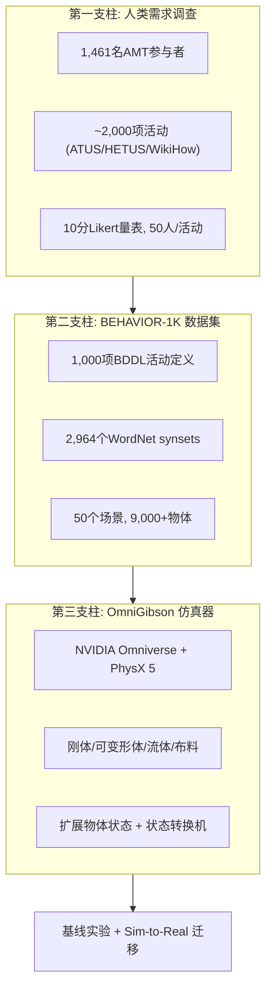

## 目录

1. [概述与导读](#1-概述与导读)
2. [研究动机与人类需求调查](#2-研究动机与人类需求调查)
3. [BEHAVIOR-1K 数据集](#3-behavior-1k-数据集)
4. [OmniGibson 仿真环境](#4-omnigibson-仿真环境)
5. [基线实验分析](#5-基线实验分析)
6. [Sim-to-Real 迁移分析](#6-sim-to-real-迁移分析)
7. [纵向分析: 演进历史](#7-纵向分析-演进历史)
8. [横向分析: 同类基准对比](#8-横向分析-同类基准对比)
9. [消融分析](#9-消融分析)
10. [2026 BEHAVIOR Challenge](#10-2026-behavior-challenge)
11. [局限性与未来方向](#11-局限性与未来方向)
12. [关键结论](#12-关键结论)

---

## 1. 概述与导读

### 1.1 核心贡献

BEHAVIOR-1K 的核心问题是: **具身AI应当为人类完成哪些任务, 以及如何在仿真中忠实地评估这些任务的完成?** 围绕这个问题, 论文提出了三个层级的贡献:

| 层级 | 贡献 | 关键数字 |
|------|------|---------|
| **活动选择** | 首次通过大规模人类偏好调查确定1,000项基准活动 | 1,461名参与者, Gini系数=0.158 |
| **活动定义** | 基于BDDL谓词逻辑的活动形式化 + 知识库标注管线 | 2,964个synsets, 35+物理属性 |
| **仿真平台** | OmniGibson: 支持全物理仿真的高保真仿真器 | PhysX 5, 视觉质量3.20/5.0 |

### 1.2 阅读地图

本文分析框架如下:

- **"为什么"** (第2节): 为什么需要以人为中心的基准? 现有基准有哪些不足?
- **"是什么"** (第3-4节): BEHAVIOR-1K的数据集和仿真器的技术细节是什么?
- **"好不好"** (第5-6节): 基线实验和sim-to-real迁移的结果如何?
- **"从哪来、到哪去"** (第7-10节): 纵向演进、横向对比、消融分析和未来挑战

---

## 2. 研究动机与人类需求调查

### 2.1 问题定位: 现有基准的盲区

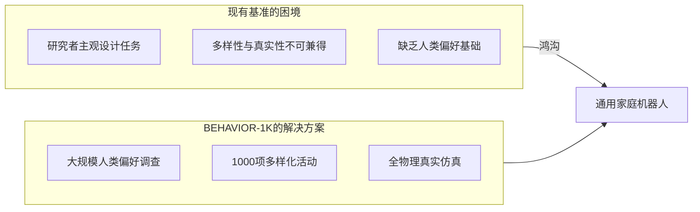

现有具身AI基准面临一个根本性矛盾: **研究者设计的任务可能并不反映人类的真实需求**. 例如, AI2-THOR仅评估1类导航任务, Habitat 2.0仅包含3种重排活动, 即使VirtualHome包含549个活动, 这些活动也完全由研究者凭经验选择, 没有任何人类偏好数据支撑.

这种矛盾的本质在于: 如果我们的目标是让机器人在日常生活中服务人类, 那么基准测试的任务集就应该反映人类**真正想要机器人做什么**——而不是研究者认为什么有趣或什么容易实现.

### 2.2 调查方法论

BEHAVIOR-1K的调查是该领域首次系统性地询问: *"你希望机器人为你做什么?"*

#### 2.2.1 活动来源

调查的活动候选集来自两个互补的来源:

1. **时间使用调查 (Time-Use Surveys)**: 从美国时间使用调查 (ATUS)、欧洲统一时间使用调查 (HETUS) 和多国时间使用研究 (MTUS) 中提取了约 **540项** 人类日常活动. 这些调查记录了人们如何花费时间, 提供了活动频率的统计基础.

2. **WikiHow文章**: 从180,000+篇WikiHow文章中提取了额外的活动, 补充了时间使用调查中缺失的活动类型. WikiHow的覆盖面更广, 包含了许多具体的操作步骤 (如 "如何烤糖饼干", "如何清洁熨斗底部").

合并后形成约 **2,090项** 候选活动, 经过可行性筛选后保留约2,000项进入调查.

#### 2.2.2 可行性筛选

论文设定了7个筛选标准, 排除当前仿真技术无法支持的活动:

| 排除标准 | 示例 |
|---------|------|
| 物理仿真不支持 | 化学反应、电路操作 |
| 媒体消费类 | 看电视、阅读 |
| 超过1天的持续时间 | 种植植物并等待生长 |
| 需要非视觉模态 | 听音乐、品尝食物 |
| 涉及品牌特定产品 | 使用特定型号手机 |
| 需要人类/动物交互 | 遛狗、照顾婴儿 |
| 需要精确几何操作 | 绘画、书写 |

#### 2.2.3 调查设计与质量控制

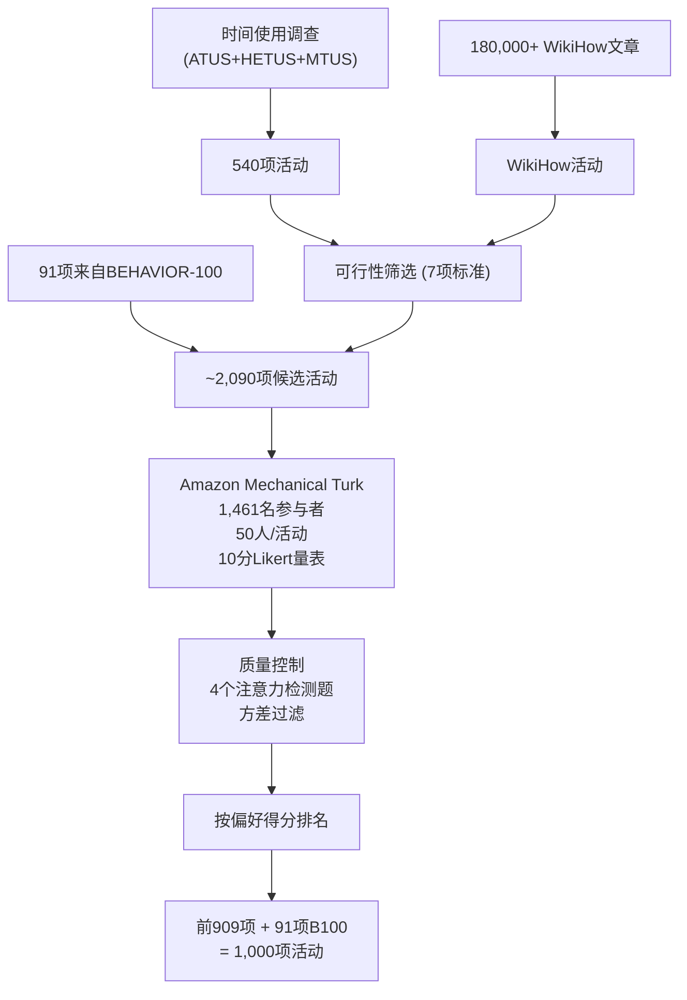

调查的关键设计决策:

- **量表选择**: 先进行了试点研究, 对比了 **Likert量表** (1-10分评分) 和 **最佳-最差缩放 (BWS)**, 结果发现两者的Kendall's tau相关性很高, 最终选择了更简单的Likert量表.
- **措辞试验**: 测试了三种措辞——"robot" (机器人)、"assistant" (助手)、"automation" (自动化), 通过30次T检验和10次ANOVA分析证明措辞对结果无显著影响.
- **质量控制**: 每位参与者有4个重复评估的注意力检测题, 若超过2次偏差>2分则剔除; 同时通过方差过滤排除随机作答者.

#### 2.2.4 核心发现

调查的核心发现是人类偏好呈现 **高度分散性**:

$$G = \frac{\sum_{i=1}^{n}\sum_{j=1}^{n}|x_i - x_j|}{2n^2\bar{x}} = 0.158$$

其中 $G=0.158$ 的基尼系数表明: 人类并非集中偏好少数几类活动, 而是对广泛的日常活动都有需求. 具体而言:

- **最高分类别**: 清洁/打扫类活动 (如 "擦洗浴室地板") — 得分最高, 反映人类对繁琐体力劳动的强烈自动化需求
- **中等分类别**: 烹饪类活动 (200+项) — 既有高分 (准备大型晚餐) 也有低分 (打开烤箱)
- **最低分类别**: 娱乐/游戏类活动 — 人类更倾向自己享受这些活动

最终, 从调查中选取偏好得分最高的 **909项活动**, 加上来自前作BEHAVIOR-100的 **91项活动**, 组成了BEHAVIOR-1K的 **1,000项活动**.

---

## 3. BEHAVIOR-1K 数据集

### 3.1 BDDL: 活动定义语言

BDDL (BEHAVIOR Domain Definition Language) 是BEHAVIOR-1K用于形式化定义活动的谓词逻辑语言, 其设计灵感来自经典AI规划中的 **PDDL (Planning Domain Definition Language)**, 但做了重要的简化和扩展以适应具身AI的特殊需求.

#### 3.1.1 BDDL的结构

每个BDDL定义包含四个部分:

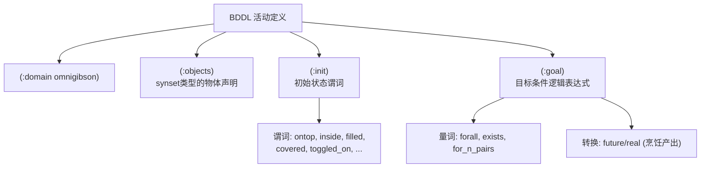

#### 3.1.2 BDDL示例: BakingSugarCookies

以"烘焙糖饼干"活动为例, 这是BEHAVIOR-1K中最复杂的活动定义之一:

```lisp
(define (problem baking_sugar_cookies-0)
    (:domain omnigibson)
    (:objects
        flour.n.01_1 - flour.n.01
        granulated_sugar.n.01_1 - granulated_sugar.n.01
        raw_egg.n.01_1 - raw_egg.n.01
        sugar_cookie.n.01_1 ... sugar_cookie.n.01_6 - sugar_cookie.n.01
        oven.n.01_1 - oven.n.01
        mixing_bowl.n.01_1 - mixing_bowl.n.01  ...)
    (:init
        (filled flour__sack.n.01_1 flour.n.01_1)
        (ontop flour__sack.n.01_1 countertop.n.01_1)
        (future sugar_cookie.n.01_1) ... (future sugar_cookie.n.01_6) ...)
    (:goal (and
        (real ?sugar_cookie.n.01_1)   ;; 所有6块饼干都被真实创造
        (real ?sugar_cookie.n.01_2) ...
        (ontop ?sugar_cookie.n.01_1 ?cookie_sheet.n.01_1) ...)))
```

这个例子展示了BDDL相对于PDDL的两个关键扩展:

1. **`future`/`real` 三值谓词**: 在初始状态中, 糖饼干被标记为 `(future sugar_cookie.n.01_1)`, 表示它们尚不存在但**将会被创造**. 当面团在烤箱中被加热到足够温度后, **Transition Machine** 将 `future` 转换为 `real`, 此时 `(real ?sugar_cookie.n.01_1)` 为真.

2. **物质 (Substance) 系统**: 面粉、糖等以粒子系统而非离散物体的形式存在, 用 `filled` 谓词表示容器与物质的关系.

#### 3.1.3 BDDL vs PDDL 对比

| 特性 | PDDL | BDDL |
|------|------|------|
| 设计目标 | 抽象AI规划 | 具身AI仿真评估 |
| 对象类型 | 自由定义 | WordNet synset |
| 动作定义 | 显式前置/后置条件 | 隐式 (由仿真器和Transition Machine处理) |
| 连续状态 | 不支持 | 温度、浸润度、覆盖度 |
| 物质/流体 | 不支持 | 粒子系统 + `filled`/`covered` |
| 烹饪转换 | 不支持 | `future`/`real` + Transition Machine |
| 量词 | `forall`, `exists` | 扩展 `for_n_pairs` |
| 可读性 | 面向AI规划器 | 面向非专家标注者 |

### 3.2 知识库标注管线

BEHAVIOR-1K的知识库构建是一个多阶段、多方法的标注流程, 将自然语言的活动描述转化为可执行的BDDL定义.

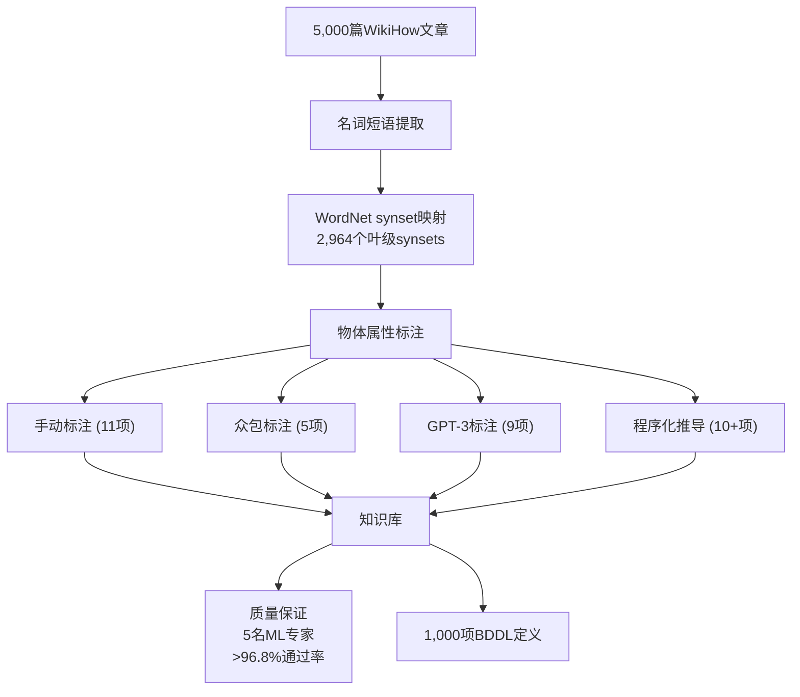

#### 3.2.1 对象空间构建

从5,000篇与1,000项活动相关的WikiHow文章中提取名词短语, 映射到 **WordNet** 的语义网络:

- **2,964个叶级synsets**: 每个synset对应一类物理实体 (如 `tomato.n.01`, `desk.n.01`)
- **DAG结构的继承**: 当活动需要 `grocery.n.01` 时, 任何后代synset (如 `apple.n.01`) 都可满足
- **自定义synsets**: 对WordNet未覆盖的概念 (如 `grated_cheese.n.01`) 添加了自定义条目

#### 3.2.2 物体属性体系

BEHAVIOR-1K为每个物体类别标注了 **35+物理属性**, 采用四种标注方法:

| 标注方法 | 属性数 | 代表性属性 | 标注者 |
|---------|--------|-----------|-------|
| **手动** | 11 | assembleable, cloth, fillable, rigidBody, softBody, rope, meltable, mixingTool | 专家团队 |
| **众包** | 5 | breakable, flammable, openable, toggleable | AMT众包工人 |
| **GPT-3** | 9 | coldSource, cookable, heatSource, liquid, sliceable, slicingTool, fireSource, particleRemover | GPT-3 + 人工验证 |
| **程序化** | 10+ | deformable (=softBody∪cloth∪rope), freezable (=heatable), diceable (=sliceable的子synset), foldable, unfoldable, substance | 规则推导 |

以GPT-3标注为例, 对 `cookable` 属性的prompt是: *"Can a [object] be cooked?"*; 对 `sliceable` 属性的prompt是: *"Can a [object] be sliced easily by a human with a knife?"*

质量保证: 5名ML专家对10%的随机样本进行验证, 所有标注类型的 **通过率>96.8%**, 活动定义的Likert评分 **>4.85/5.0**.

### 3.3 场景与3D模型

BEHAVIOR-1K包含 **50个全交互式场景**, 覆盖 **8种场景类型** — 这是同类基准中场景多样性最高的:

| 场景类型 | 数量 | 物体数量范围 | 代表性场景 |
|---------|------|------------|----------|
| 住宅 (BEHAVIOR-100遗留) | 15 | 21-187 | Beechwood, Benevolence, Merom |
| 住宅+花园 | 5 | 185-712 | Pomaria_garden, Rs_garden |
| 新住宅 | 3 | 304-1,375 | double_floor, single_floor |
| 杂货店 | 4 | 1,889-6,994 | grocery_store_asian, grocery_store_cafe |
| 大厅 | 4 | 78-3,372 | hall_arch_wood, hall_train_station |
| 酒店 | 3 | 48-322 | hotel_gym_spa, hotel_suite |
| 办公室 | 5 | 225-1,151 | office_cubicles, office_vendor_machine |
| 餐厅 | 6 | 174-1,368 | restaurant_asian, restaurant_brunch |
| 学校 | 5 | 556-890 | school_biology, school_chemistry |

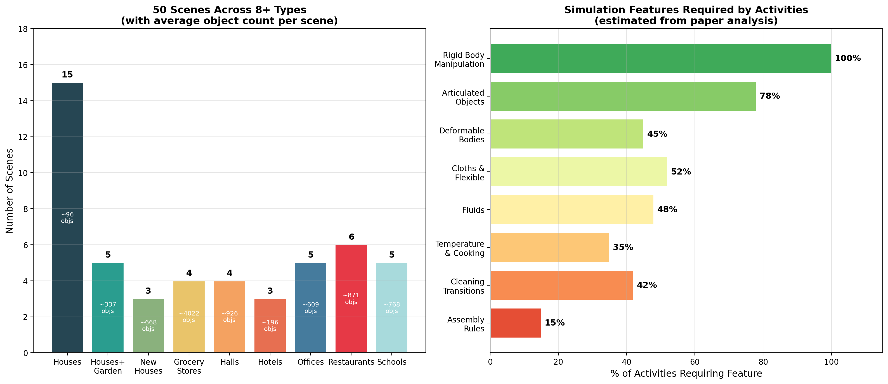

物体模型统计:
- **9,318个物体实例** (vs BEHAVIOR-100的1,217个, 增长7.7倍)
- **1,949个物体类别** (vs BEHAVIOR-100的391个, 增长5.0倍)
- **每活动3-47个物体** (长尾分布)

---

## 4. OmniGibson 仿真环境

### 4.1 技术栈与设计理念

OmniGibson是BEHAVIOR-1K配套的仿真器, 从前作iGibson 2.0 (基于PyBullet) 全面升级到 **NVIDIA Omniverse + PhysX 5** 平台. 这一技术栈迁移的核心动机是: iGibson 2.0的PyBullet引擎无法支持流体、可变形体和布料等物理效果, 而这些效果对1,000项活动中约**48%**的活动是必需的.

### 4.2 静态架构

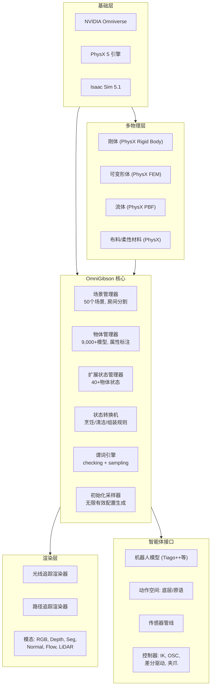

### 4.3 扩展物体状态系统

OmniGibson的核心创新之一是 **扩展物体状态 (Extended Object States)** 系统, 它在PhysX 5的基础物理之上增加了一套 **连续值** 的物理量:

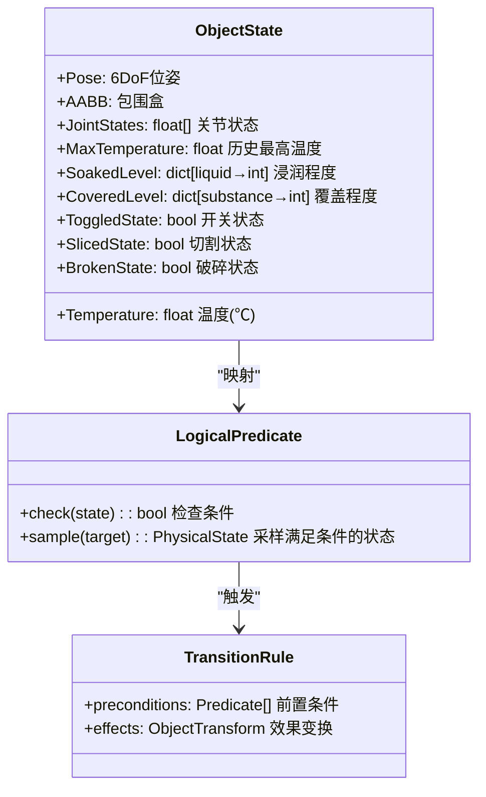

关键状态的判定逻辑 (LaTeX形式化):

**Cooked (烹饪完成)**:
$$\text{Cooked}(o) \iff T_{\text{cooked}} \leq T_o^{\max} < T_{\text{burnt}}$$

**Soaked (浸湿)**:
$$\text{Soaked}(o, l) \iff w(o, l) \geq w_{\text{threshold}}$$

其中 $w(o,l)$ 是物体 $o$ 被液体 $l$ 浸润的粒子数, 默认阈值为50个粒子.

**OnTopOf (在...之上)**:
$$\text{OnTopOf}(o_1, o_2) \iff o_2 \in \text{NegVertAxis}(o_1) \land o_2 \notin \text{PosVertAxis}(o_1) \land \text{Contact}(o_1, o_2)$$

通过沿垂直轴的射线检测加接触检测来判定空间关系.

### 4.4 仿真循环 (动态架构)

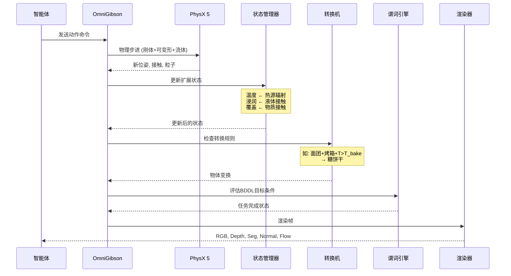

### 4.5 Transition Machine (状态转换机)

Transition Machine是OmniGibson的独特机制, 用于处理PhysX无法直接仿真的物理过程. 系统包含 **9种转换规则**:

| 规则类型 | 功能 | 示例 |
|---------|------|------|
| SlicingRule | 切割 | 刀 + 番茄 → 两半 |
| DicingRule | 切丁 | 刀 + 半番茄 → 番茄丁 |
| MeltingRule | 融化 | 热源 + 巧克力 → 液态巧克力 |
| CookingRule | 烹饪 | 烤箱 + 面团 → 面包 |
| CookingPhysicalParticleRule | 粒子烹饪 | 锅 + 生肉粒 → 熟肉粒 |
| MixingToolRule | 搅拌 | 搅拌器 + 多种原料 → 混合物 |
| WasherRule | 清洗 | 洗衣机 + 脏衣物 → 干净衣物 |
| DryerRule | 烘干 | 烘干机 + 湿衣物 → 干衣物 |
| ToggleableMachineRule | 机器操作 | 开关 + 设备 → 状态变化 |

这些转换规则根据场景中的物体**动态加载**, 仅实例化当前场景所需的规则.

以BakingSugarCookies为例:


### 4.6 视觉质量与性能

**视觉质量**: 通过Amazon Mechanical Turk的主观评估, OmniGibson的视觉真实度得分为 **3.20/5.0**, 显著优于所有对比仿真器:

| 仿真器 | 视觉质量评分 |
|--------|------------|
| **OmniGibson** | **3.20** |
| Habitat 2.0 | 1.74 |
| AI2-THOR | 1.73 |
| BEHAVIOR-100 (iGibson 2.0) | 1.69 |
| TDW Transport | 1.65 |

**性能基准** (场景: Rs_int, 81个物体):

| 配置 | 步/秒 (SPS) |
|------|------------|
| 完整功能 (流体+布料+状态更新+机器人) | 24 |
| 禁用流体和布料 | 58 |
| 禁用状态更新 | 77 |
| 禁用机器人 (仅场景) | 90 |

---

## 5. 基线实验分析

### 5.1 实验设置

论文选择了三个代表性活动, 覆盖不同物理仿真需求:

| 活动 | 物理特性 | 最少步骤 | 关键挑战 |
|------|---------|---------|---------|
| **CollectTrash** | 刚体操作 | 16步 | 长时间跨度, 状态别名 |
| **StoreDecoration** | 关节物体 (抽屉) 操作 | ~8步 | 精确放置 |
| **CleanTable** | 柔性材料 + 流体 | 6步 | 布料浸泡+擦拭 |

三种基线方法:

| 方法 | 算法 | 动作空间 | 核心特点 |
|------|-----|---------|---------|
| **RL-VMC** | SAC | 底层关节控制 | 端到端视觉-运动控制 |
| **RL-Prim** | PPO | 6种动作原语 | navigate, pick, place, push, dip, wipe |
| **RL-Prim-Hist** | PPO | 6种动作原语 + 3步历史 | 增加时序记忆 |

### 5.2 实验结果

| 方法 | 动作原语 | 历史 | StoreDecoration | CollectTrash | CleanTable |
|------|---------|------|-----------------|--------------|------------|
| RL-VMC | ✗ | ✗ | $0.0 \pm 0.0$ | $0.0 \pm 0.0$ | $0.0 \pm 0.0$ |
| RL-Prim | ✓ | ✗ | $0.48 \pm 0.06$ | $0.42 \pm 0.02$ | $0.77 \pm 0.08$ |
| RL-Prim-Hist | ✓ | ✓ | $0.55 \pm 0.05$ | $0.63 \pm 0.03$ | $0.88 \pm 0.02$ |

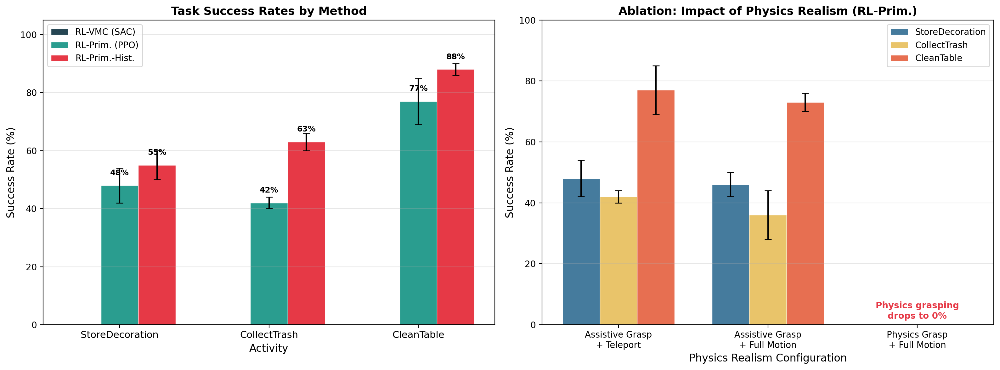

### 5.3 结果分析

**RL-VMC的彻底失败 (0%)**: 端到端视觉-运动控制在所有三个活动上完全失败, 原因可归结为三个层面:

1. **信用分配问题 (Credit Assignment)**: 在需要16步的CollectTrash中, 稀疏奖励 (仅在完成时给予) 使得算法无法判断哪些中间动作是有益的
2. **深度探索困难 (Deep Exploration)**: SAC的 $\epsilon$-贪婪/熵奖励探索策略在高维连续动作空间中极其低效
3. **梯度消失 (Vanishing Gradients)**: 长时序轨迹上的反向传播导致早期时间步的梯度趋近于零

SAC的优化目标:
$$\pi^* = \arg\max_\pi \mathbb{E}_{\tau \sim \pi} \left[ \sum_{t=0}^\infty \gamma^t \left( R(s_t, a_t, s_{t+1}) + \alpha \mathcal{H}(\pi(\cdot|s_t)) \right) \right]$$

即使加入了熵正则化项 $\alpha \mathcal{H}$, SAC也无法在如此长的时间跨度上学到有意义的行为.

**动作原语的关键作用**: RL-Prim通过将底层控制抽象为6种语义化原语, 将SAC连续空间中的 "在关节空间中探索数千步到达正确位姿" 简化为 "选择一个物体和一个原语", 极大地缩小了有效搜索空间.

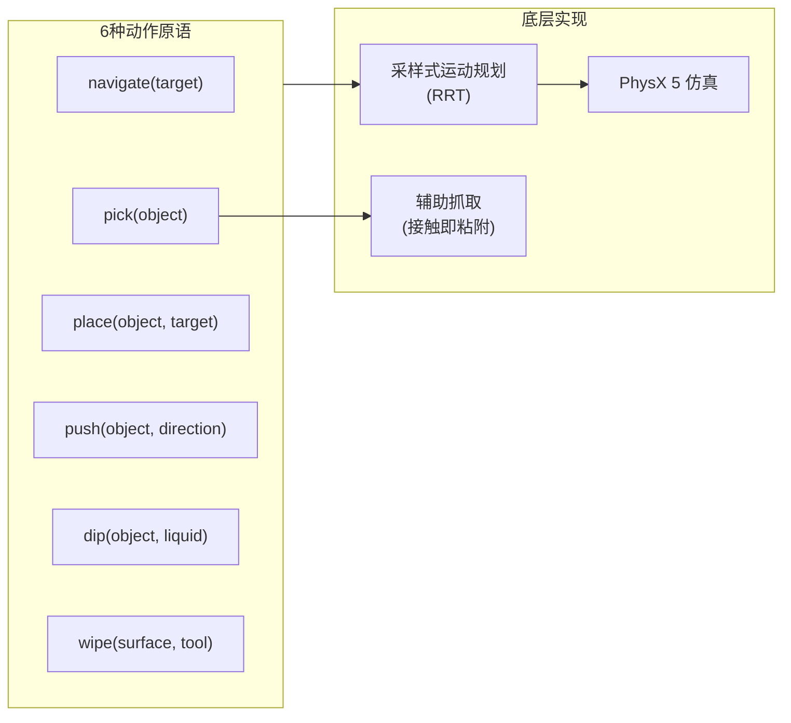

PPO的优化目标:
$$L^{\text{CLIP}}(\theta) = \hat{\mathbb{E}}_t \left[ \min \left( r_t(\theta)\hat{A}_t,\ \text{clip}(r_t(\theta), 1-\epsilon, 1+\epsilon)\hat{A}_t \right) \right]$$

**记忆的显著作用**: RL-Prim到RL-Prim-Hist的提升在CollectTrash上最为显著 (+50%, 从0.42到0.63). 原因在于: 当机器人面向垃圾桶时, 不同时间步的视觉观测几乎相同, 但机器人需要知道**哪些位置已经清理过**才能决定下一步行动. 3步历史观测提供了足够的时序上下文来消除状态别名.

### 5.4 效率指标

| 方法 | 导航距离 [m] | 仿真时间 [s] | 运动扰动 [m] |
|------|-------------|-------------|-------------|
| RL-VMC | $27.58 \pm 5.95$ | $16.67 \pm 0.00$ | $0.00 \pm 0.00$ |
| RL-Prim | $17.98 \pm 2.35$ | $13.95 \pm 5.14$ | $12.34 \pm 5.01$ |
| RL-Prim-Hist | $15.33 \pm 2.70$ | $12.48 \pm 3.68$ | $10.82 \pm 3.90$ |

RL-Prim-Hist不仅成功率最高, 在所有效率指标上也最优: 导航距离更短 (更直接的路径选择)、仿真时间更少 (更少的冗余动作)、对场景的物理扰动更小 (更精确的操作).

---

## 6. Sim-to-Real 迁移分析

### 6.1 实验设置

论文使用真实的 **Tiago++ 双臂移动操作机器人** 在一个模拟公寓中进行CollectTrash任务的sim-to-real迁移实验:

- **数字孪生构建**: 使用3D扫描 (Scaniverse) 扫描真实公寓, 然后用数据集中的3D模型替换墙壁、地板和物体
- **感知管线**: YOLOv3物体检测 + RGB-D深度相机 → 3D物体定位
- **定位**: 基于双LiDAR的粒子滤波定位
- **运动规划**: 与仿真中相同的采样式运动规划算法 (RRT), 附加调参

### 6.2 两种评估策略

为分解sim-to-real差距的来源, 论文设计了两种评估策略:

1. **最优策略 (R-OP)**: 由人类选择动作原语 → 仅评估 **执行差距** (actuation gap)
2. **训练策略 (R-TP)**: 使用在仿真中训练的RL-Prim视觉策略 → 评估 **执行差距 + 感知差距** (perception gap)

### 6.3 结果

| 设置 | 运行次数 | 成功率 |
|------|---------|--------|
| 仿真 (RL-Prim) | 50 | ~40% |
| 真实 + 最优策略 (R-OP) | 27 | ~22% |
| 真实 + 训练策略 (R-TP) | 26 | 0% |

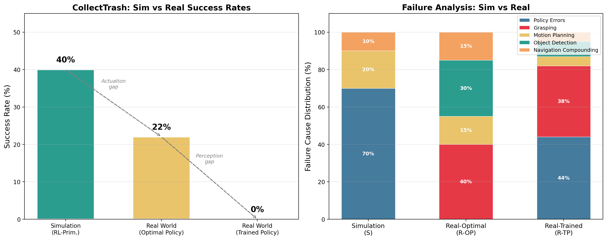

### 6.4 失败原因深度分析

```mermaid
flowchart TB
    SimGap["Sim-to-Real 差距"]
    SimGap --> Actuation["执行差距<br/>(仿真→真实最优: 40%→22%)"]
    SimGap --> Perception["感知差距<br/>(真实最优→真实训练: 22%→0%)"]
    SimGap --> Compound["误差累积效应"]
    Actuation --> Grasp["抓取失败 ~40%<br/>接触力学差异"]
    Actuation --> MotionPlan["运动规划失败<br/>碰撞检测差异"]
    Perception --> VisPolicy["视觉策略错误 44%<br/>动态范围/纹理差异"]
    Perception --> ObjDet["物体检测错误<br/>光照条件差异"]
    Compound --> NavError["导航误差累积:<br/>t时刻的位置偏差<br/>→ t+1时刻的操作不可行"]
```

**失败原因分布**:

| 失败原因 | 仿真 (S) | 真实-最优 (R-OP) | 真实-训练 (R-TP) |
|---------|---------|----------------|----------------|
| 策略错误 | ~70% | — | 44% |
| 抓取失败 | 0% (辅助抓取) | ~40% | ~38% |
| 运动规划 | ~20% | ~15% | ~5% |
| 物体检测 | 0% | ~30% | ~8% |
| 导航累积 | ~10% | ~15% | ~5% |

### 6.5 关键发现

1. **抓取是普遍瓶颈**: 无论使用最优策略还是训练策略, 抓取失败都占约40%的失败原因. 仿真中使用辅助抓取 (接触即粘附) 完全绕过了这个问题, 但真实世界中的抓取涉及接触力学、摩擦力、物体形状等大量未建模的因素.

2. **视觉域差距是训练策略失败的主因**: 44%的R-TP失败来自视觉策略选择了错误的动作原语. 虽然OmniGibson的视觉质量评分3.20远高于其他仿真器, 但真实相机的动态范围、精确的木质纹理和表面反射率仍存在显著差异. 论文使用了基于SECANT的图像增强, 但仍不足以弥合差距.

3. **导航误差会累积**: 一个独特的发现是, 仿真中假设完美定位和执行, 但真实世界中 $t$ 时刻的微小导航误差会导致 $t+1$ 时刻的操作变得不可行. 这种 **级联错误** 在仿真中完全不存在.

---

## 7. 纵向分析: 演进历史

### 7.1 具身AI基准的演进脉络

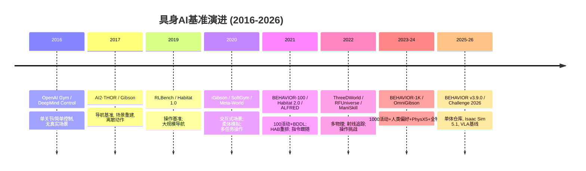

### 7.2 从BEHAVIOR-100到BEHAVIOR-1K的关键跃迁

| 维度 | BEHAVIOR-100 (2021) | BEHAVIOR-1K (2024) | 提升幅度 |
|------|--------------------|--------------------|---------|
| 活动数量 | 100 | 1,000 | 10× |
| 人类偏好基础 | ✗ (研究者设计) | ✓ (1,461人调查) | 质的飞跃 |
| 场景数量 | 15 (仅住宅) | 50 (8种类型) | 3.3× |
| 物体类别 | 391 | 1,949 | 5.0× |
| 物体实例 | 1,217 | 9,318 | 7.7× |
| 仿真引擎 | iGibson 2.0 (PyBullet) | OmniGibson (PhysX 5) | 全面升级 |
| 可变形体 | ✗ | ✓ | 新增 |
| 流体 | ✗ | ✓ | 新增 |
| 布料 | ✗ | ✓ | 新增 |
| 温度系统 | ✗ | ✓ | 新增 |
| 视觉质量 | 1.69/5.0 | 3.20/5.0 | 1.89× |
| BDDL版本 | v1 (基础) | v3 (substances+future/real) | 重大扩展 |

### 7.3 iGibson → OmniGibson 仿真器演进

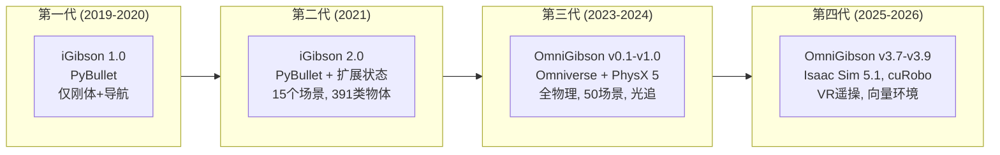

代际跃迁的驱动力:

- **第一代→第二代**: 从纯导航到交互式场景, 增加了对象状态跟踪
- **第二代→第三代**: **物理引擎从PyBullet升级到PhysX 5**, 这是最关键的跃迁. PyBullet无法支持FEM可变形体、PBF流体和布料仿真, 这些能力是覆盖1,000项活动的必要条件
- **第三代→第四代**: 工程成熟化 — pip安装、向量环境 (并行训练)、cuRobo运动规划、LeRobot/HDF5数据格式集成、单体仓库 (monorepo) 重组

### 7.4 BDDL语言的演进

BDDL从BEHAVIOR-100到BEHAVIOR-1K经历了从v1到v3的重大升级:

- **物质系统 (Substances)**: 新增对面粉、液体、粉末等粒子物质的原生支持
- **三值谓词 (Three-Valued Predicates)**: `future`/`real` 机制支持烹饪等创造新物体的过程
- **组合/分解 (Composition/Decomposition)**: 支持物体的组装和拆解
- **`for_n_pairs` 量词**: 允许指定 "恰好N对物体满足某条件", 比 `forall` 更灵活

### 7.5 后续影响

BEHAVIOR-1K发表以来的显著影响:

- **2026 BEHAVIOR Challenge**: 100项任务, 20,000个遥操示范, pi0.5和GR00T N1.7作为基线
- **仓库活跃度**: 16,178个commits, 947个PR, 270个open issues, 10+活跃贡献者
- **版本演进**: 从v0.1.0到v3.9.0, 共16个release, 持续集成Isaac Sim最新版本
- **生态系统**: 集成cuRobo运动规划、JoyLo遥操作、SB3/LeRobot训练框架

---

## 8. 横向分析: 同类基准对比

### 8.1 全面对比表

论文与22个具身AI基准进行了系统对比. 以下是最关键的几个对比维度:

| 基准 | 活动数 | 场景类型 | 物体类别 | 物体模型 | 每活动物体 | 状态变化 | 视觉质量 |
|------|--------|---------|---------|---------|-----------|---------|---------|
| **BEHAVIOR-1K** | **1,000** | **8** | **1,949** | **9,318** | **3-47** | **2-11** | **3.20** |
| BEHAVIOR-100 | 100 | 1 | 391 | 1,217 | 3-34 | 2-8 | 1.69 |
| VirtualHome | 549 | 1 | 308 | UNK | 1-24 | 1-7 | — |
| ALFRED | 7 | 1 | 84 | 84 | 2 | 2-3 | 1.73 |
| Habitat 2.0 | 3 | 1 | 41+YCB | 92+YCB | 5 | 1-2 | 1.74 |
| AI2-THOR | 1 | 1 | 118 | 118 | 5 | 4 | 1.73 |
| RFUniverse | 5 | 1 | UNK | UNK | 1-6 | 1 | — |
| RLBench | 50 | 1 | ~28 | 28 | 1-2 | 1-4 | — |
| IKEA Furniture | 100 | 1 | 73+ | 73+ | 1-2 | 1-3 | — |
| SoftGym | 10 | 1 | 4 | 4 | 1-3 | 1-3 | — |

### 8.2 物理仿真能力对比

| 能力 | BEHAVIOR-1K | BEHAVIOR-100 | RFUniverse | SoftGym | 其他基准 |
|------|-------------|-------------|------------|---------|---------|
| 运动学/动力学 | ✓ | ✓ | ✓ | ✓ | 大多数 ✓ |
| 连续扩展状态 | ✓ | ✓ | ✗ | ✗ | 全部 ✗ |
| 柔性材料 | ✓ | ✗ | ✓ | ✓ | 全部 ✗ |
| 可变形体 | ✓ | ✗ | ✓ | ✗ | 全部 ✗ |
| 流体仿真 | ✓ | ✗ | ✓ | ✓ | 全部 ✗ |
| 热效应 | ✓ | ✗ | ✓ | ✗ | 全部 ✗ |
| 真实动作执行 | ✓ | ✓ | ✓ | ✓ | 部分 |
| 无限场景初始化 | ✓ | ✓ | ✗ | ✗ | 仅HAB 2.0 |

### 8.3 多维度雷达图

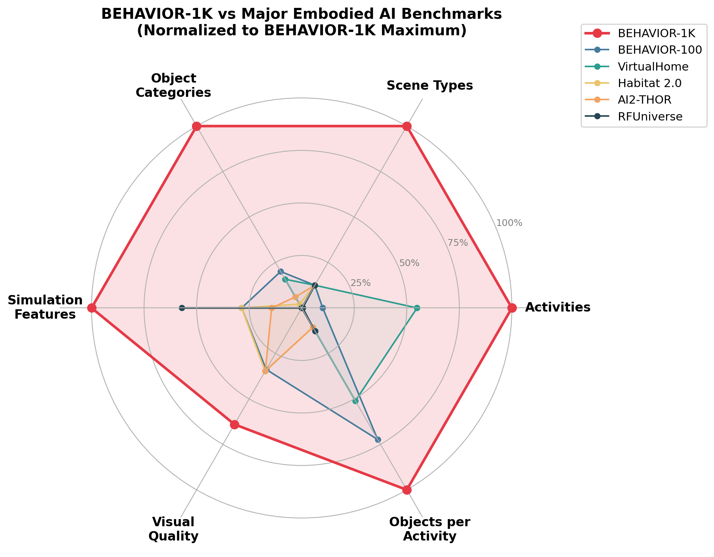

### 8.4 三个演化路线的对比

从宏观视角看, 具身AI基准沿三条路线演化:

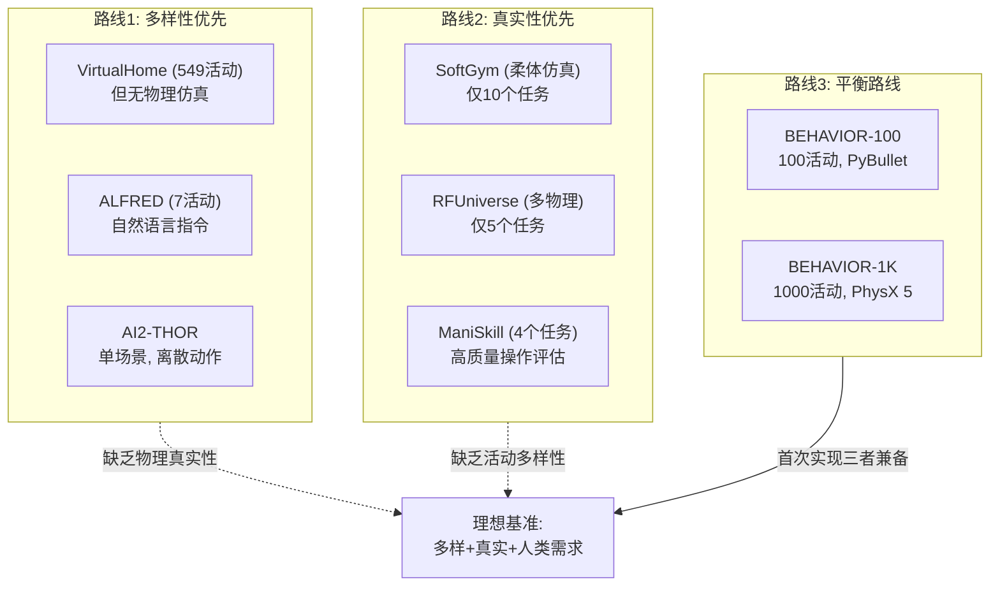

**BEHAVIOR-1K是唯一同时实现以下所有特性的基准**:
1. 人类偏好调查驱动的活动选择
2. 1,000+活动的超大规模
3. 8种场景类型的多样性
4. 可变形体 + 流体 + 布料 + 温度变化的全物理仿真
5. 连续扩展物体状态
6. 视觉质量评分>3.0
7. 无限场景初始化

---

## 9. 消融分析

### 9.1 物理简化的消融

论文对RL-Prim进行了详细的物理简化消融实验, 探究不同物理真实度对任务成功率的影响:

| 抓取方式 | 运动执行 | StoreDecoration | CollectTrash | CleanTable |
|---------|---------|-----------------|--------------|------------|
| 辅助抓取 | 瞬移 | $0.48 \pm 0.06$ | $0.42 \pm 0.02$ | $0.77 \pm 0.08$ |
| 辅助抓取 | 完整物理 | $0.46 \pm 0.04$ | $0.36 \pm 0.08$ | $0.73 \pm 0.03$ |
| 完整物理 | 完整物理 | $0.0 \pm 0.0$ | $0.0 \pm 0.0$ | $0.0 \pm 0.0$ |

### 9.2 核心发现

**发现1: 抓取是最大的瓶颈 (影响=100%)**

从辅助抓取切换到完整物理抓取后, **所有三个活动的成功率均从40-88%骤降至0%**. 这不是"性能下降"而是"完全失败", 揭示了一个深刻的事实: 当前基于采样的运动规划 + 标准夹爪控制器**无法可靠地抓取任意形状的日常物体**. 这一发现直接指向了抓取研究作为具身AI的关键短板.

**发现2: 运动执行的影响相对较小 (影响≈5-15%)**

从瞬移 (teleport) 切换到完整物理运动执行后, 性能仅有微小下降. 这支持了论文的假设: 在自由空间中, 采样式运动规划器 (RRT) 在绝大多数情况下能找到可行路径.

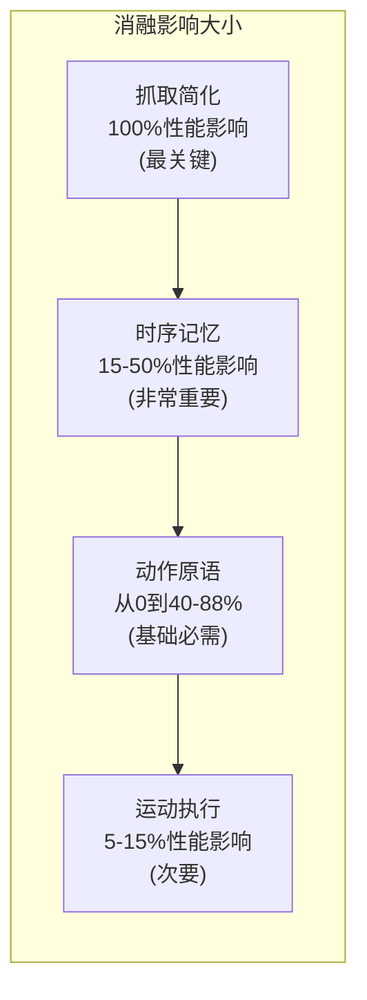

**发现3: 动作原语是必要条件**

RL-VMC的100%失败率表明, 在BEHAVIOR-1K这种长时间跨度的活动中, 某种形式的动作抽象是**必要条件**, 而非可选优化. 没有原语, 强化学习在稀疏奖励下根本无法学到有意义的行为.

**发现4: 记忆对长时间活动至关重要**

RL-Prim到RL-Prim-Hist的提升:
- StoreDecoration: +15% (0.48→0.55) — 较短任务, 提升有限
- CollectTrash: **+50%** (0.42→0.63) — 长任务+状态别名, 提升巨大
- CleanTable: +14% (0.77→0.88) — 中等任务

提升幅度与活动的**时间跨度**和**状态别名程度**正相关, 这为未来的架构设计提供了明确指导: 长时间活动需要显式的记忆机制.

---

## 10. 2026 BEHAVIOR Challenge

2026 BEHAVIOR Challenge是基于BEHAVIOR-1K的大规模具身AI竞赛, 将benchmark从学术评估推向了社区级的竞争性评估.

### 10.1 竞赛规格

| 维度 | 规格 |
|------|------|
| 任务数量 | 100项完整活动 (66项可自动采样) |
| 场景数量 | 7个 (含4个新场景) |
| 赛道 | 单赛道 (RGB + Depth + 本体感受) |
| 示范数据 | 20,000个人类遥操作示范 (1,950小时, 3.27TB LeRobot + 1.44TB HDF5) |
| 遥操作接口 | JoyLo (操纵杆设备) |
| 基线方法 | pi0.5 (Physical Intelligence), GR00T N1.7 (NVIDIA, 3B参数) |
| 评估指标 | 平均任务成功分数Q (BDDL部分学分) |
| 评估规模 | 1,000次rollout (100任务 × 10实例 × 1次) |
| 默认机器人 | R1Pro (可自定义) |
| 技能类型 | 31种 (pick, place, pour, wipe, chop等) |
| 平均轨迹 | 351.54秒 (~6分钟), 27.06个技能 |

### 10.2 基线方法详情

| 基线 | 架构 | 训练策略 | 动作时间步 |
|------|------|---------|-----------|
| **pi0.5** | 基于OpenPI fork微调 | 32步动作时间步训练, 16步滑动推理 | 32 (训练) / 16 (推理) |
| **GR00T N1.7** | Cosmos-Reason2-2B + 扩散头 (3B参数) | 冻结视觉编码器+LLM, 微调投影层+扩散头 | 16 |

**2025年冠军参考**: 使用修改版pi0.5, 以2048维任务特定嵌入替代语言提示, 达到 **26%成功率** ([代码](https://github.com/IliaLarchenko/behavior-1k-solution)).

### 10.3 时间线

| 日期 | 里程碑 |
|------|-------|
| 2026-07-02 | 竞赛启动, 发布基线代码和数据 |
| 2026-10-16 | 提交截止 |
| 2026-11-04 | 获奖者公布 |

### 10.4 奖金与赞助

- 总奖金: **$11,000** ($5K / $3K / $2K / $1K开源奖)
- 赞助商: Simovation, IMDA, Stanford HAI, Schmidt Family Foundation, Calder
- 排行榜: [HuggingFace Spaces](https://behavior-1k-2026-challenge-leaderboard.hf.space)

### 10.5 技术意义

2026 Challenge相比论文发表时有几个重要进步:

1. **VLA基线 (pi0.5, GR00T N1.7)**: 从传统RL (PPO/SAC) 升级到视觉-语言-动作模型, 反映了2024-2026年具身AI领域从RL向Foundation Model范式的转变. GR00T N1.7使用3B参数的Cosmos-Reason2-2B作为视觉主干, 代表了大模型在机器人控制中的前沿应用.

2. **20,000个遥操作示范**: 1,950小时的人类遥操作数据, 包含270,600个技能实例和31种技能类型, 规模远超论文中的50次仿真评估, 使得模仿学习方法成为可能.

3. **标准化评估管线**: 统一的Docker容器 (单张24GB GPU) 或IP协议 (50+端口) 评估方式, 降低了参与门槛. RTX 4090上RGB-only约20.62 FPS, RGB+Depth约13.52 FPS.

4. **BDDL部分学分**: 排名指标为平均任务成功分数Q, 即使任务未完全成功, 完成部分子目标也能获得分数. 平局时以仿真时间、导航距离、末端执行器位移 (以200个人类示范的平均值归一化) 为辅助指标.

---

## 11. 局限性与未来方向

### 11.1 论文指出的局限

| 局限 | 影响 | 可能的解决方案 |
|------|------|-------------|
| **速度-质量权衡** | 24 SPS (完整特性) vs iGibson的100 FPS | GPU集群并行, 选择性启用物理特性 |
| **无人类交互** | 无法评估需要人机协作的活动 | 集成VR遥操+多智能体框架 |
| **传感器噪声模型缺失** | 仿真中假设完美传感, 放大sim-to-real差距 | 添加基于真实传感器标定的噪声模型 |
| **抓取仿真差距** | 辅助抓取掩盖了真实挑战 | 投入抓取研究, 改善接触力学仿真 |
| **3D资产获取成本高** | 每个物体模型需要手动建模/扫描 | 3D生成模型 (如NeRF/Gaussian Splatting) |
| **BDDL几何目标局限** | 无法表达精细几何约束 (如折纸的精确角度) | 扩展BDDL语法, 增加几何约束原语 |

### 11.2 v3.9.0后的技术演进

基于GitHub仓库的最新状态 (v3.9.0, 2026年7月, 1,600+ Stars, 16,178 commits):

1. **单体仓库 (Monorepo)**: OmniGibson、BDDL3、JoyLo、知识库、资产管线统一到一个仓库, 简化了依赖管理. 原独立OmniGibson仓库已重定向到BEHAVIOR-1K仓库.

2. **Isaac Sim 5.1**: 升级到最新的NVIDIA仿真平台, 从Isaac Sim 2022.2.1 → 2023.1.1 → 4.1 → 4.2/4.5 → 5.1的持续演进.

3. **YAML驱动的机器人定义**: 将机器人子类重构为单一类+YAML配置, 支持 **12种机器人**: 4种移动平台 (Turtlebot, Locobot, Husky, Freight), 4种操作臂 (Franka及变体, VX300S, A1), 4种移动操作 (Fetch, Tiago, Stretch, R1/R1Pro), 外加VR专用BehaviorRobot.

4. **对象层次简化**: 合并BaseObject+StatefulObject, 合并USDObject+BaseObject, 降低代码复杂度.

5. **Fabric强制启用**: 移除禁用选项, 统一使用Fabric进行高性能物理计算.

6. **40+物体状态**: 扩展到19种绝对状态 (温度、烹饪、冷冻、着火等) + 11种关系状态 (OnTop, Inside, Touching等) + 4种固有状态 (粒子相关).

7. **向量环境**: 支持并行仿真实例, 加速训练.

8. **CuRobo集成**: NVIDIA GPU加速的运动规划, 替代传统CPU采样式规划器.

9. **LeRobot/HDF5兼容**: 支持LeRobot回放和HDF5数据格式, 便于与社区训练框架集成.

10. **辅助抓取优化**: 抓取窗口从3.0降至0.7, 使抓取条件更严格、更接近真实.

### 11.3 活跃的社区生态

| 指标 | 数值 |
|------|------|
| GitHub Stars | ~1,600 |
| 总PR数 | ~947 (38 open + 909 closed) |
| 开放Issues | 270 |
| 总Releases | 16 |
| 活跃贡献者 | 10+ (wensi-ai, cgokmen, stefren, kmy17518等) |
| Discord社区 | [discord.gg/bccR5vGFEx](https://discord.gg/bccR5vGFEx) |
| 知识库 (Live) | 1,016任务, 9,589物体, 51场景, 3,484 synsets |

---

## 12. 关键结论

### 12.1 对具身AI研究者的启示

1. **抓取是核心瓶颈**: 消融实验证明, 在日常操作任务中, 可靠的物理抓取是成功的先决条件. 在解决抓取之前, 任何上层规划和控制都会受限.

2. **动作抽象是必要的**: 端到端视觉-运动控制在长时间跨度活动中完全失败 (0%), 某种形式的技能抽象 (动作原语、技能链) 是当前技术下的必要条件.

3. **记忆机制对长任务至关重要**: 状态别名问题使得无记忆的策略在长任务上严重受限, 时序记忆带来最高50%的性能提升.

4. **Sim-to-Real差距仍然巨大**: 即使使用最高视觉质量的仿真器 (3.20/5.0), 训练策略的迁移成功率仍为0%, 核心瓶颈在于抓取力学和视觉域差距.

### 12.2 对基准设计的启示

1. **人类偏好驱动的任务选择**: BEHAVIOR-1K首次证明了通过大规模调查来建立有代表性的活动集的可行性, 这比研究者主观选择更具科学基础.

2. **多样性与真实性必须兼顾**: 仅有多样性 (VirtualHome的549活动但无物理仿真) 或仅有真实性 (SoftGym的精确柔体仿真但仅10个任务) 都不足以构成有效的基准.

3. **形式化活动定义是可扩展性的关键**: BDDL的谓词逻辑方法使得活动定义可以与具体场景解耦, 实现"一次定义, 无限实例化"的可扩展范式.

### 12.3 综合定位

BEHAVIOR-1K在具身AI基准的发展史上占据了一个关键位置: 它是第一个同时满足 **人类需求基础** (大规模偏好调查)、**活动多样性** (1,000项)、**物理真实性** (全物理仿真) 和 **形式化可扩展性** (BDDL) 的综合性基准. 它揭示了当前技术的巨大差距 (最优条件下88%, 真实世界0%), 同时为未来的研究方向 (抓取、记忆、sim-to-real) 提供了明确的指引.

---

## 术语表

| 术语 | 全称 | 含义 |
|------|------|------|
| BDDL | BEHAVIOR Domain Definition Language | 活动定义谓词逻辑语言 |
| OmniGibson | — | 基于Omniverse/PhysX 5的仿真器 |
| PhysX 5 | — | NVIDIA的物理引擎, 支持刚体/可变形/流体/布料 |
| Synset | — | WordNet中的同义词集合, 用于物体类型分类 |
| Likert Scale | — | 心理测量量表, 1-10分评分 |
| Gini Index | — | 不平等系数, 衡量分布离散度 |
| Action Primitives | — | 语义化动作原语 (navigate, pick, place, push, dip, wipe) |
| Extended Object States | — | 扩展物体状态 (温度, 浸润, 覆盖, 开关) |
| Transition Machine | — | 状态转换机, 处理烹饪/清洁/组装等复杂过程 |
| Assistive Grasping | — | 辅助抓取, 接触即粘附的简化模型 |
| Digital Twin | — | 数字孪生, 真实环境的虚拟副本 |
| SAC | Soft Actor-Critic | 基于最大熵RL的连续控制算法 |
| PPO | Proximal Policy Optimization | 近端策略优化, 离散/连续动作的RL算法 |
| RRT | Rapidly-exploring Random Tree | 快速探索随机树, 运动规划算法 |
| AMT | Amazon Mechanical Turk | 亚马逊众包平台 |
| cuRobo | — | NVIDIA的GPU加速运动规划库 |
| JoyLo | — | 基于操纵杆的遥操作框架 |
| VLA | Vision-Language-Action | 视觉-语言-动作模型 |
| SPS | Steps Per Second | 每秒仿真步数 |

## 参考文献

1. Li, C., Zhang, R., Wong, J., Gokmen, C., et al. "BEHAVIOR-1K: A Human-Centered, Embodied AI Benchmark with 1,000 Everyday Activities and Realistic Simulation." CoRL 2024. [arXiv:2403.09227](https://arxiv.org/abs/2403.09227)
2. Srivastava, S., et al. "BEHAVIOR: Benchmark for Everyday Household Activities in Virtual, Interactive, and Ecological Environments." CoRL 2021.
3. Li, C., et al. "iGibson 2.0: Object-Centric Simulation for Robot Learning of Everyday Household Tasks." CoRL 2021.
4. Haarnoja, T., et al. "Soft Actor-Critic: Off-Policy Maximum Entropy Deep Reinforcement Learning with a Stochastic Actor." ICML 2018.
5. Schulman, J., et al. "Proximal Policy Optimization Algorithms." arXiv 2017.
6. Szot, A., et al. "Habitat 2.0: Training Home Assistants to Rearrange Their Habitat." NeurIPS 2021.
7. Kolve, E., et al. "AI2-THOR: An Interactive 3D Environment for Visual AI." arXiv 2017.
8. Puig, X., et al. "VirtualHome: Simulating Household Activities via Programs." CVPR 2018.
9. Shridhar, M., et al. "ALFRED: A Benchmark for Interpreting Grounded Instructions for Everyday Tasks." CVPR 2020.
10. Fan, L., et al. "SECANT: Self-Expert Cloning for Zero-Shot Generalization of Visual Policies." ICML 2021.
