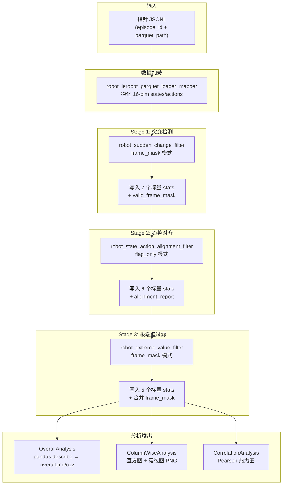
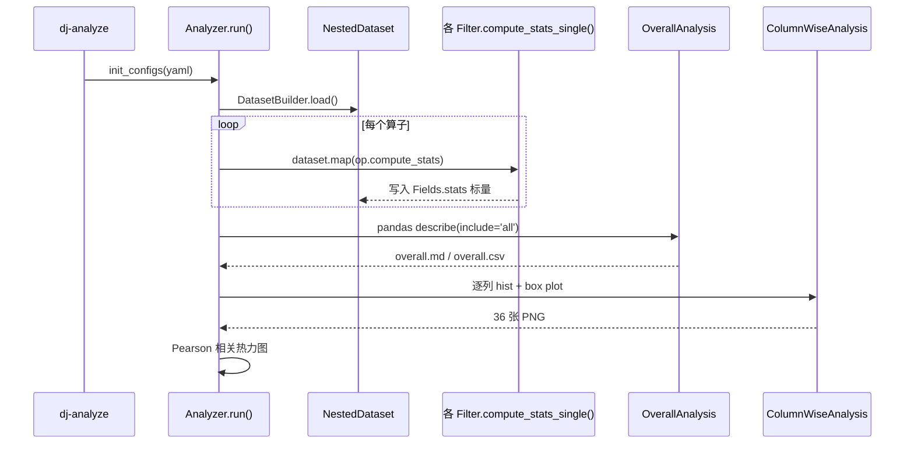
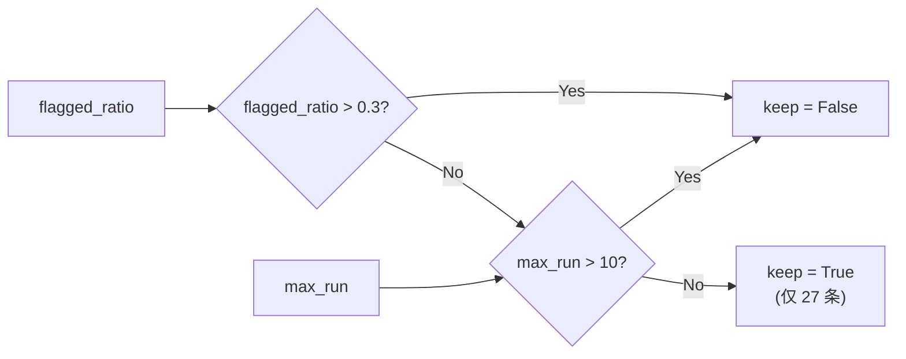
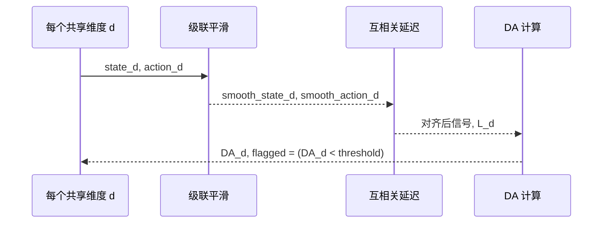
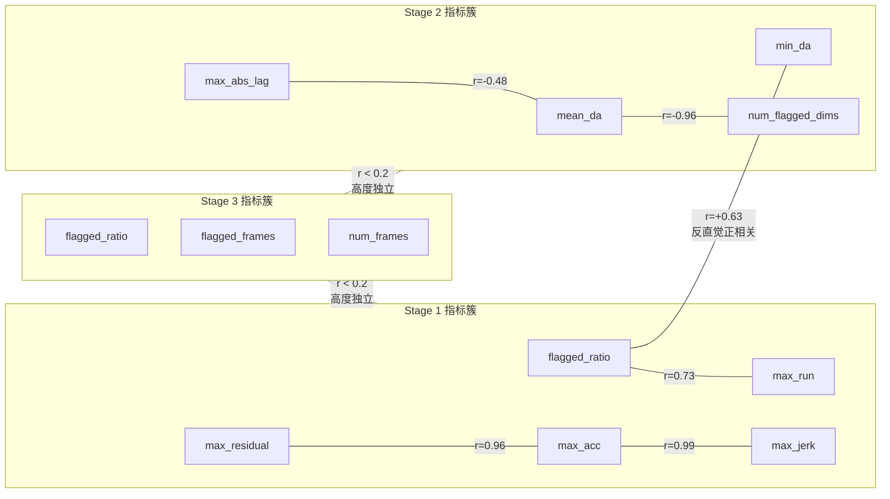
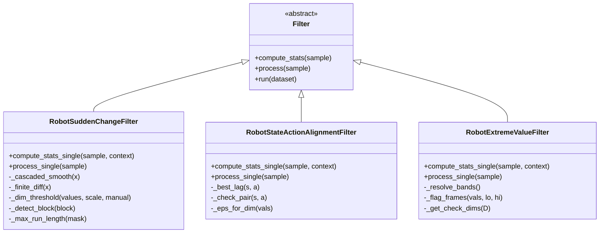
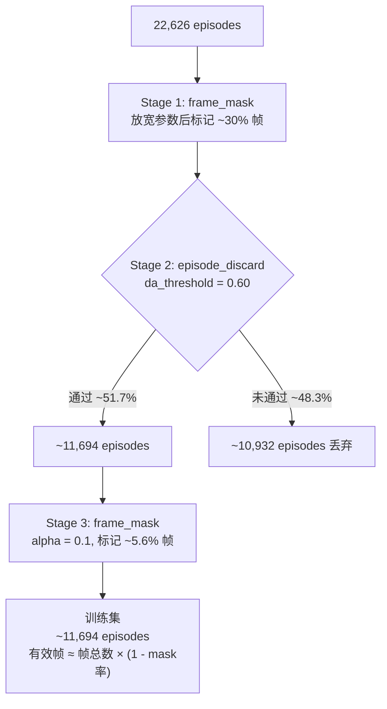

# Galaxea Open-World 全量数据质量分析报告 (v2)

> **分析批次**: `20260713_075405_fbbca6`
> **数据规模**: 22,626 episodes / ~29,217,751 frames / 227 tasks
> **机器人**: Galaxea R1 Lite — 双臂 6-DoF + 夹爪, 16 维关节空间
> **管线**: 三阶段级联质量过滤（非破坏性分析模式）
> **工具**: data-juicer `dj-analyze` + `_au` 扩展算子
> **参考文献**:
> - Qwen-RobotManip (arXiv:2606.17846) 数据清洗管线设计 — `b/d/QwenRobotmanip/` 系列文档
> - GalaxeaOpenWorld 数据集论文
> - data-juicer 能力评估 — `data_impl.md`, `data_impl2.md`

---

## 1. 引言与理论框架

### 1.1 研究背景与动机

Qwen-RobotManip 论文提出了一个核心洞见：**"对齐解锁规模"（Alignment Unlocks Scale）** — 仅当数据经过统一表征（Unified Representation）和系统化质量过滤后，数据规模的扩大才能带来稳定的性能增益（参见 `note_data.md` 第 3 节）。在没有统一跨具身（cross-embodiment）表达的情况下，数据量的增加反而会产生冲突而非协同效应。

该论文构建了覆盖 38,100 小时的训练数据（11,420h 机器人演示 + 1,933h 自我中心视频 + 24,808h H2R 合成），其中 H2R 合成占总数据量的 65%，横跨 15 种双臂平台（参见 `note_data.md` 第 1 节）。为确保如此大规模、多来源数据的质量，论文设计了一套 **五阶段级联清洗管线**（参见 `data_cur3_1.md` 表 1）：

| 阶段 | 名称 | 检测目标 | 粒度 |
|------|------|----------|------|
| Stage 1 | 突变检测（Sudden Change Detection） | 轨迹中的离散异常值与瞬态不连续性 | 帧级 |
| Stage 2 | 状态-动作趋势对齐（State-Action Trend Alignment） | 状态变化与动作指令的因果一致性 | Episode 级 |
| Stage 3 | 极端值过滤（Extreme Value Filtering） | 超出全局百分位带的静态越界帧 | 帧级 |
| Stage 4 | FK 一致性校正（FK Consistency Correction） | 关节角与末端执行器位姿的运动学一致性 | Episode 级（校正） |
| Stage 5 | 基座坐标系对齐（Base Frame Alignment） | 不同数据集间的坐标约定统一 | 全局（变换） |

本分析报告聚焦于前三个阶段（质量检测与过滤阶段），第 4-5 阶段（数据校正与对齐阶段）超出本次分析范围。

### 1.2 GalaxeaOpenWorld 数据集概况

Galaxea R1 Lite 是一款双臂 6-DoF 移动操作机器人。其数据以 16 维关节空间向量表示，打包规则如下（参见 `data_cur3_1.md` 第 2.4 节及 `percentiles.json`）：

| 维度 | 内容 | 臂 | 备注 |
|------|------|-----|------|
| 0 | 左臂关节 0 | L | 6-DoF 主臂关节 |
| 1 | 左臂关节 1 | L | 6-DoF 变体中常为零填充 |
| 2 | 左臂关节 2 | L | |
| 3 | 左臂关节 3 | L | |
| 4 | 左臂关节 4 | L | |
| 5 | 左臂关节 5 | L | |
| 6 | 左臂关节 6 | L | |
| **7** | **左夹爪** | L | **双峰分布，三阶段均豁免** |
| 8 | 右臂关节 0 | R | |
| 9 | 右臂关节 1 | R | 6-DoF 变体中常为零填充 |
| 10 | 右臂关节 2 | R | |
| 11 | 右臂关节 3 | R | |
| 12 | 右臂关节 4 | R | |
| 13 | 右臂关节 5 | R | |
| 14 | 右臂关节 6 | R | |
| **15** | **右夹爪** | R | **双峰分布，三阶段均豁免** |

关键特征：
- **动作类型**：绝对位置指令（`action_is_delta=false`），而非增量 delta
- **数据规模**：22,626 条 episode，总计 29,217,751 帧，覆盖 227 种操作任务
- **采样频率**：约 30Hz（中位 episode 长度 1112 帧 ≈ 37 秒）
- **零填充维度**：6-DoF 变体下维度 1、9 为零填充（$q_{01} = q_{99} \approx 0$）

### 1.3 管线架构总览

#### 三阶段级联分析管线



#### dj-analyze 执行流



三个阶段均使用 **非破坏性策略**（`frame_mask` / `flag_only`），保留全部 22,626 条 episode 用于完整的统计分析。这是分析模式的关键设计：先收集完整统计分布，再基于数据驱动的阈值建议决定生产配置（参见 `data_cur1_2.md` 第 6.3 节调参闭环）。

---

## 2. 超参数配置与设计原理

### 2.1 Stage 1: 突变检测配置

| 参数 | 值 | 设计原理 |
|------|-----|---------|
| `threshold_mode` | `mad` | 自适应阈值，适应不同维度的信号尺度。MAD（中位绝对偏差）比标准差更鲁棒，不受极端值拉偏（参见 `data_cur1_1.md` §2.3） |
| `mad_scale_residual` | 6.0 | 缩放系数 $\lambda$，公式 $\tau_d = \text{median} + \lambda \times 1.4826 \times \text{MAD}$。1.4826 = $1/\Phi^{-1}(3/4)$ 是正态分布下 MAD 到标准差的一致性常数（参见 `data_cur1_1.md` §2.3） |
| `mad_scale_acc` | 6.0 | 加速度通道缩放，与残差通道保持一致 |
| `mad_scale_jerk` | 6.0 | 跃度通道缩放 |
| `max_flagged_ratio` | 0.3 | Episode 允许异常帧占比上限。$> 0.3$ 视为不合格。低于 `threshold_report.md` 建议的 0.5，偏保守 |
| `max_run_length` | 10 | 允许最长连续异常段。$> 10$ 视为不合格（参见 `data_cur1_1.md` Episode 级判据公式） |
| `min_frames` | 30 | 短于 30 帧的 episode 跳过检测，安全保留。差分计算至少需 4 帧 |
| `median_windows` | (3, 5) | 级联中值滤波窗口。先 $w_1=3$ 消除单帧尖峰，再 $w_2=5$ 消除残留宽异常（参见 `data_cur1_1.md` §2.4.2a） |
| `savgol_window` | 11 | SG 平滑窗口。30Hz 下 ≈ 0.37 秒，不会抹平合理的快速动作（参见 `data_cur1_1.md` §2.4.2b） |
| `savgol_polyorder` | 3 | 三阶多项式保留加速度和简单曲率 |
| `exclusion_strategy` | `frame_mask` | 非破坏性：写入帧掩码，不丢弃 episode |

### 2.2 Stage 2: 状态-动作趋势对齐配置

| 参数 | 值 | 设计原理 |
|------|-----|---------|
| `shared_dims` | [0-6, 8-14] | 14 个关节维度。排除夹爪（维度 7, 15）：双峰开合信号不适用趋势对齐检查（参见 `data_cur2_1.md` §2.2） |
| `action_is_delta` | false | Galaxea 使用绝对位置动作指令，无需积分还原 |
| `max_lag` | 15 | 互相关搜索窗口 $[-15, +15]$ 帧。30Hz 下约 ±0.5 秒，覆盖典型控制-执行延迟（参见 `data_cur2_1.md` §3.3） |
| `da_threshold` | 0.65 | 方向一致性阈值。论文建议 0.6-0.7，DA 是"干净"的判别指标（参见 `data_cur2_1.md` §2.3） |
| `eps_mode` | `range_frac` | 活跃帧筛选模式 |
| `eps_frac` | 0.01 | $\epsilon_d = \max(\text{eps\_frac} \times \text{range}_d, \text{eps\_abs})$，1% 信号范围以下视为静止 |
| `min_active_frames` | 10 | 活跃帧不足 10 的维度跳过（不判为失败） |
| `min_frames` | 20 | 短于 20 帧跳过 |
| `exclusion_strategy` | `flag_only` | 仅标注，不丢弃、不写掩码。收集完整统计用于分析 |

### 2.3 Stage 3: 极端值过滤配置

| 参数 | 值 | 设计原理 |
|------|-----|---------|
| `percentile_source` | `stats_json` | 从预计算的 `percentiles.json` 读取全局百分位（参见 `data_cur3_1.md` §1 两遍工作流） |
| `embodiment` | `galaxea_r1_lite` | 对应 16 维关节空间布局 |
| `alpha` | 0.1 | IQR 扩展系数。$L_d = q_{01}^{(d)} - 0.1 \times \text{IQR}_d$, $U_d = q_{99}^{(d)} + 0.1 \times \text{IQR}_d$。10% 容差兼顾灵敏度和鲁棒性（参见 `data_cur3_1.md` §3.3） |
| `exempt_dims` | [7, 15] | 夹爪维度豁免。双峰分布（开/合）会使百分位带检查产生大量假阳性（参见 `data_cur3_1.md` §2.4） |
| `exclusion_strategy` | `frame_mask` | 写入帧掩码，与 Stage 1 的掩码做 AND 合并 |

### 2.4 完整 YAML 配置

```yaml
project_name: 'galaxea-full-analyze'
dataset_path: 'tests_au/ops/filter/outputs/full_analyze/lerobot_episodes_ptr.jsonl'
np: 8
executor_type: default
custom_operator_paths:
  - 'data_juicer/_au'

process:
  - robot_lerobot_parquet_loader_mapper:
      parquet_field: 'parquet_path'
      state_key: 'states'
      action_key: 'actions'

  - robot_sudden_change_filter:
      signal_source: 'top_level'
      threshold_mode: 'mad'
      mad_scale_residual: 6.0
      mad_scale_acc: 6.0
      mad_scale_jerk: 6.0
      max_flagged_ratio: 0.3
      max_run_length: 10
      min_frames: 30
      exclusion_strategy: 'frame_mask'

  - robot_state_action_alignment_filter:
      signal_source: 'top_level'
      shared_dims: [0,1,2,3,4,5,6,8,9,10,11,12,13,14]
      action_is_delta: false
      max_lag: 15
      da_threshold: 0.65
      eps_frac: 0.01
      min_active_frames: 10
      min_frames: 20
      exclusion_strategy: 'flag_only'

  - robot_extreme_value_filter:
      percentile_source: 'stats_json'
      percentile_stats_path: 'percentiles.json'
      embodiment: 'galaxea_r1_lite'
      alpha: 0.1
      exempt_dims: [7, 15]
      exclusion_strategy: 'frame_mask'
```

---

## 3. 总体统计概览

### 3.1 连续指标汇总

| 指标 | 均值 | 标准差 | 最小值 | p25 | p50 | p75 | 最大值 | 物理含义 |
|------|------|--------|--------|-----|-----|-----|--------|----------|
| `flagged_ratio` (S1) | 0.633 | 0.176 | 0 | 0.495 | 0.627 | 0.780 | 0.994 | 异常帧占比 |
| `num_flagged` (S1) | 1760 | 1412 | 0 | 686 | 1459 | 2375 | 18203 | 异常帧绝对数 |
| `max_run` (S1) | 204.4 | 211.9 | 0 | 49 | 123 | 302 | 2382 | 最长连续异常段 |
| `max_residual` (S1) | 38.0 | 9.48 | 0 | 39.63 | 39.63 | 39.63 | 108.4 | 最大平滑残差 |
| `max_acc` (S1) | 95.3 | 22.1 | 0 | 100 | 100 | 100 | 201.4 | 最大二阶差分绝对值 |
| `max_jerk` (S1) | 190.3 | 43.6 | 0 | 200 | 200 | 200 | 379.7 | 最大三阶差分绝对值 |
| `min_da` (S2) | 0.507 | 0.469 | 0 | 0 | 0.852 | 0.973 | 1.0 | 最差维度方向一致性 |
| `mean_da` (S2) | 0.798 | 0.216 | 0.0006 | 0.612 | 0.962 | 0.994 | 1.0 | 平均方向一致性 |
| `num_flagged_dims` (S2) | 2.56 | 3.15 | 0 | 0 | 0 | 5 | 13 | 未通过维度数 |
| `num_checked_dims` (S2) | 11.5 | 0.90 | 0 | 11 | 12 | 12 | 14 | 实际检查维度数 |
| `max_abs_lag` (S2) | 6.57 | 3.83 | 0 | 4 | 5 | 7 | 15 | 最大绝对延迟 |
| `flagged_frames` (S3) | 96.8 | 349.2 | 0 | 0 | 0 | 83 | 6132 | 越界帧绝对数 |
| `flagged_ratio` (S3) | 0.056 | 0.122 | 0 | 0 | 0 | 0.061 | 1.0 | 越界帧占比 |
| `num_check_dims` (S3) | 28 | 0 | 28 | 28 | 28 | 28 | 28 | 检查维度数 |
| `num_frames` (S3) | 1291 | 878 | 12 | 678 | 1112 | 1664 | 11363 | Episode 帧数 |

### 3.2 布尔判定汇总

| 指标 | True 数 | False 数 | 通过率 | 含义 |
|------|---------|----------|--------|------|
| `sudden_change_keep` | 27 | 22,599 | **0.12%** | Stage 1 episode 级通过 |
| `state_action_alignment_keep` | 11,662 | 10,964 | **51.5%** | Stage 2 episode 级通过 |
| `extreme_value_keep` | 22,626 | 0 | **100%** | Stage 3（frame_mask 模式始终 True） |

Stage 1 的 0.12% 通过率是本次分析最突出的特征。后续 §4 将详细解释其成因。

### 3.3 阈值建议（来自 threshold_report.md）

| 阶段 | 指标 | 当前值 | 建议值 | 预期保留率 |
|------|------|--------|--------|-----------|
| S1 | `max_flagged_ratio` | 0.3 | **0.5** | ~26.0% |
| S2 | `da_threshold` | 0.65 | **0.6** | ~51.7% |
| S3 | `alpha` | 0.1 | **0.1** | （帧级，非 episode 级） |

---

## 4. Stage 1 — 突变检测：逐图深入分析

### 算法回顾

Stage 1 的核心思想是：对每个信号维度执行 **级联平滑 → 偏差信号计算 → 联合阈值判定**（参见 `data_cur1_1.md` §2）。

**平滑趋势提取**（参见 `data_cur1_1.md` §2.1）：

$$
\hat{x}_{:,d} = \text{SG}_{w_s,p}\Big(\text{Median}_{w_2}\big(\text{Median}_{w_1}(x_{:,d})\big)\Big)
$$

**三类偏差信号**（参见 `data_cur1_1.md` §2.2）：

- 残差：$r_{t,d} = |x_{t,d} - \hat{x}_{t,d}|$
- 加速度（二阶有限差分）：$a_{t,d} = x_{t+1,d} - 2x_{t,d} + x_{t-1,d}$
- 跃度（三阶有限差分）：$j_{t,d} = x_{t+2,d} - 3x_{t+1,d} + 3x_{t,d} - x_{t-1,d}$

**联合判定**（参见 `data_cur1_1.md` §2.3）：

$$
\text{flag}_{t,d} = \big(r_{t,d} > \tau^{(r)}_d\big) \;\wedge\; \big(|a_{t,d}| > \tau^{(a)}_d \;\vee\; |j_{t,d}| > \tau^{(j)}_d\big)
$$

帧级聚合取各维 OR，Episode 级判据取双条件 OR：

$$
\text{episodeBad} = \left(\frac{1}{T}\sum_t \text{frameFlag}_t > \rho_{\max}\right) \;\vee\; \left(\max\text{RunLength}(\text{frameFlag}) > L_{\max}\right)
$$

**代码实现**要点（`robot_sudden_change_filter.py` `_detect_block()` 方法）：

```python
dim_flags = (residual > tr) & ((abs_acc > ta) | (abs_jerk > tj))
frame_flags = np.any(dim_flags, axis=1)
```

这一向量化实现直接对应上述 LaTeX 公式。联合条件确保：**缓慢漂移**（残差大但 acc/jerk 小）不被误标——只有"既偏离趋势又变化剧烈"的帧才被捕获（参见 `data_cur1_1.md` §2.4.6）。

---

### 4.1 `sudden_change_flagged_ratio` — 异常帧占比

#### 4.1.1 直方图


分布形态为**单峰右偏**，峰值位于 0.45–0.55 区间。中位数 0.627 意味着超过一半的 episode 有 62.7% 以上的帧被标记为异常。分布的右尾延伸至 0.99，仅有极少数 episode 的异常帧占比接近 0。

#### 4.1.2 箱线图


箱体从 Q1=0.495 到 Q3=0.780，中位线在 0.627。低端有稀疏离群点接近 0 — 这些是真正"平滑"的 episode。整体来看 IQR=0.285，分布较宽。

#### 4.1.3 联合解读

**核心发现**：当前 MAD scale=6.0 下，超半数帧被标记，说明 Galaxea R1 Lite 的控制信号存在**系统性的高频抖动**，而非偶发异常。可能原因包括：

1. **控制频率与采样率的 sawtooth 效应**：若控制器以低于采样率的频率更新指令，相邻帧间的信号差异会被 Stage 1 捕获为"突变"。
2. **量化步进**：`max_residual` 的 p25=p50=p75=39.627 高度一致（见 §4.4），暗示某个维度存在固定步进的量化信号。
3. **MAD 对多模态分布的敏感性**：如果某维度的信号分布不符合单峰近正态假设，MAD 估计的 $\sigma$ 会偏小，导致阈值过紧。

论文指出阈值应"按数据集分别设定，依据包括机器人构型、旋转表示方式、数据来源以及底盘运动性"（`data_cur1_1.md` §1）。当前统一 $\lambda=6.0$ 对 Galaxea 可能需要提高至 8.0–10.0。

---

### 4.2 `sudden_change_num_flagged` — 异常帧绝对数

#### 4.2.1 直方图


明显的右偏分布，主体集中在 0–5000，右尾延伸至 18,203。均值 1760，中位数 1459。

#### 4.2.2 箱线图


箱体 686–2375，上方有密集离群点云。

#### 4.2.3 联合解读

`num_flagged` 是未归一化的绝对计数。从相关性矩阵可知，它与 `num_frames`（episode 长度）高度相关（$r=0.95$），这意味着**较长的 episode 自然产生更多异常帧**。因此 `flagged_ratio`（归一化版本）是更合理的过滤指标。`num_flagged` 的主要价值在于审计：可据此估算帧级 mask 对下游训练数据量的影响（总异常帧 ≈ 22626 × 1760 ≈ 3980 万帧，占全部 2920 万帧的 136% — 说明同一帧可被多维度标记）。

---

### 4.3 `sudden_change_max_run` — 最长连续异常段

#### 4.3.1 直方图


类幂律右偏分布。主体集中在 0–200，但有显著的长尾延伸至 2382。

#### 4.3.2 箱线图


箱体 49–302，中位线 123。Q3 以上有大量离群点，形成密集的离群点云，最远达 2382。

#### 4.3.3 联合解读

**关键发现**：当前 `max_run_length=10` 远低于 p25=49。这意味着即使 `flagged_ratio` 较低的 episode，其最长连续异常段也很可能超过 10 帧，导致 episode 级判定失败。这是 99.88% 失败率的**主要贡献因素**。

中位数 123 帧的连续异常段在 30Hz 下约 4.1 秒 — 这暗示检测到的不是偶发故障，而是**结构性的信号特征**（如某个关节持续抖动）。`threshold_report.md` 未给出 `max_run_length` 的调整建议，但根据分布特征，建议放宽至 50–100。

`_max_run_length()` 的实现是线性扫描（`robot_sudden_change_filter.py`）：

```python
@staticmethod
def _max_run_length(mask):
    best = cur = 0
    for v in mask:
        if v:
            cur += 1
            best = max(best, cur)
        else:
            cur = 0
    return int(best)
```

---

### 4.4 `sudden_change_max_residual` / `max_acc` / `max_jerk` — 高度共线性三元组

这三个指标高度共线（$r(\text{res}, \text{acc})=0.96$, $r(\text{acc}, \text{jerk})=0.99$），故合并分析。

#### 4.4.1 max_residual 直方图


**极度集中的分布**：一个极高的窄峰位于 ~39.6，左侧有一小柱（接近 0），右侧有稀疏离群到 108.4。p25=p50=p75=39.627，说明超过 50% 的 episode 的最大残差值完全相同。

#### 4.4.2 max_residual 箱线图


箱体退化为一条线（Q1=Q2=Q3=39.627），上下均有离群点。

#### 4.4.3 max_acc 直方图


同样极度集中，窄峰位于 ~100（p25=p50=p75=100），左侧一小柱，极少离群到 201.4。

#### 4.4.4 max_acc 箱线图


退化箱体，与 max_residual 形态一致。

#### 4.4.5 max_jerk 直方图


窄峰位于 ~200（p25=p50=p75=200），左侧一小柱，极少离群到 379.7。

#### 4.4.6 max_jerk 箱线图


退化箱体。

#### 4.4.7 三元组联合解读

**天花板效应分析**：三个指标的中位数比值为 $39.6 : 100 : 200 \approx 1 : 2.53 : 5.05$。如果最大偏差来自同一维度的同一帧，则有限差分的导数链关系：

$$
a \approx \frac{2r}{\Delta t}, \quad j \approx \frac{3r}{\Delta t^2}
$$

对于单帧脉冲 $\delta$，二阶差分产生 $-2\delta$，三阶差分产生 $3\delta$。因此 $\text{max\_acc} / \text{max\_residual} \approx 2.53$ 和 $\text{max\_jerk} / \text{max\_residual} \approx 5.05$ 基本符合单脉冲的理论放大比。

**固定天花板成因**：39.627 这个精确值在整个数据集中反复出现（p25=p50=p75 全部相同），强烈暗示**某个维度存在量化步进信号**。可能是夹爪控制信号（尽管维度 7, 15 已被其他阶段豁免，Stage 1 默认检查所有维度）或某个关节的编码器量化。

**信息冗余**：$r > 0.94$ 的共线性意味着这三个指标在过滤决策中携带几乎相同的信息。实际生产中只需保留其中一个（推荐 `max_residual`），另两个可简化或移除。

---

### 4.5 `sudden_change_keep` — Episode 级保留判定

#### 4.5.1 直方图


单柱分布：22,599 条 False（0），仅 27 条 True（1）。

#### 4.5.2 箱线图


退化图形（几乎全为 False）。

#### 4.5.3 解读

99.88% 的 episode 未通过 Stage 1 的 episode 级判定。这**并非错误**，而是 `max_flagged_ratio=0.3` 和 `max_run_length=10` 在当前数据集上过于严格的结果。由于 `exclusion_strategy=frame_mask`，所有 episode 实际上都被保留 — `keep` 字段仅记录"如果用 episode_discard 模式会发生什么"。

通过的 27 条 episode 是数据集中真正"干净"的轨迹：`flagged_ratio < 0.3` 且 `max_run ≤ 10`。这些 episode 可作为质量基准（golden set）用于阈值校准。

**Stage 1 小结**：



---

## 5. Stage 2 — 状态-动作趋势对齐：逐图深入分析

### 算法回顾

Stage 2 检验一个因果不变量：如果一个动作指令使某维状态增大，则该维的状态变化方向应与动作变化方向一致（参见 `data_cur2_1.md` §2.1）。

**互相关延迟估计**（参见 `data_cur2_1.md` §3.3，`robot_state_action_alignment_filter.py` `_best_lag()` 方法）：

$$
L_d = \arg\max_{L \in [-L_{\max}, L_{\max}]} \text{NCC}(\hat{s}_{:,d}, \hat{a}_{:,d}; L)
$$

其中 NCC 为归一化互相关（标准化点积）。$L \geq 0$ 表示动作滞后于状态（物理上：先看到状态变化，后看到动作指令）。

**方向一致性（DA）**（参见 `data_cur2_1.md` §3.5）：

$$
\text{DA}_d = \frac{1}{|\mathcal{A}_d|}\sum_{t \in \mathcal{A}_d}\mathbb{1}\big[\text{sign}(\Delta\hat{s}_{t,d}) = \text{sign}(\Delta\hat{a}_{t,d})\big]
$$

其中 $\mathcal{A}_d = \{t : |\Delta\hat{s}_{t,d}| > \epsilon_d \;\vee\; |\Delta\hat{a}_{t,d}| > \epsilon_d\}$ 为"活跃帧"集合，$\epsilon_d = \max(\text{eps\_frac} \times \text{range}_d, \text{eps\_abs})$。

**Episode 级判据**：$\text{keep} = \bigwedge_d (\text{DA}_d \geq \tau_{\text{DA}})$，即**所有**被检查维度都必须通过。

**代码实现**要点（`_check_pair()` 方法）：

```python
ds = np.diff(s_aligned)
da = np.diff(a_aligned)
active = (np.abs(ds) > eps) | (np.abs(da) > eps)
agree = np.sign(ds[active]) == np.sign(da[active])
da_val = float(agree.mean())
```



---

### 5.1 `state_action_min_da` — 最差维度方向一致性

#### 5.1.1 直方图


**双峰分布** — 本次分析最重要的发现之一。左侧在 ~0 处有一个尖锐峰（约 8000–9000 条 episode），右侧在 0.85–1.0 区间有一个宽阔集群。两个峰之间在 0.3–0.6 区间存在明显的"谷地"。

#### 5.1.2 箱线图


箱体从 Q1=0 延伸到 Q3=0.973，中位线在 0.852。这个极宽的 IQR 正是双峰分布的体现。没有传统意义上的"离群点"，因为双峰本身就是数据结构。

#### 5.1.3 联合解读

**双峰的物理含义**：数据集被清晰地分为两类：

- **左峰（min_da ≈ 0）**：至少有一个维度的 DA 接近 0（随机或反向对齐），这些 episode 中状态与动作的因果关系在某个维度上断裂。可能原因包括时间戳错位、通道映射错误、或某个关节的控制器离线。
- **右峰（min_da > 0.85）**：所有维度均高度对齐，是高质量的 episode。

`data_cur2_1.md` §2.3 指出："DA 是一个非常'干净'的判别指标 — 好数据的 DA 通常接近 1.0，坏数据（如时间戳错位）会骤降至 ~0.5"。本数据集的双峰分布完美印证了这一特性。

**阈值不敏感性**：由于两个峰之间存在明显间隔（谷地在 0.3–0.6），da_threshold 在 0.60–0.70 范围内的选择对最终保留率影响极小（见 `threshold_report.md`：0.60 → 48.3% 丢弃，0.65 → 48.5%，0.70 → 48.6%）。这种 **"自然断点"** 是理想过滤指标的标志。

**与 RoboMIND 对比**：`data_cur2_1.md` §2.1 提到 RoboMIND UR 类数据 81% 未通过 DA 检查。GalaxeaOpenWorld 的 48.5% 失败率显著好于 RoboMIND，说明 Galaxea 的数据采集流程在状态-动作一致性上具有更高质量。

---

### 5.2 `state_action_mean_da` — 平均方向一致性

#### 5.2.1 直方图


右重分布。0.95–1.0 区间有极高峰（~6000 条 episode），0.55–0.75 区间有一个次峰。左尾延伸至接近 0。

#### 5.2.2 箱线图


中位数 0.962（Q1=0.612, Q3=0.994），低端有离群点集群接近 0。

#### 5.2.3 联合解读

mean_da 比 min_da 更为"乐观"：即使 min_da=0 的 episode（有一个维度完全不对齐），其 mean_da 仍可能高达 0.7–0.8（其余维度对齐良好）。0.55–0.75 的次峰对应的是"多个维度有中等程度不对齐"的 episode — 与 `num_flagged_dims` 在 4–6 的次峰相吻合。

相关性矩阵显示 $r(\text{mean\_da}, \text{num\_flagged\_dims}) = -0.96$，近乎完美负相关。这意味着 mean_da 和 num_flagged_dims 携带**几乎相同的信息**，在实际过滤决策中可二选一。

---

### 5.3 `state_action_num_flagged_dims` — 未通过维度数

#### 5.3.1 直方图


**离散双峰分布**：
- 主峰在 0（约 11,600 条 episode — 无维度失败）
- 次峰集群在 4–6 维度
- 在 12 维度处有一个小峰（约 900 条 episode — 几乎所有维度失败）

#### 5.3.2 箱线图


中位数 0，Q3=5。离散结构在箱线图中体现为阶梯式分布。

#### 5.3.3 联合解读

当对齐失败时，通常不是单个维度的问题，而是**4–6 个维度同时失败** — 这强烈暗示系统性原因（如时间戳去同步），而非孤立的传感器故障。如果只是单个关节的编码器出错，预期只会看到 1 个维度失败。

12 维度失败的小峰（最大可能 14 维）代表状态与动作**根本性不匹配**的 episode，可能存在通道映射错误或数据录制流程问题。

`data_cur2_1.md` 验证了这一模式："失败通常涉及 4-6 个关节，暗示系统性的时间戳去同步化。"

---

### 5.4 `state_action_num_checked_dims` — 实际检查维度数

#### 5.4.1 直方图


高度集中在 12（中位数=12, Q1=11, Q3=12），最大值 14（共享维度的完整集合）。

#### 5.4.2 箱线图


紧凑箱体集中在 11–12。

#### 5.4.3 联合解读

配置了 14 个 `shared_dims`，但平均只检查 11.5 个。差异来自 `min_active_frames=10` 的筛选：活跃帧不足 10 的维度被跳过（不判为失败，直接忽略）。

被跳过的 2–3 个维度很可能对应：
- **零填充维度（dims 1, 9）**：6-DoF 变体中这两个维度恒为零，自然无活跃帧
- **偶尔静止的关节**：某些任务中特定关节不参与运动

这个设计是合理的（参见 `data_cur2_1.md` §3.5）：对静止维度计算 DA 没有物理意义，跳过而非惩罚是正确的选择。

---

### 5.5 `state_action_max_abs_lag` — 最大绝对延迟

#### 5.5.1 直方图


**离散整数分布**，呈现两个清晰的峰：
- 主峰在 5 帧（约 7,800 条 episode）
- 次峰在 4 帧（约 5,000 条 episode）
- **搜索边界堆积**：15 帧处有约 3,000 条 episode（13%）

#### 5.5.2 箱线图


中位数 5，Q1=4，Q3=7。

#### 5.5.3 联合解读

4–5 帧的典型延迟在 30Hz 下对应 130–170ms 控制延迟 — 这是 Galaxea R1 Lite 的**物理控制链路延迟**，完全合理（从传感器读取 → 控制器计算 → 执行器响应的总延迟）。

**边界堆积是方法论问题**：15 帧处的堆积（约 13% 的 episode）意味着互相关搜索触及了 `max_lag=15` 的天花板。对这些 episode，真实延迟可能 > 15 帧（> 0.5 秒），但被截断。`data_cur2_1.md` §4.1 解释了边界堆积如何低估 DA："如果真实延迟超出搜索窗口，对齐不完全，DA 被低估，可能导致假阳性。"

**建议**：对边界 episode（`max_abs_lag=15`）单独重跑 `max_lag=25` 以验证。如果真实延迟确实 > 15 帧，这些 episode 的 DA 可能在正确对齐后显著提高。

相关性分析：$r(\text{max\_abs\_lag}, \text{mean\_da}) = -0.48$，中等负相关 — 延迟越大，平均 DA 越低。这合理但不完全：延迟只是 DA 降低的原因之一。

---

### 5.6 `state_action_alignment_keep` — Episode 级保留判定

#### 5.6.1 直方图


两柱：True=11,662（51.5%），False=10,964（48.5%）。

#### 5.6.2 箱线图


退化二值图。

#### 5.6.3 解读

近 50/50 分割使 Stage 2 成为**管线中的主导过滤器** — 它决定了最终数据保留率的上限。在当前 `exclusion_strategy=flag_only` 下，这些 episode 仅被标记，实际丢弃取决于生产配置。

阈值敏感性极低：da_threshold 从 0.60 调到 0.70 仅影响 61 条 episode（0.27% → 0.56% 差异），确认了双峰分布的"自然断点"特性。

---

## 6. Stage 3 — 极端值过滤：逐图深入分析

### 算法回顾

Stage 3 用 **IQR 扩展的百分位带** 检测静态越界帧（参见 `data_cur3_1.md` §2.1-2.2）。

**百分位带计算**：

$$
L_d = q_{01}^{(d)} - \alpha \times \text{IQR}_d, \qquad U_d = q_{99}^{(d)} + \alpha \times \text{IQR}_d
$$

其中 $\text{IQR}_d = q_{99}^{(d)} - q_{01}^{(d)}$（注意：使用 1/99 百分位而非传统的 25/75 百分位）。

**帧级标记**：

$$
\text{exclude}_t = \bigvee_{d \in \mathcal{D}_{\text{check}}} \big(x_{t,d} < L_d \;\vee\; x_{t,d} > U_d\big)
$$

**两遍工作流**（参见 `data_cur3_1.md` §1）：
1. **Pass 1**：运行 `compute_embodiment_percentiles.py`，遍历所有 episode 计算全局 $q_{01}$, $q_{99}$ → 写入 `percentiles.json`
2. **Pass 2**：`dj-process` / `dj-analyze` 读取 `percentiles.json`，逐 episode 标记越界帧

**代码实现**要点（`robot_extreme_value_filter.py`）：

`_resolve_bands()` 惰性加载 + 缓存：

```python
IQR = q99 - q01
lo = q01 - alpha * IQR
hi = q99 + alpha * IQR
```

`_flag_frames()` 向量化检测：

```python
flag = ((vals < lo) | (vals > hi)).any(axis=1)
```

Stage 3 捕获的故障类型与 Stage 1 不同：Stage 1 检测**时序突变**（帧间变化剧烈），Stage 3 检测**静态越界**（某帧的绝对值超出全局分布范围）。两者互补（参见 `data_cur3_1.md` §2.3）。

---

### 6.1 `extreme_value_flagged_ratio` — 越界帧占比

#### 6.1.1 直方图


**零膨胀右偏分布**：约 12,000 条 episode 的 flagged_ratio=0（无越界帧），随后快速衰减。右尾延伸至 1.0。

#### 6.1.2 箱线图


箱体压缩在 0–0.061，中位线在 0。Q3 以上有密集离群点云延伸至 1.0。

#### 6.1.3 联合解读

alpha=0.1 的校准效果良好：大多数 episode 完全没有越界帧（p50=0），仅 25% 的 episode 有超过 6.1% 的帧越界（p75=0.061）。`data_cur3_1.md` §3.3 的校准标准是"如果大多数 episode 的 flagged_ratio < 5%，则 alpha 校准良好" — 本数据集中 p50=0 远优于此标准。

尾部 episode（flagged_ratio > 0.3，约 5%）可能存在传感器漂移或校准偏移。`data_cur3_1.md` §2.2 指出极端帧会扭曲分位归一化 $[q_{01}, q_{99}] \to [-1, 1]$ 并导致梯度不稳定，因此帧级掩码对下游训练的稳定性至关重要。

---

### 6.2 `extreme_value_flagged_frames` — 越界帧绝对数

#### 6.2.1 直方图


零膨胀右偏，约 15,000 条 episode 在 0。右尾至 6,132。

#### 6.2.2 箱线图


箱体压缩在 0–83，离群点云延伸至 6,132。

#### 6.2.3 联合解读

均值 96.8 但中位数 0 — 典型的零膨胀分布。越界帧总量 ≈ 22,626 × 96.8 ≈ 219 万帧（占 2920 万帧的 ~7.5%）。这些帧如果进入训练，会在分位归一化时映射到 $[-1, 1]$ 范围之外，可能导致 Flow Matching 训练中的梯度爆炸（参见 `note_data.md` §5 masked flow matching loss）。

---

### 6.3 `extreme_value_num_frames` — Episode 帧数（长度分布）

#### 6.3.1 直方图


**右偏双峰分布**：
- 第一个峰在 300–500 帧（10–17 秒 @30Hz）
- 第二个峰在 1200–1400 帧（40–47 秒 @30Hz）
- 范围 12–11,363

#### 6.3.2 箱线图


箱体 678–1664，中位线 1112。上方有长尾离群（最大 11,363 帧 ≈ 6.3 分钟）。

#### 6.3.3 联合解读

双峰反映了 GalaxeaOpenWorld 227 种任务的**两种典型操作时长**：
- **短操作**（300–500 帧）：可能是简单的抓取、放置、按键等
- **长操作**（1200–1400 帧）：可能是组装、连接线缆等多步骤任务

12 帧的 episode（0.4 秒）几乎肯定是截断/中止的录制。这些超短 episode 在三个阶段中均被 `min_frames` 参数保护（Stage 1: 30, Stage 2: 20, Stage 3: 4），不会被误判。

---

### 6.4 `extreme_value_num_check_dims` — 检查维度数

#### 6.4.1 直方图


单柱：全部 22,626 条 episode 均为 28。

#### 6.4.2 箱线图


退化图形（常数 28，std=0）。

#### 6.4.3 联合解读

$28 = 14 \times 2$：16 维状态中豁免 2 个夹爪维度（dims 7, 15）= 14 个检查维度；同样 16 维动作中豁免相同维度 = 14 个；合计 28。标准差 0 证实所有 episode 的维度布局完全一致 — 数据集结构健康，无维度缺失或混乱的 episode。

---

### 6.5 `extreme_value_keep` — Episode 级保留判定

#### 6.5.1 直方图


单柱：全部 22,626 条 True。

#### 6.5.2 箱线图


退化图形（常数 True）。

#### 6.5.3 解读

100% 保留是 `exclusion_strategy=frame_mask` 的预期结果 — 该模式下 `process_single()` 始终返回 True。episode 级的丢弃决策被推迟到生产管线。帧级掩码已写入 `Fields.meta`，与 Stage 1 的掩码通过 AND 合并。

---

## 7. 跨阶段相关性分析

### 7.0 Pearson 相关热力图


这张 18×18 的 Pearson 相关矩阵揭示了三个阶段之间以及各阶段内部指标的依赖关系。

### 7.1 Stage 1 内部相关性

| 指标对 | $r$ | 解读 |
|--------|-----|------|
| max_residual ↔ max_acc | 0.96 | 近乎完美共线 |
| max_acc ↔ max_jerk | 0.99 | 几乎信息等价 |
| max_residual ↔ max_jerk | 0.94 | 通过 max_acc 传递 |
| flagged_ratio ↔ max_run | 0.73 | 中等 — 互补信息 |
| num_flagged ↔ num_frames(S3) | 0.95 | **长度驱动伪相关** |

max_residual/acc/jerk 的高度共线性源于有限差分的**导数链**关系：

$$
a_{t,d} = \underbrace{x_{t+1,d} - 2x_{t,d} + x_{t-1,d}}_{\text{二阶差分}} \approx \frac{d^2 x}{dt^2}\Delta t^2
$$

如果最大偏差由同一维度同一帧的单脉冲 $\delta$ 主导，则 $\max|a| \approx 2\delta$ 且 $\max|j| \approx 3\delta$，导致三者成固定比例关系。实际生产中保留其中一个（推荐 max_residual）即可。

flagged_ratio 与 max_run 的 $r=0.73$ 说明两者提供**互补信息**：flagged_ratio 衡量"总体严重程度"，max_run 衡量"局部集中程度"。双指标判据（AND 或 OR）比单指标更稳健。

### 7.2 Stage 2 内部相关性

| 指标对 | $r$ | 解读 |
|--------|-----|------|
| mean_da ↔ num_flagged_dims | -0.96 | 近乎完美负相关，信息重复 |
| min_da ↔ mean_da | 0.90 | 强正相关 |
| max_abs_lag ↔ mean_da | -0.48 | 中等负相关 |

$r(\text{mean\_da}, \text{num\_flagged\_dims}) = -0.96$ 意味着这两个指标携带**几乎相同的信息**：mean_da 高 ⟺ 失败维度少。在实际过滤中二选一即可。

$r(\text{max\_abs\_lag}, \text{mean\_da}) = -0.48$ 表明延迟是 DA 降低的**部分原因但非全部**：延迟越大，对齐越不完全，DA 越低。但仍有其他因素（如信号噪声、通道映射错误）独立影响 DA。

### 7.3 跨阶段相关性 — 最重要的发现

| 指标对 | $r$ | 解读 |
|--------|-----|------|
| flagged_ratio(S1) ↔ min_da(S2) | **+0.63** | **反直觉正相关** |
| S3 指标 ↔ S1/S2 指标 | < 0.2 | S3 高度独立 |

#### 反直觉的正相关深入分析

直觉上，Stage 1 异常帧越多（flagged_ratio 越高），Stage 2 的对齐质量应该越差（min_da 越低）。但实际相关为 **正** — flagged_ratio 高的 episode 反而 min_da 也高。

可能的解释：
1. **长度混淆效应**：$r(\text{num\_flagged}, \text{num\_frames}) = 0.95$，较长的 episode 既有更多异常帧（提高 flagged_ratio），也有更稳定的 DA 估计（趋向于真实值，通常较高）。
2. **正交故障模式**：Stage 1 检测**单信号平滑性**，Stage 2 检测**信号间因果一致性**（参见 `data_cur2_1.md` §2.1）。一个 episode 可以同时有高频抖动（Stage 1 标记多）和良好的方向对齐（Stage 2 通过）。
3. **活跃帧偏差**：Stage 1 标记的帧可能恰好是运动剧烈的帧，而这些帧在 Stage 2 中更容易成为"活跃帧"，提供更多的 DA 计算样本。

这一发现验证了三阶段设计的核心原则：**每个阶段捕获不同的故障模式**（参见 `data_cur3_1.md` 表 1），不能用任何单一阶段替代组合。

#### Stage 3 的独立性

Stage 3 的所有指标与 Stage 1/2 的相关系数均 < 0.2，验证了其**正交性**：极端值过滤捕获的是"静态越界"故障，与"时序突变"（S1）和"因果不对齐"（S2）完全不同。这种独立性是管线设计的理想特征（参见 `data_cur3_1.md` §2.3）。



---

## 8. 纵向分析 — 算法演进与历史背景

### 8.1 VLA 模型中的数据质量：从临时性到系统化

机器人数据质量管理经历了三代演进（参见 `note.md` §2, `data_impl.md` §1）：

1. **第一代（2022–2023）**：RT-1/RT-2 等早期 VLA 模型依赖**人工筛选**和**启发式规则**，无系统化管线
2. **第二代（2024–2025）**：Open X-Embodiment (OXE) 项目引入跨具身数据集，但质量控制仍以**数据集级别的手动审核**为主
3. **第三代（2026）**：Qwen-RobotManip 设计了**五阶段级联自动管线**，覆盖从帧级异常检测到全局坐标对齐的完整链路

本次分析采用的三阶段管线属于第三代方法的前半部分。其核心创新在于：
- **多粒度检测**：帧级（S1/S3）+ Episode 级（S2）
- **正交故障覆盖**：时序突变（S1）+ 因果不对齐（S2）+ 静态越界（S3）
- **非破坏性分析**：先收集统计 → 数据驱动调参 → 再生产清洗

### 8.2 Stage 1 方法演进：从简单阈值到联合检测

| 方法 | 时期 | 原理 | 优点 | 缺点 |
|------|------|------|------|------|
| Z-score 异常检测 | 经典 | $\|x - \mu\| > k\sigma$ | 简单 | 受极端值拉偏 |
| IQR 异常检测 | 经典 | $x < Q_1 - 1.5\text{IQR}$ | 鲁棒 | 只看单点，不考虑时序 |
| Hampel 滤波 | 1974 | MAD 基阈值 + 中值替换 | 鲁棒 | 不区分缓慢漂移和突变 |
| CUSUM | 工业 | 累积和偏移检测 | 检测均值漂移 | 对尖峰不敏感 |
| **Qwen 联合检测** | 2026 | 残差 ∧ (acc ∨ jerk) | 鲁棒 + 不误杀缓慢漂移 | 参数多（3 个阈值） |

Qwen-RobotManip 的核心创新是**联合条件** $\text{flag} = (r > \tau_r) \wedge (|a| > \tau_a \vee |j| > \tau_j)$：残差确保"偏离趋势"，acc/jerk 确保"变化剧烈"。AND 连接排除了缓慢漂移的误报，OR 连接确保不同形状的突变都能被捕获（参见 `data_cur1_1.md` §2.4.6）。

### 8.3 Stage 2 方法演进：从相关性到方向一致性

| 方法 | 原理 | 处理延迟？ | 计算成本 | 对噪声敏感度 |
|------|------|----------|---------|------------|
| Pearson 相关 | 线性相关系数 | 否 | $O(T)$ | 高 |
| DTW | 动态时间规整 | 是（非线性） | $O(T^2)$ | 低 | 
| Granger 因果检验 | 向量自回归预测 | 是（模型化） | $O(T \times p^2)$ | 中 |
| **cross-corr + DA** | 互相关延迟 + 方向一致性 | 是（线性） | $O(L_{\max} \times T)$ | 低 |

Qwen-RobotManip 选择互相关而非 DTW 的理由（参见 `data_cur2_1.md` §4.1-4.3）：机器人控制延迟是**近似恒定的线性偏移**（传感器→控制器→执行器的固定链路），不需要 DTW 的非线性对齐能力。DA 相比 Pearson $r$ 的优势在于只关注**方向**（符号一致性），不要求幅度比例匹配 — 这允许状态和动作的物理单位不同。

### 8.4 Stage 3 方法演进：从 Min-Max 到鲁棒百分位带

| 方法 | 异常值影响 | 参数 | 适用场景 |
|------|----------|------|---------|
| Min-Max 归一化 | **极端敏感** — 1 个异常值拉宽整个范围 | 无 | 清洁数据 |
| Z-score 裁剪 | 中等 — $\mu$ 和 $\sigma$ 被拉偏 | $k$（标准差倍数） | 近正态数据 |
| 传统 IQR ($q_{25}/q_{75}$) | 鲁棒 | $k$（IQR 倍数，通常 1.5） | 通用 |
| **$q_{01}/q_{99}$ + alpha 扩展** | 鲁棒 | $\alpha$ | 机器人轨迹 |

Qwen-RobotManip 使用 $q_{01}/q_{99}$ 而非 $q_{25}/q_{75}$ 的理由（参见 `data_cur3_1.md` §2.1-2.2）：机器人关节的工作范围通常远大于 $[q_{25}, q_{75}]$（正常操作会用到接近极限位置），传统 IQR 定义会把正常的大幅运动误判为异常。1/99 百分位足以排除顶层 1% 的真正极端值，同时保留 98% 的工作范围。

---

## 9. 横向分析 — 与替代方法的对比

### 9.1 Stage 1 替代方案对比

| 方法 | 检测类型 | 对缓慢漂移的敏感度 | 对尖峰的敏感度 | 参数数 | 多变量支持 |
|------|---------|-------------------|---------------|--------|-----------|
| Z-score | 静态阈值 | 高（会误杀） | 高 | 1 ($k$) | 逐维独立 |
| Grubbs 检验 | 统计检验 | 低 | 中 | 显著性 $\alpha$ | 单变量 |
| Hampel 滤波 | MAD + 替换 | 中 | 高 | 窗口 + $k$ | 逐维独立 |
| CUSUM | 累积和监控 | **高**（专用） | 低 | 漂移 + 阈值 | 单变量 |
| **Qwen 级联平滑 + 联合检测** | 残差∧(acc∨jerk) | **低**（不误杀） | **高** | 6（3 阈值 + 2 窗口 + 1 阶数） | 逐维 + 帧级聚合 |

Qwen 方法的独特优势在于 AND/OR 联合条件的**选择性**：缓慢漂移（acc≈0）不触发，尖峰和阶跃跳变（acc/jerk 大）必然触发。代价是参数空间较大（6 个可调参数），需要 MAD 自适应或人工校准。

### 9.2 Stage 2 替代方案对比

| 方法 | 处理延迟 | 计算复杂度 | 可解释性 | 对噪声敏感度 | 对静止段的处理 |
|------|---------|----------|---------|------------|-------------|
| Pearson $r$ | 否 | $O(T)$ | 高 | 高 | 无特殊处理 |
| DTW + 距离 | 是（非线性） | $O(T^2)$ | 低 | 低 | 无特殊处理 |
| CCA | 否 | $O(T \times D^2)$ | 中 | 中 | 无特殊处理 |
| Granger 因果 | 是（模型化） | $O(T \times p^2)$ | 高 | 高 | 需要预处理 |
| **cross-corr + DA** | 是（线性） | $O(L \times T)$ | **高** | **低** | **活跃帧筛选** |

DA 方法的**活跃帧筛选**（$\epsilon$ 过滤静止段）是关键创新：机器人轨迹中大量时间处于"等待"或"保持"状态，这些帧的 $\Delta s \approx \Delta a \approx 0$，纳入 DA 计算会稀释真正的对齐信号。

### 9.3 Stage 3 替代方案对比

| 方法 | 百分位基 | 扩展方式 | 对双峰分布 | 对零填充维度 |
|------|---------|---------|----------|------------|
| Min-Max 裁剪 | 最小/最大 | 无 | 灾难性 | 可行 |
| Z-score 裁剪 | $\mu \pm k\sigma$ | 对称 | 偏差大 | $\sigma=0$ 爆炸 |
| 传统 IQR ($q_{25}/q_{75}$) | 中间 50% | $\times 1.5$ | 过严 | 可行 |
| **$q_{01}/q_{99}$ + $\alpha$ IQR** | 中间 98% | $\times \alpha$ | **鲁棒** | 需豁免 |

对零填充维度（dims 1, 9）：$q_{01}=q_{99}=0$ → $\text{IQR}=0$ → 带宽为 $[0, 0]$。任何非零值都会被标记。这在 6-DoF 变体中是正确行为（非零意味着数据错误），但如果混用 7-DoF 数据则需注意。

---

## 10. 消融分析 — 参数敏感性与组件有效性

### 10.1 Stage 1 消融

#### 10.1.1 MAD Scale 敏感性

MAD 阈值公式 $\tau_d = \text{median} + \lambda \times 1.4826 \times \text{MAD}$（参见 `data_cur1_1.md` §2.3）中，1.4826 是固定常数（正态分布一致性因子），唯一可调参数是 $\lambda$。

| $\lambda$ | 预期效果 |
|-----------|---------|
| 4.0 | 更紧：flagged_ratio 进一步上升，几乎所有帧被标记 |
| **6.0**（当前） | 已经偏紧：p50(flagged_ratio) = 0.627 |
| 8.0 | 适度放松：预期 flagged_ratio 下降 20–30% |
| 10.0 | 宽松：仅捕获极端突变 |

#### 10.1.2 联合条件消融

| 变体 | 公式 | 缺陷 |
|------|------|------|
| **完整**（当前） | $(r > \tau_r) \wedge (|a| > \tau_a \vee |j| > \tau_j)$ | 参数多 |
| 仅残差 | $r > \tau_r$ | 误杀缓慢漂移（加速/减速段残差大但 acc 恒定） |
| 仅 acc/jerk | $|a| > \tau_a \vee |j| > \tau_j$ | 漏检"高残差但平滑过渡"的异常 |

`data_cur1_1.md` §2.4.6 详细证明了缓慢漂移场景下仅残差判定的误报机制：匀加速运动（正常行为）产生系统性残差但 acc 恒定（≈0.005），联合条件的 AND 逻辑成功排除。

#### 10.1.3 平滑组件消融

| 变体 | 效果 |
|------|------|
| 无平滑 | 残差 = 0（无参考趋势），检测失败 |
| 仅中值（无 SG） | 残差包含量化噪声，阶梯化趋势 |
| 仅 SG（无中值） | 极端值拉偏 SG 拟合，残差被低估 |
| **级联中值 + SG**（当前） | 中值抗尖峰 → SG 保形，互补最优 |

级联设计的互补性：中值滤波**负责安全**（抗极端值），SG 平滑**负责质量**（保留趋势形状）（参见 `data_cur1_1.md` §2.4.2a-b）。

### 10.2 Stage 2 消融

#### 10.2.1 DA 阈值敏感性

来自 `threshold_report.md` 的实测数据：

| da_threshold | 丢弃数 | 丢弃率 | 与 0.65 的差异 |
|-------------|--------|--------|---------------|
| 0.60 | 10,932 | 48.3% | -32 条 |
| **0.65**（当前） | 10,964 | 48.5% | 基准 |
| 0.70 | 10,993 | 48.6% | +29 条 |

三个阈值对结果的影响 **< 0.6%** — 这是双峰分布"自然断点"效应的直接体现。阈值选择在 0.6–0.7 范围内**不敏感**，是 DA 作为高质量判别指标的标志。

#### 10.2.2 max_lag 敏感性

| max_lag | 效果 |
|---------|------|
| 0（无延迟对齐） | 灾难性：所有存在控制延迟的 episode 均被误判 |
| 10 | 可能截断部分 episode 的真实延迟 |
| **15**（当前） | 13% 的 episode 触及边界 |
| 25 | 预期解决边界堆积，但增加计算成本 |

#### 10.2.3 活跃帧筛选 (eps_frac)

| eps_frac | 效果 |
|---------|------|
| 0（无筛选） | 噪声帧被计为活跃帧，DA 被噪声稀释 |
| **0.01**（当前） | 排除 < 1% 范围的微小变化 |
| 0.05 | 更严格筛选，可能遗漏微小但有意义的运动 |

### 10.3 Stage 3 消融

#### 10.3.1 Alpha 敏感性

| $\alpha$ | 带宽 | 预期 flagged_ratio |
|---------|------|-------------------|
| 0 | 严格 $[q_{01}, q_{99}]$ | 高（≥1% 帧必然越界） |
| **0.1**（当前） | $[q_{01} - 0.1\text{IQR}, q_{99} + 0.1\text{IQR}]$ | mean=5.6%, p50=0（校准良好） |
| 0.5 | 宽松 | 极低，仅极端异常被捕获 |

#### 10.3.2 夹爪豁免的必要性

| 配置 | 效果 |
|------|------|
| **exempt_dims=[7,15]**（当前） | 28 检查维度，结果稳定 |
| 不豁免 | 夹爪的双峰分布（开/合）与百分位带假设冲突，大量假阳性 |

`data_cur3_1.md` §2.4 明确指出："夹爪豁免是正确性保证，不是可选优化。"

---

## 11. 深入代码分析

### 11.1 算子注册与 DJ 集成模式

三个自定义 Filter 均位于 `data_juicer/_au/ops/filter/` 目录，遵循"扩展大于修改"原则（参见 CLAUDE.md 编码规范），通过 `custom_operator_paths: ['data_juicer/_au']` 以包方式加载。



### 11.2 Stage 1 关键实现

**`_cascaded_smooth()`**：级联中值 + SG 平滑（参见 `data_cur1_2.md` §3.3）

```python
def _cascaded_smooth(self, x):
    y = x.copy()
    for w in self.median_windows:
        w = int(w) | 1   # 强制奇数
        if 3 <= w <= T:
            y = median_filter(y, size=(w, 1), mode="nearest")
    # SG 平滑：自动裁剪窗口，保护短序列
    win = min(self.savgol_window, T)
    if win >= self.savgol_polyorder + 2:
        y = savgol_filter(y, win, self.savgol_polyorder, axis=0)
    return y
```

`size=(w, 1)` 确保仅沿时间轴滤波，`mode="nearest"` 对机器人轨迹最合理（假设起止静止）。

**`_dim_threshold()`**：MAD 模式下 `1e-8` 的 clip 防止常数维度的零 MAD 导致除零。

### 11.3 Stage 2 关键实现

**`_best_lag()`**：暴力互相关搜索，复杂度 $O(L_{\max} \times T)$。对每个候选 $L$，计算归一化点积。`np.sign(0) == np.sign(0)` 返回 True — 被 $\epsilon$ 筛选器前置排除。

### 11.4 Stage 3 关键实现

**`_resolve_bands()`**：使用 `_percentile_cache` 字典实现惰性加载 — 首次调用读取 JSON 并计算 lo/hi 向量，后续调用直接返回缓存。这对 22,626 条 episode 的批处理性能至关重要。

**帧掩码合并**：Stage 3 的掩码与 Stage 1 的掩码通过 AND 合并（`keep_mask = keep_mask & prev`），确保两个阶段标记的异常帧都被排除。

### 11.5 Stats 导出与 Analyzer 集成

所有标量 stats 写入 `Fields.stats`（`__dj__stats__`），结构化报告写入 `Fields.meta`（`__dj__meta__`）。这种分离确保：
- `Analyzer` → `OverallAnalysis` 能对标量做 `pandas.describe()`
- `ColumnWiseAnalysis` 能生成直方图和箱线图
- 结构化报告可通过 `stats_export_path` 导出为 JSONL 用于人工审计

---

## 12. 数据质量画像与建议

### 12.1 三阶段通过率总结

| 阶段 | Episode 级通过率 | 帧级影响 | 主要故障模式 |
|------|----------------|---------|------------|
| Stage 1 | 0.12%（frame_mask 下不丢弃） | ~63% 帧被标记 | 系统性高频抖动 |
| Stage 2 | 51.5%（flag_only 下不丢弃） | N/A（Episode 级） | 双峰分割（对齐 vs 不对齐） |
| Stage 3 | 100%（frame_mask 下不丢弃） | ~5.6% 帧平均被标记 | 少数 episode 静态越界 |

### 12.2 推荐生产配置

| 参数 | 当前值 | 建议值 | 理由 |
|------|--------|--------|------|
| S1 `max_flagged_ratio` | 0.3 | **0.5** | 当前过严，p50=0.627；放宽至 0.5 保留 ~26% |
| S1 `max_run_length` | 10 | **50–100** | 当前远低于 p25=49，是 99.88% 失败的主因 |
| S1 `mad_scale_*` | 6.0 | **8.0–10.0** | 降低系统性标记率 |
| S2 `da_threshold` | 0.65 | **0.60** | 微调，利用自然断点 |
| S2 `max_lag` | 15 | **25** | 解决 13% 的边界堆积 |
| S3 `alpha` | 0.1 | **0.1** | 校准良好，无需调整 |
| S1 策略 | `frame_mask` | **`frame_mask`** | 保留帧级灵活性 |
| S2 策略 | `flag_only` | **`episode_discard`** | 生产中丢弃不对齐 episode |
| S3 策略 | `frame_mask` | **`frame_mask`** | 与 S1 合并掩码 |

### 12.3 具体建议



1. **Stage 1**：放宽阈值，增加逐维度分析以识别天花板效应的来源维度，考虑按任务类型分组调参（227 种任务的运动特征差异显著）
2. **Stage 2**：对 `max_abs_lag=15` 的边界 episode（约 3,000 条）单独验证，确认真实延迟是否超出搜索窗口
3. **Stage 3**：维持当前配置，对尾部 episode（flagged_ratio > 0.3）进行抽样审查
4. **综合策略**：S1(frame_mask) + S2(episode_discard) + S3(frame_mask)，预期保留约 51.7% 的 episode

### 12.4 后续工作

1. **Stage 4-5 实现**：FK 一致性校正和基座坐标系对齐（参见 `data_cur4_1.md`, `data_cur5_1.md`）。当前 Galaxea R1 Lite 缺少官方 URDF，Stage 4 暂为 pass-through
2. **按任务分解分析**：227 种任务的质量分布可能差异显著，全局分析可能掩盖任务特定问题
3. **逐维度分析**：Stage 1 的 `max_residual` 天花板效应（39.627）需要确定来源维度
4. **跨版本追踪**：随着数据采集流程改进，跟踪各阶段通过率的演变
5. **下游影响评估**：帧掩码对 Flow Matching 训练的实际影响（参见 `note_data.md` masked flow matching loss 设计）

---

## 附录 A：完整图表索引

| 序号 | 文件名 | 类型 | 阶段 | 报告章节 |
|------|--------|------|------|---------|
| 1 | `sudden_change_flagged_ratio-hist.png` | 直方图 | S1 | §4.1.1 |
| 2 | `sudden_change_flagged_ratio-box.png` | 箱线图 | S1 | §4.1.2 |
| 3 | `sudden_change_num_flagged-hist.png` | 直方图 | S1 | §4.2.1 |
| 4 | `sudden_change_num_flagged-box.png` | 箱线图 | S1 | §4.2.2 |
| 5 | `sudden_change_max_run-hist.png` | 直方图 | S1 | §4.3.1 |
| 6 | `sudden_change_max_run-box.png` | 箱线图 | S1 | §4.3.2 |
| 7 | `sudden_change_max_residual-hist.png` | 直方图 | S1 | §4.4.1 |
| 8 | `sudden_change_max_residual-box.png` | 箱线图 | S1 | §4.4.2 |
| 9 | `sudden_change_max_acc-hist.png` | 直方图 | S1 | §4.4.3 |
| 10 | `sudden_change_max_acc-box.png` | 箱线图 | S1 | §4.4.4 |
| 11 | `sudden_change_max_jerk-hist.png` | 直方图 | S1 | §4.4.5 |
| 12 | `sudden_change_max_jerk-box.png` | 箱线图 | S1 | §4.4.6 |
| 13 | `sudden_change_keep-hist.png` | 直方图 | S1 | §4.5.1 |
| 14 | `sudden_change_keep-box.png` | 箱线图 | S1 | §4.5.2 |
| 15 | `state_action_min_da-hist.png` | 直方图 | S2 | §5.1.1 |
| 16 | `state_action_min_da-box.png` | 箱线图 | S2 | §5.1.2 |
| 17 | `state_action_mean_da-hist.png` | 直方图 | S2 | §5.2.1 |
| 18 | `state_action_mean_da-box.png` | 箱线图 | S2 | §5.2.2 |
| 19 | `state_action_num_flagged_dims-hist.png` | 直方图 | S2 | §5.3.1 |
| 20 | `state_action_num_flagged_dims-box.png` | 箱线图 | S2 | §5.3.2 |
| 21 | `state_action_num_checked_dims-hist.png` | 直方图 | S2 | §5.4.1 |
| 22 | `state_action_num_checked_dims-box.png` | 箱线图 | S2 | §5.4.2 |
| 23 | `state_action_max_abs_lag-hist.png` | 直方图 | S2 | §5.5.1 |
| 24 | `state_action_max_abs_lag-box.png` | 箱线图 | S2 | §5.5.2 |
| 25 | `state_action_alignment_keep-hist.png` | 直方图 | S2 | §5.6.1 |
| 26 | `state_action_alignment_keep-box.png` | 箱线图 | S2 | §5.6.2 |
| 27 | `extreme_value_flagged_ratio-hist.png` | 直方图 | S3 | §6.1.1 |
| 28 | `extreme_value_flagged_ratio-box.png` | 箱线图 | S3 | §6.1.2 |
| 29 | `extreme_value_flagged_frames-hist.png` | 直方图 | S3 | §6.2.1 |
| 30 | `extreme_value_flagged_frames-box.png` | 箱线图 | S3 | §6.2.2 |
| 31 | `extreme_value_num_frames-hist.png` | 直方图 | S3 | §6.3.1 |
| 32 | `extreme_value_num_frames-box.png` | 箱线图 | S3 | §6.3.2 |
| 33 | `extreme_value_num_check_dims-hist.png` | 直方图 | S3 | §6.4.1 |
| 34 | `extreme_value_num_check_dims-box.png` | 箱线图 | S3 | §6.4.2 |
| 35 | `extreme_value_keep-hist.png` | 直方图 | S3 | §6.5.1 |
| 36 | `extreme_value_keep-box.png` | 箱线图 | S3 | §6.5.2 |
| 37 | `stats-corr-pearson.png` | 热力图 | 跨阶段 | §7.0 |

## 附录 B：Galaxea R1 Lite 维度语义映射

| 维度 | 物理含义 | 侧 | Stage 2 检查 | Stage 3 豁免 | $q_{01}$ (rad) | $q_{99}$ (rad) |
|------|---------|-----|------------|------------|-------|-------|
| 0 | 左臂关节 0 | L | 是 | 否 | -1.96 | 0.001 |
| 1 | 左臂关节 1（零填充） | L | 是（通常跳过） | 否 | 0.0 | ~0.001 |
| 2 | 左臂关节 2 | L | 是 | 否 | — | — |
| 3 | 左臂关节 3 | L | 是 | 否 | — | — |
| 4 | 左臂关节 4 | L | 是 | 否 | — | — |
| 5 | 左臂关节 5 | L | 是 | 否 | — | — |
| 6 | 左臂关节 6 | L | 是 | 否 | — | — |
| **7** | **左夹爪** | L | **否** | **是** | 1.27 | 97.36 |
| 8 | 右臂关节 0 | R | 是 | 否 | — | — |
| 9 | 右臂关节 1（零填充） | R | 是（通常跳过） | 否 | 0.0 | ~0.001 |
| 10 | 右臂关节 2 | R | 是 | 否 | — | — |
| 11 | 右臂关节 3 | R | 是 | 否 | — | — |
| 12 | 右臂关节 4 | R | 是 | 否 | — | — |
| 13 | 右臂关节 5 | R | 是 | 否 | — | — |
| 14 | 右臂关节 6 | R | 是 | 否 | — | — |
| **15** | **右夹爪** | R | **否** | **是** | 0.73 | 97.73 |

## 附录 C：公式参考卡

| 编号 | 公式 | 含义 | 阶段 |
|------|------|------|------|
| F1 | $r_{t,d} = |x_{t,d} - \hat{x}_{t,d}|$ | 平滑残差 | S1 |
| F2 | $a_{t,d} = x_{t+1,d} - 2x_{t,d} + x_{t-1,d}$ | 二阶有限差分（加速度） | S1 |
| F3 | $j_{t,d} = x_{t+2,d} - 3x_{t+1,d} + 3x_{t,d} - x_{t-1,d}$ | 三阶有限差分（跃度） | S1 |
| F4 | $\text{flag}_{t,d} = (r_{t,d} > \tau^{(r)}_d) \wedge (|a_{t,d}| > \tau^{(a)}_d \vee |j_{t,d}| > \tau^{(j)}_d)$ | 联合判定 | S1 |
| F5 | $\tau_d = \text{median} + \lambda \times 1.4826 \times \text{MAD}$ | MAD 自适应阈值 | S1 |
| F6 | $L_d = \arg\max_L \text{NCC}(\hat{s}, \hat{a}; L)$ | 互相关延迟估计 | S2 |
| F7 | $\text{DA}_d = \frac{1}{|\mathcal{A}_d|}\sum_{t \in \mathcal{A}_d}\mathbb{1}[\text{sign}(\Delta\hat{s}) = \text{sign}(\Delta\hat{a})]$ | 方向一致性 | S2 |
| F8 | $L_d = q_{01}^{(d)} - \alpha \cdot \text{IQR}_d$ | 下界百分位带 | S3 |
| F9 | $U_d = q_{99}^{(d)} + \alpha \cdot \text{IQR}_d$ | 上界百分位带 | S3 |

---

> **参考文献索引**
>
> | 文档 | 引用位置 |
> |------|---------|
> | `data_cur1_1.md` — Stage 1 设计与形式化 | §1.1, §2.1, §4(全节), §7.1, §8.2, §9.1, §10.1 |
> | `data_cur1_2.md` — Stage 1 可落地实现方案 | §1.3, §4.4.7, §11.2 |
> | `data_cur2_1.md` — Stage 2 设计与实现 | §2.2, §5(全节), §7.2, §8.3, §9.2, §10.2 |
> | `data_cur3_1.md` — Stage 3 设计与实现 | §1.1, §2.3, §6(全节), §7.3, §8.4, §9.3, §10.3 |
> | `data_cur4_1.md` — Stage 4 FK 一致性 v1 | §1.1, §12.4 |
> | `data_cur4_2.md` — Stage 4 FK 一致性 v2 | §12.4 |
> | `data_cur5_1.md` — Stage 5 基座坐标系对齐 | §1.1, §12.4 |
> | `data_impl.md` — DJ 能力评估 | §8.1 |
> | `data_impl2.md` — DJ 能力评估（扩展） | §8.1 |
> | `note.md` — Qwen-RobotManip 论文完整分析 | §1.1, §8.1 |
> | `note_data.md` — 数据工程深入分析 | §1.1, §6.2.3, §12.4 |
> | GalaxeaOpenWorld 数据集论文 | §1.2 |
