# Ego-Hand VLA Pipeline 环境配置指南

> 面向 `demos/ego_hand_action_annotation/vla_pipeline.py`：把人类第一人称（egocentric）手部视频转成 LeRobot v2.0（`robot_type=egodex_hand`）数据集。
>
> 本文记录本机（H200 / CUDA 12.8）上从零跑通该管线的**完整环境配置**与**踩坑排错**，可直接照做复现。

---

## 1. 管线与环境总览

### 1.1 算子链

```mermaid
flowchart LR
    A["VideoExtractFramesMapper<br/>抽帧"] --> B["VideoCameraCalibrationMogeMapper<br/>MoGe-2 内参+深度"]
    B --> C["VideoHaWorMegaSaMCombinedMapper<br/>HaWoR 3D 手 + MegaSaM 相机位姿"]
    C --> D["VideoHandActionComputeMapper<br/>7-DoF action + 8-dim state"]
    D --> E["VideoActionCaptioningMapper<br/>动作字幕(API)"]
    E --> F["ExportToLeRobotMapper<br/>导出 LeRobot v2.0"]
    F --> G["materialize()<br/>触发执行 + finalize_dataset"]
```



### 1.2 为什么需要两个 conda 环境

`VideoCameraPoseMegaSaMMapper`（MegaSaM，基于 DROID-SLAM）的 CUDA 扩展 `droid_backends` / `lietorch` 与主环境依赖冲突，必须**单独一个环境**编译，运行时由 Ray 的 `runtime_env` 切换。

| 环境 | 路径 | 负责的算子 |
|------|------|-----------|
| `data_juicer` | `/mnt/r/share/zwy/conda/envs/data_juicer` | 抽帧、MoGe、HaWoR、手部动作计算、字幕、导出 LeRobot |
| `mega-sam` | `/mnt/r/share/zwy/conda/envs/mega-sam` | HaWoR+MegaSaM 合并算子（相机位姿） |

> 官方 demo 里两个环境分别叫 `base` / `mega-sam`。本机把「主环境」实际用的是 `data_juicer`，所以脚本里 `runtime_env` 已从 `base` 改成 `data_juicer`。

### 1.3 关键版本（本机实测）

| 组件 | 版本 |
|------|------|
| OS / GPU | Linux / NVIDIA H200（`sm_90`） |
| 系统 nvcc | `/usr/local/cuda-12.8` → CUDA **12.8** |
| Python | 3.11 |
| PyTorch（mega-sam） | `2.10.0+cu128`（CUDA 12.8） |
| Ray | 两个环境 + 启动 head 的环境**必须完全一致** |

> ⚠️ **不要用 uv `.venv`（提示符 `(py-data-juicer)`）跑这条管线。** 从 uv 起 Ray 会导致 worker 找不到 conda 环境、Ray 版本/Python 小版本不一致等一系列问题（见 §5）。全程用 `conda activate data_juicer`。

---

## 2. 主环境 `data_juicer` 配置

```bash
conda activate data_juicer

# data-juicer 本体（本仓库可编辑安装）
uv pip install -e .[all]      # 或 pip install py-data-juicer

# Ray（版本需与 mega-sam 一致，见 §4）
pip install -U "ray[default]"

# 感知模型依赖
pip install "moge @ git+https://github.com/microsoft/MoGe.git"      # MoGe-2 相机标定
pip install opencv-python==4.10.0.84 opencv-contrib-python==4.10.0.84  # ⚠️ MoGe 依赖 cv2，常漏装
pip install scipy pyarrow av Pillow openai numpy==1.26.4
```

### HaWoR（3D 手部重建）

```bash
git clone --depth 1 https://github.com/ThunderVVV/HaWoR.git \
  ~/.cache/data_juicer/assets/HaWoR
# 按 demos/ego_hand_action_annotation/Dockerfile 调整 requirements 后：
pip install -r ~/.cache/data_juicer/assets/HaWoR/requirements.txt
pip install --no-build-isolation "chumpy @ git+https://github.com/mattloper/chumpy"
```

> 更完整的依赖清单见 `demos/ego_hand_action_annotation/Dockerfile`（conda 版）与 `Dockerfile.uv`（uv 版）。

---

## 3. `mega-sam` 环境配置（重点）

### 3.1 从主环境克隆

```bash
conda create -n mega-sam --clone data_juicer -y
```

### 3.2 PyTorch 必须匹配系统 nvcc

编译 CUDA 扩展时 PyTorch 与 `nvcc` 的 CUDA 版本**必须一致**，否则报：

```
RuntimeError: The detected CUDA version (12.8) mismatches the version
that was used to compile PyTorch (13.0).
```

本机 `nvcc` 是 12.8，所以装 cu128：

```bash
conda activate mega-sam
pip install torch torchvision torchaudio --index-url https://download.pytorch.org/whl/cu128
python -c "import torch; print(torch.__version__, torch.version.cuda)"   # 期望 2.x+cu128 12.8
nvcc --version   # 期望 12.8
```

### 3.3 拉取并打补丁 MegaSaM

```bash
git clone --recursive https://github.com/mega-sam/mega-sam.git \
  ~/.cache/data_juicer/assets/mega-sam
cd ~/.cache/data_juicer/assets/mega-sam
```

**补丁 1：`.type()` → `.scalar_type()`**（新版 PyTorch 废弃 `tensor.type()`）
不打会报：`no suitable conversion from "const at::DeprecatedTypeProperties" to "c10::ScalarType"`。

```bash
sed -i 's/\.type()/\.scalar_type()/g' \
  base/src/altcorr_kernel.cu \
  base/src/correlation_kernels.cu \
  base/src/droid_kernels.cu \
  base/thirdparty/lietorch/lietorch/src/lietorch_gpu.cu \
  base/thirdparty/lietorch/lietorch/src/lietorch_cpu.cpp
```

> ⚠️ **只改上面这 5 个文件**。不要对 `lietorch.cpp` 全局替换——它里面是 `device().type()`，改了会坏。

**补丁 2：加 H200 的 `sm_90`（顺带 `sm_89`）**，`setup.py` 默认只到 `sm_86`：

```bash
sed -i "/compute_86,code=sm_86/a\                    '-gencode=arch=compute_89,code=sm_89',\n                    '-gencode=arch=compute_90,code=sm_90'," \
  base/setup.py
```

### 3.4 编译安装

```bash
cd ~/.cache/data_juicer/assets/mega-sam/base
rm -rf build
export TORCH_CUDA_ARCH_LIST="7.0;7.5;8.0;8.6;8.9;9.0"
export FORCE_CUDA=1
export CUDA_HOME=/usr/local/cuda-12.8
export PATH=/usr/local/cuda-12.8/bin:$PATH
python setup.py install     # 编译较久（约 8~10 分钟）
```

验证：

```bash
python -c "import droid_backends, lietorch; print('ok')"
```

### 3.5 安装 `torch_scatter`（MegaSaM 运行期依赖）

`droid_slam` 运行时 `from torch_scatter import scatter_sum`，缺了会在**运行阶段**（不是编译阶段）报
`ModuleNotFoundError: No module named 'torch_scatter'`，进而 MegaSaM 算不出相机位姿 → 下游
`VideoHandActionComputeMapper` 报 `missing cam_c2w, skipping` → 最终 `finalize` 报
`No staged episodes found`。

```bash
conda activate mega-sam

# 优先预编译 wheel（匹配 torch 2.10.0 + cu128）
pip install torch-scatter -f https://data.pyg.org/whl/torch-2.10.0+cu128.html

# 若无对应 wheel，则源码编译（本机有 nvcc 12.8）
export CUDA_HOME=/usr/local/cuda-12.8
export PATH=/usr/local/cuda-12.8/bin:$PATH
export TORCH_CUDA_ARCH_LIST="9.0"
pip install --no-build-isolation torch-scatter

python -c "import torch_scatter; print(torch_scatter.__version__)"
```

---

## 4. Ray 版本对齐（务必）

head / driver / 所有 worker 用的 Ray **版本必须完全一致，Python 小版本也要匹配**，否则报：

- `TypeError: connect() got an unexpected keyword argument 'startup_token'`
- `RuntimeError: Version mismatch: Ray 2.52.0 / Python 3.11.14 vs 3.11.15`
- `ValueError: runtime_env_agent_port must be an integer between 1024 and 65535`

对齐方法：

```bash
conda activate data_juicer && python -c "import ray,sys; print(ray.__version__, sys.version.split()[0])"
conda run -n mega-sam       python -c "import ray,sys; print(ray.__version__, sys.version.split()[0])"
# 不一致时，在版本落后的环境里对齐：
# pip install "ray[default]==<以 data_juicer 为准的版本>"
```

---

## 5. MANO 模型

MANO 需在 [官网](https://mano.is.tue.mpg.de/) 注册登录后手动下载（下载链接需鉴权，脚本无法直接抓）。

下载 `mano_v1_2.zip` 解压后，本机放在：

```
/mnt/r/share/zwy/Projects/data-juicer/mano_v1_2/models/MANO_RIGHT.pkl
/mnt/r/share/zwy/Projects/data-juicer/mano_v1_2/models/MANO_LEFT.pkl
```

脚本 `vla_pipeline.py` 与 `configs/vla_pipeline.yaml` 中的 `mano_right_path` / `mano_left_path` 已指向上述路径。

---

## 6. 运行

```bash
# 1. 关掉可能残留的旧集群（尤其是从 uv 起的）
ray stop --force

# 2. 一定用主 conda 环境
conda activate data_juicer

# 3. 起 head
ray start --head

# 4. 跑管线
cd /mnt/r/share/zwy/Projects/data-juicer/demos/ego_hand_action_annotation
python vla_pipeline.py
```

产物检查：

```bash
ls -R output/lerobot_dataset/meta
# 期望: info.json  episodes.jsonl  stats.json  tasks.jsonl
```

---

## 7. 已知问题与修复速查

| 报错 | 原因 | 修复 |
|------|------|------|
| `Could not find any running Ray instance` | 没先起 Ray | `ray start --head`（或脚本里 `ray.init()`） |
| `conda environment 'mega-sam' doesn't exist` | 从 uv `.venv` 起 Ray，看不到 conda env | 用 `conda activate data_juicer` 起 Ray/跑脚本 |
| `CUDA version (12.8) mismatches ... PyTorch (13.0)` | mega-sam 的 torch 是 cu130 | 换 cu128：`pip install torch --index-url .../cu128` |
| `no suitable conversion ... c10::ScalarType` | 没打 `.type()`→`.scalar_type()` 补丁 | 见 §3.3 补丁 1 |
| 运行时报架构不支持 | `setup.py` 缺 `sm_90` | 见 §3.3 补丁 2 |
| `connect() got an unexpected keyword 'startup_token'` / `Version mismatch` / `runtime_env_agent_port` | 各环境 Ray 版本/Python 不一致 | 见 §4 对齐 Ray |
| `ModuleNotFoundError: No module named 'cv2'` | `data_juicer` 缺 OpenCV | `pip install opencv-python==4.10.0.84` |
| `ModuleNotFoundError: No module named 'torch_scatter'`（在 MegaSaM worker 内） | `mega-sam` 缺 torch_scatter | 见 §3.5 安装 |
| `missing cam_c2w, skipping` + `No staged episodes found` | 上一条的连锁反应：MegaSaM 挂了算不出位姿 | 装好 §3.5 的 torch_scatter 后重跑 |
| `API call failed: Missing credentials ... OPENAI_API_KEY` | 字幕算子缺 API key（非阻塞） | `export OPENAI_API_KEY=...`（DashScope 再加 `OPENAI_BASE_URL`）；或从脚本移除该算子 |
| `ArrowNotImplementedError: Cannot write struct type 'element' with no child field` | `ds.write_parquet` 写嵌套空 struct meta | 已改用 `ds.materialize()`（LeRobot 由算子直接写盘） |

---

## 8. 与官方 demo 的差异（本机已应用的改动）

`demos/ego_hand_action_annotation/vla_pipeline.py`：

1. `runtime_env={"conda": "base"}` → `{"conda": "data_juicer"}`（本机主环境不是 base）。
2. `mano_right_path` / `mano_left_path` → 指向本机 `mano_v1_2/models/`。
3. 结尾 `ds.write_parquet(output_dir)` → `ds.materialize()`，避免空 struct 写 parquet 报错；LeRobot 产物由 `ExportToLeRobotMapper` + `finalize_dataset` 写出。
